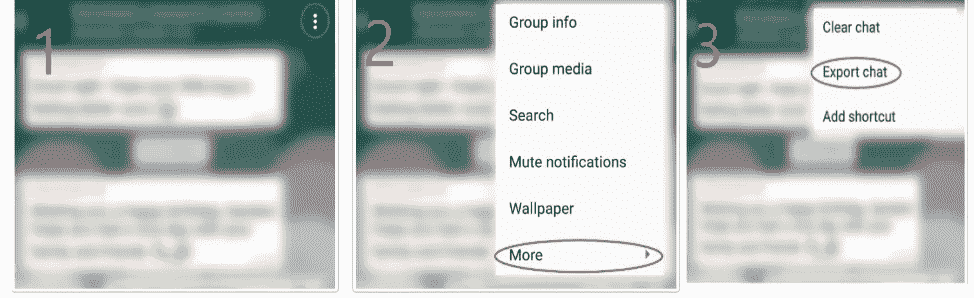
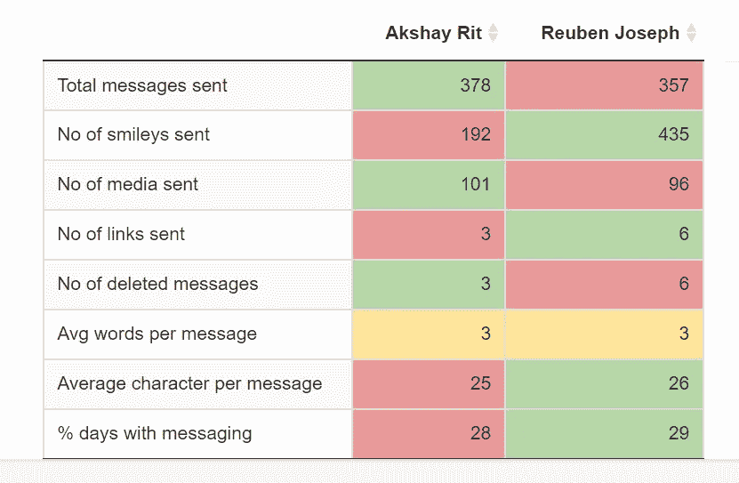

# 我是如何使用 rwhatsapp 和 ggplot 在 R 中分析 WhatsApp 聊天的

> 原文：<https://medium.com/analytics-vidhya/how-i-analyzed-whatsapp-chat-in-r-using-rwhatsapp-and-ggplot-912ba9439026?source=collection_archive---------8----------------------->

## 在分析你的 WhatsApp 聊天记录后，你会得到令你真正惊讶的结果

Whatsapp 聊天是一个丰富的数据来源，可以用来从数据中获得更深入的见解。我已经使用 R 进行了这个分析，并使用 shiny 创建了一个便于分析的仪表板。Rwhatsapp 是一个强大的软件包，旨在简化 whatsapp 聊天分析。请随意浏览这篇文章，只需看看它的情节和视觉效果。如果你只是对了解项目的概况感兴趣。您可以在以下位置找到我的项目

[https://reubenjoseph13.shinyapps.io/Whatsapp_Analyzer/](https://reubenjoseph13.shinyapps.io/Whatsapp_Analyzer/)。

# 如何导出聊天

Whatsapp 可以让你将聊天内容导出到文本文件中。要导出聊天记录，请遵循以下步骤:

如何导出 WhatsApp 聊天

这是原始数据的样子

# 数据清理

任何数据分析的第一部分都是清理数据。安装和添加 Rwhatsapp 将是第一步。使用这个包中的 rwa_read()，可以很容易地将文本文件转换成 tibble。

由 rwhatsapp 包创建的 Tibble

# 创建仪表板

如果你只是谷歌 Whatsapp 聊天分析，你会发现几十个网站和应用程序为你提供了很多可视化。我想提供一些用户期望的额外的分析和见解。

*   我想让我的应用程序自动检测上传的聊天是否属于一个团体，或者是否是两个人之间的聊天，并相应地显示可视化效果。
*   作为一个用户，发送的信息和微笑的总数没有任何意义，除非你和其他人或群体的平均水平进行比较。因此，我的重点是提供两个人之间或相对于平均值的良好比较。
*   我希望人们能够选择要分析的聊天持续时间，这允许他们放大到某个特定的时间段(这帮助我了解了新冠肺炎对我们信息的频率和差异的影响)

因此，我使用了已经被[基根·斯托克埃](https://medium.com/u/20095ecca3a)共享的代码进行基本的可视化，这样我就可以利用我的资源进行更深入的分析。你可以在这里找到他的文章[的链接](https://levelup.gitconnected.com/text-and-sentiment-analysis-of-whatsapp-messages-1eebc983a58)。在我们今天生活的世界中，如果你不总是需要从零开始，这真的很有帮助。

# 基本求和

这些表格不言自明。它给出了所有消息、表情符号、媒体等的计数。以及一些平均指标，如每条消息的平均字数和每条消息的平均字符数。很基本的东西。请注意，个人聊天和小组聊天的表格略有不同。

群聊的基本总结

个人聊天的基本总结

# 基本可视化

## 跨时间发送的消息

我们可以了解信息的频率是如何随时间变化的。看看这个特殊的例子，很明显，自从 2020 年 3 月新冠肺炎事件后实施封锁以来，聊天的频率显著增加。

## 谁发送的消息最多

## 最常用的表情符号和单词

## 一周中每一天和一天中每一小时的消息

和你的朋友组成的小组在周末或工作日有更多的消息吗？你倾向于在一天中的什么时候发送更多的信息？这就是制作这些图表的目的。

这个特定的聊天显示，星期六是大多数消息被发送的时间，并且大多数消息在晚上 10 点被发送。

# 独特的 3 个字母单词

## 词云

还为个人聊天和群组聊天(一般的群组和群组内的特定人)显示 Word Cloud，以便理解个人/群组发送的文本摘要。

我尝试在聊天中加入情感分析和其他可视化，但这没有多大意义，因为我的大多数聊天都是用英语输入的当地语言。

# 比较

这是分析中最重要的部分。作为一名用户，我觉得如果数据显示为比较值而不是绝对值，理解起来会好得多。个人聊天和群组聊天的对照表是不同的。

# 个别聊天中的比较

这个表格非常简单明了。绿色代表较高的值，红色代表较低的值。如果两个人的值相同，则给出黄色。现在让我们看下一个有更深入分析的表格。

# 群聊中的比较

这与前面的个人聊天对照表的工作方式相同。在第二个人的位置，需要输入聊天的平均值，这给出了下面的表格。

# 报表生成

仪表板还可以选择将分析结果导出为 HTML 文件，以便与朋友分享。此处可以看到导出文件的示例[。这是通过使用 R Markdown 报告完成的，该报告的参数是从 shiny 传递过来的。](https://drive.google.com/file/d/1k0PCsNa7wlv7UfPtyCnMeK99TyPuznNM/view?usp=sharing)

闪亮的服务器文件:

R-Markdown 文件的代码:

# 部署的仪表板

你可以在这里找到我创建的仪表板:【https://reubenjoseph13.shinyapps.io/Whatsapp_Analyzer/ 

# 结论

在开发应用程序之前，站在用户的角度思考确实有帮助。当很多朋友说他们发现比较和分析表非常有趣时，感觉真的很棒。这是你在创建一个应用程序后所能期望的最好回报。

这也让我意识到仅仅一次聊天就包含了大量的数据。从 Whatsapp 的角度来看，他们甚至不必知道正在发送什么消息(E2E 加密)，就能够获得一些非常好的数据。像发送消息的时间戳、读取消息的时间、某人在线的时间等等。Whatsapp 将利用所有这些见解来开发产品。但这并不能掩盖这样一个事实，即我们在使用这些公司的产品时，向它们提供了大量的数据。