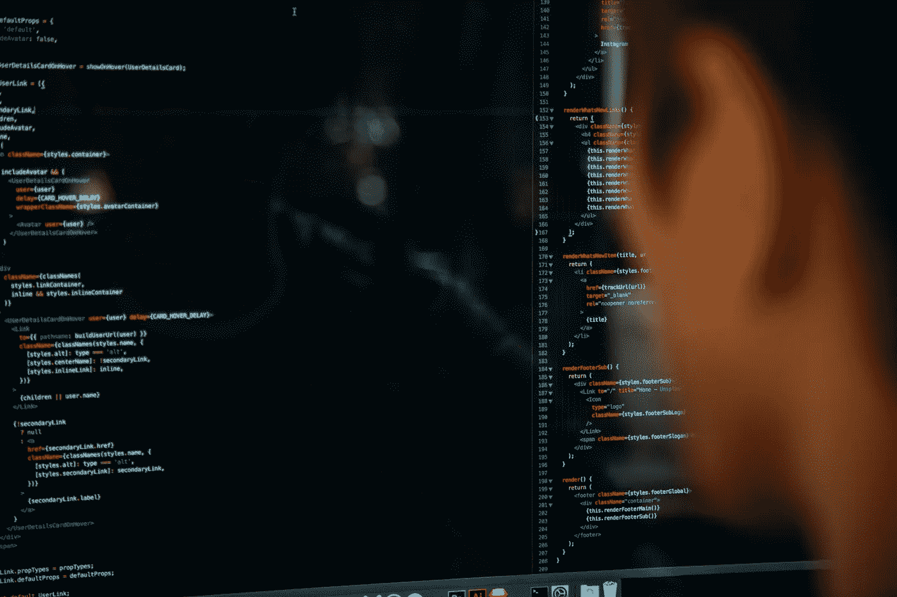

# 我如何使用 Python 自动创建股票和加密货币内容

> 原文：<https://medium.com/analytics-vidhya/how-i-automated-my-stock-and-cryptocurrency-content-creation-with-python-13565c9ddb69?source=collection_archive---------29----------------------->

查尔斯·德鲁维奥在 Unsplash 上的照片

随着最近股市的波动，我想做一些自己的挖掘，试图提供更多的背景，看看市场在做什么，情况到底有多“糟糕”。

我最后在 LinkedIn 上发布了我的一些发现。一些股票和加密货币硬币在过去的 365、90、30、7 和 1 天里都有表现，尽管只是…