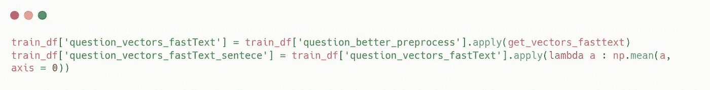

# 我如何建立一个问答模型

> 原文：<https://medium.com/analytics-vidhya/how-i-build-a-question-answering-model-3548878d5db2?source=collection_archive---------8----------------------->

问题回答模型简单来说就是一个回答你所提问题的计算机程序。

为了让程序能够做到这一点，我们需要用一系列问题和答案来训练机器学习算法。

我们将在本文中看到如何做到这一点。

我们将使用的数据集是[斯坦福问答](https://rajpurkar.github.io/SQuAD-explorer/)数据集，它引用了超过 10 万个与他们的问题相关的答案。
在这个数据集中，我们还有其他在这个简单案例中不会用到的信息。

# 准备数据

## 检索数据帧中的数据

这是提供给我们的 Json 文件中的数据的样子。
我们希望检索每个响应的 **response_text** 字段以及与之相关的信息。为此，我们可以如下进行:

通过应用该函数，我们将从 Json 转到一个数据帧，我们将能够使用该数据帧进行工作:

这里每一行代表一个问题的答案。当我们要训练我们的机器学习模型时，这将有助于我们，因为我们要给它一个问题作为特征，一个答案作为标签。

## 训练单词嵌入模型

机器学习模型只能用数字来训练，所以我们必须按照这个图表向量化我们的问题和答案

1.  我们根据上下文(与问题相关的文本)训练我们的单词嵌入模型。
2.  我们使用之前获得的模型对我们的问题和答案进行矢量化。
3.  我们用这些矢量化的问题和答案来训练我们的机器学习模型。

因此，作为第一步，我们需要检索我们的上下文，对它进行预处理，并用它来训练我们的单词嵌入模型。

## 预处理特征和标签

对于答案，我们就取答案所在的句子。当我们给模型打分时，它会帮助我们。

这个函数遍历上下文，找到答案所在的句子，然后简单地预处理这些句子，丢弃一些没有价值的答案。

对于更简单的问题，我们只使用简单的预处理 gensim 函数。

## 嵌入问题和答案

我们将使用两种不同的方法来嵌入我们的问题和答案。然后我们将比较他们的表现。

我们将使用的第一种方法非常简单，我们将使用 FastText 来嵌入所有内容。FastText 的优点是可以处理词汇表之外的单词，所以我们不会因为试图嵌入词汇表之外的单词而出现任何错误。

第二种方法稍微复杂一点，代码如下:

事实上，所有令人困惑的代码都可以用这个图表来总结

然后，我们可以将这些函数应用到我们的数据集，以嵌入问题和答案。

我们从混合嵌入开始:

我们对每个问题进行平均，以便每个句子而不是每个单词有一个向量。

我们可以为快速文本嵌入做同样的事情:

在训练我们的机器学习模型之前，我们需要处理输入的形状。事实上，scikit learn 机器学习模型采用 2D 数组作为输入，这与我们刚刚创建的熊猫系列不同。

为了解决这个问题，我们创建了一个函数，将熊猫系列转换为学习机模型可以使用的 2D 数组。

*   question_np，answer_np : 2D 数组，包含使用 mix 方法矢量化的问题和答案
*   question _ fastText _ np，answer_fastText_np : 2D 数组，包含用唯一的 fastText 方法矢量化的问题和答案

# 训练和评分模型

## 训练我们的机器学习模型

我们将使用 scikit 学习库中的两个不同的模型，支持向量回归机(SVR)和梯度推进回归机(GBR)。我们将使用多输出回归器，顾名思义，它允许我们获得一组输出值(这里是矢量化响应)。

为了测试我们的单词嵌入方法的有效性，我们将使用我们拥有的两组不同的问题和答案来训练模型。

因此，我们将有 4 种不同的模型:

*   基于 mix 方法嵌入问答的支持向量回归模型
*   一个嵌入了问题和答案的 SVR 模型
*   问题和答案嵌入 mix 方法的 GBR 模型
*   一个 GBR 模型，问题和答案嵌入了唯一的快速文本方法

## 给我们的模型打分

现在测试我们训练过的模型是很重要的。为此，我们将无法使用 scikit learn 基于我们的用例已经制作的功能。在本文中，我将向你展示如何实现这些功能，但我不会运行它们，因为它们需要几天时间来处理整个数据集。

所以我们将使用两个主要函数:

*   get_vectorized_context 将一个上下文作为输入，并返回一个数组，该数组包含该上下文中与其矢量化相关联的每个句子。
*   least_distance 将向量 x 和向量 y 的数组作为输入，并通过应用欧几里得距离返回 y 到 x 的最近向量。

如果在我们的上下文中，与我们预测的向量最接近的向量是真实答案，我们认为预测是好的。

在本文中，我们已经看到了一个经典的 NLP 问题，这个问题允许我们试验预处理和分析文本数据所需的不同步骤。

我们也了解云处理的所有利益，其中一个模型需要 20 多分钟来训练，我们无法为它们尝试许多参数。
如果功率更大，我们可以进行一些交叉验证或网格搜索来找到最佳参数。