# 我如何使用深度卷积神经网络构建了一个文档分类系统！

> 原文：<https://medium.com/analytics-vidhya/how-i-built-a-document-classification-system-using-deep-convolutional-neural-networks-e1d9a83cbabd?source=collection_archive---------0----------------------->

随着深度学习的出现，OCR(光学字符识别)的工具改进了很多，变得更加高效。

你们知道谷歌文档本身有一个内置的 OCR 功能吗？

## 那么，文档分类管道如何帮助改进 OCR 呢？

在内容检测 OCR 中，我们可以使用文档分类管道来索引不同的文档，以便 OCR 可以分别针对不同的布局高效地操作。为各种类型的文档，如“研究论文、新闻论文、报告、表格、简历”建立一个通用的 OCR 是一项非常艰巨的任务，但如果我们可以划分算法，它可以有效地完成所有任务。

在 OCR 运行之前进行文档分类可以帮助我们以不同的方式对不同种类的文档图像进行预处理，从而使 OCR 的任务变得更加容易。

我们开始吧！

## 数据集描述

RVL-CDIP(瑞尔森视觉实验室复杂文档信息处理)数据集由 16 类 400，000 幅灰度图像组成，每类 25，000 幅图像。有 320，000 幅训练图像、40，000 幅验证图像和 40，000 幅测试图像。调整图像大小，使其最大尺寸不超过 1000 像素。

## 让我们使用深度卷积神经网络来构建我们的文档分类系统，仅使用 1/3 的数据，准确率就超过 90%!

**这 16 个班级如下:**

1.  信
2.  形式
3.  电子邮件
4.  手写的
5.  广告
6.  科学报告
7.  科学出版物
8.  规格
9.  文件夹
10.  新闻文章
11.  预算
12.  发票
13.  介绍会；展示会
14.  调查表
15.  简历
16.  备忘录

## 让我们来看看数据集中的一些样本:

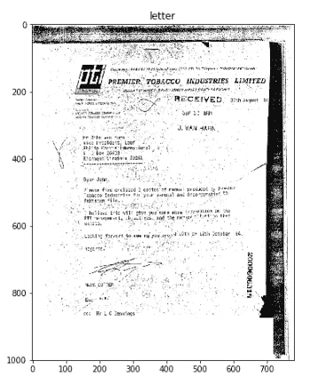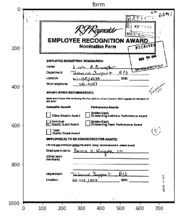

## 创建结构化数据

标签文件以下列格式列出图像及其类别:

`path/to/the/image.tif category`

我们创建一个脚本，这样我们就可以得到两个单独的 pickel 文件，分别用于标签和图像路径

```
import os
import joblib
count=0
labels=[]directories=['C:/Users/sambal/Desktop/labels/train.txt','C:/Users/sambal/Desktop/labels/test.txt','C:/Users/sambal/Desktop/labels/val.txt']
train_path=[]
test_path=[]
val_path=[]
paths=[train_path,test_path,val_path]
y_train=[]
y_test=[]
y_cv=[]
labels=[y_train,y_test,y_cv]for i in range(3):
        label=[]
        with open(directories[i],'r') as f:
            for line in f:
                label.append(line)path=[]for x in label:category=x.split(" ")[1][-2::-1][::-1]
            labels[i].append(category)
            y=x.split(" ")[0]
            paths[i].append(y)for i in range(3):
    print(paths[i][0],labels[i][0])joblib.dump(labels,"labels")
joblib.dump(paths,"paths")
```

一旦我们将标签和路径分离到文件中，我们现在就可以将数据过滤成三个部分——Train、Test 和 Cv。

## 让我们使用一些图像样本来检查图像大小是否有任何变化

```
train_width=[]test_width=[]cv_width=[]count=0for image in train[:100]:im = cv2.imread(image,cv2.IMREAD_GRAYSCALE)train_width.append(im.shape[1])for image in test[:100]:im = cv2.imread(image,cv2.IMREAD_GRAYSCALE)test_width.append(im.shape[1])count+=1for image in cv[:100]:im = cv2.imread(image,cv2.IMREAD_GRAYSCALE)cv_width.append(im.shape[1])
```

让我们形象化的图像宽度分布。

```
import seaborn as sb
from matplotlib import pyplot as pltwidth=(train_width,test_width,cv_width)for x in width:
   sb.distplot(x,kde = True)
   plt.show()
```

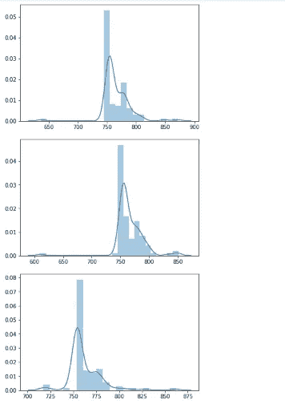

我们看到，对于所有三个测试、训练和 CV 数据图像，图像的宽度存在很大差异。

因此，调整图像大小将是这个项目的重要组成部分。

## 检查阶级不平衡

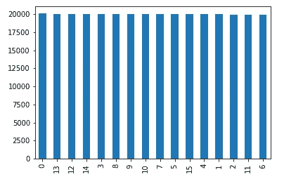

这是一个相当平衡的数据集，所有类别都具有相同的代表性。

## 构建生成器和文件结构

我们将有 3 个文件夹，即培训、测试和简历。

每个文件夹将有 16 个文件，代表从 0 到 15 的每个类

我们将所有与标签相关的数据移动到各自的文件夹中。

**由于计算能力的限制，现在我们只将每节课 10k 的训练数据转移到这些文件夹中！**

由于数据非常庞大，我们需要一个 Keras 生成器将数据批次从磁盘加载到模型中，以实现高效的 I/O。因此，我们初始化了 Keras 数据生成器，还包括数据标准化方面，这样我们的数据范围为 0 到 1，除以 255。

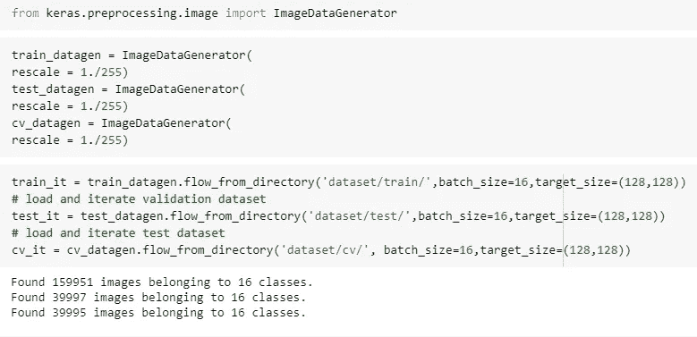

# 建筑

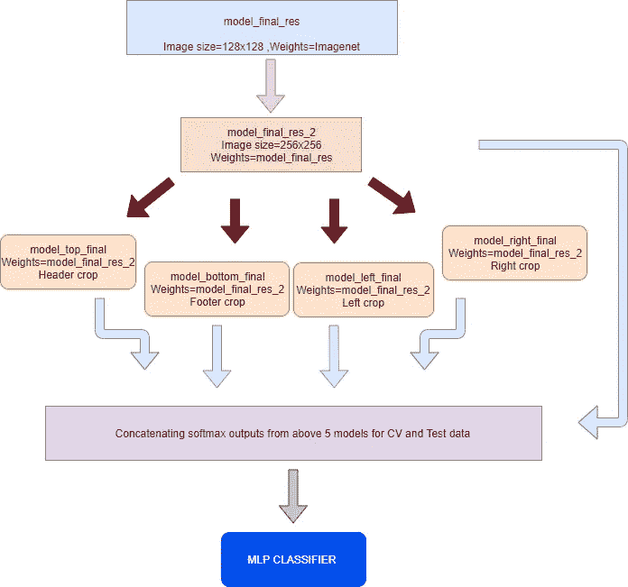

哦！好吧，我上面说的这个东西看起来超级复杂，对吧？

所以让我们把它一点一点的分解吧！

# 基础模型

## **1。型号 _ 最终 _ 结果**

我们使用的是在 imgenet 上训练过的重量初始化的 **Inceptionresnet-V2** 。我们将调整我们的图像大小为 128x128，并训练这个模型。我们解冻所有层并训练。

**你可能听说过 resnet 和 Inception-net，但是什么是 inception_resnet_v2 呢？**

顾名思义，它基本上是一个来自 Resnet 的 Inception-net 结合剩余模块的概念。

剩余连接允许模型中的捷径，并允许研究人员成功地训练更深的神经网络，这导致了更好的性能。这也极大地简化了初始阶段。

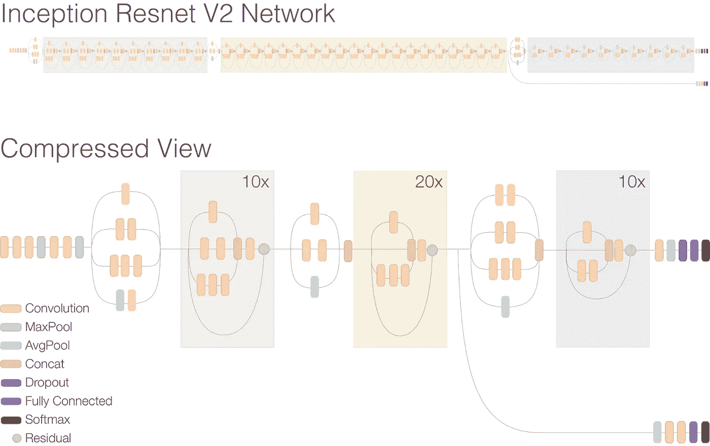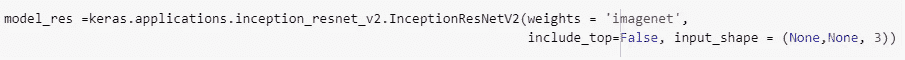

我们使用 Keras 应用程序 API 导入带有 imagenet 权重的 inception_resnet_v2 模型，并使用(None，None，3)将它设置为变量输入形状。稍后我们会在这个博客上做一些有趣的事情。

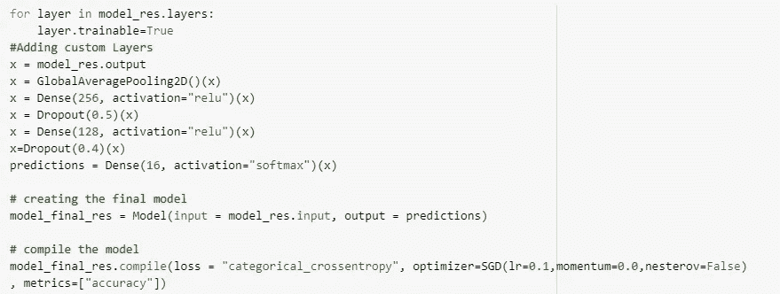

我们移除 inception_resnet_v2 模型的顶部，并附加 2 个具有下降的密集层，最后附加一个大小为 16 的 Softmax 层。

我们将使用旧的经典 SGD，lr=0.1，momentum=0.0，nesterov=False

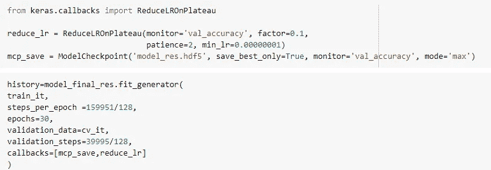

如果验证精度在 2 个时期后没有提高 10%,我们将惩罚我们的学习率，并最终用 batch_size=128 训练它 30 个时期。

**经过 30 个时期的训练，我们在测试数据上获得了相当不错的 85%的准确率。**

## 2.模型 _ 最终 _ 结果 _2

在我们用 128x128 的图像大小训练了我们的基本模型之后，我们将把这些权重转移到另一个 inception_resnet_v2 模型，在那里我们将在 256x256 大小的图像上训练。

这是我从 Fast.ai 课程中学到的一个小技巧，杰瑞米·霍华德在较小的图像上训练，然后使用这些权重初始化相同的架构来训练较大的图像。

我认为这种技术可行的原因是，当一个较小尺寸的图像被提供给我们的架构时，它试图学习所有被较小图像尺寸限制的微小特征。然而，一旦它在约束条件下学习了这些特征，我们的模型最终将很好地处理较大尺寸的图像。这就像**数据扩充**迫使你的模型学习更好的特性，有点像正则化。

所以一切都保持不变，除了我们改变我们的图像大小为 256X256，并在上述相同的条件下训练 20 个时期。

**瓦拉！我们在测试数据上获得了 89.37%的准确率**

**model_final_res_2 现在将成为我们的基础模型。**

# 域内迁移学习

迁移学习涉及将机器学习模型在一个领域获得的经验转移到另一个相关领域。虽然文档分类和对象分类看起来似乎是不同的领域，但在 1000 类 ImageNet 数据集上训练的架构已被证明可以作为广义特征提取器。

在这项工作中，在 ImageNet 上训练的 inception_resnet_v2 模型被用作我们的整体模型的初始权重，从而构成初始一级(L1)权重转移。当然，L1 迁移源自不同的领域，是迁移学习的常规领域间形式。然而，在 RVL-CDIP 数据集的完整图像上训练的整体模型可以被认为是广义的文档特征提取器。基于区域的模型的训练集，尽管包含文档区域的图像并且具有不同的比例，但本质上仍然是文档的图像。因此，通过建立转移学习的另一层(L2)来利用这个概念，其中用来自整体模型而不是原始 inception_resnet_v2 模型的权重来初始化基于区域的模型。

使用域内迁移学习的概念，我们现在将通过以不同方式裁剪我们的图像来训练**区域特定的**模型。

# 特定区域模型

**1。顶部裁剪**

我们从上到下取前 256 个像素，然后裁剪剩下的。

我们通过构建一个裁剪函数并将该函数传递给生成器来实现这一点。

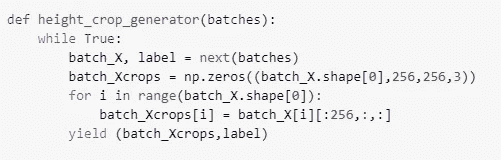

我们现在将权重从 model_final_res_2 加载到新的 inception_resenet_v2 模型中，并对其进行 5 个时期的训练。

仅使用图像的顶部区域，我们得到 85.6%

**2。底部裁剪**

我们从下到上取最后的 256 个像素，然后裁剪剩下的。

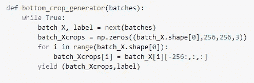

仅使用图像的底部区域，我们得到 82.09%

**3。左侧裁剪**

我们从左到右取最左边的 256 个像素，然后裁剪剩下的像素。

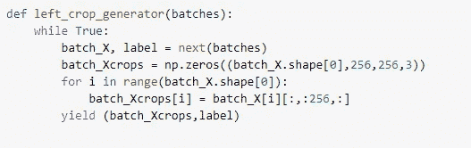

仅使用图像的左侧区域，我们得到 86.77%

**4。右键单击**

我们从右到左取最右边的 256 个像素，然后裁剪剩下的像素。


仅使用图像的区域，我们得到 84.36%

我们使用学习率为 0.0001 的 Adam optimizer 来训练所有区域特定的模型。

到目前为止，我们已经训练好了所有的模型。

# 堆叠概括

让我们使用堆叠的力量得到 SOTA 结果。

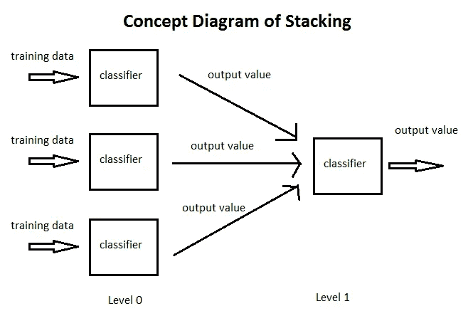

我们带着我们所有的 5 个模特

1.  整体模型:模型 _ 最终 _ 结果 _2
2.  顶部裁剪模型:模式 _ 最终 _ 顶部
3.  底部裁剪模型:模式 _ 最终 _ 底部
4.  左侧裁剪模型:模式 _ 最终 _ 左侧
5.  右裁剪模型:模式 _ 最终 _ 右

将所有验证数据和测试数据的每个模型的 softmax 输出连接在一起。

我们将使用从验证数据生成的 softmax 输出来训练一个简单的 2 层 MLP 元分类器，然后我们将在测试数据上测试它。

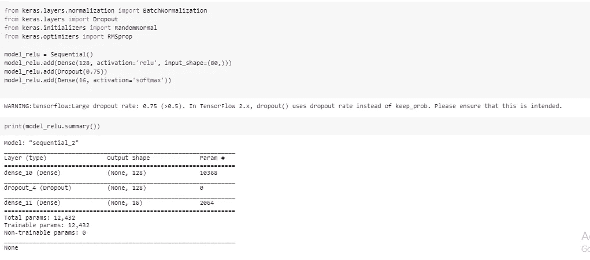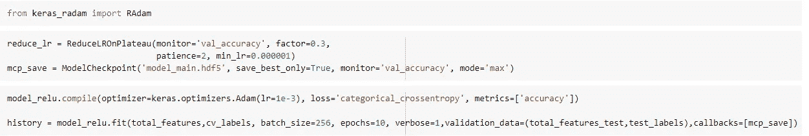

经过 20 个时期的训练后，我们在测试和训练数据上都获得了 90.5 %的准确度。

# **管道**

```
from matplotlib import cmcmap = cm.get_cmap('tab20')def height_crop(path,type): image=cv2.imread(path) image = cv2.resize(image, (512,256)) if type=='bottom': image =image[-256:,:,:] else: image =image[:256,:,:] return imagedef width_crop(path,type): image=cv2.imread(path)
   image = cv2.resize(image, (256,512)) 
   if type=='right': image =image[:,:256,:]
   else: image =image[:,-256:,:] return imagedef full_image(path): image=cv2.imread(path)
      image = cv2.resize(image, (256,256))
      return imagedef preprocess(im): im = im/255
     im = np.expand_dims(im, axis=0)
     return imdef predictions(image): top_pred=top.predict(image[0])
   bottom_pred=bottom.predict(image[1])
   left_pred=left.predict(image[2])
   right_pred=right.predict(image[3])
   holistic_pred=main.predict(image[4])
   total_features=np.hstack((top_pred,bottom_pred,
   left_pred,right_pred,holistic_pred))
   prediction=mlp_classifier.predict(total_features) return predictiondef plot_bar_x(axes,prediction,doc_type): sort_index=np.argsort(prediction)[::-1]
       df=pd.DataFrame({'Document_Type':doc_type,
                         'Percentage':prediction})
       df=df.sort_values('Percentage',ascending=True)
       labels=df['Document_Type']  
       df.plot(kind='barh',y='Percentage',x='Document_Type',       
ax=axes,colormap=cmap)
```

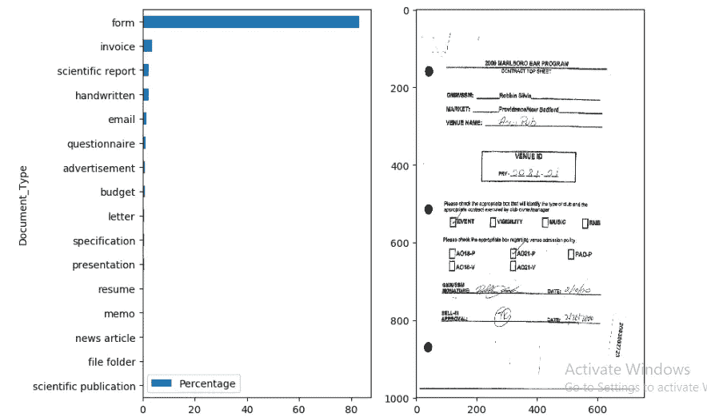

**我们对随机图像的输出非常准确！！**

# **结论**

我们使用域内迁移学习，然后使用堆叠泛化，用 1/3 的数据实现了 90.5%的准确率。

使用更多的数据可以产生更好的结果，我正在努力。

一旦我们很快超过 92.4 基准，我会随时通知你！！

您可以从以下网址获得完整代码:[https://github . com/sambalshikhar/Document-Image-class ification-with-Intra-Domain-Transfer-Learning-and-Stacked-Generalization-of-Deep](https://github.com/sambalshikhar/Document-Image-Classification-with-Intra-Domain-Transfer-Learning-and-Stacked-Generalization-of-Deep)

注意:笔记本显示最终结果为 93%,这是没有重置发电机的错误。修复后，我们发现准确率为 90.5%。

# 学分:

 [## 基于域内迁移学习和层叠泛化的文档图像分类

### 本文提出了一个基于区域的深度卷积神经网络框架，用于文档结构学习

arxiv.org](https://arxiv.org/abs/1801.09321) 

[https://ai . Google blog . com/2016/08/improving-inception-and-image . html](https://ai.googleblog.com/2016/08/improving-inception-and-image.html)