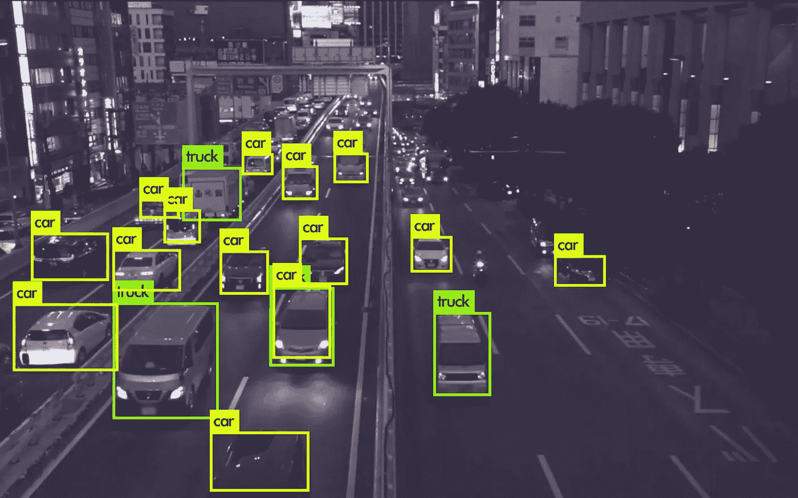

# 我如何用不到 100 行代码构建了一个强大的对象检测器。

> 原文：<https://medium.com/analytics-vidhya/how-i-built-a-powerful-object-detector-in-under-100-lines-of-code-ec8c2dcdd1e0?source=collection_archive---------12----------------------->

目标检测一直是计算机科学领域最热门的话题之一。自从 [AlexNet](https://en.wikipedia.org/wiki/AlexNet) 在 [ImageNet 大规模视觉识别挑战](https://en.wikipedia.org/wiki/ImageNet#ImageNet_Challenge)中大获全胜，取得 15.3%的前五名误差，比亚军低 10.8 个百分点以上以来，卷积神经网络和深度学习在各种计算机视觉任务中的使用一直在增加。已经提出了各种不同的架构，并且已经采用了各种不同的方法。R-CNN 模型族、固态硬盘、YOLO 等是目前使用最多的目标检测架构。

目标检测框架主要可以分为两部分:单镜头检测器和多镜头检测器。像 YOLO 或 SSD 这样的单触发检测架构提供了更好的推断速度，而多触发检测器比单触发检测器具有更高的准确性。然而，一些新的单镜头检测架构(如 FAIR 的 RetinaNet)声称与更快的 RCNN 等双镜头检测器一样好。

目标检测是世界范围内最广泛的研究课题之一，用于此目的的算法只会与日俱增。今天，我们将学习如何使用预训练的 YOLO 模型来创建我们自己的通用对象检测器。

YOLOv3 已经在上下文中的公共对象(COCO)数据集上接受了训练，并且能够识别 80 种不同类别的对象。

对于那些想详细了解 YOLOv3 架构的人，这里有一个 YOLOv3 原文的链接。

> 【https://pjreddie.com/media/files/papers/YOLOv3.pdf 

在这里，我们将使用 opencv 的 dnn 模块推理在预训练的 YOLOv3 模型上创建我们自己的对象检测器。

在我们开始之前，前往[https://pjreddie.com/darknet/yolo/](https://pjreddie.com/darknet/yolo/)
下载预训练的重量和配置文件。七个不同版本的 YOLO 模型被放在网站上，每一个都有自己的优点和缺点。选择你喜欢使用的任何一个。出于我的目的，我使用的是 YOLOv3-spp，地图为 60.6(可以说是站点中托管的最好的 YOLOv3 模型)。

然后前往 https://drive.google.com/open?id = 1 adjbud 0 pn-n1 gdrx-QQD-4g ygr x05 GW 2 下载 coco.names 文件，同样放在项目目录下。该文件包含 YOLOv3 能够对其执行检测的类名。

既然 YOLOv3-spp.weights、YOLOv3-spp.cfg 和 coco.names 已经在项目目录中，现在是时候进行一些简短而有效的编码了。

# 导入库

我们将使用 OpenCV 库来执行图像处理，并使用非常高效的 Numpy 来执行数组操作。我们将使用 argparse 库来解析命令行参数。

> *import cv2
> import numpy as NP
> import arperse*

# 加载图像类

然后我们将定义一个短函数来加载 coco.names 文件中的不同类。

# 奇迹发生的地方

我们现在锁定并加载了辅助函数 load_classes。让我们编写驱动对象检测过程的主运行函数。

首先，我们将使用 OpenCV 的 dnn 模块，通过权重和我们之前下载的 cfg 文件来读取暗网架构。

> net = cv2 . dnn . readnet(opt . weights，opt.cfg)

opt 是我们的参数解析器对象，我们将在后面讨论。

然后我们将使用我们的帮助函数 load_classes 获得类名。它采用*的路径。将文件命名为它的唯一参数，也将通过命令行提供。

> classes = load_classes(可选名称)

现在，我们将从预定义的暗网架构中检索输出层名称。

> layer_names = net.getLayerNames()
> 
> output layers =[layer _ names[I[0]-1]for I in net . getunconnectedoutlayers()]

我们还将定义颜色和字体，稍后我们将在输入图像中写入这些内容。

> colors = np.random.uniform(0，255，size = len(classes)，3))
> font = cv2。字体 _ 好时 _ 单纯形

现在该初始化 VideoCapture 对象了。它将用于从一个流中捕获视频。我将使用来自网络摄像头的视频流，随意使用任何视频通过其各自的路径。有关如何将各种视频流作为输入的更多信息，请参见 V [ideoCapture](https://docs.opencv.org/2.4/modules/highgui/doc/reading_and_writing_images_and_video.html) 文档。

> cap = cv2。视频捕获(0)

现在我们将启动一个 while 循环。循环的每一次迭代将获取一帧，对其执行检测，并将其显示在输出屏幕上。

首先，我们将从 VideoCapture 对象中读取一帧，从中生成 blobs，然后将其传递给 darknet 架构。

> _，frame = cap.read()
> 高度，宽度，通道= frame.shape
> 
> blob = cv2 . dnn . blobfromimage(frame，0.00392，(320，320)，(0，0，0)，True，crop=False)
> 
> net . set input(blob)
> outs = net . forward(output layers)

现在，我们将得到在斑点中检测目标的算法的置信度得分。然后使用给定对象斑点的最高置信度生成 class_id。其被附加到列表中。为此，我们将启动三个不同的列表，class _ ids、confidences 和 box，每一个都包含顾名思义的信息。

然后，我们将执行非最大值抑制，以过滤掉同一对象的多个检测。这可以使用 dnn 库的 NMSBoxes 函数来完成。

> indexes = cv2 . dnn . NMS box(盒子，置信度，0.4，0.6)

现在是时候获取所有检测到的对象，在它们周围绘制适当的边界框和置信度值，在边界框上绘制类别标签，然后将后续帧写入输出屏幕。

# 参数分析器

我们的目标检测算法已经准备好了。现在，我们只需要定义参数解析器来接受命令行输入，并使用权重文件、cfg 文件和*的适当路径调用检测算法。名字文件，我们就可以上路了。

> parser = argparse。argument parser()
> parser . add _ argument('—weights '，type = str，default = '。/yolov3-spp.weights '，help = '权重文件的路径')
> 
> parser.add_argument(' — cfg '，type = str，default = '。/yolov3-spp.cfg '，help = ' CFG 文件的路径')
> 
> parser.add_argument(' — names '，type = str，default = '。/coco.names '，help = '*。名称路径’)
> 
> opt= parser.parse_args()

如果文件保存在项目目录本身(。/*)，我们不需要传递命令行输入，因为路径值已经被定义为默认值。如果路径改变了，我们需要从命令行使用适当的参数显式地提供路径。

# 最终代码

下面提供了代码的完整实现:

正如承诺的那样，我们只用了不到 100 行代码(准确地说是 84 行)就构建了一个非常强大的通用对象检测器😉).给定的实现只能使用您的 CPU 执行推理，因此可能会有一些性能相关的问题。我们需要使用深度学习框架来利用我们的 GPU 的能力，并加快这个过程。稍后会有更多相关信息…..