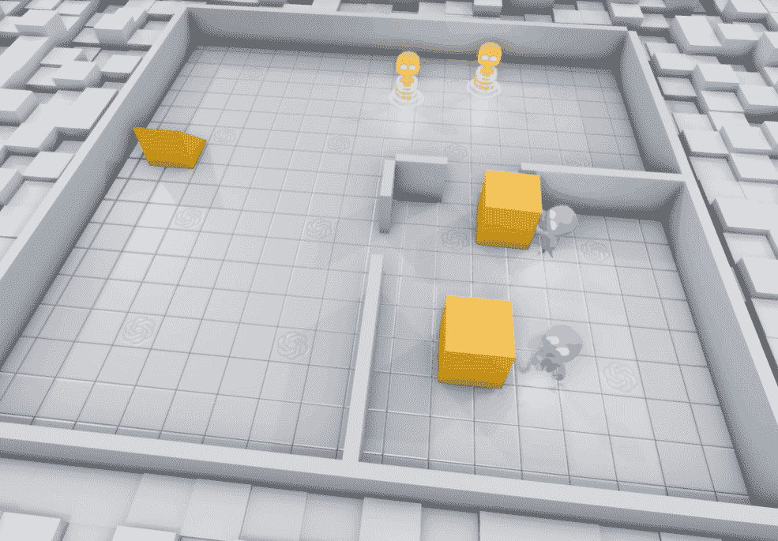
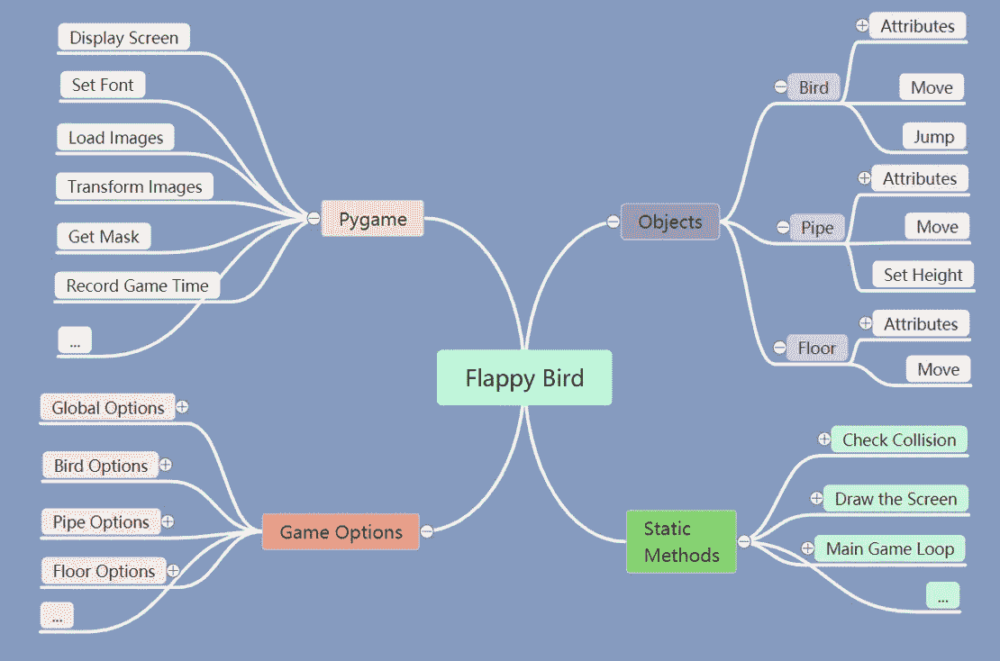
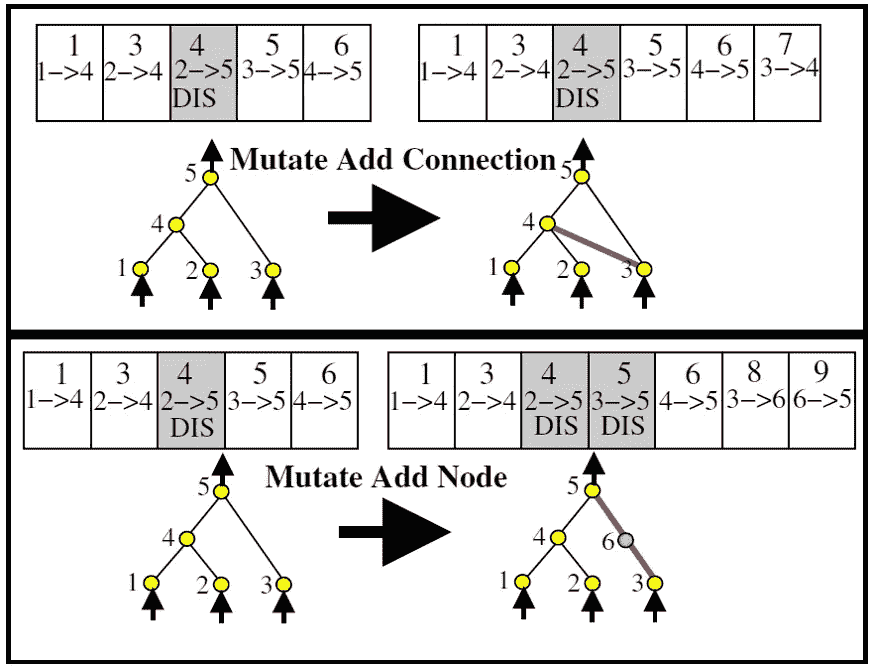

# 我如何构建一个智能代理来扮演 Flappy Bird

> 原文：<https://medium.com/analytics-vidhya/how-i-built-an-ai-to-play-flappy-bird-81b672b66521?source=collection_archive---------1----------------------->

一个智能代理扮演 Flappy Bird

# 介绍

你玩过 Flappy Bird 吗？在这个动画中，你看到的是一个熟练的玩家在玩游戏 Flappy Bird。但是，这个玩家不是人类。这是一个我用增强拓扑结构的神经进化算法**构建的**智能代理**(IA)**(NEAT)算法。

2019 年 9 月，OpenAI 发布的一篇名为 [*从多智能体交互中紧急使用工具*](https://openai.com/blog/emergent-tool-use/) 的文章展示了智能体如何在模拟的捉迷藏环境中逐步学习使用复杂的工具和策略。我觉得特别有意思，想多了解一下**强化学习** (RL)。

多智能体捉迷藏。来源: [*通过*](https://openai.com/blog/emergent-tool-use/) [*OpenAI*](https://openai.com/) 从多智能体交互 *中使用紧急工具*

在我的研究中，我看到了优步人工智能实验室的一篇论文，题为 [*深度神经进化:遗传算法是训练深度神经网络进行强化学习*](https://arxiv.org/pdf/1712.06567.pdf) 的一个有竞争力的替代方案，其中研究人员提出了经验证据，表明一个简单的**遗传算法** (GA)可以在 RL 问题上表现得非常好。除了上面我们看到的[捉迷藏](https://openai.com/blog/emergent-tool-use/)的例子，RL 还被成功应用于 [**雅达利**](https://towardsdatascience.com/atari-reinforcement-learning-in-depth-part-1-ddqn-ceaa762a546f)[**贪吃蛇**](https://towardsdatascience.com/how-to-teach-an-ai-to-play-games-deep-reinforcement-learning-28f9b920440a)[**迪诺跑**](/acing-ai/how-i-build-an-ai-to-play-dino-run-e37f37bdf153) 等各种游戏中。如果我们可以用 GA 来构建一个游戏 IA 呢？这个想法引发了我对使用 NEAT 构建 Flappy Bird IA 的浓厚兴趣，NEAT 是 Ken Stanley 在 2002 年开发的 g a。

用强化学习教 AI 玩游戏。来源: [**雅达利**](https://towardsdatascience.com/atari-reinforcement-learning-in-depth-part-1-ddqn-ceaa762a546f) **，** [**蛇**](https://towardsdatascience.com/how-to-teach-an-ai-to-play-games-deep-reinforcement-learning-28f9b920440a) **，** [**迪诺跑**](/acing-ai/how-i-build-an-ai-to-play-dino-run-e37f37bdf153) **。**

# 为什么是 Flappy Bird？

对于那些不熟悉游戏 Flappy Bird 的人来说，这是一款由 Dong Nguyen 在 2013 年开发的热门手机游戏。Flappy Bird 获得了大量涌入的玩家，并在短时间内取得了巨大的成功。玩家点击屏幕来导航这只鸟，它必须在正确的时间跳跃通过一组类似马里奥的管道。

拍打鸟。来源: [flappybird.io](http://flappybird.io/)

Flappy Bird 对于有兴趣从头开始构建游戏的初学者来说是一个合理的选择，因为游戏的机制很简单，唯一的游戏动作是跳跃。此外，创建一个 IA 不会太复杂，因为我们只需要一些输入就可以得到一个二进制输出(我稍后会谈到)。最后但同样重要的是，Flappy Bird 是我最喜欢的手机游戏之一！所以，当我开始制作我的第一个游戏时，Flappy Bird 是一个不用动脑筋的人。

# 如何用 Python 构建 Flappy Bird？

我使用的主要模块是 Pygame。网上有大量的教程，以下是我最喜欢的一些:

*   Pygame 新手指南
*   [PyGame 教程:游戏编程简单介绍](http://pygametutorials.wikidot.com/tutorials)
*   【thenewboston 的 PyGame 教程的 YouTube 播放列表

在 Pygame 中构建 Flappy Bird 方面，也有大量的教程。以下是我发现非常有用的教程列表。我从他们那里记笔记，总结他们的方法，并试图在他们的基础上构建我的代码。如果你想了解更多这方面的信息，请查阅它们。

*   [AI 和 Tim 一起用 Tech 的 NEAT Python 玩 Flappy Bird](https://www.youtube.com/playlist?list=PLzMcBGfZo4-lwGZWXz5Qgta_YNX3_vLS2)
*   [使用 Bluefever 软件开发的 Flappy 和 Pygame 的神经网络](https://www.youtube.com/playlist?list=PLZ1QII7yudbebDQ1Kiqdh1LNz6PavcptO)
*   CodeWithHarry 为绝对初学者编写的 Flappy Bird Python 教程

在编码之前，我总是画一个思维导图来指导我完成整个过程。下面是思维导图的演示:

构建 Flappy Bird 的思维导图示例

要制作 Flappy Bird，我们需要三个 Python 对象:鸟、管道和地板。我们还需要一些功能来检查碰撞，显示和运行游戏。像大多数游戏一样，游戏选项部分允许我们根据自己的喜好改变一些游戏特性。

## 现在，让我们深入研究代码！

首先导入包，初始化 Pygame，设置屏幕显示游戏。

**游戏初始化**

下面是一些以后会用到的游戏选项。

游戏参数设置

Flappy 鸟游戏设计

*   **如何建造一只鸟？**

我们需要一些类方法来模拟这个运动。回想一下我们在中学物理课上学过的，计算一个从时间 0 到时间 ***t*** 以非零速度开始的物体的位移***d***v*v*的方程是: [*d = vt + 1/2at*](http://zonalandeducation.com/mstm/physics/mechanics/kinematics/EquationsForAcceleratedMotion/Introductions/Displacement/Introduction.htm) ，其中 ***a*** 是加速度。如果鸟跳跃，它获得一个向上的速度。然后我们根据位移计算更新鸟的位置。

造一只鸟

*   **如何搭建管道？**

管子比鸟更直截了当。管道以固定的速度水平移动。一个简单的*移动*方法如下图所示。我们需要的另一个类方法是随机化管道间隙的位置。因为每个缝隙的大小都是一样的，所以我们可以简单的把上面管子的高度随机化，然后下面管子的高度也会相应的变化。

建造管道

*   **如何搭建地板？**

地板是最简单的一种。它以固定的速度水平移动。我们可以复制三幅图像，并将它们连接在一起。一旦第一个图像移出屏幕，我们就把它附加到最后一个图像的右边。这同样适用于第二和第三幅图像。

建一层楼

*   **如何检查碰撞？**

[矩形碰撞检测](https://www.pygame.org/docs/ref/rect.html)(左)vs [像素完美碰撞检测](http://renesd.blogspot.com/2017/03/pixel-perfect-collision-detection-in.html)(右)

如果一只鸟的图像与一根管子的图像重叠，那么我们说这只鸟撞到了管子。主要有两种方法来检查重叠。一个叫做**矩形碰撞检测**由[的 *pygame 完成。rect . collider rect*](https://www.pygame.org/docs/ref/rect.html)*函数。另一个由[*pygame . mask . mask . overlap*](https://www.pygame.org/docs/ref/mask.html)函数调用**像素完美碰撞检测**。注意，我们也说鸟撞到上限或者地面就碰撞了。*

*检查碰撞*

*   ***如何展示游戏？***

*下面是显示游戏的函数。我们画一个背景，一个移动的地板，一组管道和一群鸟。我们还添加了一些文本消息来显示一些附加信息。*

*绘制游戏屏幕*

*现在游戏差不多做好了，我们来看看如何建立一个 IA。*

# *扩充拓扑的神经进化(NEAT)*

**

*扩充拓扑的神经进化。来源: [Evolv 科技](https://www.evolv.ai/blog/ai-101-intro-to-evolutionary-algorithms/)*

***NEAT** 代表**增强拓扑的神经进化**，这是一种遗传算法，旨在高效进化人工神经网络拓扑。这是一项了不起的技术，解决了**拓扑和权重进化人工神经网络**(tween)的一些挑战。在深入到 NEAT 之前，我们先来看看两个关键概念:**人工神经网络** (ANN)和**遗传算法** (GA)。*

## *什么是人工神经网络？*

**

*典型的人工神经网络结构*

*人工神经网络(ANN)是一种受大脑启发的计算系统，由相互连接的节点和加权连接组成。典型的人工神经网络结构包含一个输入层、一些隐藏层和一个输出层。隐藏层和输出层中的每个节点由一个 [*激活函数*](https://en.wikipedia.org/wiki/Activation_function) 组成，该函数将输入值的加权和转换为输出。在大多数情况下，人工神经网络可以通过 [*反向传播*](https://en.wikipedia.org/wiki/Backpropagation) 适当调整其连接权重来学习，这是一种执行梯度方法以最小化损失的技术。*

*如果您想了解更多关于 ANN 的信息，以下资源可能会有所帮助:*

*   *[维基百科:人工神经网络](https://en.wikipedia.org/wiki/Artificial_neural_network)*
*   *[人工神经网络简介](https://towardsdatascience.com/introduction-to-artificial-neural-networks-ann-1aea15775ef9)*
*   *[3 blue 1 brown 的神经网络教程的 YouTube 播放列表](https://www.youtube.com/playlist?list=PLZHQObOWTQDNU6R1_67000Dx_ZCJB-3pi)*

## *什么是遗传算法？*

> *"我们在有机世界的任何地方和任何部分都能看到美丽的适应."——*查尔斯·达尔文*《物种起源》。*

*1859 年，查尔斯·达尔文提出的自然选择理论奠定了进化生物学的基石。这个理论的精髓是那些最能适应变化的人最有可能生存下来。从那时起，“适者生存”的概念为人们理解物种进化提供了一种新的方式。*

**

*古尔德的达尔文雀。来源:[维基媒体](https://commons.wikimedia.org/wiki/File:Darwin%27s_finches_by_Gould.jpg)*

*如果生物进化能够产生像人类和许多其他人一样的惊人物种，**是否有可能将现代遗传学与机器学习技术相结合来解决一个问题**？遗传算法打开了机会之门，照亮了通向可能性的道路。*

**

*遗传算法。来源:[新科学家](https://www.newscientist.com/term/dna/)*

*根据定义，遗传算法是一种启发式技术，**模拟自然选择的过程来解决各种各样的优化问题**，尤其是那些具有不可微或随机目标函数的问题。*

*以下是一些关键术语:*

*   ***适应度函数**:在许多情况下，适应度函数与目标函数相同。它是一个函数，将解决方案作为输入，并生成一个适应度分数作为输出，以评估每个解决方案的质量。这是遗传算法的一个基本要素。我们应该根据每个具体问题来定制适应度函数。*
*   *群体:在遗传算法中，群体是给定问题的所有候选解的子集。*
*   ***染色体**:群体中的每一个候选解都是一条染色体，有时也称为基因组。*
*   ***基因**:染色体内的每一个元素位置都是一个基因，它有一个特定的值，决定了解的基因型和表现型。*
*   ***世代**:在每次迭代中，GA 执行一组遗传操作(选择、交叉、变异等。)对当前人口产生连续一代。*
*   ***选择**:选择是根据适应度得分筛选和保留解的过程。适应性更高的解决方案更有可能被推进到下一代。可以选择一对被选择的解作为亲本，通过交叉将它们的基因繁殖和传播给下一代。*
*   ***交叉**:交叉是亲代染色体产生子代染色体的方式。双亲的基因根据一组交叉点重新组合，形成新的后代。*
*   ***突变**:GA 中的突变是染色体中基因的微小随机调整。它允许遗传算法探索解空间，避免陷入局部极小值。*

*下面是一个典型遗传算法如何工作的演示:*

**

*典型的遗传算法工作流程*

*开始时，我们随机产生 N 个解决方案作为我们的初始群体。然后，我们进入评估阶段，分配任务并计算每个解决方案的适合度分数。接下来，我们基于以下条件确定是否终止文献:我们是否获得了可接受的解决方案？我们达到时间或世代限制了吗？我们是否陷入了业绩停滞？如果没有，我们将继续进行遗传操作，为下一代繁殖后代。*

*为了帮助说明工作流程，下面是 GA 的“Hello World”问题、 [*背包问题*](https://en.wikipedia.org/wiki/Knapsack_problem) 。*

**

*背包问题。来源:[维基百科](https://en.wikipedia.org/wiki/Knapsack_problem)*

*想象一下，给你五件不同重量和价值的物品。你想最大化你包里物品的总价值。但是，你的容量是 15 公斤。这个例子中的最优集合对你来说似乎很直观，但是让我们看看 GA 是如何处理这个问题的。*

**

*背包问题的遗传工作流实例*

*在这种情况下，我们将*适应度函数*定义为包含在我们包中的每件物品的值的总和。换句话说，我们相信如果一个收藏的总价值越高，它就越好。此外，总重量不应超过我们的能力。在迭代的开始，我们随机生成四个解决方案(*人口*)作为我们的第一个*代*。对于每个解(*染色体*，我们表示一个项目是包含(“1”)还是不包含(“0”)，代表一个*基因*。每个建议的解决方案都有一个适合度分数。得分最高的解决方案更有可能被选为父代(*选择*)。两个被选择的染色体基于交叉点交换它们的一些基因(*交叉*)。而且有小概率新后代的某些基因会发生变化(*突变*)。终于，新一代诞生了。该循环将继续，直到满足终止要求。*

*现在我们已经有了一些关于 ANN 和 GA 的基础知识，让我们开始学习 NEAT 吧！*

## *扩充拓扑的神经进化是什么？*

*简而言之， **NEAT 是一个设计用来进化 ANN 的 GA**。你可能会有一个大问题，是什么让整洁变得特别？我相信这个问题的答案可以在肯尼斯·斯坦利 2002 年写的这篇精彩的 6 页论文中找到。下面的讨论就是基于这篇[原文](http://nn.cs.utexas.edu/downloads/papers/stanley.cec02.pdf)。*

*使用遗传算法而不是反向传播来进化人工神经网络的过程也被称为**神经进化** (NE)。NEAT 的美妙之处在于它提供了解决 NE 面临的三个主要挑战的解决方案:*

*   *有没有一种基因表达允许不同的拓扑以一种有意义的方式交叉？*
*   *需要几代优化的拓扑创新如何保护，才不会过早从种群中消失？*
*   *如何在进化过程中最小化拓扑结构，而不需要专门设计的适合度函数来测量复杂性？*

*以下是支撑 NEAT 的关键概念:*

*   ***遗传编码**:遗传编码是在 GA 中表示染色体的过程。NEAT 使用一个直接编码方案，即每个基因组由一个节点基因列表和一个连接基因列表组成。节点基因表示所有可以连接的输入、隐藏和输出节点，而连接基因存储连接信息和用于历史标记的创新数。通过这样做，NEAT 可以在交叉过程中快速排列相应的基因。*

**

*一个基因编码的例子。来源:[神经网络拓扑的高效进化](http://nn.cs.utexas.edu/downloads/papers/stanley.cec02.pdf)*

*   ***生长** : NEAT 通过结构突变来生长和进化拓扑结构。突变可以是在旧连接中添加新节点，或者在两个未连接的节点之间添加新连接。因此，NEAT 能够提高基因组多样性，探索解空间，避免局部极小值。*

**

*净增长的一个例子。来源:[神经网络拓扑结构的高效进化](http://nn.cs.utexas.edu/downloads/papers/stanley.cec02.pdf)*

*   ***历史标记**:历史标记就是追踪基因的过程。NEAT 使用一个全球*创新编号*来表示系统中一个基因的年表，以执行历史标记。每当创建一个新的节点或连接时，都会为该基因分配一个新的创新编号。在交叉过程中，后代随机选择来自任一父代的具有相同新息数的基因(*匹配基因*)，并继承来自更适合的父代的具有不同新息数的基因(*分离基因*或*过量基因*)。因此，NEAT 确保了交叉是有意义的，并解决了*竞争约定*，这是一种具有相似表型的父母产生受损后代的情况。*

**

*一个整洁的历史标记的例子。来源:[神经网络拓扑的高效进化](http://nn.cs.utexas.edu/downloads/papers/stanley.cec02.pdf)*

*   *物种形成:拓扑创新通常伴随着适应性的降低，并且需要时间来优化它的性能。然而，如果直接与总体竞争，新的拓扑很可能在达到其最佳适应度之前被淘汰。这就是为什么物种形成在 NEAT 中起着关键作用。NEAT 测量两个基因组之间的相容性距离。相容性是由*匹配基因*的平均重量差和*过量*和*分离基因*的数量的线性组合计算的。基于相容性阈值，基因组被聚类成不同的物种。通过这样做，每一个基因组都与同一生态位内的基因组竞争。因此，一个新的物种将得到保护。*

**

*相容距离的一个方程。来源:[神经网络拓扑的高效进化](http://nn.cs.utexas.edu/downloads/papers/stanley.cec02.pdf)*

*   ***最小化维度** : NEAT 总是从一个统一的群体开始，没有任何隐藏节点。通过结构突变引入新的结构，并通过物种形成保护新的结构。然后，适应性评估确定创新是否有用。因此，NEAT 只在需要时增加复杂性，从而减少训练时间。*

*以下是对 NEAT 的这些重要组件之间的依赖关系的概述:*

**

*简单组件之间的依赖关系。来源:[神经网络拓扑结构的高效进化](http://nn.cs.utexas.edu/downloads/papers/stanley.cec02.pdf)*

*总之，NEAT (1)利用历史标记来固定基因并避免竞争约定，从而可以发生有意义的交叉，并且需要较少的拓扑分析；(2)基于相容性距离将种群分成物种，使得竞争主要在相同的生态位内，并且创新受到保护；(3)从最简单的结构开始，通过突变仅在必要时增长，以便更快地找到解决方案。*

*现在我们知道了 NEAT 是如何工作的，让我们看看如何使用它。*

# *Flappy Bird 怎么涂 NEAT？*

*用 Python 实现 NEAT 相当简单，因为有一个开发良好的 [NEAT 模块](https://neat-python.readthedocs.io/en/latest/index.html)，我们可以通过 *pip install neat-python* 安装它。本模块的文档清楚地解释了如何在 Python 中运行 NEAT。所以，来看看吧！*

*首先，设置一些稍后会用到的参数。*

*整洁参数设置*

*我们还需要一个 NEAT 的配置文件。你可以在这里找到更多解释[。](https://neat-python.readthedocs.io/en/latest/config_file.html#)*

*以下是配置文件中的一些重要参数:*

*   ***fitness_threshold** :用于检查我们是否得到可接受的解的参数。如果计算的适应度达到或超过该阈值，进化过程将终止。*
*   ***pop_size** :每次迭代的基因组数量。*
*   ***survival_threshold** :对于每一个物种，允许被选择用于繁殖的基因组的百分比。*
*   ***activation_default** :分配给每个新节点的激活函数。*
*   ***conn_add_prob:** 在变异中，添加新连接的概率。*
*   ***node_add_prob:** 在变异中，增加一个新节点的概率。*

*我的这个项目的配置文件如下所示。*

*简洁的配置文件*

*适应度函数是游戏分数、存活时间和碰撞惩罚的组合。*

*对于每一帧，模型的输入为:*

*   ****△_ x*:**鸟与管道之间的水平距离*
*   ****delta_y_top* :** 鸟与顶部管道之间的垂直距离*
*   ****delta _ y _ bottom*:**吊舱与底管之间的垂直距离。*

*输出是跳还是不跳。*

**

*输入和输出的演示*

*注意，所有的输入信息都来自即将到来的管道，所以我们需要一个函数来获取管道列表中最近的管道的索引。*

*获取输入索引*

*我们还需要一些可视化的功能。你可以在这里查看一个例子[。](https://github.com/CodeReclaimers/neat-python/blob/master/examples/xor/visualize.py)*

*然后，我们将 NEAT 整合到游戏循环中。游戏通过循环运行。每个循环是一帧。在每一帧中，我们移动我们创建的三个对象，如果需要的话跳过鸟，检查碰撞，并计算游戏分数。游戏将根据游戏输入和游戏逻辑进行更新。*

*主游戏循环*

*最后，我们在终端中显示学习进度，将其可视化，并检查最佳模型的统计数据。*

*跑得整齐*

# *结果*

*既然 Flappy Bird 是一个简单的游戏(从计算机的立场来看)，那么破解这个游戏只需要整整十代(0 代是我们的第一种群)。我们来看看物种分布和适合度提升。*

****

*物种分布(左)和适合度改善(右)*

*请注意，所有个体都属于同一物种，因为我们在任何拓扑创新发生之前就找到了解决方案。从第 0 代到第 4 代，所有的鸟几乎都是立刻撞到地面或者上限。从第 5 代开始，NEAT 开始知道如何让这只鸟飞起来，但它仍然不知道如何通过管道。到了第 9 代，一个巨大的突破发生了:**一只鸟学会了如何通过管道，成为了你在本文开头看到的熟练玩家**。*

*这是我们最佳模型的架构。实线表示启用的连接，而虚线表示禁用的连接。绿线表示连接的权重为正，而红线表示权重小于或等于零。线宽表示连接权重的大小。*

**

*最佳模型的人工神经网络结构*

*最终的架构只包括一个输入层和一个输出层。回想一下，NEAT 总是从最小的起点进化结构(*最小化维度*)，所以 NEAT 能够有效地找到低维的解决方案。此外， *delta_y_top* 和 *delta_y_bottom* 的权重均为正，而 *delta_x* 的权重为非正。每个连接权重的大小几乎相同。*

*虽然种群很小(5 条染色体/代)，但 NEAT 在十次迭代内就掌握了 Flappy Bird。证明了 NEAT 是一种有效演化网络结构的健壮技术。*

*非常感谢您的阅读！😄我希望你喜欢这篇文章。不要忘记检查这个项目的源代码。请随意使用、修改或投稿！我做过的更有趣的项目可以在[这里](https://github.com/XuebinZhu/Projects)找到。*

*不要犹豫，在下面的评论区留下你的反馈。我很乐意与您分享任何关于 Pygame、GA 或 NEAT 的想法！你也可以通过 [LinkedIn](http://www.linkedin.com/in/xuebin-zhu) 联系我。我总是想聊天！😃*

*如果你喜欢这篇文章，请点击拍手按钮👏所以其他人可能会偶然发现它。*

# *参考*

*   *[*高效进化的神经网络拓扑*](http://nn.cs.utexas.edu/downloads/papers/stanley.cec02.pdf) 作者肯尼思·o·斯坦利*
*   *[*通过扩充拓扑进化神经网络*](http://nn.cs.utexas.edu/downloads/papers/stanley.ec02.pdf) 作者肯尼思·o·斯坦利*
*   *[*通过复杂化实现神经网络的高效进化*](http://nn.cs.utexas.edu/downloads/papers/stanley.phd04.pdf) 作者肯尼思·o·斯坦利*
*   *[*工整-Python 文档*](https://neat-python.readthedocs.io/en/latest/index.html)*
*   *亨特·海登赖希的《整洁:一种令人敬畏的神经进化方法》*
*   *[*【神经进化的扩增拓扑(工整)*](https://www.youtube.com/watch?v=b3D8jPmcw-g) 亨利·艾实验室著*
*   *[*open ai 从多智能体交互中使用的突现工具*](https://openai.com/blog/emergent-tool-use/)*
*   *[*深度神经进化:遗传算法是优步 AI 实验室训练深度神经网络进行强化学习*](https://arxiv.org/pdf/1712.06567.pdf) 的一种有竞争力的替代方案*
*   *[*Pygame 新手指南*](https://www.pygame.org/docs/tut/newbieguide.html)*
*   *[PyGame 教程:游戏编程简单介绍](http://pygametutorials.wikidot.com/tutorials)*
*   *【thenewboston 的 PyGame 教程的 YouTube 播放列表*
*   *[AI 和 Tim 一起用 Tech 的 NEAT Python 玩 Flappy Bird】](https://www.youtube.com/playlist?list=PLzMcBGfZo4-lwGZWXz5Qgta_YNX3_vLS2)*
*   *[使用 Bluefever 软件开发的 Flappy 和 Pygame 的神经网络](https://www.youtube.com/playlist?list=PLZ1QII7yudbebDQ1Kiqdh1LNz6PavcptO)*
*   *[CodeWithHarry 为绝对初学者编写的 Flappy Bird Python 教程](https://www.youtube.com/watch?v=itB6VsP5UnA)*