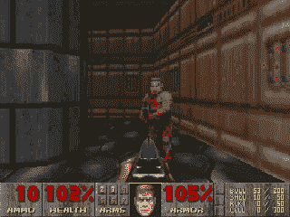

# 我如何建立一个算法来打倒雅达利游戏！

> 原文：<https://medium.com/analytics-vidhya/how-i-built-an-algorithm-to-takedown-atari-games-a13d3b3def69?source=collection_archive---------11----------------------->

电子游戏。我花了很多时间在这上面。我几乎每天都玩。但是有时候超越下一个层次是不可能的。作为一个对人工智能感兴趣的孩子和一个游戏玩家，我决定创建一个机器学习模型来击败所有我不会的游戏。👍

雅达利突破

> 在我们开始之前，试试这个很酷的技巧:在谷歌中输入“雅达利突破”,然后进入图片！

为了创建一个在专家水平上玩 Atari 游戏的算法，我从 Deep Q learning 获得了一些帮助。但是在我开始之前，我们需要了解一些基础知识来理解发生了什么。如果你是机器学习的新手，先看看这篇 [**文章**](/@sumeetpathania2003/introduction-to-the-world-of-ai-b07c4c2d3307) ！

## 快速浏览强化学习

强化学习是一种人工智能，它使用奖励和惩罚系统，目标是最大化获得的奖励。这种类型的学习有四个主要组成部分:代理人、环境、行动和回报。

让我们先试着更好地理解这一点。

假设你是一个 10 岁的孩子，需要为即将到来的数学考试学习。作为一个 10 岁的孩子，你不想学习，但如果你想，你妈妈会给你糖果，即使你完成了作业。

在这个例子中，你，孩子是**代理**，即将到来的数学考试代表**环境**，每个问题/工作表代表**状态，**决定工作与否是**动作，**和**奖励**是每次你完成一个工作表就得到糖果。

## q 学习

q 学习是代理决定采取什么行动的一种方式。起初，代理不知道该做什么。由于这不是监督学习，代理没有过去的经验，它不知道采取什么行动来最大化奖励。(回想一下孩子的例子，如果他不知道自己拿巧克力是为了什么，他就拿不到巧克力)。这就是 Q 表的用武之地！

## q 表

因为在 q-learning 中没有**策略**，所以 Q-tables 的目标是在每个状态下找到最佳策略或行动过程。Q 表中的 Q 代表“质量”(动作的质量)。本质上，Q 表的目标是规划出采取什么行动来获得最高的回报。

想象一只老鼠被困在迷宫里。

它可以采取 4 种行动:1 步左，右，上，下。这就是 Q 表派上用场的地方。Q 表告诉我们在每种状态下采取哪一步来最有效地获得奶酪。新游戏开始时，牌桌看起来会像这样:

列=操作，行=状态

## 计算每个动作的值

Q 表最终需要告诉我们采取什么行动来获得尽可能高的回报。这是通过使用**贝尔曼**方程的 Q 学习算法来完成的。

但是…如果每个 Q 值都等于零，我们在开始时可以采取什么行动呢？如果有一条老鼠还没有探索过的更好的路线呢？

这就是**勘探/开发**权衡派上用场的地方。

顾名思义，这有助于 Q-tables 决定是探索和尝试新路线，还是坚持一条路线并利用其好处/回报。

在两者之间取得平衡至关重要。首先，需要充分探索变体空间，以便识别最强的变体。通过首先识别，然后继续利用最佳行动，你可以从环境中获得最大的总回报。然而，你还想继续探索其他可行的变体，以防它们在未来提供更好的回报。

这就是我们使用**ε贪婪策略**的地方，通常写为 **ε** ，ε的希腊语符号。

epsilon 贪婪策略中的“贪婪”代表你可能认为它做的事情。让我们回到鼠标的例子。在初始化一组试验后，不同路线的 20 次左右的试验，老鼠可以开始逐渐变得贪婪，并开始只使用它在大多数尝试中找到的 20 条路线中的最佳路线。

换句话说:

如果我们设置 *e* =0.05，该算法将在 95%的时间里利用最佳变量，在 5%的时间里探索随机备选方案。这在实践中非常有效。

现在，这就是你理解深度 Q 网络所需要知道的全部！

## 深入探究深度 Q 学习

这就是事情变得有趣的地方。😎

这就是我如何创建一个算法来玩专家级别的突破！

**Q 学习** + **强化学习+神经网络** = **深度 Q 网络**

**快速注意:**对于 Atari 游戏，由于它们比简单的鼠标迷宫大得多，所以很难对每个动作和像素使用 Q 表。它效率低下，不可扩展。对于更复杂的游戏，我们使用神经网络来使学习变得更容易和更有效，并在游戏中变得更好。有了这些神经网络，我们大大减少了可能性的数量，从几十亿减少到只有几百万。给定一个状态，这是通过神经网络逼近每个动作的 Q 值来完成的。

## 预处理

在这一步中，我们简单地降低帧和堆栈帧的复杂度。首先，让我们降低复杂性。

看下图。你认为我们能移除什么？

我们可以做的几件事是将图像灰度化，缩小尺寸，裁剪框架以移除不必要的东西(比如顶部的数字)。完成后，我们可以堆叠 4 帧。为什么我们要叠 4 帧？想象一下，两辆车在路上面对面。从单个图像中，你无法判断汽车是停着还是将要撞上，但是如果你从视频中获得几帧图像，你可以很容易地判断汽车是否在移动。同样，我们的 DQN 也更容易做出假设。

然后，卷积网络处理接收到的 4 个帧。这些卷积层允许您利用这些帧的一些空间属性。

## 体验接力

我们网络的下一部分是体验接力。它帮助我们做两件重要的事情:

*   **减少相关数据**
*   **更好地利用以前的经验**

如果我们按顺序训练网络，我们的代理人可能会受到相关性的影响。因为帧与帧之间不会发生太多影响代理行为的网络权重和偏差变化。

通过从重放缓冲区随机取样，我们可以打破这种相关性。这可以防止动作值发生剧烈的波动或偏离。

本质上，样本转换被存储，然后从“转换池”中随机选择以更新知识。

## 用损失函数改善网络

还记得我在上面说过用贝尔曼方程更新我们的 Q 表吗？这一次，我们想更新我们的神经网络权重，以减少误差。

通过取我们的 Q_target(来自下一状态的最大可能值)和 Q_value(我们对 Q 值的当前预测)之间的差来计算误差(或 TD 误差)

仅此而已。我们有自己的 DQN，可以玩从毁灭战士到乒乓的雅达利游戏！😎

## dqn 的局限性

深度强化学习被堆积如山的炒作所包围。而且理由很充分！强化学习是一个令人难以置信的通用范式，原则上，一个健壮的、高性能的 RL 系统应该在所有方面都很棒。将这种范式与深度学习的力量相结合是一种完美的融合。Deep RL 是看起来最像 AGI 的东西之一，这是一种推动数十亿美元资金的梦想。

不幸的是，它还不太好用。

现在，100%有可能克服这些限制。如果我不相信强化学习，我就不会从事这项工作。但是在前进的道路上有很多问题。以下是其中的几个例子:

**强化学习通常需要一个奖励函数**

*   RL 有一种令人讨厌的倾向，会过度满足你的奖励，导致你意想不到的事情。这就是为什么雅达利是 RL 的一个很好的基准。然而，将 RL 用于其他任务可能会被证明是低效的。

**深度强化学习可能样本低效**

*   DeepMind 的一篇论文对原始 DQN 架构的几项增量改进进行了研究，证明了所有改进的组合可以提供最佳性能。在雅达利尝试的 57 款游戏中，超过 40 款游戏的性能超过了人类水平。
*   通过查看图表，您可以知道训练 atari 游戏需要多长时间。RainbowDQN 在大约*1800 万*帧时超过 100%阈值。这相当于大约 83 小时的游戏体验。

## 关键要点

*   dqn 是一个强大的工具，可以比人类更快地学习和掌握策略
*   深度 q 网络是本质强化学习+神经网络
*   预处理是限制暴露在网络中的不必要信息的重要步骤。
*   经验接力更有效地利用观察到的经验
*   RL 非常有用，但是在完善 DQNs/ RL 之前，我们仍然有一些障碍

**如果你喜欢读这篇文章，请关注我，关注我未来的文章。此外，请随意与他人分享这篇文章！**

在 Medium 和 [LinkedIn](https://www.linkedin.com/in/sumeet-pathania-93b052194/) 上关注我，了解我在人工智能方面的最新进展。

如果你想知道我目前在做什么，以及我在人工智能和类似项目上的经历，请免费订阅我的时事通讯！[http://eepurl.com/gFbCFX](http://eepurl.com/gFbCFX)