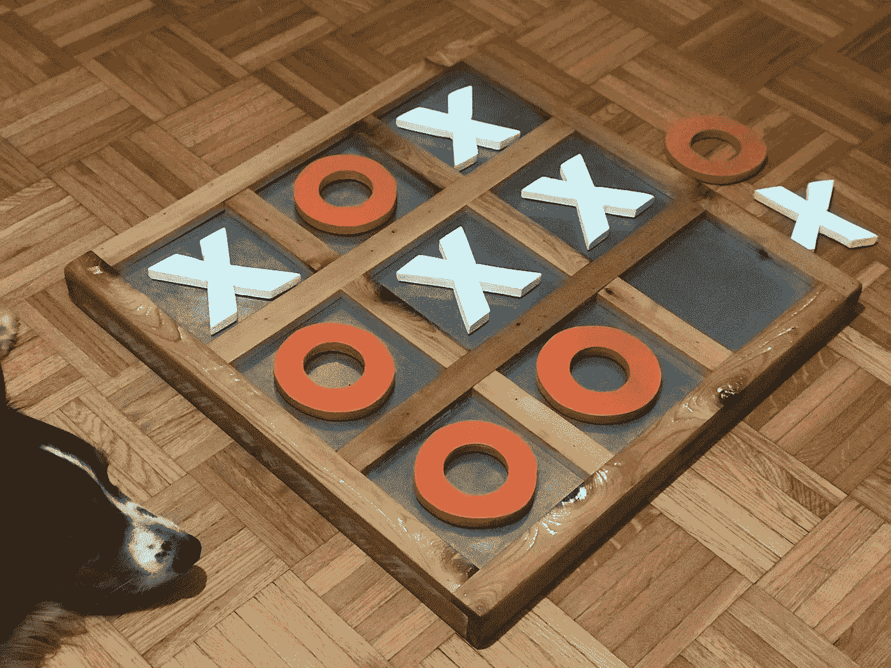

# 我如何用 Ruby 为井字游戏构建了一个无与伦比的人工智能算法

> 原文：<https://medium.com/analytics-vidhya/how-i-built-an-unbeatable-ai-algorithm-for-tic-tac-toe-game-in-ruby-26d8c2f43e52?source=collection_archive---------23----------------------->

人类一直着迷于这样一种想法，即机器可以在自己的策略游戏中击败他们，这使得创造由人工智能融入的现实游戏体验成为游戏行业的未来。人工智能的崛起和主导地位已经被证明是创造更智能、更具互动性和更能激发玩家兴趣的游戏的重大进步