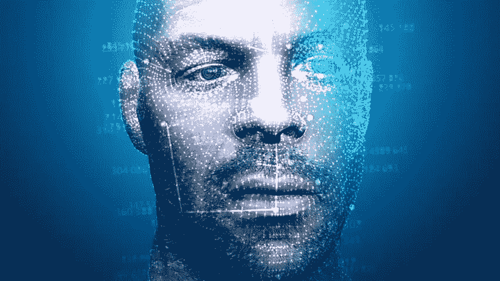
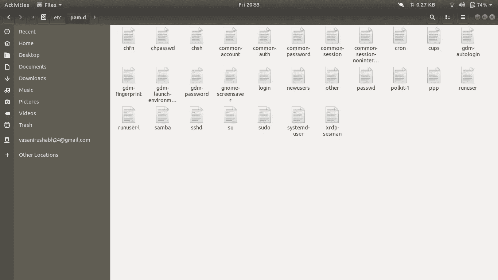
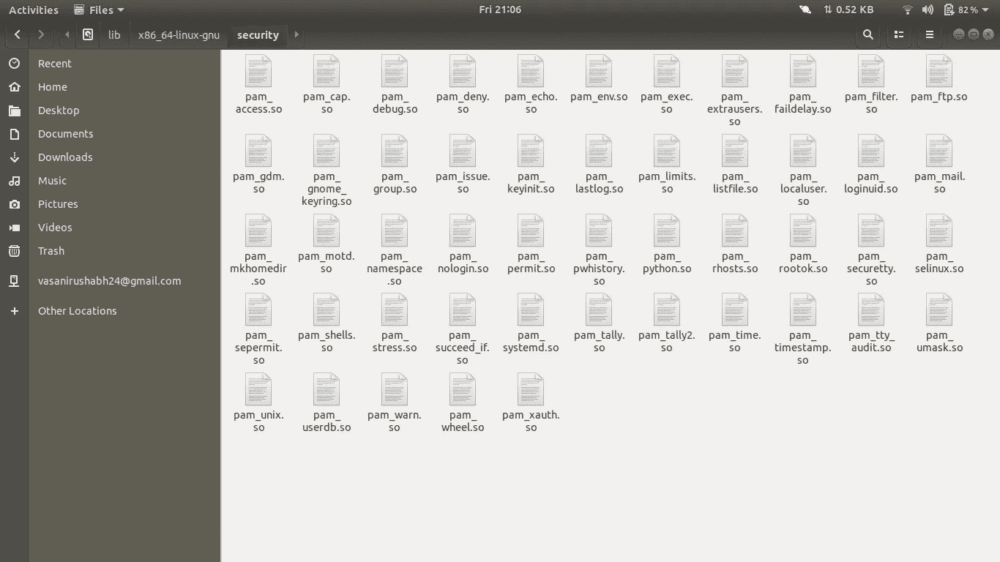
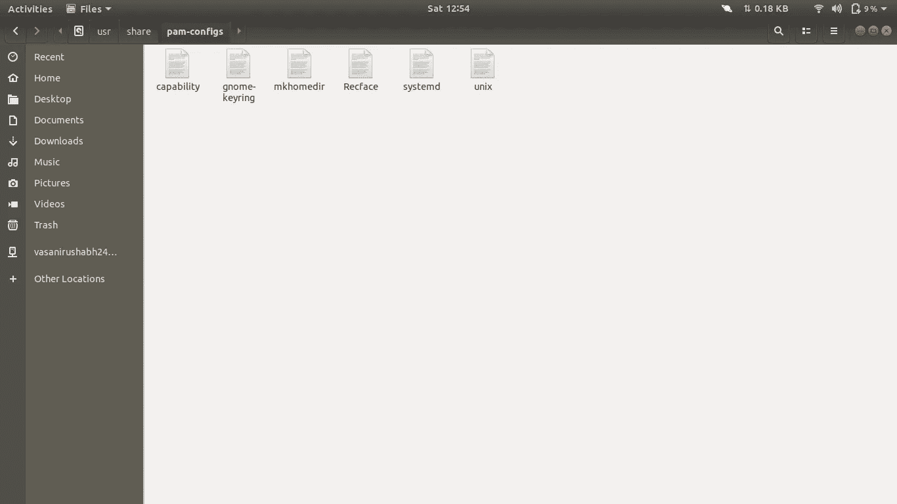

# 我是如何为 Ubuntu Linux 构建面部解锁的

> 原文：<https://medium.com/analytics-vidhya/how-i-built-face-unlock-for-ubuntu-linux-a2b769d1fbc1?source=collection_archive---------8----------------------->

# 介绍

这篇文章是关于我如何为我的 Ubuntu 机器建立 face unlock 或者苹果可能会说的“face ID”。我们开始吧！

来源:[维基百科](https://en.wikipedia.org/wiki/Face_ID#/media/File:%D7%94%D7%9C%D7%95%D7%92%D7%95_%D7%A9%D7%9C_%D7%9E%D7%A2%D7%A8%D7%9B%D7%AA_%D7%94%D6%BEFace_ID.jpg)

# 目标

它旨在建立一个面部认证系统，可以在登录时工作，同时在 Ubuntu 中运行“sudo”或“su”命令。

# 让我们先把问题分解一下:

1.  如何构建人脸识别器
2.  如何给 Ubuntu 添加这个功能

# 履行

来源:[https://ak3 . picdn . net/shutterstock/videos/1019928523/thumb/11 . jpg](https://ak3.picdn.net/shutterstock/videos/1019928523/thumb/11.jpg)

## 1.如何构建人脸识别器

我使用 OpenCV 和 [fastai](http://fast.ai) 库来构建我的人脸识别器。因此，首先只是为了建立模型，我使用了我的脸部照片和我朋友的脸部照片，然后我用 Vgg16 预训练模型转移学习模型。实际上，它没有给我令人满意的精确度。然后我意识到图像中有很多噪声，图片非常宽，而不仅仅是面部图像。因此，我使用 OpenCV 的“[Haar cascode _ frontal face _ default . XML](https://pythonprogramming.net/haar-cascade-face-eye-detection-python-opencv-tutorial/)”从图片中提取人脸，然后再次训练模型，并尝试一些参数组合，它突然在验证数据集上获得了非常好的准确性(> 93%)。

我已经建立了我的模型，并决定了最终模型的参数调整，但实时人脸识别尚未实现。然后，我编写代码来单击一张图片，提取人脸部分，然后将其返回给调用者函数和另一个函数来调用上述函数，并将返回的图片提供给模型。

我发现，这一次它主要是给我错误的输出或正确的输出，可信度较低。我意识到我的笔记本电脑的相机点击的图片比我曾经用于培训的图片差得多，所以我决定用我用于将图片返回到模型的相同代码点击我 pc 上的所有图片，但使用一些不同的参数集。比如，如果是为了测试，函数调用将是 *getFaces()* ，但是为了训练，它将是 *getFaces(training = True)。*然后我的模型又开始给出好的精确度:)

第一阶段，深度学习部分几乎完成了，但更难的部分仍然存在，即将它添加到 Ubuntu 中。

## 2.如何给 Ubuntu 添加这个功能

## 子任务:

1.  研究阶段
2.  部署阶段
3.  一些最后的润色

## 研究阶段

我知道在任何操作系统中做出改变似乎都很困难，但是 Linux 开发人员已经将 Linux 变得如此动态，以至于在任何 Linux 发行版中做出改变或添加东西都不是那么困难。你需要的只是做一些研究的能力和耐心。

当我想到在我的 Ubuntu 机器上添加一个面部解锁系统时，我在想这将会非常困难，我将不得不修改 Linux 内核的代码。但是经过几天对 Linux 认证系统的研究，我从[这个页面](http://tldp.org/HOWTO/User-Authentication-HOWTO/x115.html)了解到 **PAM(可插拔认证模块)**。然后我意识到 Linux 是多么的动态！

我的机器的/etc/pam.d/目录的屏幕截图

PAM 是一个 C++接口，实现这个接口的人成为一个认证方法。因此，实现 PAM 接口的文件只需在文件“/etc/pam.d/common-auth”中添加一行就可以成为一种认证方法，这是 Ubuntu Linux 中的认证规则集。

但更棘手的部分来了。PAM 接口是用 C++编写的，我已经决定用 python 实现人脸识别，所以我找不到处理这种情况的方法。我不知道我是怎么知道的，但是当我在寻找一些东西的时候，我知道了 [pam_python](http://pam-python.sourceforge.net/) 。而 pam_python 是 pam 接口 C++和 python 语言之间的桥梁。

## 部署阶段

所以在做了这些研究之后，我安装了 pam_python，并将 pam_python.so 文件放入“*/lib/x86 _ 64-Linux-GNU/security/*”目录中。请参见下图。

我的机器的*/lib/x86 _ 64-Linux-GNU/security/*目录截图

然后我在 pam_python 的帮助下实现了 PAM 接口，并实现了 4 个必须实现的功能，

> ***(1)PAM _ sm _ authenticate(pamh，flags，args)*** *(对于“sudo”命令)*
> 
> ***(2)PAM _ sm _ open _ session(pamh，flags，args)*** *(用于打开类似登录和“su”命令的会话)*
> 
> ***(3)PAM _ sm _ close _ session(pamh，flags，args)*** *(用于关闭会话)*
> 
> ***(4)PAM _ sm _ setcred(pamh，flags，args)*** *(设置当前用户与认证句柄关联的凭证)。*

然后，为了将它添加到身份验证方法列表中，我必须在/etc/pam.d/目录中创建一个类似 once 的规则文件，并将其放入/usr/share/pam-configs/目录中。

我的机器的/usr/share/PAM-configs/*目录截图*

*然后嘣！！它开始工作了。尽管在制作过程中遇到了很多困难。 ***我两次差点把我整个系统都败坏了！但是恢复模式救了我:*** )*

## *一些最后的润色*

*我想让其他人安装起来更简单，所以我写了 shell 脚本，这样任何人都可以用 5-6 个命令安装它，这些命令在[的自述文件](https://github.com/rushabh-v/linux_face_unlock)中有提到。我编写了 shell 脚本，向系统添加名为“facerec”的命令，该命令可用于启用面部解锁，并向系统添加新的额外面部模型，如“facerec enable”和“facerec new”。*

*在登录和运行“sudo”或“su”命令时，面部解锁运行得非常好。虽然这个过程有点慢。下面是这个项目我的 GitHub 回购的链接。*

* [## rushabh-v/linux_face_unlock

### 安装:步骤 1…

github.com](https://github.com/rushabh-v/linux_face_unlock) 

任何人都可以通过在他们的系统中运行 5-6 个命令来安装它。这些都写在自述文件中，您可以随时访问并安装它。 ***投稿和问题或任何新想法都是最受欢迎的*。因为我对它有进一步的计划，**

1.*增加并行处理以提高速度。*

2.*改变算法，使用自动编码器和解码器技术并使用* [*该数据集*](https://www.kaggle.com/c/recognizing-faces-in-the-wild/data) *制作无监督算法。我认为这在分类方面可以成为一个更有效的算法。*

3.由于它只针对 Ubuntu 发行版，现在增加对其他发行版的支持也在列表中。

# 结论

这样你也可以在你选择的 Linux 发行版中添加你喜欢的特性。你所需要的只是研究和耐心。

***PS:想找 ML/DL 的实习。结帐我的(***[***GitHub******)、(***](https://github.com/rushabh-v)[***Kaggle***](https://www.kaggle.com/rushabhvasani24)***)和(***[***LinkedIn***](https://www.linkedin.com/in/rushabh-v/)***)个人资料。***

来源:https://media.giphy.com/media/VbnUQpnihPSIgIXuZv/giphy.gif

> 继续读，继续黑——谢谢:)*