# 我如何在几分钟内使用 Dialogflow 和 Node.js 为 Slack 构建我的第一个聊天机器人

> 原文：<https://medium.com/analytics-vidhya/how-i-built-my-first-chatbot-for-slack-using-dialogflow-and-node-js-in-minutes-9ce7e5b81c8c?source=collection_archive---------7----------------------->

## 使用 Dialogflow 创建聊天机器人的简单指南。

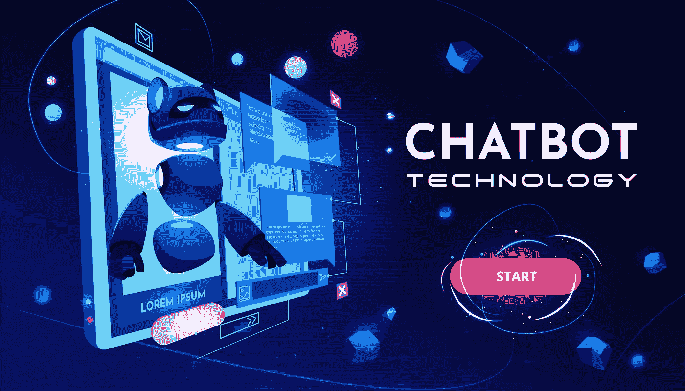

构建您的第一个货币转换器聊天机器人，并部署在 Slack。

# 介绍

如果你来这里是因为你想创建你的第一个聊天机器人。或者可能是因为您已经构建了一个，您想用 NLP 改进您聊天机器人的响应。那你来对地方了。

聊天机器人是一种可以通过聊天界面与人类互动的计算机程序，旨在使用人工智能模拟人类。

在今天存在的数以千计的聊天机器人中，最著名的是 Siri、Alexa、Cortana……事实上，机器人不仅有助于我们计划我们的一天和听音乐。它们越来越多地在广泛的行业中实施，并被公司引入市场和与客户沟通。他们甚至可以更进一步，建议你下一步要做什么。

简而言之，机器人可以负责以前消耗大量资源的数据收集、管理和例行分析。

在本文中，我将指导您如何在几分钟内使用 Dialogflow 构建您的第一个聊天机器人，并将其部署在 Slack 上。我将把这个机器人叫做 CurrencyBot。

# 目录

1.  基于自然语言处理的聊天机器人平台比较
2.  基本的理解力
3.  对话流集成
4.  构建了一个 Webhook 来使用 Dialogflow 上的 fulfillement 功能
5.  使用 Ngrok 设置代理服务器
6.  让我们的聊天机器人活起来(集成 Slack 上的机器人)

# 基于自然语言处理的聊天机器人平台比较

我们对聊天机器人及其重要性有了一个基本的了解。现在的问题是'*'我可以在哪里以及如何建立这些聊天机器人？'*
市面上有几种平台可以用来构建聊天机器人。分别是 Dialogflow，wit.ai，Rasa，Amazon Lex 等等。

以下部分讨论了其中的一些平台:

## 1.对话流:

[Dialogflow](https://dialogflow.com/) (曾被称为 Api.ai)。2016 年被谷歌收购。该平台通过谷歌助手和其他消息应用程序和设备与用户联系。

**优点**

*   很有用:不用安装，马上上手。
*   这很简单:Dialogflow 包含许多预构建的代理，激活它们轻而易举。
*   它是集成的:你可以连接你喜欢的平台，如脸书，Twitter，Slack，Telegram 等…只需点击一下。
*   多语言(它可以识别超过 15 种语言)。
*   你会很高兴知道它是完全免费的。

**缺点**

*   文档&教程库不是很令人满意。
*   程序员无法对对话处理进行精确控制。

## 2.**wit . ai:**

Wit.ai(归脸书所有)的工作方式类似于 Dialogflow:它也处理人类的语音模式，并从中过滤有用的数据，如意图和上下文。像 Dialogflow 一样，它提供了一个 UI 来帮助开发人员创建意图、实体和代理。

**优势**

*   很简单:快速入门教程对于入门来说非常实用。
*   它是集成的:你将能够集成几个平台，像脸书，推特，Slack，电报等…
*   适应性强:你可以用 Node.js、Python 或 Ruby 来构建你的机器人。
*   完全免费！

**劣势**

*   没有可视化的开发环境，所以你必须熟悉代码。
*   并不快。学习曲线似乎更陡峭，你需要投入时间来找出如何实现它。

## 3.RASA:

Rasa 是面向开发者和产品团队的开源机器学习工具。Rasa 带有 Rasa NLU 和 Rasa 核心。NLU 处理意图和实体，而核心处理对话和实现。

**优势**

*   开源，这意味着我们确切地知道在引擎盖下发生了什么，你可以定制你想要的东西。
*   您可以将其托管在您的服务器上。
*   可以作为简单的 http 服务器运行，也可以使用 API 从 python 中使用。

**缺点**

*   需要安装多个组件。
*   需要技术知识。
*   学习曲线-安装、配置和培训阶段需要机器学习专业知识(至少是基础水平)。

对于本文，我们选择使用 **Dialogflow** ,因为它为初级开发人员提供了开发机器人的良好用户体验，而无需成为该领域的专家。

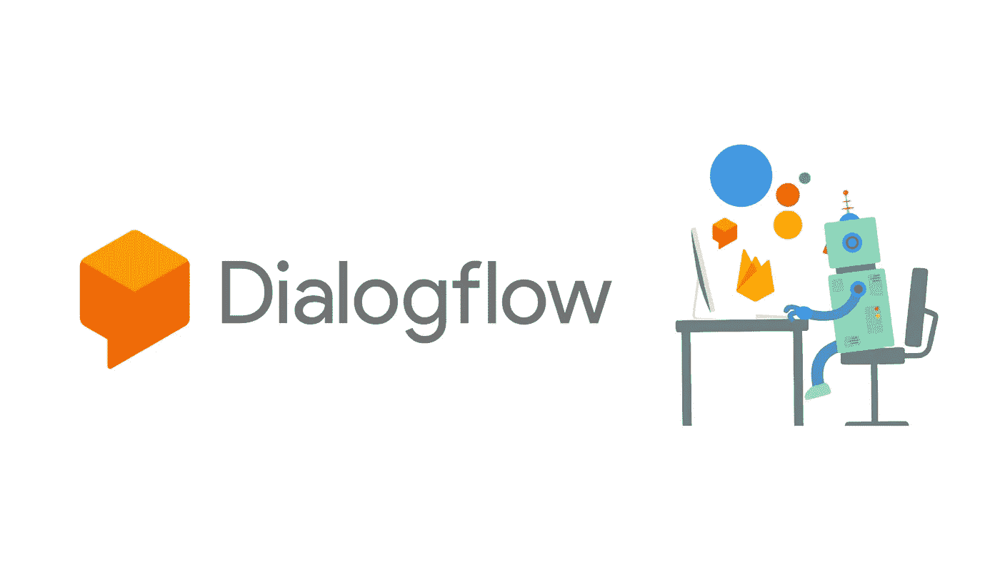

# 基本理解:

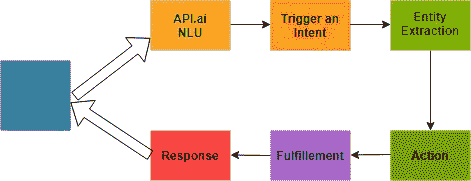

**意图:**一个*意图*就是用户的意图。例如，如果用户键入*“如何将 400 dt 转换为 Eur？”*，用户的意图是检索货币转换器。意图有一个名称，通常是一个动词和一个名词，不使用空格，例如*“货币转换器】*。

**实体:**一个*实体*修改意图。例如，如果用户键入*“让我们重设货币”*，则实体为*“重设”、“更改货币”*。实体被赋予一个名称，如*“reset”*。

动作:我们的机器人会说或做的事情。

**完成:**基本上是我们告诉机器人去做或执行的事情，一旦 Dialogflow 确定了正确的意图。对于我们的例子，我们只需要为这个目的启用启用 webhook 调用的切换。

# 对话流集成

首先，您将打开 [Dialogflow](https://dialogflow.com) 网站，然后点击*“免费注册”*按钮。你将被带到一个注册页面，在这里你可以用你的 Google 帐户登录。

所以，要开始，点击*【创建代理】*按钮。您可能需要再次授权 Dialogflow 以获得您的 Google 帐户的额外权限。这是正常的，所以点击*“授权”*。

在下一个屏幕上，我们看到了我们代理的详细信息:

*   代理名称:这是供您自己参考的，以便您可以在您的界面上区分代理。你可以选择任何你想要的名字。
*   描述:一个可读的描述，这样你就可以记住代理是做什么的。这是可选的。
*   语言:代理工作时使用的语言。在本教程中，我们将学习英语。
*   时区:您希望座席所在的时区。

然后点击“创建”按钮。

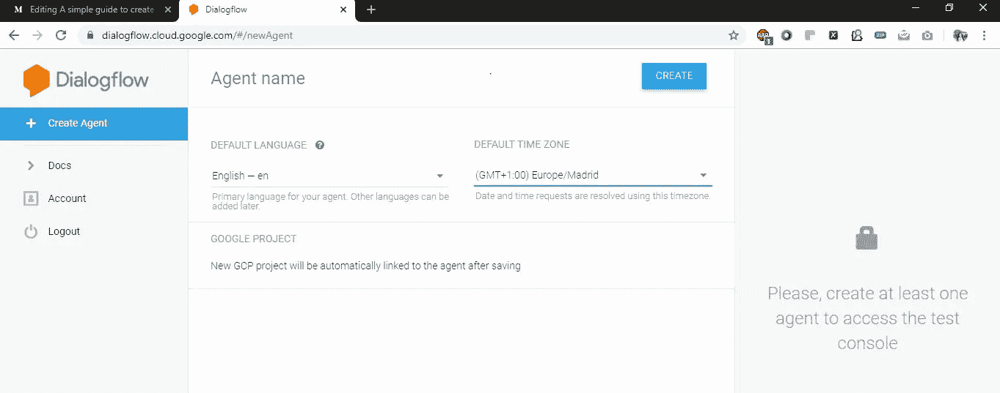

**闲聊:**

这是 Dialogflow 上的一个令人惊叹的功能，它使您的机器人能够立即就一系列常见问题(简单的问题，如*“你好吗？”*、*“你在干什么？”*、*“你叫什么名字？”*)

我来演示一下:启用**闲聊**点击“保存”。

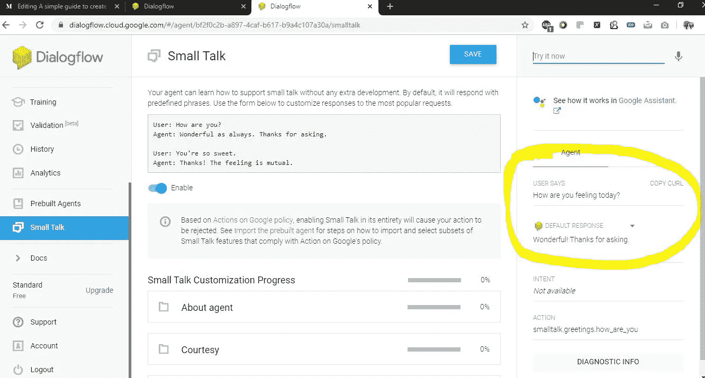

在右边的测试面板中，我输入“你今天感觉怎么样？”机器人对此的反应。

所有这些回答都是**闲聊**功能的结果，它内置于回答的训练集中。

现在，我**禁用**这个功能是有原因的。我认为为特定领域或任务设计的机器人表现最好。因为闲聊很容易使谈话偏离方向，进入未知领域，而机器人将无法实现我们想要的。

## 创建一个意图

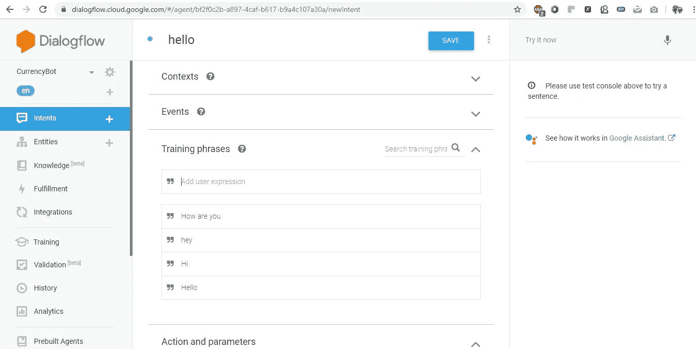

在我们新的 CurrencyBot 代理中，我们将创建一个意图。第一个意图是*“你好”*我们可以在“训练短语”中添加问候短语。以及“文本响应”中的响应。完成后，不要忘记点击*“保存”*，否则所有配置都会丢失。

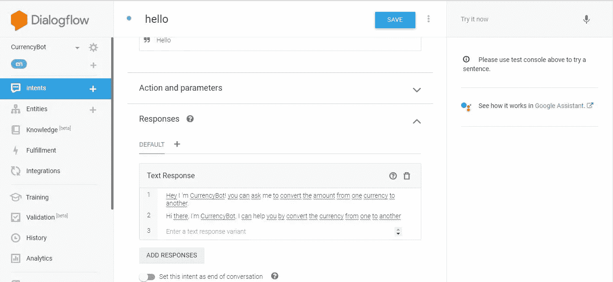

然后，我们将创建这些意图:

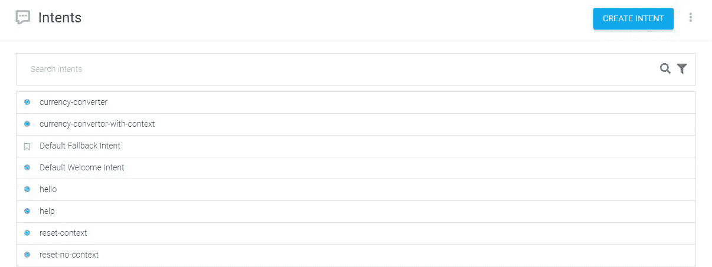

在创作过程中所有的意图都是相似的；不同之处在于*“货币转换器”*和*“上下文货币转换器”*的意图。我会向你详细说明不同之处。

*   **“货币转换器”意图**:

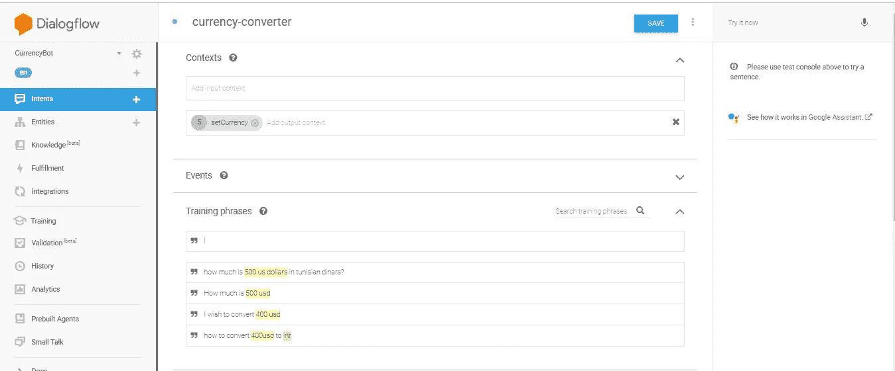

在输出上下文中添加“set currency ”+训练短语，如图所示

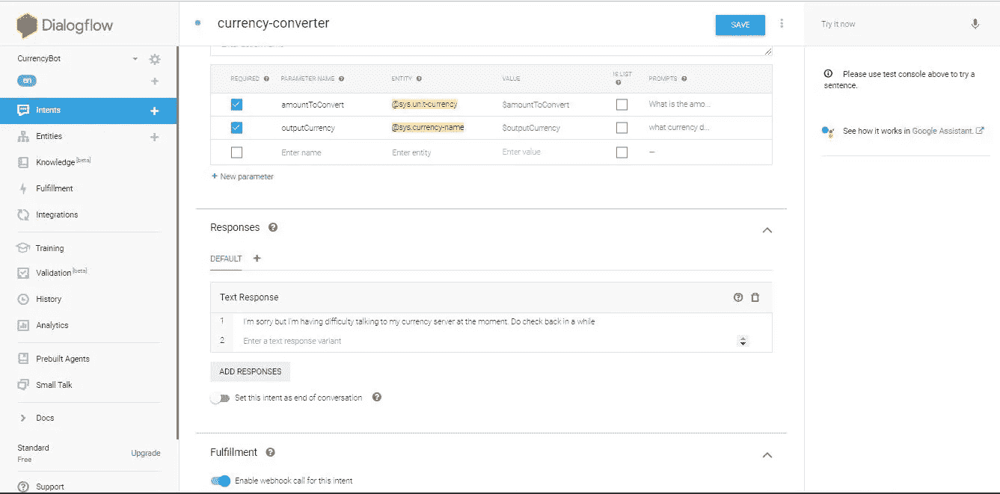

在“操作和参数”中选中“必需”并更改参数名称+在“完成”中为此目的启用 webhook 调用

*   **“带上下文的货币转换器”意图:**

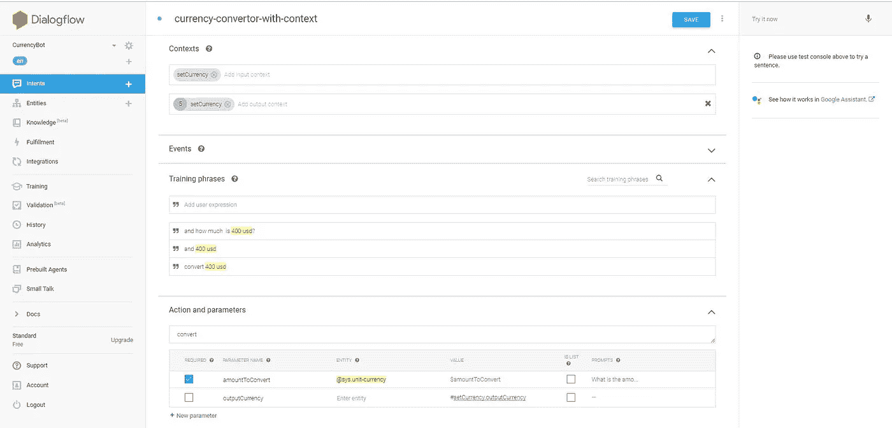

在输入和输出上下文中添加 setCurrency 在“动作和参数”中需要检查+在“Fulfillement”中启用 webhook。

# 构建了一个 Webhook 来使用 Dialogflow 上的 fulfillement 功能

让我们创建一个带有一个 webhook 端点的简单 web 服务器。首先，我们需要知道 webhook 是一种应用程序向其他应用程序提供实时信息的方式。

首先，您必须创建一个新目录，在那里您将存储您的整个项目。我们打算把它命名为“CurrencyBot”。

当你创建了你的目录，进入你的终端，访问它并初始化你的 Node.js 应用程序(你应该首先在你的系统中安装 [Node.js](https://nodejs.org/en/) ):

```
npm init
```

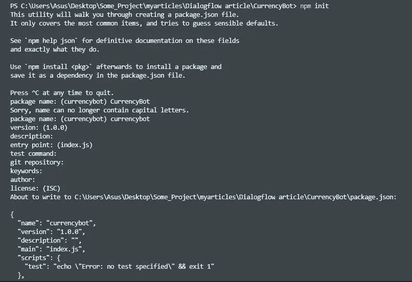

将 *package.json* 文件改成这样:

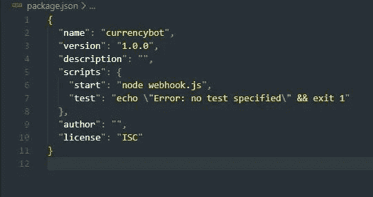

然后创建 webhook.js 文件并键入以下命令:

```
>npm install -g eslint>npm i restify request --save --save-exact
```

你可以在这里 找到我的 web hook . js[T5。](https://github.com/AmalM7/CurrencyBot)

如果您是第一次使用 Node.js，请安装“nodemon ”,使用:

```
npm install nodemon 
```

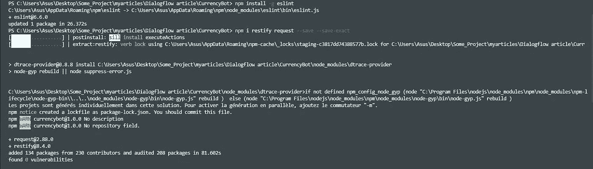

之后，您可以通过以下方式运行它:

```
npx nodemon 
```

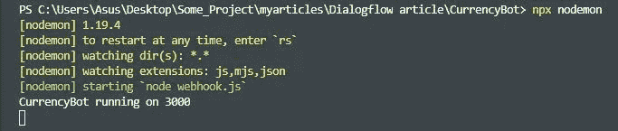

# 使用 ngrok 设置代理服务器

Ngrok 是一种多平台隧道、反向代理软件，可建立从公共端点(如互联网)到本地运行的网络服务的安全隧道，同时捕获所有流量以进行详细检查和重放。

你可以在这里[阅读更多关于它的信息](https://ngrok.com/)并安装它。

现在，您可以打开另一个终端并将其放在项目的目录中(同时您的本地服务器正在运行),然后键入以下命令:

```
ngrok http 3000
```

它将向您显示一个带有几个 URL 的新屏幕，您需要的 URL 是最后一个以 **https** 开头的 URL

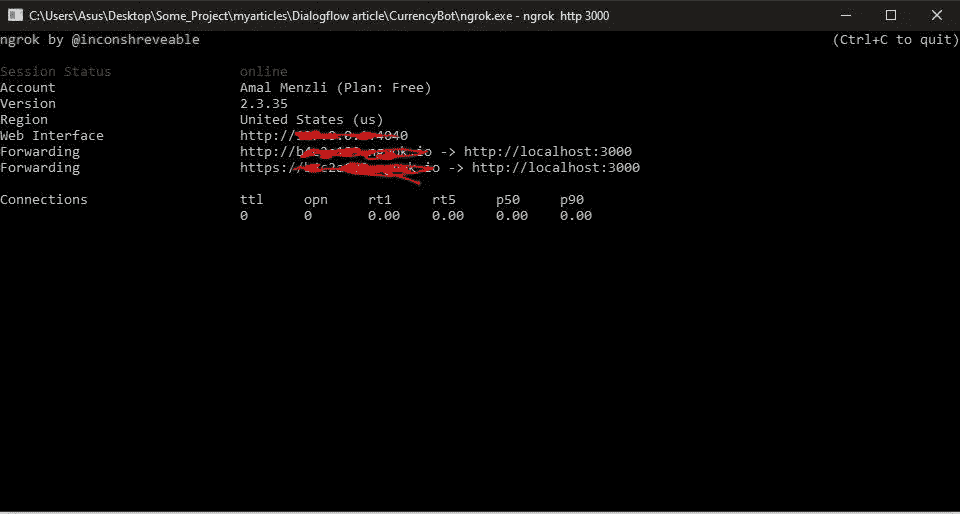

复制此 URL 并将其粘贴到 Fulfillment 部分，如下所示:

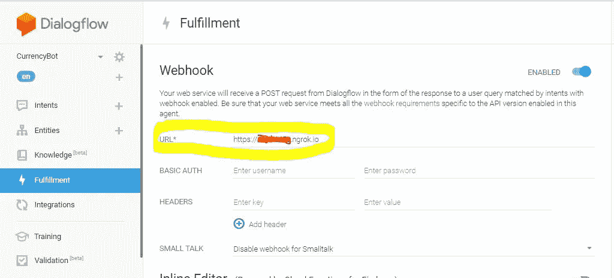

> 注意:不要忘记点击*“保存”*按钮。

在 Dialogflow 的右侧，您可以尝试您的机器人:

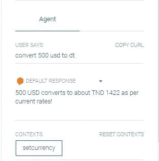

很好，一切正常！！！现在我们可以部署我们的聊天机器人了。

对于这篇文章，我会选择 Slack。

# 让我们的聊天机器人活起来(集成 Slack 上的机器人)

我们将通过创建一个 slack 应用程序来创建一个 slack 集成。让我们来看看创建一个 Slack 应用程序的过程。首先要做的是进入*“集成”*并启用松弛集成。

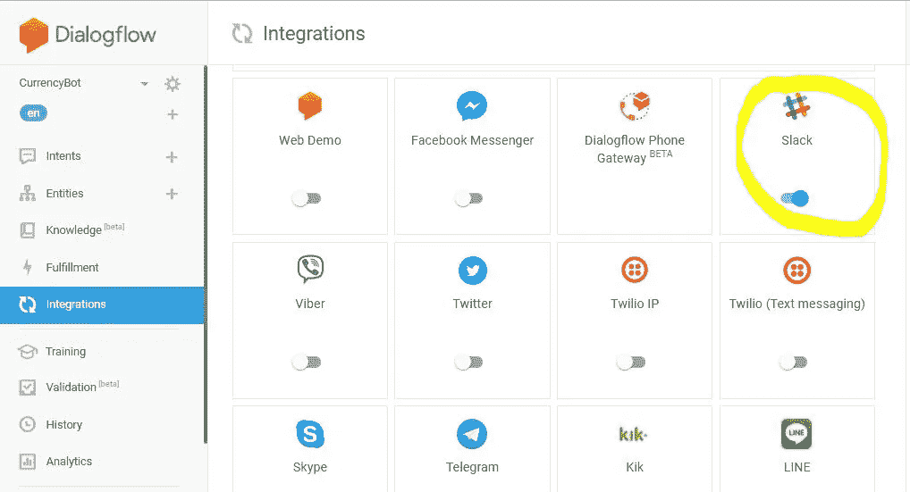

下一步是创建一个呆滞账户，并转到[**https://api.slack.com/**](https://api.slack.com/)。选择一个现有的发展松弛的工作场所(如果你有的话)或者创建一个新的。

现在在你的**工作场所**创建一个 Slack 应用程序，并给它命名。让我们把我们的应用程序叫做**current bot**。

这个过程在下面的 gif 中有详细的总结。

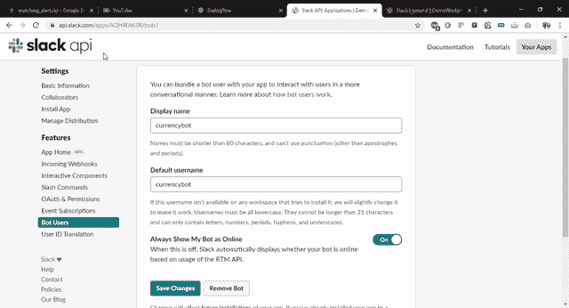

而且成功了！！🎉🎉 👏 👏

现在你可以创建一个简单但非常有效的聊天机器人。

# 结论

这是一个创建你的第一个聊天机器人的循序渐进的教程。现在，您可以添加任意多的交互性。你可以让你的机器人与实体一起工作，进行 API 调用，语音识别等…
欢迎在下面的评论区自由讨论并提供你的反馈。你将需要这个项目的代码是可用的 [*这里*](https://github.com/AmalM7/CurrencyBot) 。

***快乐阅读，快乐学习，快乐编码。***