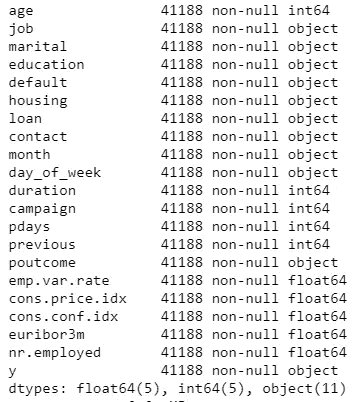
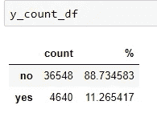
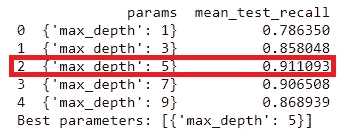
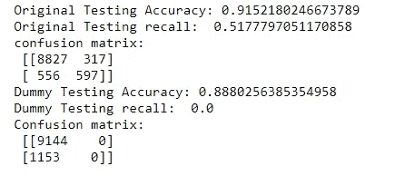
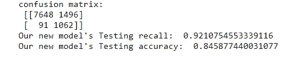

# 优化不平衡用户订阅预测的更好集合矩阵

> 原文：<https://medium.com/analytics-vidhya/how-i-choose-metric-and-parameters-for-better-prediction-on-imbalanced-user-subscription-data-824369204cb3?source=collection_archive---------20----------------------->


照片由 [Cindy Tang](https://unsplash.com/@tangcindy?utm_source=medium&utm_medium=referral) 在 [Unsplash](https://unsplash.com?utm_source=medium&utm_medium=referral) 上拍摄

我们都知道在使用机器学习来解决问题时，获得正确的指标有多重要。适合这种情况的适当指标将有助于我们的机器学习模型在创造价值方面发挥最大作用。相反，糟糕的度量设置可能导致无用的模型，并失去创造更多价值的机会。

在本文中，我将通过一个例子来说明如何根据营销场景选择指标，并进一步实现根据指标选择参数的机器学习模型。此外，由于我们的样本数据非常不平衡，我还将演示一种在交叉验证过程中实现过采样的方法。

让我们先快速浏览一下我们的数据。

我们使用的数据是来自 UCI **的 [**银行营销数据集。**我们使用由**#银行客户数据#其他属性#社会和经济背景属性组成的 20 个特征来预测用户订阅。(详细数据描述请点击链接。这里我们跳过这一部分来关注这个问题。)**](https://archive.ics.uci.edu/ml/datasets/Bank+Marketing)**

**数据:41188 个条目，21 列，20 个预测值(x)和 1 个因变量(y)**

********

**正如我们所看到的，我们的数据在类别(y)标签上是高度不平衡的。当营销人员在线或线下开展营销活动时，与不响应的用户相比，只有很低比例的用户会订阅或成为买家，这是很常见的。**

**常规设置是为了提高分类模型的度量“准确性”。然而，在我们的例子中，我们可能会遇到两个问题:**

1.  **误导性的高精度:对于主要由负值 y 组成的高度不平衡的数据，模型会倾向于将所有值预测为负值，从而误导性地提高精度。这时，过采样开始用于防止模型出现偏差。**
2.  **我们衡量的指标可能不符合现实世界的情况:在用户订阅非常有价值而营销成本相对较低的情况下，我们主要关心的是如何找到尽可能多的用户订阅，而不是准确预测那些不会响应的用户。换句话说，我们希望降低误报率(我们无法识别的订阅用户)并提高召回率(TP/TP+FN ),这样我们就可以找到大多数愿意订阅的用户。**

**现在，我们可以开始解决这些问题了。**

**首先，当我们要在交叉验证过程中应用过采样时。我们应该只对训练数据进行过采样。对于验证和测试数据，我们想让它保持不平衡。(关于它的原因，请参考[https://beckernick.github.io/oversampling-modeling/](https://beckernick.github.io/oversampling-modeling/))**

**因此，我们不使用 sci-kit learn 中原来的交叉验证类，而是使用如下修改后的类。**

```
#modified cross validation that oversampled on training data (ref   [https://stackoverflow.com/questions/32615429/k-fold-stratified-cross-validation-with-imbalanced-classes](https://stackoverflow.com/questions/32615429/k-fold-stratified-cross-validation-with-imbalanced-classes))class UpsampleStratifiedKFold:
    def __init__(self, n_splits=3):
        self.n_splits = n_splits
    def split(self, X, y, groups=None):
        for rx, tx in StratifiedKFold(n_splits=self.n_splits).split(X,y):
            nix = np.where(y[rx]==0)[0]
            pix = np.where(y[rx]==1)[0]
            pixu = np.random.choice(pix, size=nix.shape[0], replace=True)
            ix = np.append(nix, pixu)
            rxm = rx[ix]
            yield rxm, tx
    def get_n_splits(self, X, y, groups=None):
        return self.n_splits
```

**接下来，我们可以开始训练我们的模型。这里，我们使用决策树分类器，将我们的 max_depth 设置为[1，3，5，7，9]，并将 cv 设置为 unsample_kf，我们刚刚定义了 un sample _ KF，以便仅对训练数据进行过采样。对于测量的方式，而不是使用默认的“精度”度量来优化。我们输出以下度量[“准确性”、“f1”、“精确度”、“召回”]，并使用“召回”作为选择模型参数的度量。结果表明，将参数设置为 tree-depth=5 会给我们带来最高的验证数据平均召回率(0.92)。**

```
# oversampling + choose parameters by recall
clf = tree.DecisionTreeClassifier(random_state=0)
unsample_kf=UpsampleStratifiedKFold(n_splits=5)
gscv=GridSearchCV(estimator=clf, param_grid={"max_depth":[1,3,5,7,9]},cv=unsample_kf,scoring=["accuracy","f1","precision","recall"],refit=False)
gscv.fit(X_train, y_train)
recall_by_par=pd.DataFrame(gscv.cv_results_).loc[:,["params","mean_test_recall"]]
print(recall_by_par)
```

****

**最后，我们可以将我们的模型应用于测试数据。我们比较了原模型和新模型的测试结果。**

*   **原始模型(无过采样，使用精度作为测量值)**

```
#The original model result without oversampling and choose parameters by accuracy
clf = tree.DecisionTreeClassifier(random_state=0)
gscv_ori=GridSearchCV(estimator=clf, param_grid={"max_depth":[1,3,5,7,9]},cv=5)
gscv_ori.fit(X_train, y_train)
print("Best parameters:",gscv_ori.best_params_)clf = tree.DecisionTreeClassifier(random_state=0,max_depth=5)
clf_fit=clf.fit(X_train,y_train)
y_pred=clf_fit.predict(X_test)
print("Original Testing Accuracy:", accuracy_score(y_test,y_pred))
print("Original Testing recall: ",recall_score(y_test,y_pred))
print("confusion matrix:\n",confusion_matrix(y_test,y_pred))from sklearn.dummy import DummyClassifier
dummy_clf =DummyClassifier(strategy="most_frequent")
dummy_clf.fit(X_train,y_train)
y_pred_dummy=dummy_clf.predict(X_test)
print("Dummy Testing Accuracy:", accuracy_score(y_test,y_pred_dummy))
print("Dummy Testing recall: ",recall_score(y_test,y_pred_dummy))
print("Confusion matrix:\n",confusion_matrix(y_test,y_pred_dummy))
```

****

**正如我们所看到的，原始模型的准确率相当高(92%)。但是召回率低(52%)。类似地，通过最频繁策略预测的虚拟分类器也具有高准确度(89%)但低召回率(0%)。**

*   **新模型(过采样并使用召回作为测量)**

```
#oversample the training data 
ind_0=np.where(y_train==0)[0]
ind_1=np.where(y_train==1)[0]
sample_cnt=len(ind_0)-len(ind_1)
sample_to_add=np.random.choice(ind_1,size=sample_cnt)
ind_ros=np.concatenate([ind_0,sample_to_add])
X_train_ros=X_train.iloc[ind_ros,]
y_train_ros=y_train[ind_ros]#testing result 
clf_ros_new = tree.DecisionTreeClassifier(random_state=0,max_depth=5)
clf_ros_new.fit(X_train_ros,y_train_ros)
ros_new_y_pred=clf_ros_new.predict(X_test)
print("confusion matrix:\n",confusion_matrix(y_test,ros_new_y_pred))
print("Our new model's Testing recall: ",recall_score(y_test,ros_new_y_pred))
print("Our new model's Testing accuracy: ",accuracy_score(y_test,ros_new_y_pred))
```

****

**不错！我们的召回率从 52%提高到了 92%。我们的营销人员现在可以发现 92%的用户会订阅，这与发现 52%的用户会订阅相比是一个巨大的增长。我们可以看到准确性从 92%下降到 85%(这意味着将不订阅的用户归类为订阅者的用户增加了)。然而，在寻找用户如此重要，营销成本又相当低的情况下，新的模式会比原来的模式给公司带来更多的价值。**

**总之，在本文中，我们使用过采样来处理不平衡数据，并通过召回率而不是准确度来衡量我们的性能。我们修改了原始 sci-kit 学习包的交叉验证，以更好地预测我们的目标。为了进一步改进模型，您还可以尝试通过 ROC 曲线设置不同的阈值，以便模型可以帮助公司实现利润最大化。**

**就是这样。感谢您阅读文章！这个实现的 python 代码在[我的 GitHub 库](https://github.com/chenyuko/user-subscription-predict/blob/master/User_subscribe_prediction.ipynb)上。可以随意运用到自己的作品中，看看数据科学如何帮助你创造更多的价值！！**