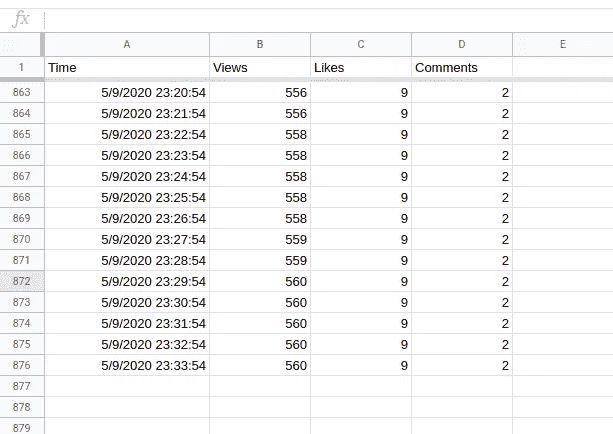
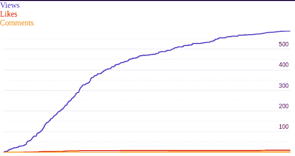
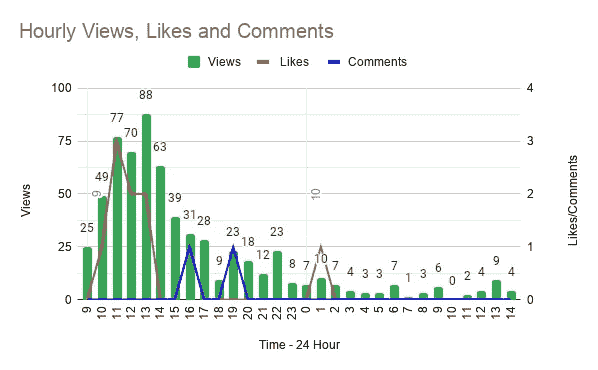

# 我如何使用 Google Sheets 为 LinkedIn 创建一个分析工具

> 原文：<https://medium.com/analytics-vidhya/how-i-created-an-analytical-tool-for-linkedin-using-google-sheets-56aa2a5bcbf8?source=collection_archive---------34----------------------->

下载此扩展以提升您在 LinkedIn 上的形象。

 [## LinkedIn 标签

### 分析工具，反映 LinkedIn 标签的关注者数量，以增强您的帖子的影响力。

chrome.google.com](https://chrome.google.com/webstore/detail/linkedin-hashtags/kkhmijpchbobncfmiihepfhpbkjnogbl) 

# 我的动力！

因此，几天前我开始使用 LinkedIn，从那时起，我就被人们定期在这个平台上发布的知识丰富的内容迷住了。受到他人的启发，我开始通过一些我认为其他人可能会受益的帖子来分享我的见解和知识。作为一名分析出身的人，我看了看数字，即我的帖子获得的覆盖面和参与度，很快我就觉得需要一个分析工具。我在网上搜索了很多，但没有找到任何好的解决方案，大多数都是付费的，而且只针对 LinkedIn 页面。因此，我的任务是构建一个基本的工具来跟踪我的帖子的观点、喜欢和评论！

# 我想到了什么？

由于已经习惯了抓取和 web 开发的世界，我的第一步是构建一个 python 脚本来抓取所需的数据，然后将其交付给 web 应用程序进行分析，并向我展示见解。但是所有这些都需要大量的时间和知识来制作一个合适的工作应用程序。因为这是供个人使用的，所以我选择简化我的工作，做一些事情，这样我就可以很容易地将数据可视化，并且不需要太多的编码就可以创造见解。

我想到的最好的工具是我们在学校一直使用的微软 Excel 或者现在的谷歌工作表。我的想法很简单，每隔一段时间从我的帖子中获取浏览、喜欢和评论的数量，然后将其插入新的一行。一旦我有了足够的数据，我就可以绘制不同栏目之间的图表，并从中进行推断，从而帮助我更好地了解我的受众。

# 那我做了什么？

为了将数据放入我的电子表格，我考虑利用 Google Apps 脚本与工作表的集成来与外界交互，并将数据添加到新行中。使用一个脚本，我从 LinkedIn 获得数字，并将它们附加到上面的表格中。现在，应用我的知识，我可以使用这些数字进行推理并绘制图表，以更好地了解我的受众，基于这些数据，我绘制了一个关于我的帖子的观点、喜欢和评论与时间的时间线。

在这里，在下一张图中，我可以看到超过 50%的浏览量来自于早上 10 点到下午 3 点之间的前 5 个小时，这是我的帖子在网络上传播的最初推动力。另外，我可以看到评论的效果持续了大约一个小时，并带来了更多的观点。

但我从图表中可以得出的最重要的推论是，我的大多数观众在下午 1 点左右都很活跃，并继续使用 LinkedIn。这种趋势从互联网上看来是不寻常的，但众所周知，我们现在面临的全球疫情可能会导致这种行为，因为我的大多数联系都是仍在大学的年轻人，他们在这段时间往往是自由的。

# 那么下一步是什么？

我计划使用我的脚本并收集更多的数据，直到我能够完全理解我的观众，因为从一篇帖子中做出推论是错误的，因为数据是不充分的。因此，我相信如果我继续分析我的帖子，有一天我将能够理解我的观众想要什么，并能够为他们创造合适的内容，从而为我们所有人充分利用这个平台。

因此，如果你有任何疑问或建议，给我发一个连接请求，在评论中提及，或留言。如果你想知道我是如何获取数据或者我使用的脚本，请告诉我！

在 LinkedIn 上与我联系，获取更多精彩帖子和更新。

谢了。