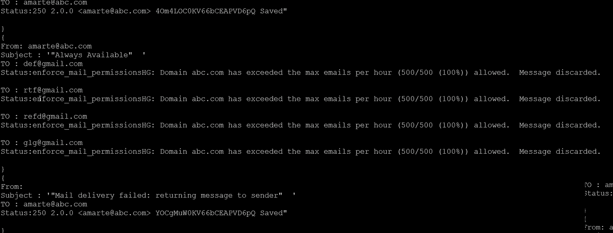

# 我如何使用 Python 从 EXIM 日志中提取“收件人、发件人、主题和状态”

> 原文：<https://medium.com/analytics-vidhya/how-i-extracted-to-from-subject-status-from-exim-logs-using-python-dbd041e8e5a?source=collection_archive---------11----------------------->


也许您的 cPanel 服务器上的某个特定域已经停止接收电子邮件。或者，您的域中的某个地址能够接收来自特定域以外的电子邮件。也许你可以很好地接收电子邮件，但会收到来自雅虎或 Gmail 的错误信息。对于上述所有场景，在大多数情况下，我们可以通过检查 Exim 日志的以下部分来找到到底发生了什么。

> 收件人、发件人、主题和状态

当然，我们可以使用 Exim 的内置命令行实用程序“exigrep ”,通过输入域或电子邮件来获得所有邮件交易的所有细节。但它还保存了除上述四个以外的大量信息。

所以我在网上到处寻找一个命令行工具来从 exim_logs 中提取上面的 prime 组件，但是我没有找到一个符合我确切要求的。所以我打算写一个 python 脚本，从 exim_logs 中提取“收件人、发件人、主题和状态”。

exim 日志中内容的模式取决于我们在 WHM >>主页>>服务配置> > Exim 配置管理器> >高级编辑器中描述它的方式。因此，根据上述设置，我们可能需要拿出一个正则表达式来提取内容。

对于我的，我想出了下面的正则表达式:

> 对于'从':"从\s <.> "
> 对于'主题':" T=。* from \ s<
> 为‘到’:【^\s]+@.*[\s]+F="
> 为‘状态’:”。*[$=]"

以下是最终的脚本:

```
import subprocess,re,sys,itertools;
import argparse;
parser=argparse.ArgumentParser(
 description=”To summarize exim_log output “
 )
parser.add_argument(‘EmailId’,help=”The email id or domain of which we need to genrate summary”)
parser.add_argument(‘-l’, ‘ — list’, help=”””Provide a list of values you need to search.seperate each input with coma(,) \n
 eg: exim_parser abc.com -l “hello world”,”[hello@helo.com](mailto:hello@helo.com)”,abc2.com “””, type=str)
args=parser.parse_args();
eximString=””;
if args.list is not None:
 my_list = [str(item) for item in args.list.split(‘,’)]
 print my_list;
 for i in my_list:
 eximString=eximString+”|”+”exigrep “+”\””+i+”\””;
 print eximString;
black=’\033[30m’
redy=’\033[31m’
green=’\033[32m’
orange=’\033[33m’
blue=’\033[34m’
pink=’\033[95m’
cyan=’\033[36m’
reset=’\033[0m’
print(args.EmailId);
spinner = itertools.cycle([‘-’, ‘/’, ‘|’, ‘\\’])
subprocesscalls=”exigrep “+”\””+args.EmailId+”\””+” exim_log”+eximString+”|cat”
lines=[];
pt = subprocess.Popen(subprocesscalls,shell=True,stdout=subprocess.PIPE,stderr=subprocess.PIPE)
while True:
 line = pt.stdout.readline();
 lines.append(line);
 if not line:
 break
 sys.stdout.write(next(spinner)) 
 sys.stdout.flush() 
 sys.stdout.write(‘\b’)
#lines = pt.stdout.readlines();
intial_regex=”T=.*from[\s]*<.*>”
fromaddress=””;
j=0;
for i in lines:
 if(re.search(intial_regex,i)):
 print(“}”);
 currentstring=str(re.findall(intial_regex,i));
 #print(currentstring);
 #print(str(re.findall(“from\s<.*@.*>”,currentstring)).replace(“from “,””))
 fromaddress=str(re.findall(“from\s<.*@.*>”,currentstring)).replace(“from “,””).replace(“‘“,” “).strip(“from”).replace(‘<’,””).replace(“>”,””).replace(“ “,””).replace(“[“,””).replace(“]”,””)
 subject=str(re.findall(“T=.*from\s<”,currentstring)).replace(“T=”,””).replace(“from”,””).replace(‘<’,””).strip(“[]”);
 print(“{“)
 print (“From: “+green+fromaddress+reset);
 print(“Subject : “+cyan+subject+reset);
 #This is the line where status and TO address lies
 elif (“F=<”+fromaddress+”>”) in i:
 #print fromaddress+”from”
 #toAdd=str(re.findall(“<.*>[\s]+F”,i));
 toAdd=str(re.findall(“[^\s]+@.*[\s]+F=”,i)).replace(“F=’]”,””).strip(“[]<>’”).replace(“>”,””);
 status=re.sub(‘.*[$=]’,’’,i).strip(‘“”’)
 print(“TO : “+orange+toAdd+reset+reset);
 print(“Status:”+pink+status+reset)
```



: