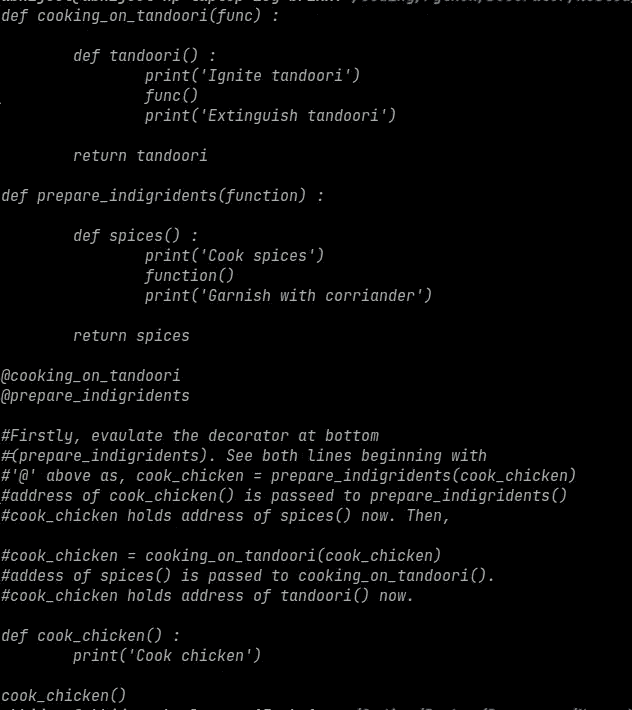

# 我如何在我的厨房里找到 Python 嵌套的装饰器

> 原文：<https://medium.com/analytics-vidhya/how-i-found-python-nested-decorators-in-my-kitchen-287b09b74667?source=collection_archive---------22----------------------->

面向对象编程的概念随处可见。装修工也不例外。

说到 Python 编程语言中的 decorators，它们是用来给函数添加额外的特性(任务)的。而不改变函数的原始代码。

让我们假设，我已经有一个名为' cook_chicken()'的函数，它告诉我煮一些鸡肉。

```
def cook_chicken():
    print('Cook Chicken')
```

但现在，我要执行*【两项附加任务】。首先，我想用烤鸡，其次是用烤鸡配菜。*

**

*照片由[图恩 Nguyễn 明](https://unsplash.com/@tuannguyenminh?utm_source=medium&utm_medium=referral)在 [Unsplash](https://unsplash.com?utm_source=medium&utm_medium=referral) 拍摄*

*所以，现在我在函数***' cook _ chicken()'***本身中楔入(force)***【两个附加任务】*** (在 tandoori 中烧鸡并用 corriander 修饰)的代码。答案是否定的。*

*因为，如果我要再写 ***另一个函数*** (它告诉我要煮别的东西)和那个 ***另一个函数*** 就涉及到这些*(在 tandoori 里煮东西和用 corriander 配菜)。我将不得不写代码的 ***【两个额外的任务】*** 在那 ***另一个函数*** 中也一样，再次。这种静态的不灵活的方法导致代码的重复和资源的滥用，说明了有缺陷的设计实践。**

**除此之外，如果函数'***cook _ chicken()'***是遗留代码(或遗留代码的一部分)，那么你就不会想去打扰函数 ***'cook_chicken()'的代码。*** *因为即使* **函数‘cook _ chicken()’***在尺寸上可能看起来微不足道，在这里。实际软件项目的遗留代码围绕着成千上万行代码。扰乱遗留代码是一个愚蠢的举动，并且是对错误的公开邀请。***

> **还有一个设计原则(在编程中)规定， ***“一个类或函数应该对扩展开放，但不能对修改开放”。*****

**这意味着如果你想给一个函数(或类)添加一个新的特性(或任务)。你不应该修改已经存在的旧的遗留代码，你应该动态地扩展遗留代码。**

**所以必须有一些方法来实现代码 ***【两个额外的任务】*** (在 tandoori 烹饪鸡肉，并用 corriander 装饰)，以一些动态和灵活的方式。**

**这就是 **Python decorators** 发挥作用的地方。需要两个(嵌套的)装饰者，一个将在 tandoori 执行烹饪任务，另一个将帮助用 corriander(树叶)装饰菜肴(烹饪的项目)。**

**Decorator prepare_indigridents()会用 corriander 装饰鸡肉。Decorator cooking_on_tandoori()将帮助鸡肉在 tandoori 上烹饪。**

****

**结论—现在如果我想在 tandoori 上做 _ 羊肉()呢？用芫荽装饰我的咖喱炒蛋。我不必将这些任务的代码嵌入到 cook _ 羊肉()和 cook _ 鸡蛋 _ 咖喱()函数中。有了这些装饰器，我们就可以轻松地使用它们了。从来不需要为 tandoori 和芫荽的任务编写代码。这种方法使我们的设计变得灵活、动态和有弹性。**