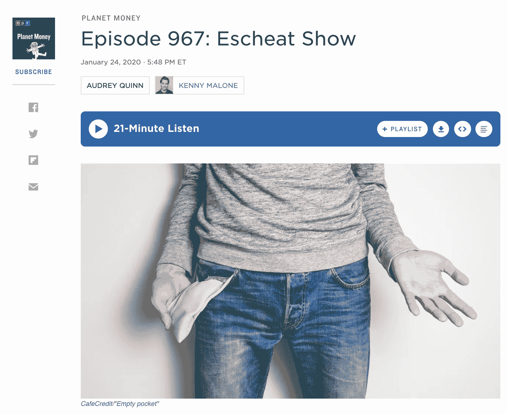
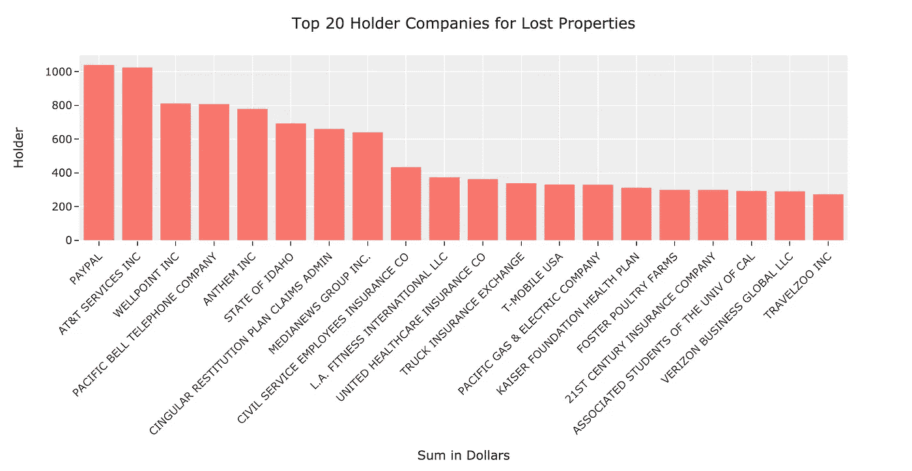
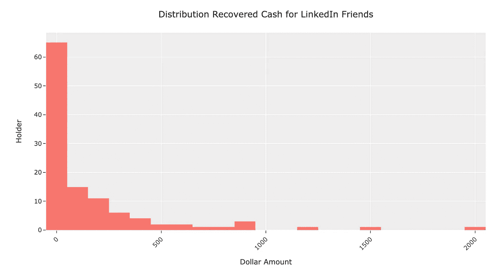

# 我是如何使用 Python 和一个不知名的公共数据库为我的 LinkedIn 朋友找到数千美元的

> 原文：<https://medium.com/analytics-vidhya/how-i-found-thousands-of-dollars-for-my-linkedin-friends-using-a-simple-python-script-to-search-an-68ed97227d33?source=collection_archive---------9----------------------->

[聆听星球金钱插曲](https://www.npr.org/2020/01/24/799345159/episode-967-escheat-show)

几周前，我在我最喜欢的播客节目**星球金钱**中听到了[的一集](https://www.npr.org/2020/01/24/799345159/episode-967-escheat-show)。在这一集里，他们调查了一个“模糊的政府项目，吸走了被遗忘的钱”。

和任何听众一样，我很快在[加州无人认领财产网站](https://ucpi.sco.ca.gov/UCP/Default.aspx)上搜索了我的名字，找到了高达 150 美元！

我也开始搜索我朋友的名字，为他们找到了一大笔钱。做完这些，我的工程师大脑开始尖叫着让我写一个脚本来搜索我认识的每个人。

事实证明，至少在加州，无人认领财产网站[将无人认领财产的整个数据库共享为 CSV 文件。](https://sco.ca.gov/upd_download_property_records.html)

# 方法

我创建了这个 Python 笔记本,让任何拥有基本脚本技能的人都可以搜索他们在 LinkedIn 上的关系所拥有的财产。

这个脚本会为您生成一个可能匹配的列表，然后您需要浏览这些匹配，找出其中是否有任何人是您的朋友。

有些名字非常常见，你需要做更多的调查工作来确定记录是否真的属于你的联系人。对 [Pandas](https://pandas.pydata.org/) 有了基本的了解，你应该能够通过争论笔记本在`results` dataframe 中生成的数据来缩小结果范围。

# 结果

我的搜索为我的朋友找到了 **$18693.67** 无人认领的财产。对于少于 5 个匹配的情况，我找到了 **$4677.37** 。在那个集合中，我为我的 23 个连接验证了损失的属性> $50。这导致了总计**3506.20**美元的追回资产。

我的研究结果中有两个有趣的图表:

如上所示，PayPal 和美国电话电报公司在向我朋友的过时地址发送支票方面似乎是最差的。此外，大部分被追回的现金数额不大，但也有很大一部分。

我发现这个项目超级有趣…我希望这也能帮助你为你的朋友挽回一笔财富！

最后，再次感谢♥️金钱星球的主持人

附言:我明白，通过使用 LinkedIn 的 API 并创建一个收集每个人的联系人的应用程序，我可以更无缝地做到这一点。然而，这些天我有点忙，我想我可以用我的时间做更好的事情，而不是窃取更多的用户数据…我 100%肯定有人会在读完这篇文章后这样做。

这个数据集是一个潜在的金矿。我希望将来能写一篇关于人们可以用它做的所有有趣的事情的帖子。