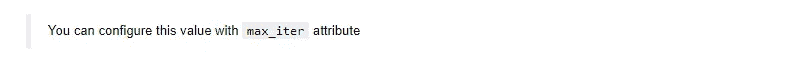

# 我如何从零开始实现神经网络

> 原文：<https://medium.com/analytics-vidhya/how-i-implement-neural-network-from-scratch-f39b84b2b722?source=collection_archive---------36----------------------->

机器学习神经网络是一个非常强大的工具。发现于 50 年代，但由于可用计算能力的指数级增长，直到最近才得到广泛利用。他们使得在学徒期后对新数据进行分类成为可能。

在本文中，我们将关注一个神经网络被证明非常有趣的实际案例:

你看到挂在你桌子角落的旧地址簿，只要给每一页拍张照，所有的电话号码都会直接进入你的在线地址簿，这是多么方便啊。

为了做到这一点，程序必须能够“读取”页面上的数字。这就是神经网络允许你做的。

通过用一系列手绘数字图片训练神经网络，它将能够“猜测”你的老阿姨弗朗索瓦丝的电话号码中有哪些数字。

# 从头开始实现神经网络

## 初始化

要初始化神经网络，必须给定每层(输入、隐藏、输出)的节点数。
在这些信息之后，构造函数将初始化各种东西:

*   从输入到隐藏层的权重矩阵:` weight_ih '
*   从隐藏层到输出层的权重矩阵:` weight_ho '
*   隐藏层的偏差矩阵:` bias_h '
*   输出层的偏差矩阵:` bias_o '
*   任意初始化的学习:` learningRate '

## 训练、评分和前馈方法

我们有三个主要的方法来实现:

*   前馈:允许从 400 个像素的单个输入获得预测的功能
*   train:一种将输入图像及其标签从训练集中作为参数的方法，考虑到我们正在进行监督学习
*   score:一种将测试集中的输入图像及其标签作为参数的方法

## 前馈方法

首先要做的是实现前馈方法。
为此，我们需要计算隐藏层和输出层的激活。

之后，我们需要实现培训功能。
我们首先通过以下公式计算输出(` output_errors `)和隐藏(` hidden_errors `)层的误差:

我们将输出层的激活作为这个函数的输出

## 训练方法

之后，我们需要实现培训功能。
我们首先通过以下公式计算输出(` output_errors `)和隐藏(` hidden_errors `)层的误差:

一旦我们有了每个层的误差，我们就可以计算**梯度**，以便获得我们将要用来校正**权重** (`weight_ih_deltas '和` weight_ho_deltas ')和**偏差** (`hidden_gradients '和` output_gradients ')的值。
为此，我们将使用线性回归公式。

训练方法的最后一步是通过添加我们刚刚计算的梯度来更新我们的变量

## 得分方法

分数方法允许计算列车组
上模型的**精度**，为此，我们只需获取输出的**最大值**并声明它是我们的预测值
，然后我们构建一个数组来比较“实际”值和“预测”值。
如果预测值等于实际值，我们给数组加一个**1**，如果不等于，则加零

**之后，我们只需返回以下结果:**

********

# **将该模型应用于手写数字识别**

**模特起来了！**

**为了训练这个神经网络，我们将使用一个包含 5000 张手写数字图像的数据集。数据集的每一行都包含数字的图像及其“标签”，即与之对应的数字。**

## **清理数据**

**我们从**加载**我们的数据开始**

****

**如主题所示，有必要在数据集中用 0 替换“10”。
为此，我们使用了“替换”功能。**

****

## **拆分数据**

**我们使用名为“train_test_split”的“scikit learn”方法将数据分成一个**序列**和一个**测试集**和
这里我们使用的测试集代表我们数据集的 20%。这种方法自动对数据进行填充**

****

## **测试我们的模型**

**为了做到这一点，我们将使用“400”作为组成输入层的数字，假设我们在每个图像中有 400 个像素。
我们将使用“10”个输出节点作为 10 个不同的可能值
我们将任意的“35”个节点用于隐藏层**

**在用所有训练集训练我们的模型之前，我们使用“样本”方法来混洗我们的数据**

********

**这里我们看到的是 MSE，它是一个模型误差指标，随着驱动的进行而减小。**

**我们使用“得分”方法来计算我们模型的**精确度****

********

**所以我们在测试集上有 84%的准确率。**

## ****将我们的模型精度与 scikit learn 的模型精度进行比较****

**Scikit learn 是一个著名的 Python 数据科学库，它将允许我们有一个比较点。**

**Scikit learn 的神经网络并不是以同样的方式工作。实际上，在计算误差之前，它会前馈所有的数据集。
数据集将被迭代多次。**

********

**Scikit learn 的神经网络模型给了我们 97%的准确率。
这个值可以用神经网络训练模型的方式来解释，如上所述，而且学习率非常低。**

**识别地址簿中照片上的电话号码的下一步将是一个程序，它定位照片上号码的位置，并将其转换成一个图片数组。**

**总之，我们会说，机器学习是一个未来的领域，它经常看起来模糊不清。这就是为什么详细了解已经在帮助我们的模型是如何工作的非常重要。**