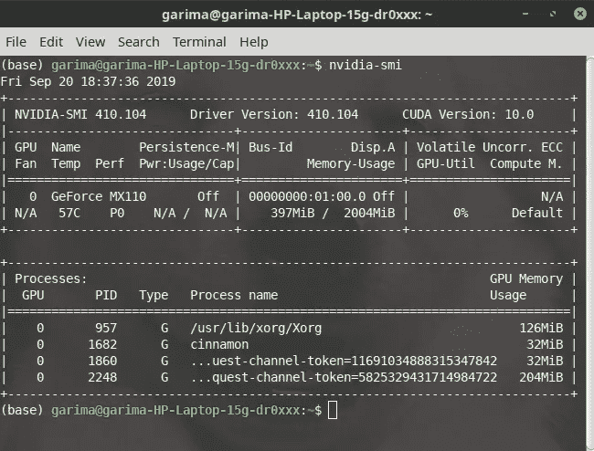
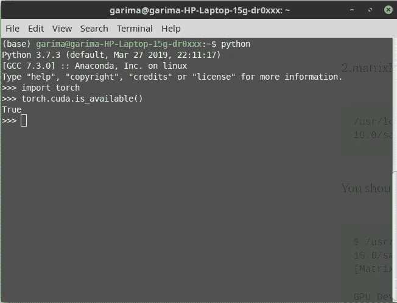

# 我如何在 Linux Mint 中为 PyTorch 安装 CUDA 10.0

> 原文：<https://medium.com/analytics-vidhya/how-i-installed-cuda-10-0-for-pytorch-in-linux-mint-2ce26dd1930f?source=collection_archive---------6----------------------->

## 10 分钟内完成安装和验证！

我知道单独安装 CUDA 确实很麻烦。对于一个对 Linux 不是那么熟悉的用户来说，设置 CUDA 的路径真的很麻烦。

在继续之前，我建议您备份您的数据，因为您永远不知道事情什么时候会变糟，并且鉴于 Linux 图形堆栈的复杂性质，结果可能会有所不同。

# 从`graphics-drivers` PPA 上安装`nvidia-driver-410`

```
sudo add-apt-repository ppa:graphics-drivers/ppa
sudo apt-get update
sudo apt-get install nvidia-driver-410
```

现在做一个`reboot`来应用修改。
运行“nvidia-smi”(不带引号)，这将为您提供正确的驱动程序版本— 410.xx，如下所示:



# 使用 Local.deb 安装 CUDA 10.0

请注意，安装 Cuda 10.0 与安装 Cuda 9.0 和 9.2 有很大不同，所以不要对两者使用相同的说明。这是严格针对 Cuda 10.0 的。

下载[CUDA。来自官方网站的 deb 文件](https://developer.nvidia.com/cuda-10.0-download-archive?target_os=Linux&target_arch=x86_64&target_distro=Ubuntu&target_version=1804&target_type=deblocal)。然后，运行下面给出的说明:

```
sudo dpkg -i cuda-repo-ubuntu1804–10–0-local-10.0.130–410.48_1.0–1_amd64.deb
sudo apt-key add /var/cuda-repo-10–0-local-10.0.130–410.48/7fa2af80.pub
sudo apt-get update
sudo apt-get install cuda
```

然后重新启动系统。将这两行添加到您的~/的底部。bashrc 完成安装后配置:

```
# CUDA Config - ~/.bashrc
export PATH=/usr/local/cuda-10.0/bin:/usr/local/cuda-10.0/NsightCompute-1.0${PATH:+:${PATH}}export LD_LIBRARY_PATH=/usr/local/cuda-10.0/lib64\
                         ${LD_LIBRARY_PATH:+:${LD_LIBRARY_PATH}}
```

要应用此更改，请执行以下操作:

```
source ~/.bashrc
```

现在，我们需要确认我们的 CUDA 安装已经完成。为此，我们输入以下命令:

```
cd /usr/local/cuda-10.0/samples
sudo make
```

完成后，让我们运行两个测试:

1.  设备查询

```
/usr/local/cuda-10.0/samples/bin/x86_64/linux/release/deviceQuery
```

您应该会看到类似这样的内容:

```
$ /usr/local/cuda-10.0/samples/bin/x86_64/linux/release/deviceQuery
/usr/local/cuda-10.0/samples/bin/x86_64/linux/release/deviceQuery Starting...CUDA Device Query (Runtime API) version (CUDART static linking)Detected 1 CUDA Capable device(s)
```

2.matrixMulCUBLAS

```
/usr/local/cuda-10.0/samples/bin/x86_64/linux/release/matrixMulCUBLAS
```

您应该会看到类似这样的内容:

```
$ /usr/local/cuda-10.0/samples/bin/x86_64/linux/release/matrixMulCUBLAS
[Matrix Multiply CUBLAS] - Starting...GPU Device 0: "GeForce GTX 1060" with compute capability 6.1GPU Device 0: "GeForce GTX 1060" with compute capability 6.1 
```

您甚至可以使用 python 来检查它:

```
import torchtorch.cuda.is_available()
```

它应该返回“真”



所以，我就是这样在 Linux Mint 中为 Pytorch 安装 Cuda 的。