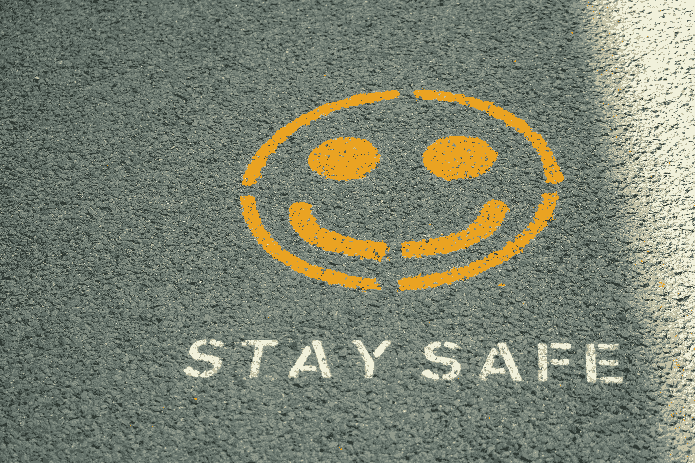
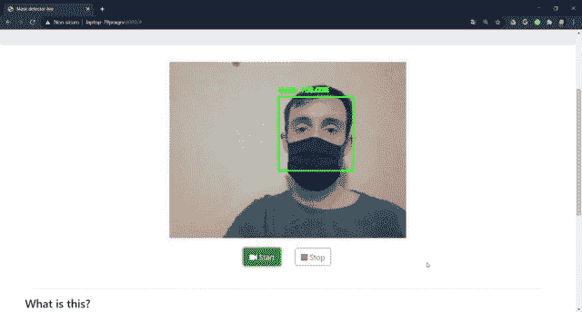
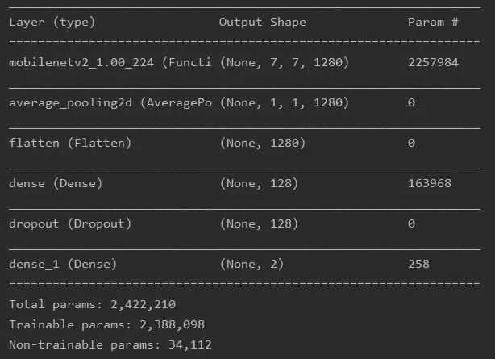
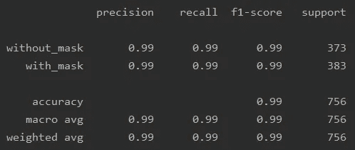
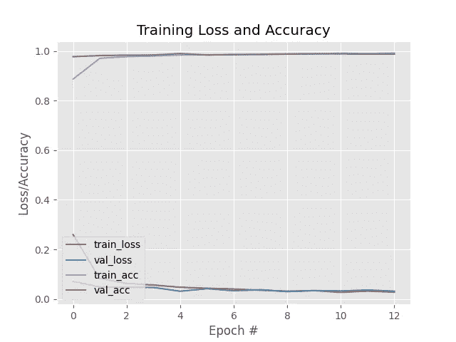

# 我如何制作一个面具检测算法

> 原文：<https://medium.com/analytics-vidhya/how-i-made-a-mask-detector-algorithm-10244fb2e39a?source=collection_archive---------9----------------------->

*将一个简单的分类器变成一个对象检测模型，同时在我的隔离区练习深度学习*



照片由[尼克·费因斯](https://unsplash.com/@jannerboy62?utm_source=unsplash&utm_medium=referral&utm_content=creditCopyText)在 [Unsplash](https://unsplash.com/s/photos/stay-safe?utm_source=unsplash&utm_medium=referral&utm_content=creditCopyText) 上拍摄

在冠状病毒传播期间，意大利进入了秋季的第二次封锁，这给了我很多空闲时间。

我想创建一个系统，能够检测人们是否戴着面具，无论是在图像中还是在实时视频流中。我只是想用一些计算机视觉任务来挑战一下自己，但这个系统可以很容易地扩展到现实生活的安全目的(例如，商店、机场、街道等)。).



作者的面具检测演示

# 问题是

我刚才描述的是一个物体检测任务；因此，理想情况下，应该使用一个大数据集，该数据集不仅标记有“with _ mask”/“with _ mask”，还标记有面部位置。顺着这个思路，我遇到了第一个问题:没有这样的数据集。我所找到的是一个由大约 7600 张图片组成的数据集:50%“带遮罩”，50%“不带遮罩”，这要感谢[这个 Kaggle 数据集](https://www.kaggle.com/omkargurav/face-mask-dataset)；另一种方法可能是考虑人脸数据集，然后人为地给人脸添加面具。
此外，实时检测增加了另一个困难:模型必须非常快，在数据流到达时即时处理图像。理想的架构应该是 MobilenetSSD 或类似的端到端网络，但缺少标注了标签和位置的大型数据集将它们淘汰出局。

在这种情况下，我有两种可能的解决方案:

1.  考虑具有不同形状的锚盒，并在多个尺度上执行滑动窗口，寻找被遮掩/未被遮掩的面部，然后应用非最大抑制；
2.  考虑预先存在的面部检测算法，然后对来自第一算法的所选框执行分类。

我决定采用第二种选择，因为从计算角度来看，这是一个更好的解决方案，这对于实时检测至关重要。事实上，第一选择甚至可以为每一帧处理数千个子图像！

因此，一旦我得到了数据集，我就决定使用 MobilenetV2，以便对那些子图像进行二进制分类(“有掩码”-“无掩码”)；这个模型非常准确，而且没有其他模型复杂:这正是我要找的组合！

通过这种方式，我能够**将一个简单的分类器变成一个对象检测模型**:我甚至可以选择一个 KNN、随机森林或者另一个经典的统计分类器。

# 模特培训

Keras 为在 Imagenet 上训练的原始 MobilenetV2 模型提供了权重，因此我添加了一个平均池和两个更密集的层(带有 dropout ),以实现我的目标，获得图中所示的架构。



原始 Mobilenet 的架构，几乎没有附加层。

为了增强模型的功能，我使用 Keras 提供的 ImageDataGenerator 类添加了一个图像增强生成器，在训练集(总图像的 70%)和验证集中(20%)都使用了以下代码:

```
from tensorflow.keras.preprocessing.image import ImageDataGeneratoraug = ImageDataGenerator(rotation_range=20,
                         zoom_range=0.15,
                         width_shift_range=0.2,
                         height_shift_range=0.2,
                         shear_range=0.15,
                         horizontal_flip=True,
                         fill_mode="nearest",
                         validation_split=0.2)# data augmentation on training set
train_generator = aug.flow(x_train, y_train, batch_size=BS, subset="training")# data augmentation on validation set
val_generator = aug.flow(x_train, y_train, batch_size=BS, subset="validation")
```

这个模型以惊人的好结果超过了我。添加早期停止我防止了模型过度拟合训练数据，让模型按照它需要的历元，这给了我测试集上的结果(10%):



在测试集上评估的模型的度量

这条学习曲线是:



训练期间模型的准确性和损失

对于人脸检测部分，我尝试了两个 CascadeClassifier，一个 CV2 算法，两个 MTCNN 库，它们都给了我很好的结果；就我个人而言，我选择了第一个，但即使是第二个也应该是一个很好的选择。CascadeClassifier 检测人脸及其位置，因此我可以为每个人脸提取原始图像的一部分，并将其作为独立图像传递给 MobilenetV2，以便对其进行分类。

# Flask web 应用程序

为了让我所做的一切更容易理解，我构建了一个用 Flask 开发的简单 web 应用程序，这是一个有用的 Python 框架，添加了一些 jQuery 和 Ajax magics。
它由两个页面组成:在主页上，您可以尝试实时检测；在第二种情况下，您可以上传自定义图像，在该图像上执行遮罩检测。实时流显然需要访问您的相机，因此系统可以逐帧处理图像，并在每个人脸周围绘制一个边界框(支持多次检测)。

实时处理部分并不容易，但我跟踪了一个很好的资源:如果你对 web 应用感兴趣，我建议你看看 Miguel Grinbergs 的网站。

这就是我如何开发一个实时面具检测器的:如果你想更深入地了解代码，这里有 Github 库的[链接。](https://github.com/GalileoParise/CV-Mask-detection)

好好享受，戴上口罩！