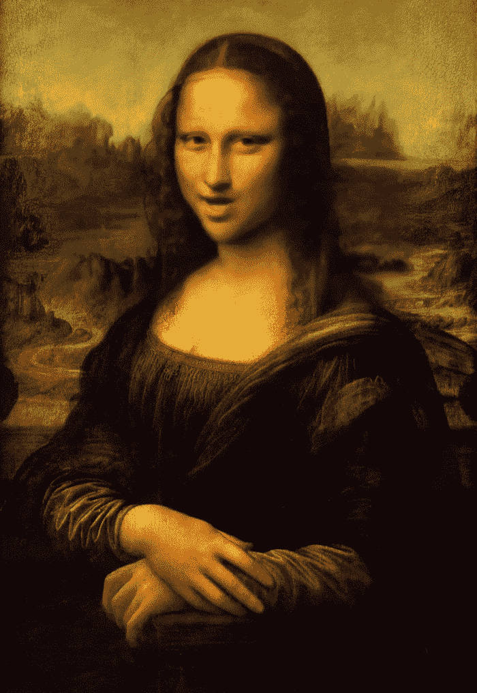
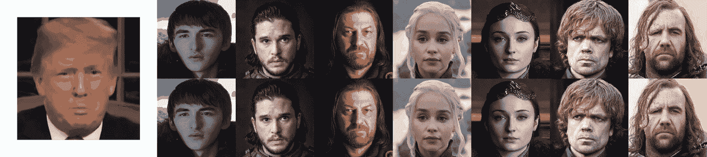
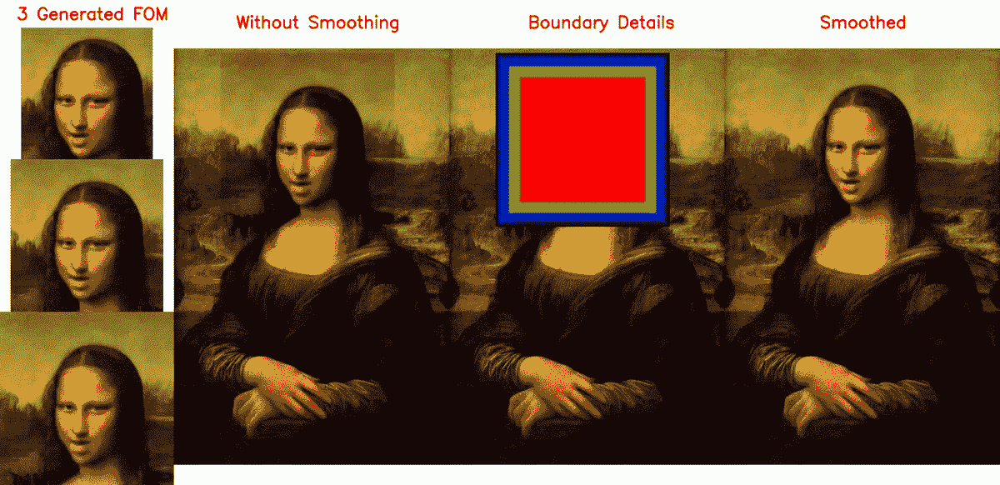
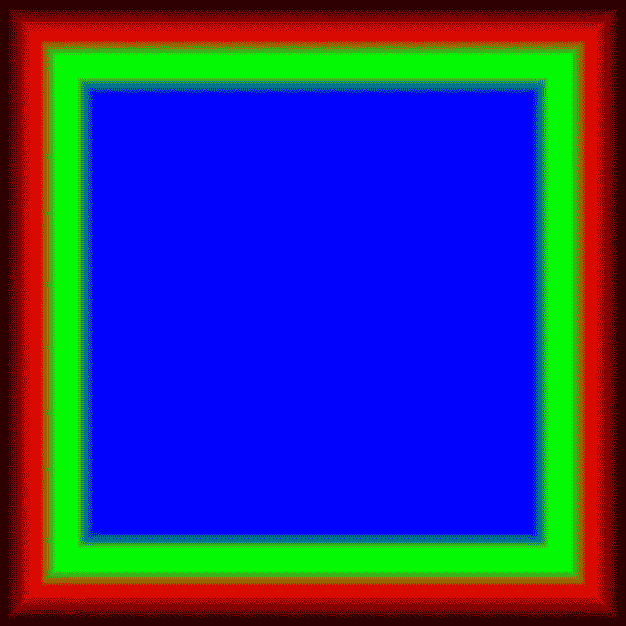
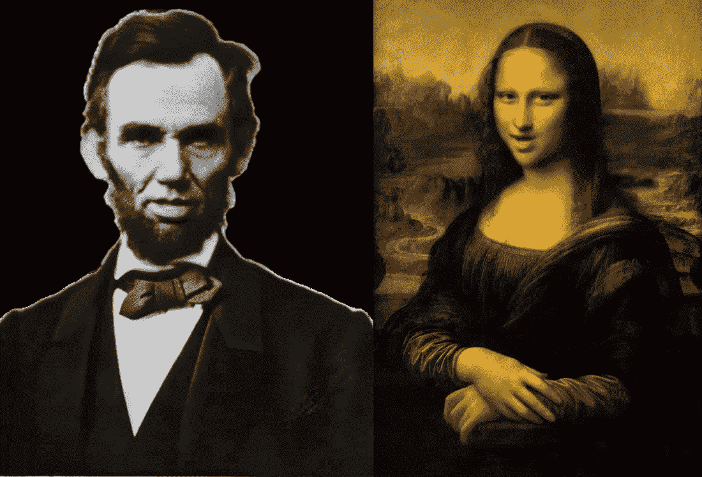

# 我是如何顺利地将蒙娜丽莎的头像注入整个肖像的

> 原文：<https://medium.com/analytics-vidhya/how-i-smoothly-injected-a-mona-lisa-talking-head-into-the-full-portrait-60f3f5e4b74b?source=collection_archive---------26----------------------->

(演示)看起来比没有平滑的替换更好(解释如下)

你好，
我们很多人都听说过 [***一阶运动***](https://github.com/AliaksandrSiarohin/first-order-model) 图像动画模型，它用于通过驾驶视频制作极其精彩的人头和舞蹈雕塑，以制作单个图像的动画！

来源:[一阶运动模型 GitHub repo](https://github.com/AliaksandrSiarohin/first-order-model)

通过 App Store 和谷歌 Play 商店上的移动应用程序制作这些动画也变得越来越流行。

今天，我们将讨论我是如何顺利地将蒙娜丽莎的头像注入全幅肖像的。

完整的管道演示

在上面的流水线演示中，**下方没有平滑的肖像**标题显示了取货头更换得有多糟糕，并且不连续性
(在边界上)使其看起来非常琐碎。

另一方面，在演示的*右侧*，在**平滑的**标题下精细/平滑的肖像看起来更好。

# 那么平滑是怎么做的呢？

在演示的左边*处*，你会看到 3 个动画的说话头，最上面的那个是最小的，最集中的，动画效果更好，或者最下面的那个是最大的，最不集中的，动画效果差的(看嘴唇)。

因此，我们的想法是将所有这些动画头像合并成完整的肖像，并在中逐渐向外**，正如我们所说，我们已经生成了 3 个具有不同大小和动画质量的
头像，正如在下方的*所示的加权方案遮罩中，您应该会看到红色、绿色和蓝色逐渐加权。***

***在*** 处从外向内看，加权-方案掩码显示在 ***下方的*。****

1.  红色边界从黑色(权重=0)到纯红色(权重=1)开始
2.  绿色边界与红色(权重=0)混合，直到最后变成纯绿色(权重=1)。
3.  蓝色边界与绿色(权重=0)混合，直到中心为纯蓝色(权重=1)。

加权计划面具逐渐由外而内，它看起来模糊，我知道这很痛(由于平滑)。

这也显示在上面标题为**边界细节的管道演示中。**

你可能会注意到对角线的不连续性，这是真的，我认为它类似于 [Sobel 导数算子](https://en.wikipedia.org/wiki/Sobel_operator)，它没有突出对角线方向上的强度变化。

今天就到这里:)

感谢您的时间:)

我使用了 [**gifski**](https://gif.ski/) 开源工具来生成高质量的 gif🎊🎊