# 我如何用 Python 开始我的第一个 Kaggle 比赛(新冠肺炎)

> 原文：<https://medium.com/analytics-vidhya/how-i-started-with-my-first-kaggle-competition-covid-19-in-python-385792e07fd5?source=collection_archive---------20----------------------->

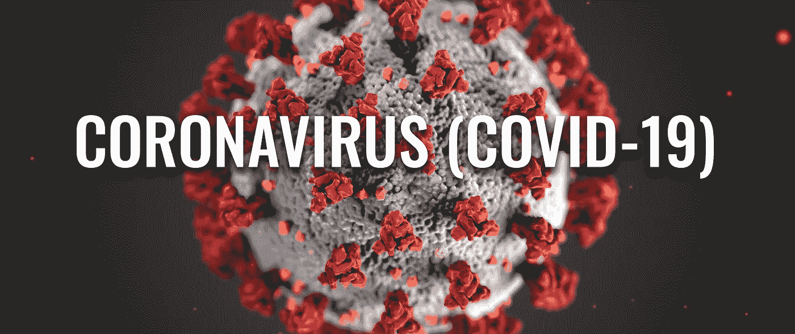

日子不正常！新冠肺炎在全世界爆发。城市已经被封锁。大自然已经找到了自己的恢复方式。在这一切进行的过程中，我有了一些空闲时间来反思和评估自己，远离日常事务。

从工程背景转向数据科学和分析是一个艰难的决定！。在分析和数据科学的旅程中，已经过去了将近一年。数据可视化，使用数据库，SQL 和 Python，像 Hadoop 这样的技术和一些机器学习算法是我去年结交的一些新朋友。但是我想做得更多！。

> 每一片乌云都有一线光明。新冠肺炎也是。

几个月前，我在网上冲浪，发现了这个神奇的数据科学平台，名为 [Kaggle](https://www.kaggle.com/) 。在那里，您可以找到关于数据科学的竞赛、数据集、笔记本和许多其他有用的学习材料。所以我在想“如果我在 Kaggle 身上做点什么呢？”。Kaggle 是如此受欢迎！它在他们的主屏幕上显示了这个横幅。

有 4 个任务，我发现“**预测新冠肺炎病例和死亡人数以帮助理解是什么驱动了传播率**”任务更有趣，因为我愿意学习用 Python 开发模型。Kaggle 由一个非常友好的内核组成，支持可重复的协作分析。

我的分析可以分为五大类。EDA(探索性数据分析)、数据清理、开发模型、模拟真实数据的模型、使用模型进行预测。任何想了解我在这个分析中所做的事情的人，都非常欢迎访问我的 Github 链接，包括我的代码、python 笔记本和数据集。我已经做了评论，包括理论、方程式、逻辑和我认为有用的文章的有用链接。在这篇文章中，我将重点关注在这个分析中我必须通过的一些主要里程碑。

*Kaggle 笔记本*:[https://www . ka ggle . com/kaniya/covid-global-forecast-sir-xgboost](https://www.kaggle.com/kaniya/covid-global-forecast-sir-xgboost)

*Github*:[https://github.com/kanishkaRandunu/Covid-19-analysis-Kaggle](https://github.com/kanishkaRandunu/Covid-19-analysis-Kaggle)

# 探索性数据分析

强大的 EDA 能让我们更好地理解数据集。我已经从-A 到+Z 做了这个分析的每一点。甚至 EDA 部分也花了我 5 天时间来完成。我在家工作，每天只能抽出 4 个小时进行分析(晚上 8 点到 12 点)。无论如何，这给了我一个很好的学习作为时间投资的回报。

新冠肺炎数据集由*约翰·霍普金斯大学系统科学与工程中心(JHU·CSSE)*向公众开放。Kaggle 提供了基于 JHU 数据集的训练数据集和测试数据集。数据集包括国家名称、国家地区、确诊病例数和死亡人数。在研究数据集时，我主要关注空值、最小最大日期、数据计数以及重复数据值和垃圾数据值的可用性。可视化部分包括确诊病例和死亡病例的总体趋势，根据死亡人数与确诊病例的比率确定受影响最大的国家，根据死亡率确定受影响最大的国家。死亡率是总死亡人数与该国首次死亡人数的天数之比。

人口密度是影响新冠肺炎传播的关键因素。所以我想把一个国家的确诊病例和死亡人数以及它的人口形象化。根据我们对这种病毒的了解，人口密度高的国家更有可能受到这种病毒的影响。检查我的想象，并尝试在前进之前创造你自己的见解。

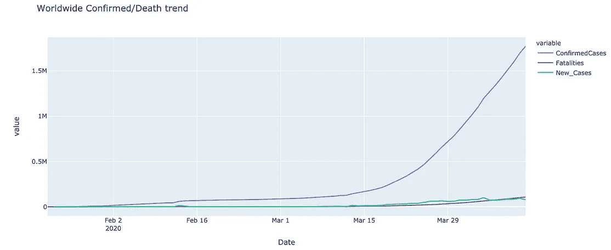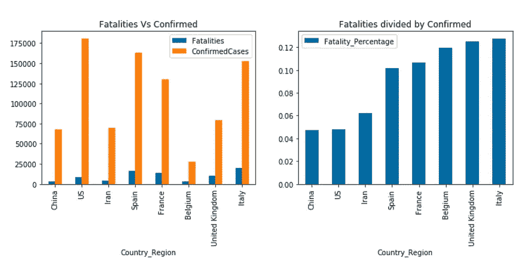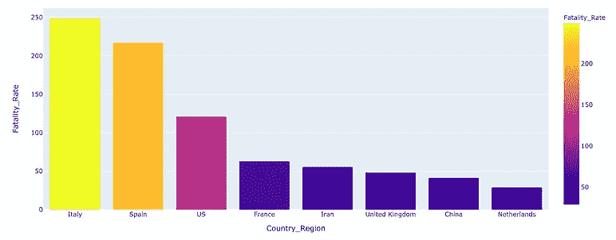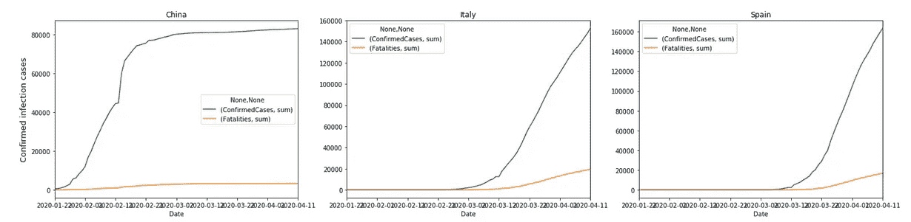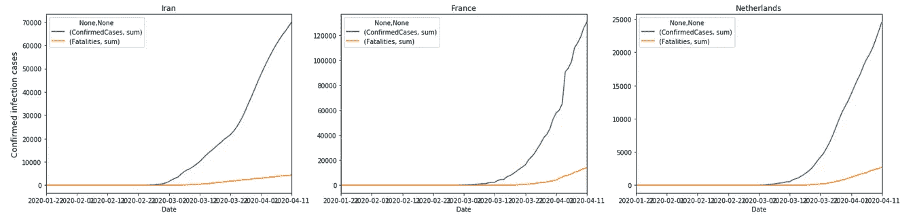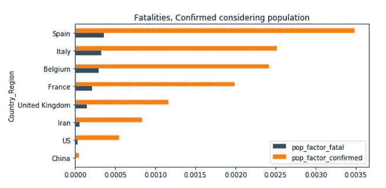

使用提供的数据集进行可视化

**来自 EDA 的见解**

如果你看第一张图，全球确诊病例和死亡人数都呈上升趋势。然而，新病例的数量略有下降！这是一个好迹象。中国，意大利，英国，西班牙，法国，伊朗，比利时，美国是受新冠肺炎影响最大的国家。虽然疫情始于中国，但与其他国家相比，它显示出较低的死亡率，即死亡确诊率。意大利、西班牙和英国的每日死亡率最高。如果将人口因素考虑在内，西班牙、意大利和比利时是受影响最大的国家。如果你分析国家的趋势，你会注意到中国有不同的趋势，而其他国家有几乎相同的趋势线。这给了我们一个提示，在开发模型时要单独考虑中国。

# **预测流行病爆发的模型**

“预测流行病爆发的模型”。这正是我谷歌寻找一个合适的流行病预测统计模型。在谷歌上找到了一些有趣的文章，关于过去的流行病如 SARS，HIV 和埃博拉病毒的可视化。数学模型，如使用常微分方程的确定性模型(房室模型、传染期的非指数分布)、简单随机模型、空间模型、网络模型，用于流行病建模。进一步的阅读将我的范围缩小到 SIR 模型，这是一个广泛用于流行病行为建模的房室模型。

**SIR 型号**

在这个模型中，群体被分成几个区间，假设同一区间中的每个个体都具有相同的特征。这是这个模型的基本形式。展望未来，通过改变考虑的区间，该模型可以扩展为 SEIR、SEIS、SIS 等。安全气囊系统模型基本上由 3 个主要车厢组成。s-易感(易受感染的人群)、I-感染(已被感染的人群)、R-康复(不再具有传染性的人群)。S+I+R 等于那个国家的总人口。我用于 EDA 的数据集由国家级新冠肺炎确认计数和致命计数组成。后来，我发现了同一数据集的更新版本，其中包括了恢复的计数。这让我想到了像先生一样的隔间模型。

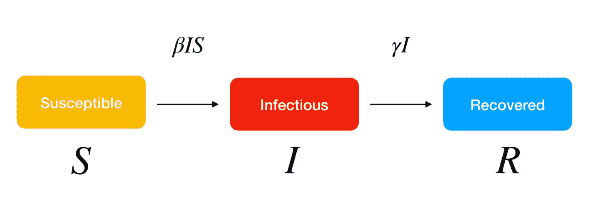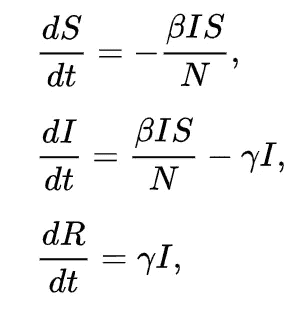

SIR 模型方程

这给了我们一个要求解的四阶微分方程。有一些数学方法，如龙格库塔的方法来解决这些类型的微分方程。用 Python 实现 Runge Kutta 方法需要对微分方程有一些数学上的理解。然而，Python 中已经有了解决这类方程的库。我使用 Odeint python 库来进行这个分析。

# 数据清理和丰富

**数据清理**对于识别数据库中哪些细节不完整、不正确、不准确或不相关非常重要。在这个 COVID 数据集中，我没有发现任何重复的数据。我唯一要做的清理就是空处理。有些国家的“省/州”详细信息为空。我定义了一个函数，仅当省/州为空时，才使用国家名称替换“省/州”。

**数据丰富**是增强、提炼和改进原始数据。一个国家的人口、人口密度、女性男性分布对新冠肺炎在该国的传播有重要影响。所以我想通过加入这些细节来改进我的数据集。Kaggle 有许多公开可用的数据源，可以很容易地使用关键字进行搜索。我使用了一个国家的人口数据集作为我分析的 ed a，后来我使用了 Kaggle 发布的新冠肺炎人口数据集。当使用这两个数据集时，我必须做一些字符串匹配，因为一些国家的名称不一样。(例如，一个数据集中的“韩国”和一个数据集中的“韩国，南方”)。

# **开发模型并模拟真实数据**

我从理解 SIR 模型的数学部分开始。带我读了一些书，还得跟着看一些 youtube 视频。最后，我在 python 上定义了 SIR 函数。然后，我使用一些虚拟值作为参数绘制了 SIR 模型输出。它与标准 SIR 模型图一致，因此我使用真实数据进行模拟。

根据我的分析，意大利是受新冠肺炎影响最严重的国家。我把“意大利”过滤到熊猫的新数据框里。对于 SIR 模型，我的输入是伽玛、贝塔值和初始条件(S0，I0，R0)。 *integrate.odeint* 函数用于对 SIR 方程进行积分，并计算γ和β值。通过手动观察“意大利”数据集来识别初始条件。如果你打算立刻将它应用于所有国家，你必须定义一个函数来识别初始条件。我使用了两个时间框架(使用 4 月 1 日之前的数据和 4 月 11 日的所有可用数据),并用真实数据值绘制了我的模拟值。

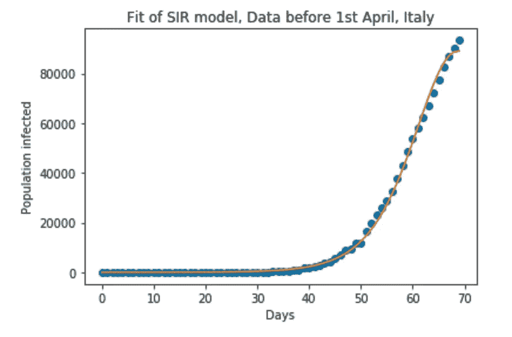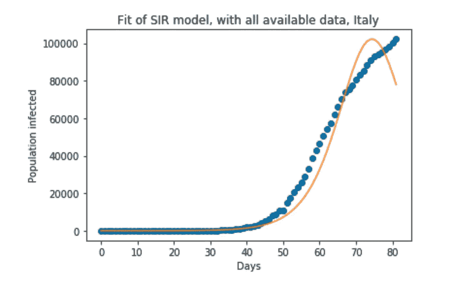

真实数据与拟合数据

虽然我的 SIR 模型适合短期，但它不适合长期。我的伽马贝塔值不准确。由于这是我尝试的第一个模型，我不知道如何从这里开始。因此，我研究了可以用于这种分析的其他模型。这是我遇到 XGBoost 分类器算法的部分。XGBoost 是一个高度灵活和通用的工具，可以处理大多数回归、分类和排序问题以及用户构建的目标函数。它是 Kaggle 用户和数据科学家中非常受欢迎的机器学习工具。

# **在 Kaggle 上提交结果**

在我的[笔记本](https://www.kaggle.com/kaniya/covid-global-forecast-sir-xgboost)的后半部分，你会发现我用 XGBoost 开发的最终模型。我使用 XGBoost 来预测确认的数量和致命的数量。在本次比赛中，参赛者必须提交给定“预测 ID”的“确认计数”和“致命计数”。你必须将你的最终预测结果写入“Submissions.csv”文件。然后你应该使用“保存版本”按钮来提交和保存你的内核。点击你的内核的最新版本后，你会看到“转到浏览器”图标。点击它将会把你带到最终的提交窗口。提交后，您将根据您的结果获得一个公开分数。你会在排行榜上排名。

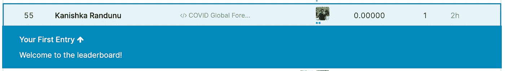

对初学者来说还不错！啊？

> 如果学习足够好，就不要担心你投入工作的时间和精力

祝你一路顺风！

# 参考

*SIR Model*:[https://en . Wikipedia . org/wiki/compartment al _ models _ in _ epidemiology](https://en.wikipedia.org/wiki/Compartmental_models_in_epidemiology)

*用 Python 开发 SIR 模型*:[https://www.youtube.com/watch?v=wEvZmBXgxO0](https://www.youtube.com/watch?v=wEvZmBXgxO0)

*XGBoost*:【https://xgboost.readthedocs.io/en/latest】T2

*疫情预测*:[https://BMC medicine . biomed central . com/articles/10.1186/s 12916-019-1406-6](https://bmcmedicine.biomedcentral.com/articles/10.1186/s12916-019-1406-6)

*熊猫，蟒蛇*:[https://pandas.pydata.org](https://pandas.pydata.org/)