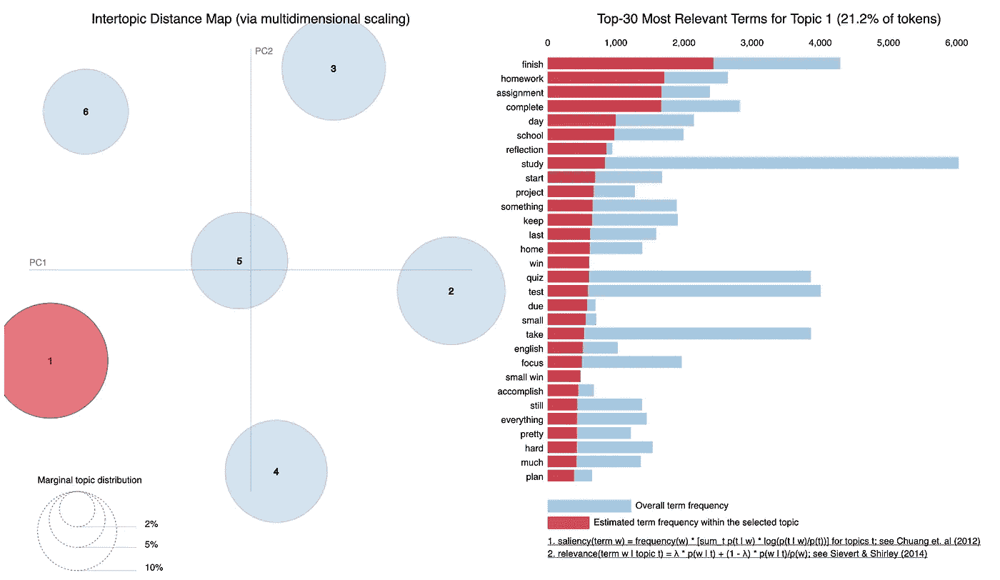
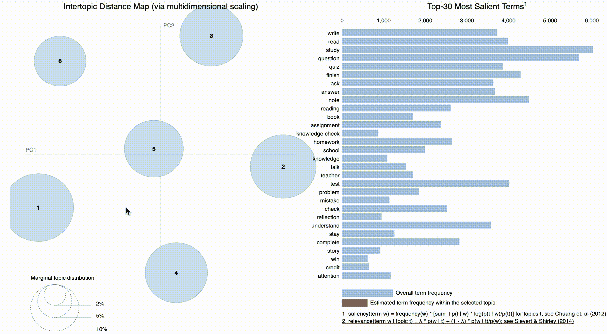

# 我是如何用 GuidedLDA 解决现实世界中的问题的？

> 原文：<https://medium.com/analytics-vidhya/how-i-tackled-a-real-world-problem-with-guidedlda-55ee803a6f0d?source=collection_archive---------1----------------------->



导向 LDA 识别的主题和每个主题中的关键字的交互式可视化快照(pyLDAvis)

用于交互的在线平台的普遍使用和来自用户输入的大量文本数据使得消化数据越来越耗时。Sown to Grow 是一家在线教育公司，旨在通过提供一个平台来设定目标、思考策略并与老师互动，从而增强学生的能力。为了让这家公司能够在美国扩大规模，自动解析反射是必要的。它有助于教师定制反馈，并将有限的资源分配给弱势儿童。

# **数据**

该公司分享了 180，000 名学生的反映，这些反映基于公司的评分系统被认为是高质量的(有一个/多个策略)。由于隐私原因，我无法展示实际数据，但我的数据框架如下所示:

```
content               index0                  reflection            0 

1                  reflection            1

.

.

.184835             reflection            184835
```

在清理数据(包括删除重复的、不相关的内容和非英语内容)之后，我最终得到了 104k 的反射，用于确定策略。下面是我用来纠正拼错单词的函数。

```
from enchant.checker import SpellCheckerdef spell_check(text):       
    '''
    spell_check: function for correcting the spelling of the reflections
    Expects:  a string
    Returns: a list
    '''
    Corr_RF = []
    #Grab each individual reflection
    for refl in text.split():
        #Check to see if the words are in the dictionary
        chkr = SpellChecker("en_US", refl)
        for err in chkr:
            #for the identified errors or words not in dictionary get the suggested correction
            #and replace it in the reflection string
            if len(err.suggest()) > 0:
                sug = err.suggest()[0]
                err.replace(sug)
        Corr_RF.append(chkr.get_text())
        #return the dataframe with the new corrected reflection column
    return ' '.join(Corr_RF)data['Corrected_content'] = data.content.apply(spell_check)document = data #to change the name of the dataframe to documents
```

为了删除非英语内容，我使用 langdetect 来标记文本的语言并删除非英语内容。当输入句子时，langdetect 相当准确，但当只输入一个单词时，它就不完美了。

```
from langdetect import detectdef lang_detect(text):
    '''
    lang_detect: function for detecting the language of the reflections
    Expects: a string
    Returns: a list of the detected languages
    '''
    lang = []
    for refl in text:
        lang.append(detect(refl))
    return lang
```

# **解决问题的初步策略**

## 常规 LDA

然后，我开始通过潜在的狄利克雷分配(LDA)使用 Gensim 主题建模包对反射中的主题进行建模。为了准备主题建模的数据，我对文档进行了分词(将文档拆分为句子，将句子拆分为单词)，删除了标点符号，并将其小写。长度小于三个字符的单词也将被删除。所有这些都可以使用 Gensim 简单预处理模块来完成。之后，我定义了一个函数，将第三人称中的单词转换为第一人称，将过去时态和将来时态中的动词转换为现在时态。然后，单词被简化为它们的根形式(词干和词尾)。

```
import gensimfrom gensim.utils import simple_preprocessfrom gensim.parsing.preprocessing import STOPWORDSfrom nltk.stem import WordNetLemmatizer, SnowballStemmerfrom nltk.stem.porter import *from nltk.corpus import wordnetimport numpy as npnp.random.seed(42)
```

导入必要的包和模块后。现在是进行一些预处理的时候了，如前所述:

```
def lemmatize_stemming(text):
    stemmer = SnowballStemmer('english')
    return stemmer.stem(WordNetLemmatizer().lemmatize(text, pos='v'))
def preprocess(text):
    result = []
    for token in gensim.utils.simple_preprocess(text):
        if token not in gensim.parsing.preprocessing.STOPWORDS and len(token) > 3:
            result.append(lemmatize_stemming(token))
    return resultprocessed_docs = documents['content'].map(preprocess)
```

下面的例子显示了预处理的结果(我使用了一个假设的例子):

```
doc_sample = documents[documents['index'] == 34].values[0][0]
print('original document: ')
words = []
for word in doc_sample.split(' '):
    words.append(word)
print(words)
print('\n\n tokenized and lemmatized document: ')
print(preprocess(doc_sample))
```

示例:

```
original document:['Something', 'I', 'think', 'I', 'have', 'done', 'correct', 'is', 'studying', 'in', 'advance.']tokenized and lemmatized document:['think', 'correct', 'studi', 'advanc']
```

要在数据集上创建一个单词包，可以使用 Gensim 字典。单词包是一个来自“processed_docs”的字典，包含一个单词在整个文档(语料库)中出现的次数(字数)。

```
dictionary = gensim.corpora.Dictionary(processed_docs)
count = 0
for k, v in dictionary.iteritems():
    print(k, v)
    count += 1
    if count > 10:
        break
```

移除出现在少于 15 个文档和高于 0.5 个文档中的标记(整个文档的分数，而不是绝对值)。之后，保留 100000 个最常用的代币。

```
dictionary.filter_extremes(no_below=15, no_above=0.5, keep_n=100000)
```

我创建了一个字典，显示哪些单词以及这些单词在每个文档中出现的次数，并将它们保存为 bow_corpus:

```
bow_corpus = [dictionary.doc2bow(doc) for doc in processed_docs]
```

现在，数据已经准备好运行 LDA 主题模型了。我使用的 Gensim LDA 能够在多个内核上运行。

```
lda_model = gensim.models.LdaMulticore(bow_corpus, num_topics=7, id2word=dictionary, passes=2, workers=2)
```

要检查每个主题的单词及其相对权重:

```
for idx, topic in lda_model.print_topics(-1):
    print('Topic: {} \nWords: {}'.format(idx, topic))Topic: 0Words: 0.046*"time" + 0.044*"read" + 0.041*"week" + 0.030*"work" + 0.024*"studi" + 0.022*"go" + 0.016*"good" + 0.016*"book" + 0.015*"like" + 0.014*"test"Topic: 1Words: 0.055*"read" + 0.036*"question" + 0.034*"answer" + 0.025*"time" + 0.018*"text" + 0.017*"strategi" + 0.017*"work" + 0.016*"think" + 0.014*"go" + 0.014*"look"Topic: 2Words: 0.037*"need" + 0.021*"work" + 0.018*"word" + 0.018*"write" + 0.015*"time" + 0.015*"complet" + 0.015*"essay" + 0.014*"goal" + 0.013*"help" + 0.012*"finish"Topic: 3Words: 0.042*"note" + 0.041*"help" + 0.032*"studi" + 0.029*"understand" + 0.027*"quiz" + 0.024*"question" + 0.021*"time" + 0.016*"better" + 0.014*"take" + 0.014*"test"Topic: 4Words: 0.031*"write" + 0.031*"work" + 0.027*"time" + 0.025*"think" + 0.024*"sure" + 0.019*"check" + 0.017*"thing" + 0.017*"strategi" + 0.014*"question" + 0.014*"help"Topic: 5Words: 0.058*"work" + 0.057*"grade" + 0.046*"goal" + 0.033*"class" + 0.027*"week" + 0.022*"math" + 0.017*"scienc" + 0.016*"improv" + 0.016*"want" + 0.016*"finish"
```

正如您从每个主题中的单词所看到的，一些单词在主题之间是共享的，并且没有可以为每组单词标记的不同主题。

## 词性标注

在 LDA 之后，我决定标记每个反射的词性，并从中提取动词。因为我假设学生在反思他们所做的事情，所以动词过去式的反思可以给我学习策略主题的线索(例如，我研究了笔记并练习了过去的考试)。我解析了反射，并通过词性标注提取了反射中使用的所有动词。然后，我寻找动词的时态，以确定拥有学习策略的反思和其中使用的动词时态之间的关系。我注意到有些反思明显有学习策略，但不一定是过去时。

所以，这也没有帮助我找到学习策略的独特主题。然而，LDA 和 POS 都给了我一个想法，那就是使用 GuidedLDA ( [Github repo](https://guidedlda.readthedocs.io/en/latest/) )。导向 LDA 是一种半监督学习算法。其思想是为用户认为代表语料库中潜在主题的主题设置一些种子词，并引导模型围绕这些术语收敛。我使用了 J. Jagarlamudi、H. Daume III 和 R. Udupa 的论文“将词法先验合并到主题模型中”中解释的算法的 python 实现。该论文讨论了如何将先验(在这种情况下，先验是指种子词)设置到模型中，以将它引导到某个方向。

在常规 LDA 中，首先每个单词被随机分配给一个主题，该主题由 Dirichlet 先验通过 Alpha 参数控制(现在你知道 LDA 的名字是从哪里来的了)。下一步是找出哪个术语属于哪个主题。LDA 使用一种非常简单的方法，每次为一个术语寻找主题。

让我们假设我们想要为单词“学习”找到主题。LDA 将首先假设语料库中的每隔一个单词被分配给正确的主题。在最后一步中，每个单词都均匀地分布在所有主题中，并假设这是这些单词的正确主题。然后，LDA 计算出“学习”这个词经常出现在哪个单词中。那么，这是这些术语中最常见的话题。我们将对该主题进行“研究”。“研究”可能会接近“教科书”和“笔记”中的任何主题。现在这三个词比这一步之前更接近了。然后，模型移动到下一个单词，并根据需要重复这个过程直到收敛。有了导向 LDA，我们明确地希望模型以一种方式收敛，即单词“学习”和“教科书”在一个主题中。为了做到这一点，GuidedLDA 为“研究”和“教科书”提供了一些额外的帮助，使其位于特定的主题中。在该算法中，应该给予单词多少额外提升的参数由 seed_confidence 控制，并且其范围可以在 0 和 1 之间。当 seed_confidence 为 0.1 时，您可以将种子单词向种子主题倾斜 10%以上。

要使用 GuidedLDA 的 python 实现，您可以:

```
pip install guidedlda
```

或者

```
[https://github.com/vi3k6i5/GuidedLDA](https://github.com/vi3k6i5/GuidedLDA)
cd GuidedLDA
sh build_dist.sh
python setup.py sdist
pip install -e .
```

与任何 NLP 工作一样，启动 GuidedLDA 需要对数据进行预处理。为此，我定义了自己的预处理函数:

```
def get_wordnet_pos(word): '''tags parts of speech to tokens
    Expects a string and outputs the string and 
    its part of speech'''

    tag = nltk.pos_tag([word])[0][1][0].upper()
    tag_dict = {"J": wordnet.ADJ,
                "N": wordnet.NOUN,
                "V": wordnet.VERB,
                "R": wordnet.ADV}
    return tag_dict.get(tag, wordnet.NOUN)def word_lemmatizer(text): '''lemamtizes the tokens based on their part of speech'''

    lemmatizer = WordNetLemmatizer()
    text = lemmatizer.lemmatize(text, get_wordnet_pos(text))
    return textdef reflection_tokenizer(text): '''expects a string an returns a list of lemmatized tokens 
        and removes the stop words. Tokens are lower cased and 
        non- alphanumeric characters as well as numbers removed. ''' text=re.sub(r'[\W_]+', ' ', text) #keeps alphanumeric characters
    text=re.sub(r'\d+', '', text) #removes numbers
    text = text.lower()
    tokens = [word for word in word_tokenize(text)]
    tokens = [word for word in tokens if len(word) >= 3]
    #removes smaller than 3 character
    tokens = [word_lemmatizer(w) for w in tokens]
    tokens = [s for s in tokens if s not in stop_words]
    return tokens
```

在定义了用于预处理的所有必要函数之后，是时候将它应用到 dataframe 的目标列(这里是 corrected_content ),并将其保存为新列“lemmatized_tokens”。

```
df['lemmatize_token'] = df.corrected_content.apply(reflection_tokenizer)
```

现在，是时候生成术语-文档矩阵了。为此，我使用了 scikit 学习包中的 CountVectorizer 类:

```
from sklearn.feature_extraction.text import CountVectorizer
```

首先，我们需要实例化 CountVectorizer。有关参数的完整列表，您可以参考 scikit learn 网站。我将标记器更改为我之前定义的自定义标记器，并将停用词更改为我基于自己的数据集创建的停用词列表。这里，我使用了 4 个单词的 n-gram 范围。现在，是时候拟合和转换语料库以生成术语-文档矩阵了:

```
token_vectorizer = CountVectorizer(tokenizer = reflection_tokenizer, min_df=10, stop_words=stop_words, ngram_range=(1, 4))X = token_vectorizer.fit_transform(df.corrected_content)
```

为了用 GuidedLDA 对主题进行建模，在导入包之后，会创建一个术语字典。

```
import guidedldatf_feature_names = token_vectorizer.get_feature_names()word2id = dict((v, idx) for idx, v in enumerate(tf_feature_names))
```

现在，是时候提供一个种子词列表来建模了。为此，我使用了文本的语义，以及从 LDA 建模和 POS 动词词典中获得的初始关键字。为此，我创建了一个列表列表，其中每个列表都包含了我希望在特定主题下进行分组的关键字。

```
seed_topic_list= [['take', 'note', 'compare', 'classmate', 'highlight', 'underline', 'jot', 'write', 'topic', 'main', 'complete', 'point', 'copy', 'slide'],['read', 'study', 'review', 'skim', 'textbook', 'compare', 'note', 'connect', 'sketch', 'summarize', 'relationship', 'map', 'concept', 'diagram', 'chart'],['question', 'essay', 'assignment', 'exam', 'test', 'quiz', 'answer', 'practice', 'review', 'repeat', 'strength', 'weak', 'solve', 'problem', 'identify'],['plan', 'calendar', 'time', 'task', 'list', 'manage', 'procrastinate', 'due', 'stress', 'manage', 'anxiety', 'express', 'break', 'sleep', 'nap', 'eat', 'exercise'],['group', 'partner', 'classmate', 'brainstorm', 'ask', 'answer', 'verify', 'peer', 'teach', 'clarify'],['ask','aid', 'resource', 'teacher', 'tutor', 'peer', 'verify', 'explain', 'clear', 'talk']]
```

正如你所看到的，我已经为 6 个主题提供了带有种子词的模型。

```
model = guidedlda.GuidedLDA(n_topics=6, n_iter=100, random_state=7, refresh=10)
seed_topics = {}
for t_id, st in enumerate(seed_topic_list):
    for word in st:
        seed_topics[word2id[word]] = t_id
model.fit(X, seed_topics=seed_topics, seed_confidence=0.15)
```

检查每个主题的单词:

```
n_top_words = 15
topic_word = model.topic_word_
for i, topic_dist in enumerate(topic_word):
     topic_words = np.array(tf_feature_names)[np.argsort(topic_dist)][:-(n_top_words+1):-1]
     print('Topic {}: {}'.format(i, ' '.join(topic_words)))
```

结果看起来是这样的:

```
Topic 0: write time reading book know essay start idea take people read keep focus first completeTopic 1: read study time note take test reading quiz question book look understand day word reviewTopic 2: question time study quiz understand check problem note answer knowledge take practice ask mistake learnTopic 3: time finish assignment homework complete study reflection school day test quiz home keep win lastTopic 4: question answer time read look text reading evidence write find understand word know back rightTopic 5: ask finish teacher talk time school stay attention pay focus extra test pay attention homework know
```

为了可视化数据，我使用了 pyLDAvis 软件包强大的交互式可视化功能，下面是结果。可以看出，6 个主题明显分开，每个主题的主题可以分为:

1.  完成作业/完成任务

2.检查过去的测验和问题/理解答案

3.边说边问老师/注意

4.阅读/研究笔记和书籍

5.回答问题和学习问题

6.写故事、文章和书



每个主题中的关键字分布以红色显示

源代码可以在 [GitRepo](https://github.com/ShahrzadH/Insight_Project_SHV) 上找到。我期待听到任何反馈或问题。