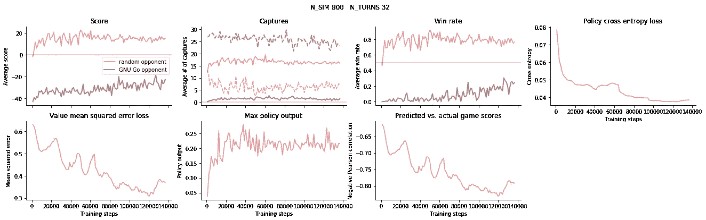
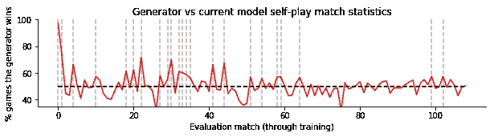
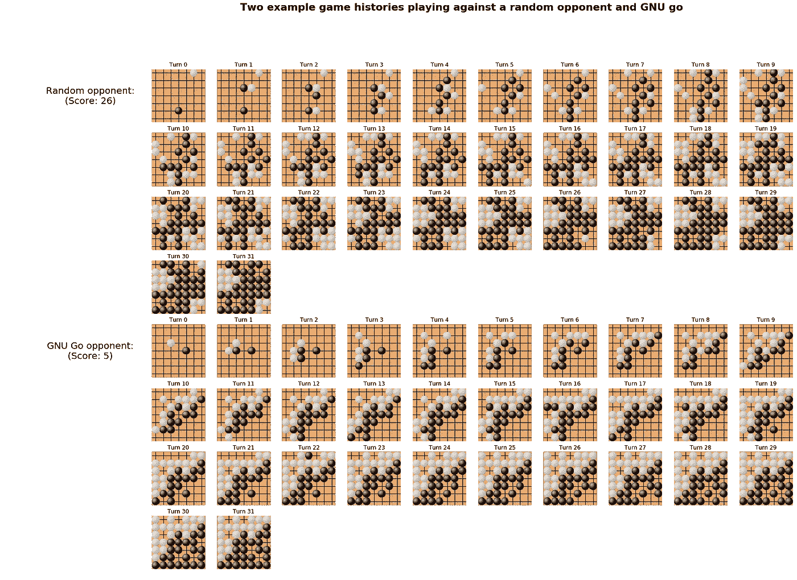
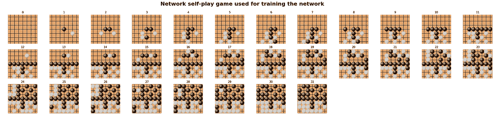
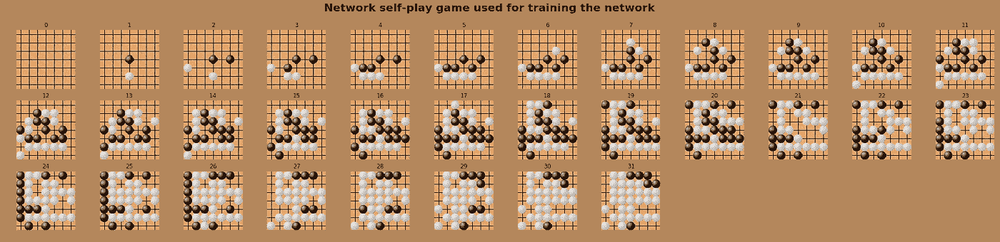

# 我如何训练一个自我监督的神经网络在小(7x7)棋盘上击败 GnuGo

> 原文：<https://medium.com/analytics-vidhya/how-i-trained-a-self-supervised-neural-network-to-beat-gnugo-on-small-7x7-boards-6b5b418895b7?source=collection_archive---------7----------------------->

这篇文章是我大约一年前写的一篇[文章](https://towardsdatascience.com/alphazero-implementation-and-tutorial-f4324d65fdfc)的后续，这篇文章讲述了我实现了一个非常类似 AlphaGo Zero 算法的东西，并在我的普通台式电脑上运行了它。这些代码产生的网络在性能方面我会(也确实)总结为“没那么好”。

因此，在过去的一年里，我尝试了一些不同的方法(比如添加一些[辅助损失函数](https://blog.janestreet.com/accelerating-self-play-learning-in-go/)，顺便提一下，我发现了一个问题，如下文更详细描述的，这导致我的网络以次优的方式被评估(但不是被训练)。结果，我训练的网络(即使没有任何辅助损失函数或其他附加功能)比我想象的要好得多。

那么网络有多好呢？嗯，当我与他们对战时(我是一个极端的新手，所以你可以这样认为)，我让网络采取第一步行动，我几乎总是在`7x7`棋盘上输(我唯一一次击败它是在我发布的[游戏视频](https://youtu.be/a5vq1OjZrCU)中)。我打第一招，网络打第二招的时候，偶尔能打得过。你可以在[这个 Youtube 视频](https://youtu.be/a5vq1OjZrCU)里看我和它打几局。

# **神经网络 vs GNU 围棋**

它对 GNU Go 的表现如何？以下是我在不使用任何树搜索的情况下运行网络时的一些统计数据(即，我将网络的移动定义为具有最高概率输出的移动位置):

*   **网络先下** (GNU Go 下第二步开局棋):
    网络赢**93%**(128 局 119 胜)
*   **网络下第二** (GNU Go 下第一步开局棋):
    网络胜**9.4%**(128 局 12 胜)

这两个条件的平均值将是网络赢得 51%的时间。注意，上面的统计数据可以用 [GitHub 存储库](https://github.com/cody2007/alpha_go_zero_implementation)中的`net_vs_gui.py`脚本复制。

# **培训和模型详情**

在大约两个月的时间里，我在两张 GPU 卡上进行了培训(有关我的设置的更多详细信息，请参见下面的章节),这与我之前描述的[非常相似](https://towardsdatascience.com/alphazero-implementation-and-tutorial-f4324d65fdfc)。所有的自我游戏训练都来自持续 32 个“回合”的游戏(其中“回合”意味着每个玩家移动一次——因此每个玩家有机会放置 32 次石头)。自玩游戏推出 800 次。我没有为网络实现任何退出机制，所有游戏持续了 32 回合(如果网络不能移动，游戏无论如何都会进行到下一回合，没有移动)。

在每个`128*5`自玩游戏从“生成器模型”中生成后，我通过“当前模型”对自玩批处理池(由每个包含`32`“回合”[如上定义]的`35*128`游戏组成)的`32*5*5`训练步骤进行反向传播。在梯度更新之后，对“当前”和“发电机”模型进行相互评估，以查看“当前”模型是否可以提升到下一个“发电机”模型(见下图二)。

我已经将模型权重和定义提交到了[存储库](https://github.com/cody2007/alpha_go_zero_implementation)(参见`models/`)。该模型有 5 层，每层包含 128 个卷积滤波器。值和策略标题各有一个带有 128 个过滤器的独立全连接层，其后是最后一个与相应输出维度匹配的全连接层(分别为`1`和`7x7`)。否则，模型详细信息(批次定额等。)和 AlphaGo Zero 以及相关论文大体相似。

下面的第一组图是训练曲线，第二组图是网络被“提升”的次数(当前训练的模型被设置为新的“生成器”模型，用于生成新的自玩训练示例)。垂直线表示促销发生的时间。本文中的所有图形都可以用我包含在存储库中的笔记本来复制(`notebooks/training_visualizations.ipynb`)。

模型的训练。**浅红色**线是对随机移动的对手评估网络时的统计数据。**深红色**线是反对 GNU Go 模型的。所有的评估都没有使用树搜索(网络的移动被选择为其概率最高的位置)。请注意，所有网络训练数据都来自自我游戏——与 GNU Go 和随机对手的游戏只是为了可视化训练进度。还要注意，在这些图上对 GNU Go 的评估带有下面描述的评估错误。

在整个训练过程中，评估“当前”模型(通过 back-prop 训练的重量的当前版本)与“生成器”模型(用于生成自我游戏训练数据的模型)。垂直线表示发电机模型何时升级为新的“当前”模型。

# **示例游戏**

你也可以在[这个视频](https://youtu.be/a5vq1OjZrCU)里看到一些我玩游戏的例子。下面是网络对战 GNU Go(随机对手)和自身(自玩)的例子。

神经网络在上面两个游戏中分别扮演黑。请注意，随机对手只是随机移动。

神经网络在和自己作对。诸如此类的游戏被用来训练神经网络。

神经网络在和自己作对。诸如此类的游戏被用来训练神经网络。

# **bug**

据我所知，我之前所做工作的主要和唯一的主要问题是，我没有在 Tensorflow 批处理范数函数中设置`training`标志(它默认总是处于`training`模式，在该模式下，平均值和方差统计随着每个网络评估而更新)。结果，我相信当网络在测试时被评估时，网络总是以条件差的状态结束。当我与网络对战时，我也察觉到了这一点——他们似乎总是有不错的开局，然后随着游戏的进行，一切都变成了犯很多粗心的错误。

## 一个未解之谜

虽然我正在训练的网络表现良好，如以上部分所述，但是在发现这个 bug 的过程中仍然存在一个异常，我还没有弄清楚。让我先总结一下我如何进行训练的一些细节。代码在内存中保存了三个模型:

*(之所以使用混合精度浮点数，是因为它* [*加快了(计算)训练时间*](https://arxiv.org/abs/1710.03740) *。)*

*   **【main】**:该模型用于生成新的自弹训练批次。“主”存储为`float16` s。
*   **“eval 32”**:该模型使用“main”创建的 self-play 训练批次进行训练。“eval32”存储为`float32` s。
*   **【eval】**:该模型的目的是在围棋对弈中对“主”模型进行评估(这是将“eval32”模型转换成`float16`的副本)。一旦它能够以足够高的概率战胜“主”模型，它就被提升(复制/覆盖)到“主”模型。

反向传播从不直接发生在“主”和“评估”模型上，它们位于“评估 32”模型的下游。出于这个原因，看起来您永远不会想要在`training`模式下运行这些模型——统计数据应该由“eval32”模型在训练时设置并保持固定。因此，我认为下面的`training`旗帜配置最有意义:

*   **【主】** : `training` = `False`
*   **"eval32"** : `training` = `True`
*   **【eval】**:`training`=`False`

然而，我发现用上述配置进行训练会导致模型表现不佳。只有当我在训练期间将所有标志设置为`True`时，我才能得到像样的表演模型(如果在`training`标志设置为`False`的情况下玩；如果我在`training`标志设置为`True`的情况下播放它们，性能仍然很差)。如果有人知道为什么会这样，请告诉我！我认为这种配置的训练会导致模型更差，而不是更好。

# **代码**

我修复了 bug 的代码是 GitHub 上的[可用的](https://github.com/cody2007/alpha_go_zero_implementation)——我再次在公共领域发布了它。除了 bugfix 之外，我还增加了在两个 GPU 上同时训练的能力，这是我在训练本文中谈到的当前模型时所做的。

# **我的设置**

所有代码都已经在 Centos 8 上使用 Python 2.7.16、Tensorflow v1.15.0 进行了测试和编写，并使用 NVCC vv 10 . 2 . 89(Nvidia Cuda 编译器)进行了编译。我在双 GPU 设置(使用 Nvidia 2080 Ti 和 Nvidia Titan X 卡)、四核 Intel i5–6600k CPU @ 3.50 GHz 和 48 Gb RAM(代码本身通常在使用 35 Gb 左右时达到峰值)上运行并测试了所有代码。我还没有在其他配置上测试过它(虽然有一段时间我运行的是 Ubuntu 18.04 而不是 Centos 8，而且一切都在那里工作)。如果您要使用更少的 RAM 来运行这个设置，我建议只运行一个 GPU(并将 RAM 需求减半)，而不是减少树搜索深度(这将是减少 RAM 使用的替代方法)。

# **更进一步**

一个明显的下一步就是增加电路板的尺寸，看看我能在我的设置中做到什么程度。然而，计算机 Go 邮件列表上的其他人建议说，他们期望我应该能够通过这种类型的训练设置获得更高性能的模型。他们的想法包括设置 komi(我目前使用的值为 0，这可能会剥夺网络的学习信号，因为黑色[谁先玩]赢得了大多数的自玩游戏)，使用技术来确保足够多的游戏品种，并减少自玩游戏的初始缓冲区大小，以便更快地开始训练。你可以在[邮件列表线程](http://computer-go.org/pipermail/computer-go/2020-January/011062.html)上了解更多信息。

## 框架投诉

虽然我想继续上面的一些想法，但不幸的是，我最近更新了我的系统(用“yum update”更新了通用发行版包——没有对 Tensorflow 进行更新)，现在当我的代码在第二个 GPU 上启动时，我的代码的多 GPU 部分崩溃了——尽管同样的代码已经完美地工作了大约一年——这个问题似乎是在我尝试运行模型时 Tensorflow 1.15 崩溃。

我还不确定我是否会尝试修补一艘正在下沉的船或者完全改变框架。Tensorflow 在许多方面都非常好用，我非常感谢所有开发人员所做的出色工作。然而，这些年来，当函数的名称和语义似乎不必要地改变和贬值，或者事情没有明显的原因就停止工作时，保持任何代码在其上一致地运行就越来越像是一件苦差事，就像我现在所经历的。

在 2015 年 Tensorflow 首次发布之前和发布期间(在我知道 Tensorflow 之前)，我一直在开发自己的神经网络框架，目的类似于 Tensorflow(尽管我的用例在范围上比 TF 更窄)，除了我编写的一些其他自定义 CUDA 内核之外，我还直接调用和使用了 [cuDNN](https://developer.nvidia.com/cudnn) 。无论如何，提到这一点的目的是，这段代码今天仍然可以编译和运行，尽管自从我转到 TF 后，我已经几年没有碰过它了。

因此，对我来说，下一步可能是将我的代码转移到我的旧框架中。从长远来看，也许我最终会清理它并发布框架。我知道我不是唯一一个厌倦了软件框架无缘无故地改变的人。幸运的是，对于深度学习来说，它似乎并没有完全渗透进来 cuDNN 似乎一直保持着相当稳定的状态(正如我在 2015 年编译和运行的代码所证明的那样)，因此没有理由在它的基础上构建的任何东西都不会接近相同水平的稳定性的极限。

## 超越围棋

从长远来看，我希望能有一个网络让[玩一款游戏](http://arcanefortune.com)，或者我正在开发的游戏的一部分。可能那里的方法将需要采取人类监督和自我监督学习的更混合的方法(也许类似于 [AlphaStar](https://deepmind.com/research/publications/AlphaStar-Grandmaster-level-in-StarCraft-II-using-multi-agent-reinforcement-learning) )。很可能我永远不会像 DeepMind 那样在规模实验室中运行网络训练，但我所看到的 Go 使用最少硬件的进步无疑是对我的鼓励。这些网络可能不在李·塞多尔的水平上，但它们仍然足够好，足以成为我们其他人的好对手:)