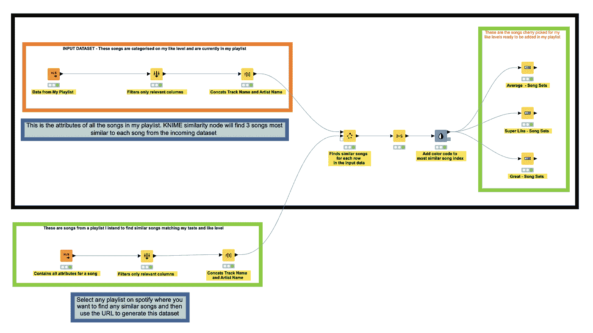

# 我如何使用人工智能/人工智能在 Spotify 上管理我的音乐

> 原文：<https://medium.com/analytics-vidhya/how-i-use-ai-ml-to-curate-my-music-on-spotify-3b356a5b9f26?source=collection_archive---------22----------------------->

> ***“没有音乐，人生将是一场错误。”—弗里德里希·尼采*T3**


*每周一早上，我都会等着我的 30 首新歌，它们是由 Spotify 令人敬畏的算法推荐的。Spotify 之所以能够比任何人都更好地向你推荐音乐，是因为他们使用机器学习来理解你的口味，并向你推荐你最有可能听的歌曲。*

因为音乐一直是我的激情所在，有一天我渴望成为一名 DJ/音乐制作人。我决定使用这个 [URL](http://sortyourmusic.playlistmachinery.com/) 中的数据为我的播放列表创建类似的东西，并创建一个模型，根据我的口味识别歌曲并对它们进行评级。这将允许我把我的播放列表做得更好，它最近出现在一个在线音乐策展网站上。

[](https://bestnew.com/products/nicolas-jaar-caribou-jamie-xx-amtrac-solomun-london-grammer-etc) [## 尼古拉斯·贾尔/驯鹿/杰米·XX/阿姆特拉/索洛门/伦敦·格拉玛等.....

### 815 名关注者见到了 Alankar，一位来自加州洛杉矶的 32 岁的 Spotify 播放列表管理员。你能告诉我们关于…的什么情况吗

bestnew.com](https://bestnew.com/products/nicolas-jaar-caribou-jamie-xx-amtrac-solomun-london-grammer-etc) 

# AI/ML 真的在音乐策展工作吗？

在我开始创建一个适合我的模型之前，我必须向自己证明我确实可以使用**机器学习来编程**到**为我的播放列表**创建或建议歌曲。为了测试这个假设，我首先决定创建一个**流派分类模型**来验证我是否能够使用下面为每首歌曲收集的数据**预测歌曲的流派**。

```
Beats Per Minute (BPM) - The tempo of the song
Energy       - The higher the value, the more energetic song
Danceability - The higher the value, the easier it is to dance to song
Loudness     - The higher the value, the louder the song.
Valence      - The higher the value, the more positive mood for song
Length       - The duration of the song
Acoustic     - The higher the value the more acoustic the song is
Popularity   - The higher the value the more popular the song is
```

使用 **KNIME** ，我测试了以下模型来创建一个流派分类引擎:


**如你所见，我尝试了多种算法，如:**

1.  朴素贝叶斯分类器
2.  梯度增强树
3.  决策树
4.  随机森林

**梯度增强树**对我来说效果最好，准确率约为 70%。

下面是混淆矩阵的结果，它显示了一些流派之间的重叠，因为它们在属性上的相似性。


我在文章末尾附上了数据集和 KNIME 工作流，供用户使用数据并进一步探索。

# 如何创建一个模型来识别我的播放列表中的相似之处，并向我推荐相似的歌曲？

## 选择什么型号？

在与业内的一些 ML/AI 工程师交谈后，我决定使用**余弦相似度**来建立一个模型，它将帮助我根据自己的**个人品味**来识别歌曲。余弦相似性度量内积空间的两个向量之间的相似性。它由两个向量之间的夹角余弦来测量，并确定两个向量是否大致指向同一个方向。

## 余弦相似度如何帮助我们找到相似的音乐？

我将我的播放列表分为三类:

*   *平均值*
*   *伟大的*
*   *超级喜欢*

我这样做的原因是为了找到最接近我喜欢水平的歌曲集，基于这种方法，我可以挑选它们添加到我的播放列表中。使用[**相似性搜索**](https://nodepit.com/node/org.knime.distmatrix.similaritysearch.SimilaritySearchNodeFactory) 节点，我可以使用余弦相似性方法从目标播放列表歌曲中找到与我的个人歌曲最接近的 3 个邻居**。这让我可以在将歌曲添加到我的主播放列表之前，有选择地聆听和评估这些歌曲。**

```
The output of this similarity search has the following 
important columns which helps us to select songs :-  Similarity : (1 - Most similar and 0 as most dissimilar)
-  Most Similar Song Index - 0,1,2
-  Most Similar Track Title
-  Like Level : Like level from the original playlist data
```

**这是我在相似性搜索节点中使用的配置，用于查找与播放列表中每首歌曲最相似的 3 首歌曲。**

****

**如你所见，我用绿色突出显示的列来计算输入歌曲的余弦距离，并找到最近的 3 个邻居。**

**我还使用范围进行过滤，即添加相似系数的**阈值，以过滤掉任何低于 0.70 的值。****

**如果满足 **0.70** 和 **1.0** 之间的阈值要求，我的输出会产生 3 首相似的歌曲。**

**这是相似性搜索的工作流图像，带有每个相似级别的输出。**

****

**以下是**超级喜欢**类别的示例输出:**

****

**对于我的播放列表中的每首歌，我现在至少有 3 首相似的歌曲，我会很快听完并添加到我的播放列表中。**

## **重要链接**

**[**所有数据集**](https://docs.google.com/spreadsheets/d/1INmBDMvUrG_fWudl6-aO7RKwZ2Wn7fdRY0msf2UGRhk/edit?usp=sharing)**[**KNIME 工作流程**](https://drive.google.com/drive/folders/1NCdrwltK09JSRZSML990AJGKRWzWPaTj?usp=sharing)****

# ****结论****

****这个模型是一个起点，因为这里有更多的机会来增加复杂性，但这是我在生活中创造和融合我的两个最大的兴趣的微薄努力。这向我们展示了有效和智能地使用数据来优化甚至像创建播放列表这样最简单的任务的力量。****