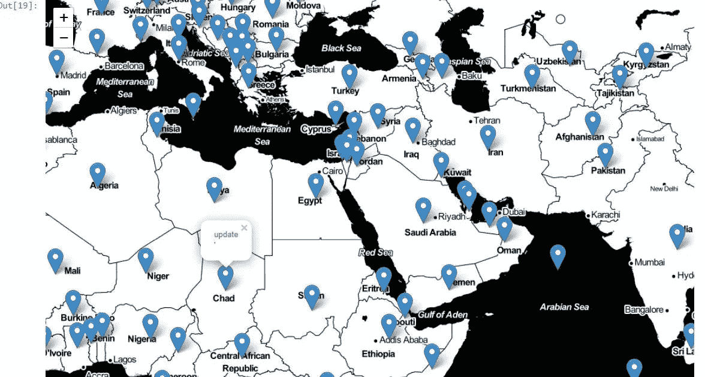

# 我如何使用熊猫和叶子让世界各地的新冠肺炎更新更接近你，并在 5 个步骤中访问你。

> 原文：<https://medium.com/analytics-vidhya/how-i-used-pandas-and-folium-to-bring-the-covid-19-updates-around-the-world-closer-and-accessible-dbe580443fc7?source=collection_archive---------18----------------------->

生成的树叶地图的裁剪镜头。

如果焦虑有一个像股票市场实体一样的显示指数，毫无疑问，我们会看到它的水平随着世界上发生的事情而上升。然而，有一件事是有帮助的，那就是被告知。有鉴于此，我找到了一种简单的方法来帮助获取世界各地新冠肺炎局势的实时统计数据。你所要做的就是点击你所选择国家的蓝色标记上弹出的更新链接。体验一下[这里](https://oluwatobij4.github.io/covidmap/)。

我是这样做的。

1.  进口了所需的图书馆、熊猫和树叶
2.  阅读我的熊猫档案。我的文件的名字是“时间”，它包含下列栏目:纬度，经度的国家和相应的超文本链接。超文本链接将浏览者引向地图上被点击的任何国家的最新统计数据。提供这些最新数据的网站是 [worldometers](https://www.worldometers.info/) 。
3.  定义了映射并创建了 for 循环来分别定义 popup 和 Marker 参数。
4.  将此添加到“m”变量中，该变量是前面定义的叶子图。
5.  通过调用“m”运行代码，瞧，地图出现了。

我把地图放在一个网络平台上，让人们可以访问它。无论你在地图上的什么地方，保持健康和安全。谢谢你。