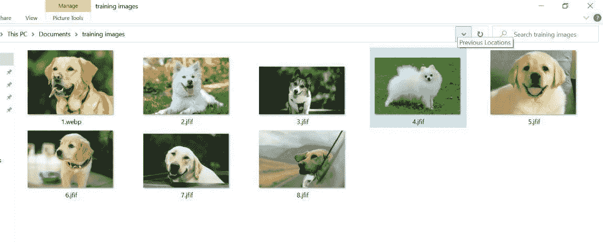
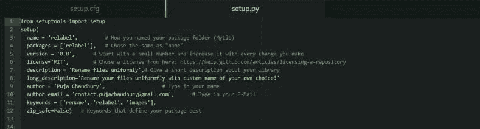
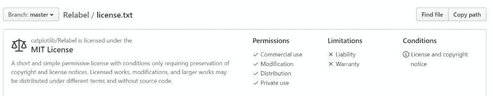
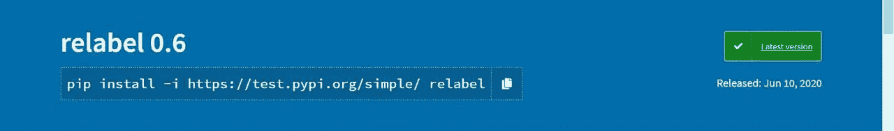
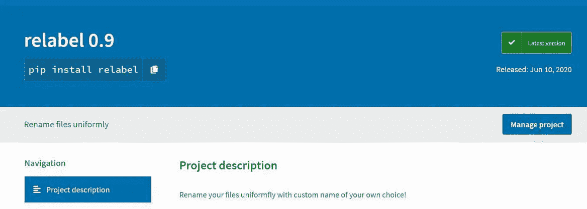

# 快速编码:瞬间创建 Python 库！

> 原文：<https://medium.com/analytics-vidhya/how-i-wrote-a-python-library-in-under-3-hours-d9b9c502dfe?source=collection_archive---------25----------------------->



是的，你没看错！你可以在 3 小时或更短的时间内开发一个 python 库！您也不需要成为 python 专家。对于像 [Relabel](https://github.com/catplotlib/Relabel) 这样的简单库，这将是本文的重点，您只需要知道一些基础知识。

我是一个机器学习爱好者，我经常处理没有正确组织的大型数据集。所以为了解决这个问题，我决定查找有用的 python 命令，我确实找到了一个。

```
os.rename()
```

我从我的男朋友那里得到了把这个脚本变成一个图书馆的想法，他几个月前出版了他自己的图书馆。一定要看看 [Tasveer](http://GitHub.com/abhinavmir/tasveer) ，它只需一个命令就能帮助你下载训练和测试图像！

在我们进入教程之前，这里有一些你需要的先决条件:

1.  了解基本的 python 语法。
2.  Linux 命令的知识。
3.  PyPI 上的帐户。

让我们开始陈述吧！

# 写你的代码。

首先，提出一个问题，并尝试使用 python 在您的系统上解决它。您也可以在代码中使用其他库。

```
import os
from os import listdir
def change_name():    
    variable=input("Enter new file names:\n")    
    path = os.getcwd()    
    i = 1    
    for filename in listdir(path):        
        m=filename.index(’.’)        
        l=len(filename)         
        n=l-m        
        if(variable==""):             
            os.rename(filename,str(i).zfill(1)+filename[-n:])        
        else:            
            os.rename(filename,variable+ str(i).zfill(1)+filename[-n:])      
        i+=1
```

这是我为 Relable 写的代码。正如你所看到的，这是一个相当简单的代码，它包含了操作系统库。

# PyPI 账户。

然后去 https://pypi.org/的[和 https://test.pypi.org/的](https://pypi.org/)和[创建两个独立的账户。](https://test.pypi.org/)

# 上传到 PyPI。

**步骤 1: Linux shell** 打开您的 Linux 命令提示符，导航到保存代码的文件夹。


**第二步:关于你的库。** 将 setup.py、setup.cfg、license.txt 添加到文件夹中。这些文件包含有关库的信息，这有助于更好地定义库的功能。



Setup.py

你可以查找“麻省理工学院许可证”并在添加到你的文件夹之前做一些调整。



license.txt

查看我的[库](https://github.com/catplotlib/Relabel)以获得关于您需要创建什么文件的更多细节。

**第三步:测试** 把所有必要的文件都放在一个文件夹里之后，就该进行一些测试了！

```
python setup.py sdist
```

从您的 Linux shell 运行上面的代码行。在运行这一行之前，请确保在您的系统上安装了 PyType。这将创建一个可以直接上传到 PyPI 的. tar 文件。

运行下面一行并输入您的用户名和密码来测试 PyPI。

```
twine upload --repository-url [https://test.pypi.org/legacy/](https://test.pypi.org/legacy/) dist/*
```



testPyPI

你可以用它做各种各样的测试，只是要确保在新版本发布之前从 setup.py 文件中修改你的库的版本。

第四步:发布。

完成测试并对库的输出满意后，您需要在 shell 中运行以下命令。出现提示时，输入您的用户名和密码登录 PyPI(不是 test PyPI)。您的库将被上传到 PyPI 主站点，您的库现在可以使用了！

```
twine upload dist/*
```



感谢您的阅读！希望你觉得这有用！一定要留下很多掌声！