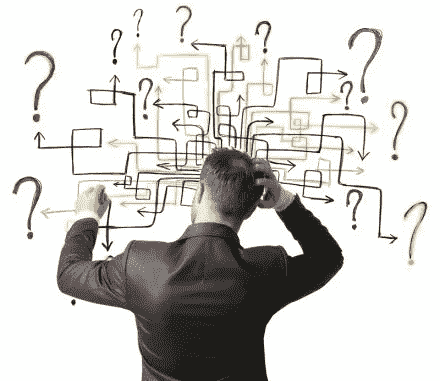
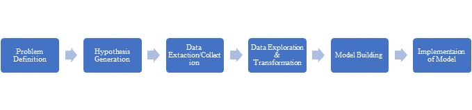
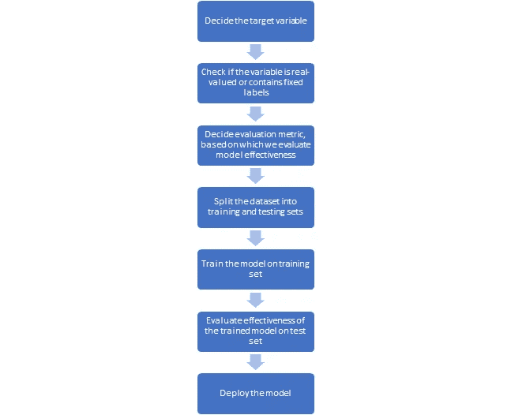

# 业务问题如何转化为数据问题，以及如何提供数据问题的解决方案？

> 原文：<https://medium.com/analytics-vidhya/how-is-a-business-problem-converted-to-a-data-problem-and-how-to-provide-solution-to-the-data-de594f8e4733?source=collection_archive---------14----------------------->

分析专家总是面临这样的问题。分析专家的工作并不总是预测模型、数据争论或数据故事。最终目标是为组织创造价值或解决业务问题。这可以通过**数据科学生命周期来实现。**

下面是总结数据科学生命周期流程的简单流程图

数据科学生命周期

我将在下面简要描述每个步骤:

# **问题定义:**

问题定义就像目标设定。如果不定义成功/最终目标是什么，你就无法在数据科学项目中取得成功。重要的是要记住，识别问题是解决问题的非常重要的一步。错误地定义问题会导致不必要的努力。数据科学家的工作是深入客户的细节，以识别业务问题，并将业务问题转化为数据问题，通常以等式的形式。

例如，假设我们的客户是一家银行，核心问题是提高存款金额。

**押金=∑客户 _ 余额*(1+投资回报率)——(成本 _ 营销+∑员工 _ 薪资)**

在哪里，

*   ROI: %利率(例如 8% = 0.08)
*   employee_salary:每个员工的薪金
*   customer_balance:每个客户的余额
*   成本营销:获得新客户或留住新客户的营销成本

# **假设生成:**

假设生成阶段是关于找出可以做什么来找到解决方案或查明问题的根本原因。一个问题可能有数百种假设。在数据科学生命周期的这个阶段，没有什么问题是愚蠢的。这一步在查看数据之前完成，以避免人为偏见。有一个零假设和一个替代假设，其中一个假设被数据和统计证明是正确的。验证假设有时就像看一个图像一样简单。

# 数据提取/收集:

如果数据成功满足下面提到的标准，我们就选择它

1.  **数据的清洁**:虽然我们在建模前执行数据清洁，但我们应该确保通过正确选择数据集来最小化这些工作。
2.  **历史数据的可用性**答:所需时间段的数据应该可用。
3.  **结构兼容性**:要进行的数据分析应与可用数据兼容。例如，如果大部分可用数据是主要由数字值构成的结构化表格，就不值得对一些社交媒体评论进行文本分析。
4.  **费用**:获取数据的金钱和时间不应超过组织期望从数据中获得的收益。
5.  **依赖**:数据源不应该不可靠。我们在可用数据上检查我们的模型的有效性，但是该模型是在真实世界的数据上部署的。我们的模型不应该基于与我们期望在现实世界中看到的不相似的数据来训练。

# **数据探索与转换:**

**探索性数据分析**的目标是获得对你的**数据**的信心，达到你准备好使用机器学习算法的程度。EDA 的另一个附带好处是细化您对稍后将用于机器学习的特征变量的选择。

一些机器学习算法如**线性回归**只考虑**数字输入特征**。因此，如果数据集中有任何分类变量，您必须转换它们。一些机器学习模型如 **kNN** 是基于**距离的**因此你可能需要实现**标准化**或**规范化**以便你的特征在相同的比例上。

作为一名数据科学家，你的工作是根据你选择用来解决手头问题的机器学习算法来转换数据。

# **模型建筑**

任何建模过程的第一步都是决定目标变量。如果目标变量是实值的(连续的),我们使用回归技术，如果目标变量是确定的类别，我们使用分类技术。对于回归和分类，我们使用评估标准来衡量有效性。建模的下一步包括将可用数据采样到训练和测试数据集中。然后，我们训练该模型，并在测试集上测量其有效性。然后将模型投入生产，以收集数据见解或提供一种功能，如向用户提供建议。下面是整个过程的流程图。

数据建模过程

# **模型的实现:**

在这一步中，您必须将您的模型转换为策略。让我们用一个例子来理解这一点。

**你是数据科学负责人。您希望针对现有的高价值客户开立定期存款账户(FDA)**

战略框架的模型如下:

1.  *整理目标人群的所有维度= >* ***客户价值=终身*平均。余额*产品毛利***
2.  *评估成功/KPI = >成功:现有客户对 FD 产品的接受度更高。KPI:增加现有客户的 FD 产品交叉销售*
3.  *找到通向成功的关卡*
4.  *创造战略= >* ***客户价值=生命周期*预计年价值***

# **结论**

在本文中，我们看到了数据科学的过程以及该过程每个阶段所涉及的步骤。在本文中，我试图解释一个数据科学项目的完整生命周期。希望本文有助于您理解业务问题如何转化为数据问题，以及如何提供数据问题的解决方案。