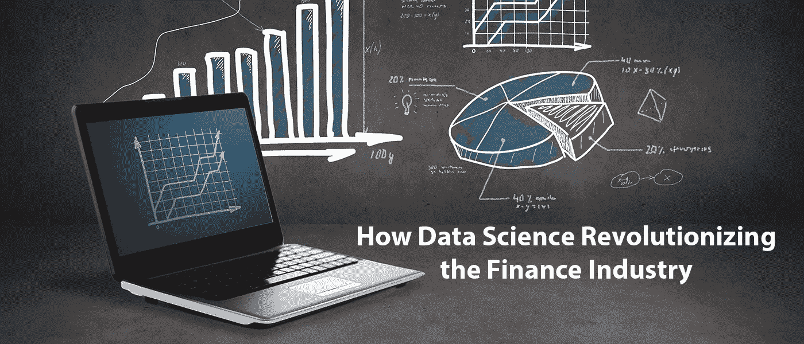
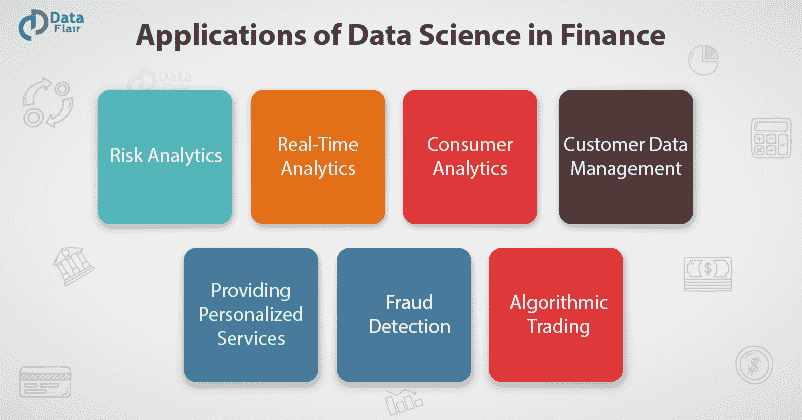
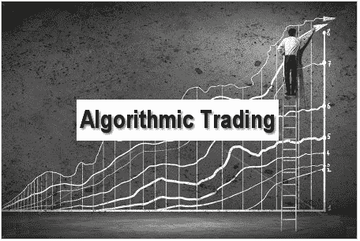

# 数据科学如何革新金融行业？

> 原文：<https://medium.com/analytics-vidhya/how-is-data-science-revolutionizing-the-finance-industry-c0a95368e5bc?source=collection_archive---------0----------------------->

> “是时候在数据科学、机器学习和深度学习的帮助下修改金融战略了”

我确实相信，金融总是与数据有关。事实上，数据科学和金融是相辅相成的。甚至在术语 [**数据科学**](https://bit.ly/2z9XUWB) 被发明之前，金融业就已经在使用它了。就像银行如何自动化风险分析一样，金融业也使用数据科学来完成这项任务。

金融行业将数据视为基本商品和燃料。它将原始数据转化为有意义的产品，并利用它来获得行业更好运作的见解。金融是数据的枢纽。金融机构是数据分析的最早用户和先驱之一。数据科学广泛应用于风险分析、客户管理、欺诈检测和算法交易等领域。

## **为什么在金融领域使用数据科学-**

金融行业需要自动化风险分析，以便为公司执行战略决策。使用机器学习，他们识别、监控和优先考虑风险。这些机器学习算法通过对大量可用的客户数据进行训练，提高了成本效率和模型可持续性。同样，金融机构使用机器学习进行预测分析。它可以让公司预测客户的终身价值和他们的股票市场走势。我们可以将[**机器学习**](https://bit.ly/2PvnOyu)**(ML)&**[**深度学习**](https://data-flair.training/blogs/deep-learning-tutorial/) **(DL)** 定义为数据科学的一个子集，它利用统计模型得出洞察并做出预测。

# **令人惊叹的数据科学应用正在彻底改变金融行业-**

**1。风险分析-** 风险分析是数据科学的关键领域之一。借助风险分析和管理，公司能够做出战略决策，提高可信度和安全性。风险管理是一个跨学科的领域，掌握数学、统计学和解决问题的知识至关重要。

大多数公司都面临着各种各样的风险。这些风险来源于竞争对手、信用、市场等。管理风险的主要步骤是识别风险、监控风险和确定风险的优先级。金融交易、客户信息等数据的可用性非常高。因此，机构在这种类型的数据上进行训练，以增加风险评分模型并优化其成本。风险管理的另一个重要方面是核实客户的信誉。为了分析信誉度，公司聘请了数据科学家，他们使用机器学习算法来分析客户的交易。

**2。消费者分析**——消费者人格化是金融机构的一项主要任务。在实时分析的帮助下，数据科学家能够从消费者行为中获得洞察力，并能够做出适当的商业决策。

像保险公司这样的金融机构利用消费者分析来衡量客户的终身价值，增加他们的交叉销售，以及减少零以下客户，以优化损失。

**3。欺诈检测-** 欺诈是金融机构的一大担忧。欺诈的危险随着交易数量的增加而增加。然而，随着大数据和分析工具的增长，金融机构现在可以跟踪欺诈行为。金融机构中最常见的欺诈之一是信用卡欺诈。

这种类型欺诈的检测是由于算法的改进，提高了异常检测的准确性。此外，这些检测会提醒公司金融购买中的异常情况，促使他们冻结帐户，以最大限度地减少损失。

各种 [**机器学习工具**](https://data-flair.training/blogs/machine-learning-tools/) 也可以识别交易数据中的异常模式，并提醒金融机构对其进行进一步调查。银行还必须应对其他与保险相关的欺诈。使用几种 [**聚类算法**](https://en.wikipedia.org/wiki/Cluster_analysis) ，公司能够分离和聚类看似高度可疑的数据模式。

**4。客户数据管理-** 金融机构需要数据。事实上，大数据已经彻底改变了金融机构的运作方式。数据的数量和种类是通过社交媒体和大量交易贡献的。

数据以两种形式出现-

*   结构数据
*   非结构化数据

虽然结构化数据更容易处理，但非结构化数据会带来很多问题。这种非结构化数据可以用几个 NoSQL 工具来处理，也可以在 MapReduce 的帮助下进行处理。

**5。算法交易-** 算法交易是金融机构最重要的部分。在算法交易中，有复杂的数学公式和闪电般的计算帮助金融公司设计新的交易策略。大数据对算法交易产生了巨大影响，数据科学已成为其最重要的特征。

算法交易中存在的数据由大量数据流组成，并涉及测量和描述底层数据流的模型。分析引擎的目的是通过更好地理解海量数据集来预测未来市场。

**6。提供个性化服务-** 金融机构负责向客户提供个性化服务。金融机构采用各种技术来分析客户信息，并对他们的互动产生洞察力。此外，金融机构正在依靠基于语音识别和[**自然语言处理**](https://data-flair.training/blogs/ai-natural-language-processing/) 的软件为其用户提供更好的交互性。

利用用户反馈的数据，金融机构能够对其客户需求进行可操作的洞察，从而增加利润。这将有助于这些机构优化其战略，并为其客户提供更好的服务。

除了这些应用，数据科学在金融领域还有许多作用。公司还使用数据科学客户组合管理通过商业智能工具分析数据趋势，金融从业者最常使用机器学习来实现流程自动化和安全性。通过各种客户情绪分析技术和机器学习算法，我们可以促进社交媒体互动，促进他们的反馈并分析客户评论。

金融业目前的趋势正在引领更具革命性、更合理的模式进入市场。随着大量数据科学家进入该领域，技术是所有金融面临的巨大压力。我们在金融和贸易领域面临的关键问题的最佳解决方案将会提高效率、增加透明度、加强风险管理和创新。

**探索 6 大令人瞠目结舌的数据科学应用-** [**数据科学应用**](https://bit.ly/2UrE8CR)