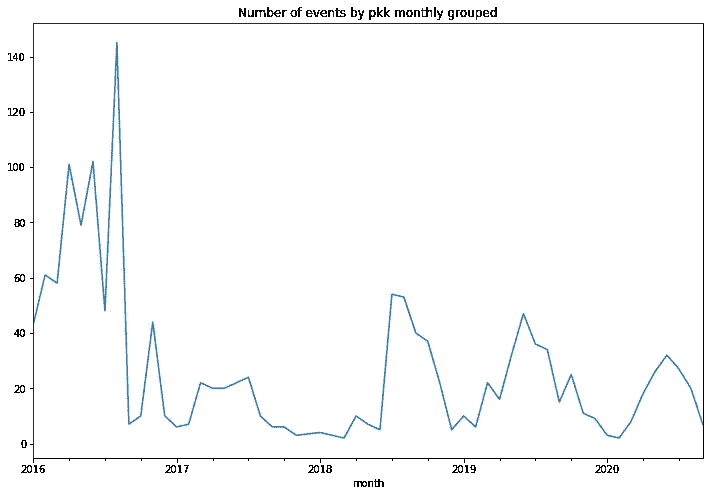
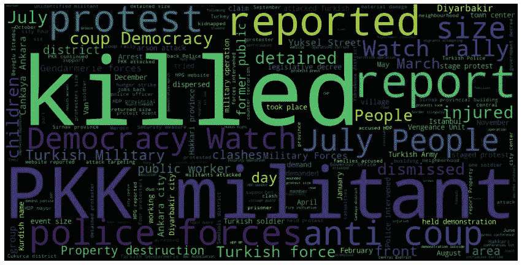

# 土耳其如何应对冲突:土耳其冲突数据集的案例研究(使用 python)

> 原文：<https://medium.com/analytics-vidhya/how-is-turkey-doing-about-conflicts-case-study-on-turkeys-conflict-dataset-with-python-83c0655090be?source=collection_archive---------22----------------------->


土耳其马尔丁市。来源:[https://unsplash.com/photos/B-W-6_o1LD8](https://unsplash.com/photos/B-W-6_o1LD8)

对我来说，这是一项不同的工作，我热爱我的国家，我想用我的技能去了解它的来源和去向，并解开数据中一些看不见的模式。尽管我是一名优秀的科学家，但作为一名优秀的分析师和观察者也是我的目标，学习数据科学在我永无止境的道路上帮助了我太多。

正在导入库。

```
import pandas as pd
import ssl
import numpy as np
import networkx as nx
from datetime import date#Viz Libraries
import matplotlib.cm as cm
from wordcloud import WordCloud
import plotly
import plotly.express as px
import plotly.offline as py
import plotly.graph_objs as go
import plotly.graph_objects as go
import matplotlib.pyplot as pltpd.set_option(‘display.max_columns’, None)#displaying all columns
ssl._create_default_https_context = ssl._create_unverified_context
%matplotlib inline
```

我是从[https://data.humdata.org](https://data.humdata.org)打来的数据电话。有些列的数据类型必须先修复。

```
conflict_turkey = pd.read_csv('[http://data.humdata.org/dataset/b1b91452-c8e3-4490-b614-f1d70331a650/resource/7d2ba969-9f07-4795-901e-02ac8fe99844/download/conflict_data_tur.csv'](http://data.humdata.org/dataset/b1b91452-c8e3-4490-b614-f1d70331a650/resource/7d2ba969-9f07-4795-901e-02ac8fe99844/download/conflict_data_tur.csv'))
conflict_turkey=conflict_turkey.iloc[1:]
conflict_turkey['event_date']=pd.to_datetime(conflict_turkey['event_date'])
conflict_turkey['longitude']=pd.to_numeric(conflict_turkey['longitude'])
conflict_turkey['latitude']=pd.to_numeric(conflict_turkey['latitude'])
conflict_turkey['fatalities']=pd.to_numeric(conflict_turkey['fatalities'])
conflict_turkey=conflict_turkey.sort_values(by=['event_date'])
conflict_turkey.head()
conflict_turkey.info()
```


下面可以看到 event_type 的值计数。

```
conflict_turkey.groupby(‘event_type’).size().plot(kind=’bar’)
```


```
#To create some charts i will create a new dataframe so that i can #visualize event_type count's monthly distrubiton
conflict_turkey[‘month’]=conflict_turkey[‘event_date’].dt.to_period(‘M’)
df_new=conflict_turkey.groupby([‘month’, ‘event_type’])[‘fatalities’].sum().reset_index()
df_new[‘month’]=df_new[‘month’].astype(str)
df_new.tail()
```


```
fig = go.Figure(data=[
go.Bar(name=’Battles’, x=df_new.month[df_new.event_type==’Battles’], y=df_new.fatalities[df_new.event_type==’Battles’]),go.Bar(name=’Explosions/Remote violence’, x=df_new.month[df_new.event_type==’Explosions/Remote violence’], y=df_new.fatalities[df_new.event_type==’Explosions/Remote violence’]),go.Bar(name=’Strategic developments’, x=df_new.month[df_new.event_type==’Strategic developments’], y=df_new.fatalities[df_new.event_type==’Strategic developments’]),go.Bar(name=’Protests’, x=df_new.month[df_new.event_type==’Protests’], y=df_new.fatalities[df_new.event_type==’Protests’]),go.Bar(name=’Violence against civilians’, x=df_new.month[df_new.event_type==’Violence against civilians’], y=df_new.fatalities[df_new.event_type==’Violence against civilians’]),go.Bar(name=’Riots’, x=df_new.month[df_new.event_type==’Riots’], y=df_new.fatalities[df_new.event_type==’Riots’])
])fig.update_xaxes(rangeslider_visible=True, visible=True)
fig.update_layout(barmode=’stack’)
fig.show()
```


1.  下面，我们可以看到事件数量的时间序列图。

```
pivot=pd.DataFrame(conflict_turkey.groupby([‘event_date’, ‘event_type’]).size().unstack().reset_index()).fillna(0).set_index(‘event_date’)fig = px.line(pivot, x=pivot.index, y=pivot[‘Battles’].rolling(window=14).mean(), width=1000, height=600)fig.add_scatter(x=pivot.index, y=pivot[‘Explosions/Remote violence’].rolling(window=14).mean(), mode=’lines’, name=’Explosions/Remote violence’)fig.add_scatter(x=pivot.index, y=pivot[‘Riots’].rolling(window=14).mean(), mode=’lines’, name=’Riots’)fig.add_scatter(x=pivot.index, y=pivot[‘Strategic developments’].rolling(window=14).mean(), mode=’lines’, name=’Strategic developments’)fig.add_scatter(x=pivot.index, y=pivot[‘Violence against civilians’].rolling(window=14).mean(), mode=’lines’, name=’Violence against civilians’)fig.update_xaxes(rangeslider_visible=True, visible=True)
fig.update_layout(plot_bgcolor=’rgba(233, 215, 165, 1)’)
fig.show()
```


*   我将绘制一个条形图，显示每个 acti R1 的死亡人数，按最常提及的 6 个 acti R1 的年份和月份分组。

```
df_new2=conflict_turkey.groupby([‘month’, ‘actor1’])[‘fatalities’].sum().reset_index()#creating monthly aggregated datadf_new2[‘month’]=df_new2[‘month’].astype(str)
```


```
fig = go.Figure(data=[go.Bar(name=’Protesters (Turkey)’, x=df_new2.month[df_new2.actor1==’Protesters (Turkey)’], y=df_new.fatalities[df_new2.actor1==’Protesters (Turkey)’]),go.Bar(name=’PKK: Kurdistan Workers Party’, x=df_new2.month[df_new2.actor1==’PKK: Kurdistan Workers Party’], y=df_new2.fatalities[df_new2.actor1==’PKK: Kurdistan Workers Party’]),go.Bar(name=’Military Forces of Turkey (2016-)’, x=df_new2.month[df_new2.actor1==’Military Forces of Turkey (2016-)’], y=df_new2.fatalities[df_new2.actor1==’Military Forces of Turkey (2016-)’]),go.Bar(name=’Police Forces of Turkey (2016-)’, x=df_new2.month[df_new2.actor1==’Police Forces of Turkey (2016-)’], y=df_new2.fatalities[df_new2.actor1==’Police Forces of Turkey (2016-)’]),go.Bar(name=’Violence against civilians’, x=df_new2.month[df_new2.actor1==’Violence against civilians’], y=df_new2.fatalities[df_new2.actor1==’Violence against civilians’]),go.Bar(name=’Unidentified Armed Group (Turkey)’, x=df_new2.month[df_new2.actor1==’Unidentified Armed Group (Turkey)’], y=df_new2.fatalities[df_new2.actor1==’Unidentified Armed Group (Turkey)’])
])fig.update_xaxes(rangeslider_visible=True, visible=True)
fig.update_layout(barmode=’stack’)
fig.show()
```


```
 #To see fatalites in total:
df_fats=conflict_turkey.groupby(‘event_date’)[‘fatalities’].sum().reset_index()fig=px.line(df_fats, x=’event_date’, y=df_fats[‘fatalities’].rolling(window=30).mean(), 
 title=’Monthly moving average of fatalities’)
fig.update_layout(plot_bgcolor=’rgba(233, 215, 165, 1)’)
fig.update_xaxes(rangeslider_visible=True, visible=True)
fig.show()
```


上面我们可以看到 30 天移动平均值的总致命性。有趣的是，我们可以看到死亡总数的季节性。

现在，我将绘制一张地图，显示基于经度和纬度的死亡人数分布图，在右边，我根据死亡人数给气泡着色。您也可以缩放地图。

```
spatial=pd.DataFrame(conflict_turkey.groupby([‘latitude’, ‘longitude’], as_index = False)[‘fatalities’].sum())
spatial=spatial.iloc[1:]
fig = px.scatter_mapbox(spatial, lat=”latitude”, lon=”longitude”, size=’fatalities’,
 zoom=4.5, height=300, color=’fatalities’)
fig.update_layout(mapbox_style=”open-street-map”)
fig.update_layout(margin={“r”:1,”t”:1,”l”:1,”b”:0})
fig.show()
```


不出所料，这些事件大多发生在该国东南部。

actor1 和 actor1 的网络表示形式可能非常有助于理解这种关系。我只带了造成 10 人以上死亡的演员。

```
cats = conflict_turkey.groupby([“actor1”, “actor2”]).count()[[“fatalities”]]\
 .rename(columns={“fatalities”:”Count”}).reset_index()
cats=cats.loc[cats[‘Count’]>10] G = nx.from_pandas_edgelist(cats, ‘actor1’, ‘actor2’, ‘Count’)
pos = nx.circular_layout(G)
plt.figure(figsize=(14,10)) 
nx.draw(G, node_size=120,font_size=15, with_labels=True)
plt.show()
```


上面我们可以看到每个演员的动作。

让我们深入了解 actor1 和 actor2 的定义。我想看 2016 年前后的军事表现，这里我将使用我刚刚发现的平行类别。其次，我想看看 pkk 恐怖组织。

**土耳其军队(2016-)**

```
fig = px.parallel_categories(conflict_turkey.loc[conflict_turkey[‘actor1’]==’Military Forces of Turkey (2016-)’], dimensions=[‘actor1’, ‘actor2’],
 labels={‘actor1’:’Military Forces of Turkey (2016-) ‘, ‘actor2’:’actor2'})#, width=1200, height=600)
fig.show()
```


**土耳其军队(2002-2016)**

```
fig = px.parallel_categories(conflict_turkey.loc[conflict_turkey[‘actor1’]==’Military Forces of Turkey (2002–2016)’], dimensions=[‘actor1’, ‘actor2’],
 labels={‘actor1’:’Military Forces of Turkey (2002–2016)’, ‘actor2’:’actor2'})
fig.update_layout(autosize=True)
fig.show()
```


**PKK:库尔德斯坦工人党**

```
fig = px.parallel_categories(conflict_turkey.loc[conflict_turkey[‘actor1’]==’PKK: Kurdistan Workers Party’], dimensions=[‘actor1’, ‘actor2’],
 labels={‘actor1’:’PKK: Kurdistan Workers Party’, ‘actor2’:’actor2'})
fig.update_layout(autosize=True)
fig.show()
```


让我们看看 pkk 作为 actor1 的冲突数量的趋势如何。

```
conflict_turkey.loc[conflict_turkey[‘actor1’]==’PKK: Kurdistan Workers Party’].groupby(‘month’).size().plot(figsize=(12, 8), title=’Number of events by pkk monthly grouped’)
```



既然我们有新闻的文本格式，让我们来看看最常用的单词云。

```
wordcloud = WordCloud(width=1000, height=500).generate(“+”.join(conflict_turkey[‘notes’]))
plt.figure(figsize=(15,8))
plt.imshow(wordcloud, interpolation=’bilinear’)
plt.axis(“off”)
plt.show()
```



所以在我看来，我们在对抗冲突方面做得很好。但情况正在好转，我们必须更加频繁地关注这些数据。

我相信，在这个数据集中，我们可以挖掘更多的信息，但是要挖掘这些信息，还需要领域知识。我会留下我笔记本的 github 链接，如果你想继续挖掘这个数据集，你需要做的就是安装请求的模块。数据不需要下载，最需要的预处理是在这里完成的。

# **链接:**

**数据**:[https://data.humdata.org/dataset/ucdp-data-for-turkey](https://data.humdata.org/dataset/ucdp-data-for-turkey)

**Jupyter 笔记本(github)**:https://github . com/UmarIgan/Jupyter-Notebooks/blob/master/Turkey % 20 conflicts % 20 data % 20 mining . ipynb

**Jupyter 笔记本(nb viewer)**:[https://nb viewer . Jupyter . org/github/UmarIgan/Jupyter-Notebooks/blob/d 19 a 0 ed 33 ad 96 c 5300 be 192555773 b 0f 666811 c 3/Turkey % 20 conflicts % 20 data % 20 mining . ipynb](https://nbviewer.jupyter.org/github/UmarIgan/Jupyter-Notebooks/blob/d19a0ed33ad96c5300be192555773b0f666811c3/Turkey%20Conflicts%20Data%20Mining.ipynb)