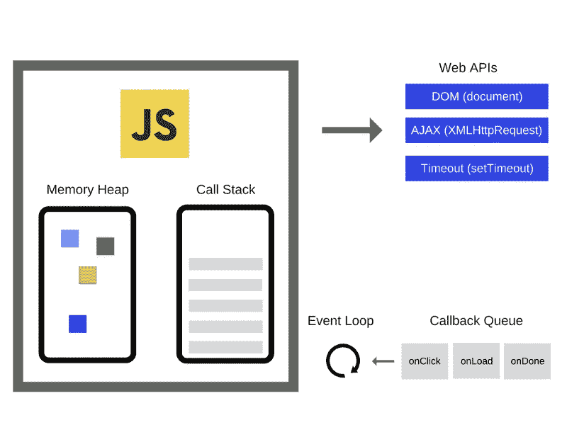
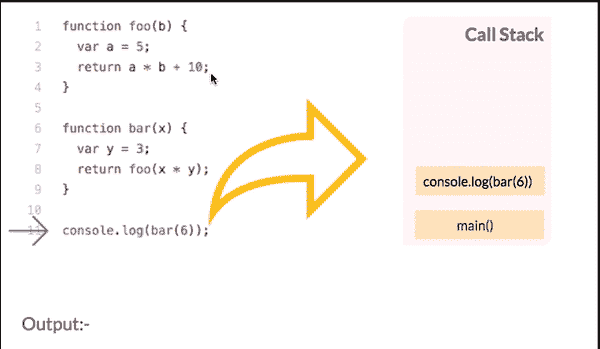
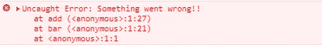
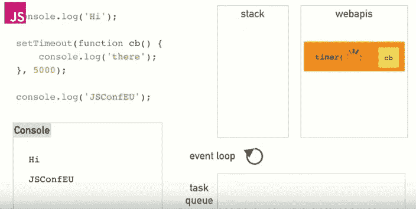
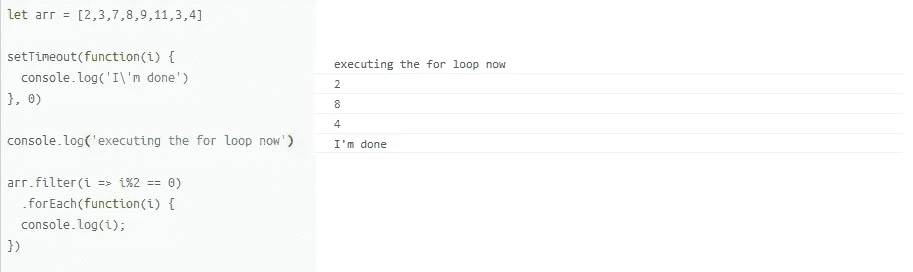

# Javascript 是如何单线程的？深入解释事件循环和调用堆栈

> 原文：<https://medium.com/analytics-vidhya/how-javascript-is-single-threaded-in-depth-explaination-of-event-loop-and-call-stacks-dbc7e4f6ca56?source=collection_archive---------14----------------------->

大约两年前，我开始学习 Javascript，想找一些零碎的东西来探索它的内部工作原理。我听说过在浏览器上运行的 v8 运行时引擎，但对此一无所知，并开始在浏览器上做自己的研究和实验。大多数 JS 开发人员可能听说过术语 V8，chrome 的运行时，但有些人甚至不知道这是什么意思，是做什么的。

首先，引擎盖下的 Javascript 是什么 NodeJS 的核心组件。JS 是单线程、单一并发语言，它有一个调用栈、一个事件循环、一个回调队列和一些其他 API。如果我们在浏览器中谈论 v8 运行时，下面的一个是它真正是什么的简化视图…



**什么是调用栈？**

当您的 Javascript 代码逐行运行时，您可以将调用堆栈视为功能堆栈或执行堆栈。除非将代码部分交给回调队列，否则它会填充运行时引擎的调用堆栈。

为了便于理解，请考虑下面的图像。



这里，首先 JS 被设计为在 main()线程上运行，所以当我们一起执行上面的代码时，main()函数将首先被调用。入口执行点是 console.log()语句，执行将被停止，直到其中提供的参数没有完成其执行，即 bar(6)。现在，bar(6)将被推送到堆栈上，然后它调用函数 foo(3*6 ),因此位于顶部。现在，当 foo()的执行完成时，它将通过从 stack 弹出条目返回结果，并到达 bar(6)，bar(6)又将条目返回到控制台，并打印结果。

你们一定都在我们的浏览器控制台中看到过长长的红色错误堆栈跟踪，它基本上指示了调用堆栈的当前状态，以及在函数中从上到下失败的地方，就像堆栈一样。请看下图，这是写在图片旁边的代码的结果。



```
function add(a, b) {
  throw Error("something went wrong");
}function bar(a,b) {
  add(3,4)
  return a-b
}bar(3,4)
```

有时，我们会陷入无限循环，因为 Chrome 浏览器的堆栈大小限制为 16，000 帧，这可能是由于重复的函数调用而发生的，浏览器试图为您取消并抛出“范围错误:超出最大堆栈大小”

**web API**

Web API 中有一些 JS 模块，如 XMLHttpRequest、Timeout 和 DOM 事件。Web API 开始执行，当执行完成时，它将函数调用放在任务队列中，我们将在下一节讨论。WebAPIs 本身不能将执行代码放到堆栈上，这就是任务队列的作用。

当下面的代码执行时，它会立即被移交给 webAPI 并完成工作。

```
//timeout or execution after some delay
setTimeout(function() {
   console.log('after delay')
}, 5000);//XMLHttpRequest call
fetch('https://example.api.com').then(function(result) {
    console.log(result);
});//DOM event
document.getElementById('btn-submit').onclick = function(event) {
    clicked++;
    console.log(event.target.value);
}
```



请看上面的插图。当它将 setTimeout 推送到堆栈上时，它被发送到 webapis 运行模块并在后台执行，直到它完成执行。

**事件循环**

事件循环的主要职责是监控任务队列和堆栈状态。如果要执行 webapis 任务队列中的一些函数回调，则事件循环会拾取这些回调，如果堆栈为空，则会将其放入堆栈中。如果堆栈处于执行状态，或者简单地说，如果它不为空，那么任务队列中的回调需要等待，直到调用堆栈变空。因此，setTimeout()函数不能保证以指定的延迟执行，如果调用堆栈函数花费更多的时间来执行，它可能必须在任务队列中等待。

有趣的是，下面代码的执行不是异步的，而是以同步的方式执行。

```
let arr = [2,3,7,8,9,11,3,4]arr.filter(i => i%2 == 0)
 .forEach(function(i) {
 console.log(i);
})
```

现在，根据上面的解释，很明显，使用 0 ms 延迟定义的 setTimeout()函数不能保证立即执行，因为它首先被放入堆栈，然后由 webapi 运行计时器，并在任务队列中等待，然后由事件循环选择再次推送到调用堆栈。



对于上面的代码，输出显示如下，在 setTimeout()中编写的语句在最后执行并打印消息。

总之，上面解释的所有组件一起工作来保持 JS 代码的单线程执行。

编码快乐！！