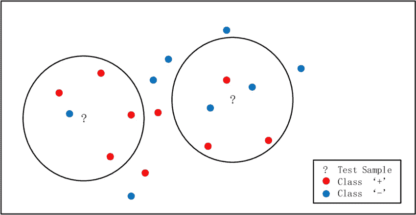
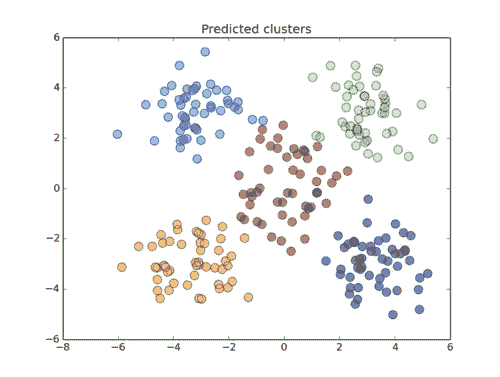

# K-NN 与 K-Means 有何不同

> 原文：<https://medium.com/analytics-vidhya/how-k-nn-is-different-from-k-means-61add9902c75?source=collection_archive---------14----------------------->

**KNN** 即**K-最近邻**是一种监督分类算法，用于将数据点分类为不同的类别，例如类别α和类别β。如果你不明白监督分类算法是什么意思，或者如果你想快速复习，你最好在[T5打劫，然后回来。回到我们的话题。我们将有许多数据点，即标记数据，即算法用来理解潜在动态和隐藏特征模式的训练集。完成后，我们向模型展示一些看不见的数据，即测试集，以观察模型在近似真实世界场景中的响应和表现。](/@kelvinjose/supervised-and-unsupervised-algorithms-1ad3c8ca0b9c)

让我们看看做 K-NN 的几个步骤

1.  把数据贴上标签，分成训练和测试数据。
2.  选择 K，这是一个超参数，指的是我们在对目标标签进行多数投票时将考虑的最近邻居的数量。
3.  选择一个相似性和评估指标。
4.  运行 K-NN 几次，改变 K 并检查评估度量。
5.  在每次迭代中，K 个邻居投票，多数票胜出，成为最终预测。
6.  通过挑选具有最佳评估度量的一个来优化 K。

**K-Means** 是一种无监督算法，用于将相似的数据点聚类在一起。与监督学习机制不同，我们使用未标记的数据。该算法依赖于底层数据的独立特征。K-Means 聚类是一种矢量量化方法，最初来自信号处理，在数据挖掘的聚类分析中很流行。k 均值聚类旨在将 *n* 个观察值划分为 *k* 个聚类，其中每个观察值属于具有最近均值的聚类。

看下面给出的伪代码

1.  任意选择 K 个质心
2.  将每个数据点分配给最近的质心
3.  将质心移动到每个簇的平均值
4.  重复步骤 2 和 3，直到质心没有太大变化。

对，就这样了！抓紧了。新帖子来了。

和平力量快乐