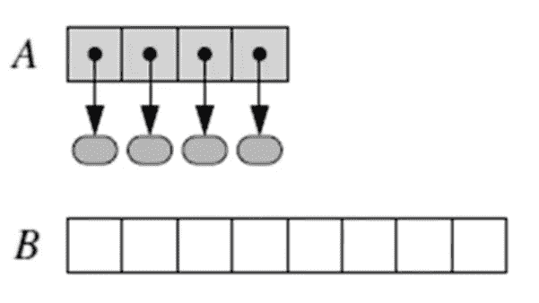
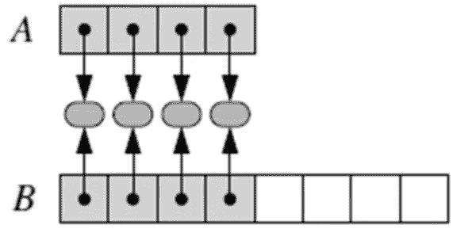
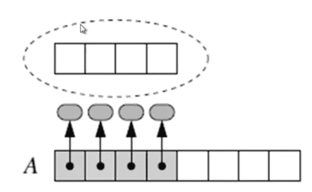
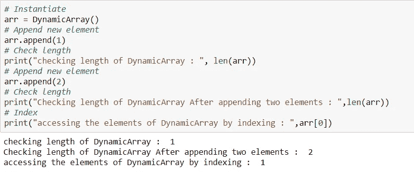

# Python 中如何实现列表

> 原文：<https://medium.com/analytics-vidhya/how-lists-are-implemented-in-python-9b055fbc8d36?source=collection_archive---------4----------------------->

在本文中，我们将看到如何使用基本数组在 python 内部实现列表。

在 list 中，我们不需要像在 array 中那样提前提到它的大小，如果我们继续添加元素，它的大小会动态增加，就像在上一篇[博客](/@manikanthgoud123/array-based-sequences-in-python-a62c4c3a6a06)中看到的那样，现在我们来看看动态数组在理论上是如何实现的。

# 动态数组实现:

在动态数组中，主要的关键是不要提供它的大小，它是通过以下步骤实现的:

步骤 1:分配一个容量更大的新阵列(让我们考虑 B)。

第二步:设 B[i] = A[i]，对于 i =0，1，…。n-1，其中 n 表示项目的当前数量。

步骤 3:设置 A=B 也就是说，我们从此以后使用 B 作为支持数组列表的数组。

步骤 4:在新数组中插入新元素。

让我们用更外行的术语来看实现动态数组。

如果当前数组(即 A)已满。创建一个两倍大小的新数组(即 B)

将 A 的元素存储在 b 中。

将引用 A 重新分配给新数组。

现在我们将创建自己的动态数组类！我们将使用一个名为 [Ctypes](https://docs.python.org/2/library/ctypes.html) 的内置库。查看文档以获得更多信息，但是它在这里基本上被用作来自 [Ctypes](https://docs.python.org/2/library/ctypes.html) 模块的原始数组。如果你发现自己对它非常感兴趣，可以去看看: [Ctypes 教程](http://starship.python.net/crew/theller/ctypes/tutorial.html)。

我们将一步一步地浏览代码

# `[ctypes](https://docs.python.org/3/library/ctypes.html#module-ctypes)`是 Python 的外来函数库。它提供 C 兼容的数据类型，并允许调用 dll 或共享库中的函数。它可以用来用纯 Python 包装这些库。

导入类型

我们将创建自己的类创建一个新的类创建一个新的*类型*的对象，允许创建该类型的新的*实例*。每个类实例都可以附加属性来维护其状态。有关课程的更多信息，请点击[此处](https://docs.python.org/3/tutorial/classes.html)。

类 DynamicArray():

**创建类的方法:**

def __init__(self):

__init__()是一个保留方法，也称为类构造函数。它在创建实例时执行。

self 类似于 java 中的这个关键字，它指的是正在创建的实例。

def __len__(self):

Python len()函数返回对象的长度。这个函数在内部调用对象的 __len__()函数。所以我们可以对任何定义 __len__()函数的对象使用 len()函数。

def __getitem__(self，k):

`__getitem__`用于实现类似`self[key]`的调用。

def _resize():

下划线前缀意味着*暗示*以单个下划线开头的方法是供内部使用的。这个惯例是在 PEP 8 中定义的[。](http://pep8.org/#descriptive-naming-styles)

def make_array(self，new_cap):

该方法用于创建新数组。

现在让我们创建一个我们类的实例，并在下面的代码片段中使用它，你可以看到一些由 list 完成的操作。

