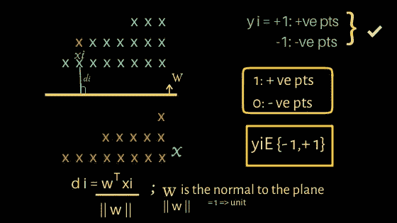
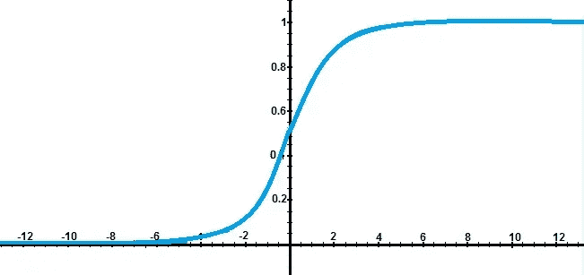
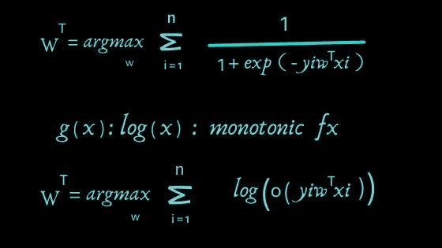
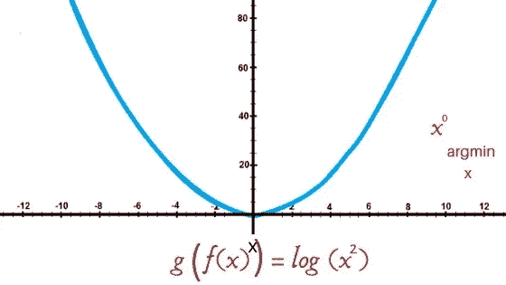
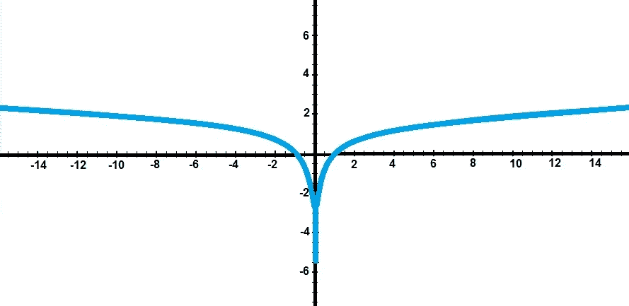
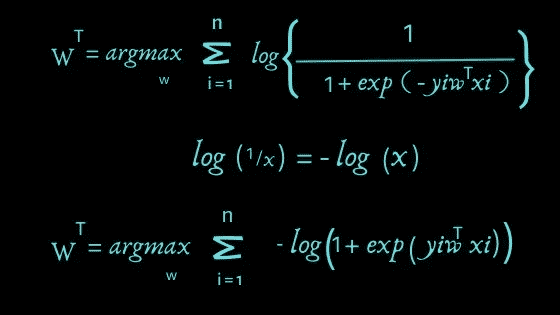
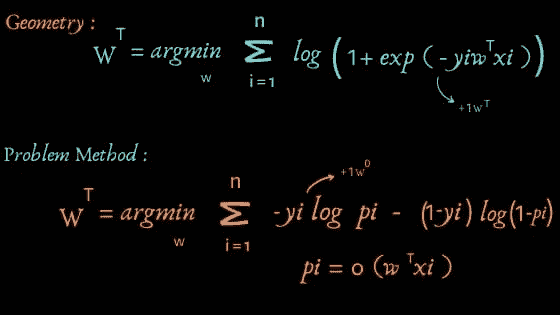

# 逻辑回归是如何工作的？

> 原文：<https://medium.com/analytics-vidhya/how-logistic-regression-works-c0d5a3949726?source=collection_archive---------12----------------------->

逻辑回归是基本的机器学习算法，与更复杂的 ML 算法相比，它承诺更好的结果。在这篇文章中，我很兴奋地写下它的工作原理。

> 出发

任何工作的机器学习算法都可以在几何空间中表示，因为它遵循基本的数学前提。请这样想，您的数据点设置在某个 n 维空间中，其中 n 是数据中的要素数量。下面的例子是在 2D 空间中，其中蓝色的代表一个等级，橙色的代表另一个等级。

*黄色*线代表一个平面，我们必须拟合该平面，使得该平面精确地划分两类数据点。让我们称这架飞机为 W^T(，因为我们要转置 w。

WT 垂直于平面，找到它是优化问题，因为我们需要执行强力分析，以查看哪个 WT 平面或 WT 矩阵的哪些值正确地分类了数据类，并且它必须拟合尽可能多的点，从而使它离数据点足够远。因此，当我们将 WT 乘以 Xi 时，我们得到输出 Yi。最佳或优化的 WT 平面给出了所有 f(X) = Yi*WT*Xi (i=1..n)为最大值。

下面是四种类型的案例，涵盖了易的正价值和负价值。

情况 1: Y*WT*Xi > 0 —当 WT*Xi > 0 且 Yi >0 时

情况 2: Y*WT*Xi > 0 —当 WT *Xi < 0 and Yi < 0

Case 3: Y*WT*Xi < 0 — when WT *Xi < 0 and Yi > 0 时

情况 4: Y*WT*Xi < 0 — when WT *Xi > 0 且 Yi < 0

如果你认为最大化 f(X) = Yi*WT*Xi 不是正确的方法。你是对的。为什么？

请允许我向您展示一个例子:)

假设我们在 2D 空间中有四个数据点 x1、x2、x3、x4，其中 x1 是正类，x2、x3、x4 是负类。

一些法线平面容易受到异常值的影响。怎么会？

以 4 个数据点 x1，x2，x3，x4 为例，对于一些低效的 WT，我们得到函数 f(X) = Y*WT*Xi 的 50，-1，-2，-3 个值。将其相加，我们得到 50 -1 -2 -3 = 44，但是如果只有 1 个点被正确分类，并且对于每一个其他的 WT，我们得到小于 44 的值。

再举一个例子，f(X)对于 4 个数据点，我们得到 28，1，2，3。但是总和是 34，其不容易受到异常值的影响，并且该值低于先前的值，因此找到了先前的法线平面，但是在这种情况下，所有四个点都被正确分类。

出于这个原因，我们使用挤压函数来惩罚较大的数字(异常值)并将范围限制在[0，1]

1/(1+e^-x):曲线图

选择 sigma 函数来压缩值的原因是它有两个属性:

1.概率解释

2.容易区分

因此，在应用挤压函数后，我们为找到最佳 WT 而求解的方程是:

argmax 最大化函数 f(X)。

几何上我们可以证明，如果 g(x)是单调递增的，那么 g(f(x))也是单调递增的。

示例:

F(x) = X 在 x = 0 时具有最小值

G(f(x)) = log(x)在 0 处也有最小值

简化原始方程后，我们得到:

