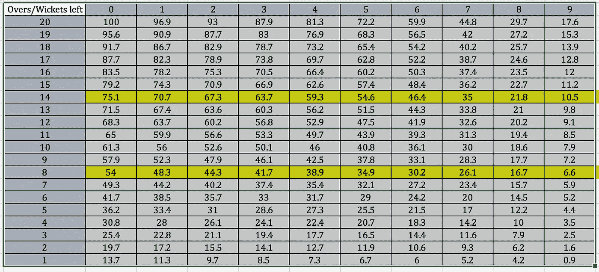
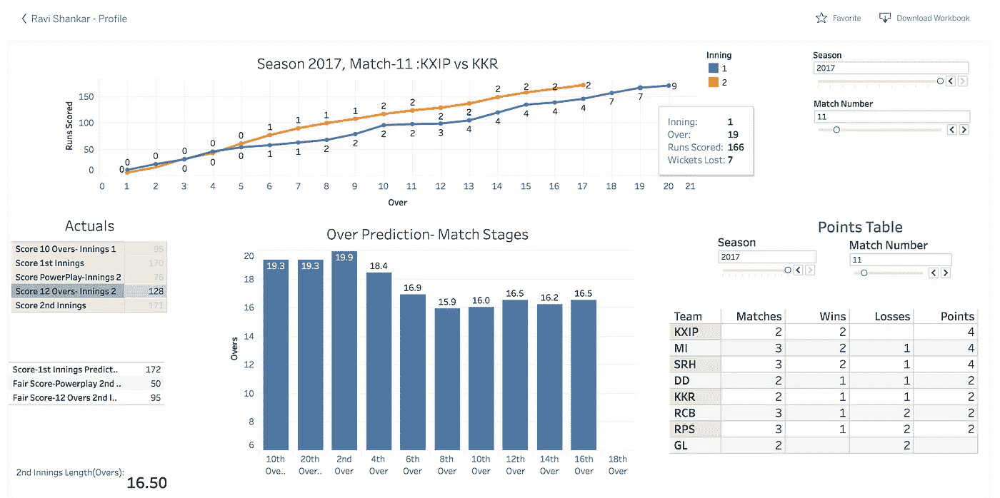

# 这场 IPL 比赛会持续多久？逐球数据的 ML

> 原文：<https://medium.com/analytics-vidhya/how-long-this-ipl-match-would-last-ml-on-ball-by-ball-data-6bbeca121549?source=collection_archive---------0----------------------->

Dhoni 女士可能会将比赛拖到最后，或者 Maxwell 可能会过早结束比赛，但在每局比赛后都会留下足迹/数据。这样的数据点被有意识地跟踪，经过 10 个赛季/636 场比赛/150461 个球，一个机器学习模型准备起飞。

只有多尼知道比赛什么时候结束，再也不知道了！

**问题陈述**:一场比赛的持续时间会影响广告收入，广播公司希望将最优质的库存放在最高评级(最大 TRP)的时段。即使最高评级的位置不能保证，广告库存也不应该浪费在提前完成的情况下。

**在攻击更大的问题之前回答问题——数据科学家道:**

1.  印度几点睡觉？
2.  电视观众在全神贯注于一局比赛之前的热身时间是多少？
3.  下午的比赛和晚上的比赛有什么不同？
4.  哪一个球队获得了最多的主场支持，比如 CSK 的钦奈队。
5.  球队的竞争在电视收视率上是如何表现的，例如米帅对 KKR
6.  积分表/锦标赛阶段在吸引比赛眼球方面扮演什么角色

**数据收集:**

1.  过去 10 个赛季的彩球数据。它有投球手、击球手、跑垒得分、三柱门(如果有的话)等等的细节。[https://www.kaggle.com/manasgarg/ipl](https://www.kaggle.com/manasgarg/ipl)
2.  从 BARC 收集的印度和邦的电视收视率。

使用 BARC 数据回答了所有的电视收视率问题，并使用逐球数据集来预测比赛长度。

**方法论:**

该模型建立在过去 636 场比赛的基础上，并创建了一个资源表，即击球队可用资源的 20*10 矩阵。R 中的保序回归用于基于过去的匹配模式生成表格。

预测分数的资源表

第一条黄线读作:如果击球队在 6 局结束时已经为 3 个三柱门得了 50 分，剩余资源为 **63.7%，即**该队在这一局中可以得 **50+63%*50/37%= 135** 分。这类似于 50 回合板球比赛中使用的杜克沃斯-路易斯系统，但被定制为更短的比赛形式。在此基础上，在第二局的每个关卡计算公平分数，并首先预测获胜者，然后是比赛时间。

我在:[https://public.tableau.com/profile/ravi.shankar1671#!主持了最终仪表板/viz home/IPL _ length prediction/Dashboard _ IPL](https://public.tableau.com/profile/ravi.shankar1671#!/vizhome/IPL_LengthPrediction/Dashboard_IPL)。

这是一个即插即用的公共数据库，包含所有比赛的数据、比赛的得分比较、实时积分表和各个比赛阶段的预测。

所有季节的仪表盘组合

该算法在> 90%的匹配中预测匹配长度在±2 范围内。模型中唯一的主要异常值是当 Dhoni 在 CSK 4 个检票口落后的情况下仍然需要 150+的得分，并将一场不太可能的追逐转换为最后的胜利。计划是将这个模型扩展到一个具有实时分数抓取功能的 web-API(下一篇文章),以便实时估计概率，并在下注时赚些钱！！