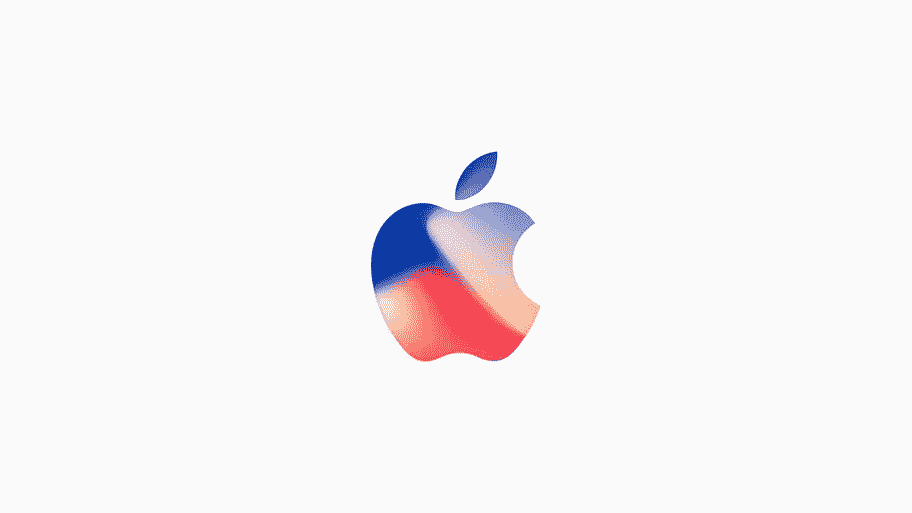
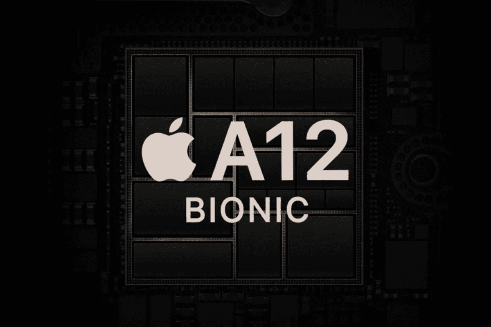
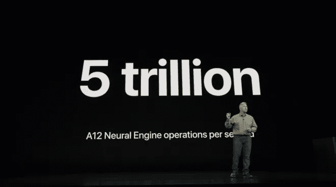
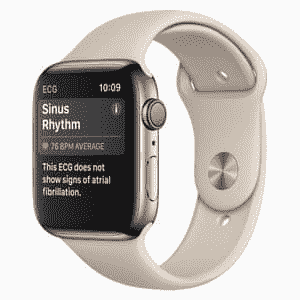

# 机器学习算法和硬件如何驱动苹果最新的手表和 iPhones

> 原文：<https://medium.com/analytics-vidhya/how-machine-learning-algorithms-hardware-power-apples-latest-watch-and-iphones-d306e1506e15?source=collection_archive---------3----------------------->

这是成为数据科学家的绝佳时机——所有顶级科技巨头都在将机器学习集成到他们的旗舰产品中，对这类专业人士的需求达到了历史最高水平。而且只会越来越好！

苹果一直是机器学习的主要倡导者，并在产品中加入了 FaceID、增强现实、Animoji、医疗传感器等功能。在昨天观看苹果的主题活动时，我不禁对他们开发的使用机器学习算法的新芯片技术感到惊讶。

在本文中，我们将了解苹果公司使用机器学习来丰富用户体验的一些方法。相信我，你将看到的一些数字会让你大吃一惊。

*如果你已经跃跃欲试，想在 iPhone 上使用苹果的 CoreML 构建你的第一个 ML 模型，请查看* [*这篇出色的文章*](https://www.analyticsvidhya.com/blog/2017/09/build-machine-learning-iphone-apple-coreml/) *。*

# A12 芯片

*来源:The Verge*

A12 芯片由苹果开发人员内部设计，具有比去年更先进的神经引擎(去年神经引擎在 A11 芯片中正式亮相)。A11 芯片为 iPhone X、8 和 8 Plus 提供动力，所以你可以想象为什么 A12 在机器学习社区中引起了轩然大波。

A12 使用小至 7 纳米的特征，而 A11 使用 10 纳米的特征，这解释了速度的加速。你真的认为苹果会让这件事过去而不提电池寿命吗？A12 芯片有一个智能计算系统，可以自动识别哪些任务应该在芯片的主要部分上运行，哪些任务应该发送到 GPU，哪些任务应该委托给神经引擎。

# 神经引擎是怎么回事？

*来源:苹果内幕*

神经引擎的关键功能有两个方面:

*   使用超快的面部识别算法来验证 Face ID。这种算法使用神经网络来绘制某些面部特征/点，当然已经在数百万张图像上进行了训练，以避免在真实产品中出错。至关重要的是，该算法将眼镜和人的头发等物理对象考虑在内，苹果公司表示今年将更加准确地做到这一点
*   来追踪 Animojis 的面部运动。与上面的描述类似，该算法映射某些面部特征，并实时将其转换为动物表情脸

今年的引擎有八个核心，这就是为什么**他的芯片可以每秒执行 5 万亿次运算**。去年的版本有两个内核，每秒可以进行 6000 亿次运算。这是技术在我们眼前快速发展的一个缩影。

神经引擎可以做得更多..

会帮助 iPhone 用户拍出更好的照片(一年能好多少？！).当你按下快门按钮时，神经网络会识别镜头中的场景类型，并明确区分图像中的任何对象和背景。所以下次你拍照的时候，只要记住神经网络必须有多快，在几毫秒内完成所有这些。

*在我们的“* [***计算机视觉使用深度学习***](https://trainings.analyticsvidhya.com/courses/course-v1:AnalyticsVidhya+CVDL101+CVDL101_T1/about) *”课程中，你可以学到所有关于物体检测和计算机视觉算法的知识！这是一个全面的产品，是对您的机器学习技能的宝贵补充。*

# 苹果手表

自从四年前首次亮相以来，Apple Watch Series 4 给人的感觉比任何时候都更像是一款健康监测设备。当然，所有的兴奋都是围绕着手表的设计，以及它如何比去年的产品大 35%。但是，让我们走出聚光灯，看看更有趣的功能之一——新的健康传感器。

这款手表配有心电图(ECG)传感器。你会问，为什么这很重要？首先，这是第一款包含这一功能的智能手表。但更重要的是，传感器不仅能测量你的心率，还能测量它的节律。这有助于监控任何不规则的节律，手表会在任何即将发生的危险情况下立即提醒您。这些传感器已经被 FDA 和美国心脏协会批准。

此外，这些系列 4 手表集成了改进的加速度计和陀螺仪。这将有助于传感器检测佩戴者是否摔倒。一旦有人摔倒并在 60 秒内没有任何移动迹象，该设备就会同时向多达五个(预先定义的)紧急联系人发出紧急呼叫。

我相信你现在一定已经猜到了所有这些更新的背后是什么？没错，就是机器学习。正如我在这篇文章中提到的，医疗保健已经成熟，可以采用机器学习的术语。有数十亿个数据点在发挥作用，将 ML 与领域专业知识相结合是头彩所在。我很高兴看到像苹果这样的公司利用它，尽管是在他们自己的产品中。

# 结束注释

苹果、谷歌和其他公司之间的竞争正在升温，人工智能和机器学习可能是赢得这场战斗的关键。硬件在这里至关重要，因为它每年都有重大升级，可以内置越来越复杂的算法。

*对这一切着迷，并在寻找一种开始学习数据科学的方法？今天就来试试我们的“***”课程吧！我们将帮助你迈出进入这个令人敬畏的新世界的第一步。**

*老实说，这是进入数据科学的最佳时机。快速浏览一下苹果的官方招聘信息，就会发现有 400 多个机器学习相关职位的空缺。问题是是否有足够多的有经验的人来满足这一需求。*

*你可以点击查看整个苹果事件[。](https://www.apple.com/apple-events/september-2018/)*

**原载于 2018 年 9 月 13 日*[*www.analyticsvidhya.com*](https://www.analyticsvidhya.com/blog/2018/09/how-machine-learning-hardware-and-algorithms-power-apples-latest-watch-and-iphones/)*。**