# 机器学习如何分组和预测客户的行为

> 原文：<https://medium.com/analytics-vidhya/how-machine-learning-group-and-predict-customers-behavior-1693616ab32b?source=collection_archive---------8----------------------->

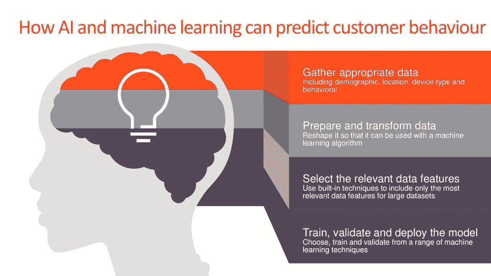

来自 Genesys 的保罗·奥德怀尔

机器学习已经成为支持人们自动化和扩展特定任务的过程和结果的流行工具，如[电子邮件过滤](https://towardsdatascience.com/how-i-used-machine-learning-to-classify-emails-and-turn-them-into-insights-efed37c1e66)和[网飞推荐引擎](https://becominghuman.ai/how-netflix-uses-ai-and-machine-learning-a087614630fe)。为了展示机器学习的能力和可扩展性，这篇文章将展示细分(非监督学习)和预测(监督学习)如何帮助德国邮购公司分析他们的客户和德国普通人群获得客户的过程。

# 项目介绍

该项目由贝塔斯曼 Arvato Analytics 的真实数据支持，贝塔斯曼 arva to Analytics 是一家国际活跃的服务公司，开发和实施创新解决方案，如 SCM 解决方案、金融服务和 IT 服务。

数据由四个数据集和两个 CSV 文件组成:

*   **Azdias:** 德国普通人口的人口统计数据(包含 891，211 个观察值和 366 个特征)
*   **客户**:德国邮购公司客户的人口统计数据(包含 191，652 个观察和 369 个特征)
*   **Mailout_train:** 作为营销活动目标的个人的人口统计数据(包含 42，982 个观察和 369 个特征)
*   **Mailout_test:** 作为营销活动目标的个人的人口统计数据(包含 42，833 个观察和 366 个特征)
*   这两个 CSV 文件包含有关特性解释和特性值分类的信息

这个项目的过程包括三个步骤:

1.  **数据预处理:** 流程的第一部分是确保数据是干净的，准备好被我们的算法分析。这一部分包括删除无信息特征和分解以及重新设计分类特征。
2.  **确定公司客户群:** 流程的第二部分是将客户的特征与德国人口特征进行比较。这是通过使用相同的细分标准对客户和人群进行细分，并从细分中得出结论来实现的。
3.  **预测客户转换率:** 流程的第三部分是创建一个模型，可以通过对公司营销活动的反应来预测个人是否成为客户。模型将首先在 **Mailout_train** 文件中进行训练；然后，模型将尝试预测给定特征在 **Mailout_test** 文件中的转化率。

为了知道我们的分割和模型的结果是否准确，我们需要有一个合适的度量来判断我们的结果:

来自[玻璃盒子](https://glassboxmedicine.com/2019/02/23/measuring-performance-auc-auroc/)的瑞秋·李

ROC AUC(曲线下面积)是一个指标，它将告诉我们模型预测正确结果的能力。模型越精确，模型曲线就越接近真实的正结果，反之亦然。ROC AUC 值为 0.8 表示该模型在 80%的情况下都会得到正确的结果。

*(技术说明:我们之所以使用这一指标，而不是我们通常使用的指标，如准确性和 F-beta 分数，也是因为我们认为我们的数据结果是不平衡的***(只有 1%的回复率))**

**(技术说明:也可以使用 PR 曲线下面积，而不是 RO 曲线下面积)**

*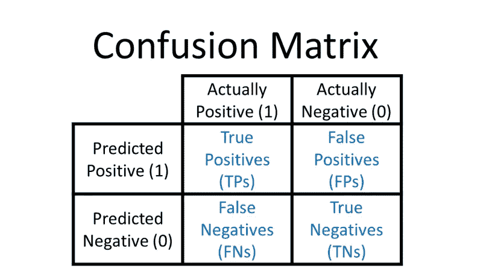*

*来自 [Glassbox](https://glassboxmedicine.com/2019/02/17/measuring-performance-the-confusion-matrix/) 的蕾切尔·李*

***真阳性率** = **真阳性** / **全部阳性** = **真阳性** / **(真阳性** + **假阴性)***

***假阳性率** = **假阳性** / **全部阴性** = **假阳性** / **(假阳性** + **真阴性)***

*ROC AUC 的完整公式也在上文提供。
关于分割，将使用 [EDA](https://towardsdatascience.com/exploratory-data-analysis-8fc1cb20fd15) (探索性数据分析)，因为我们将从分割结果中得出结论。*

# *数据预处理*

*我们将做两个主要部分来修复我们的数据集:移除或修复无信息列(许多丢失的值或没有描述的功能)以及重新设计[分类](https://stats.idre.ucla.edu/other/mult-pkg/whatstat/what-is-the-difference-between-categorical-ordinal-and-numerical-variables/)变量。*

*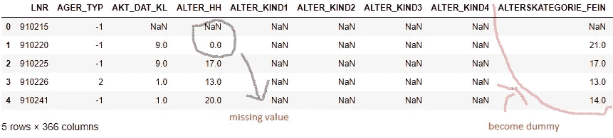*

*Azdias 数据集示例*

*处理无信息列/特征的第一步是，我们删除每个没有描述的列，例如上面的 LNR 列，因为它可能会妨碍我们解释结果。*

*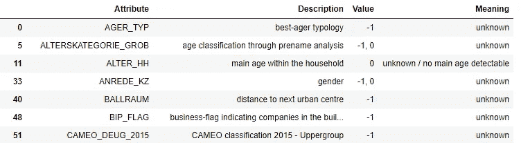*

*要素描述数据集示例*

*删除列后，我们将把 azdias 数据集中所有标为 unknown (-1 或 0)的值更改为 NaN(非数字)或缺失值。然后，我们删除有太多缺失值的每一列和每一行(阈值由离群值表示)。*

*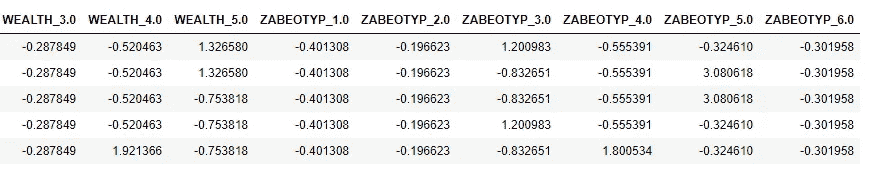*

*Azdias 数据集最终示例*

*之后，我们按照下面的流程得到上面的**阿兹迪亚斯**表:
1。删除与其他列提供相同信息的列
2。用列
3 的模式填充剩余的缺失值。为非二进制的分类列创建虚拟变量
4。将 CAMEO_DEUINTL_2015 等列修改为两个新列:WEALTH 和 LIFESTAGE
5。[重新调整所有列，尤其是带有数值的列。](https://towardsdatascience.com/scale-standardize-or-normalize-with-scikit-learn-6ccc7d176a02)*

**(技术说明:有许多* [*缩放方法*](https://www.kaggle.com/discdiver/guide-to-scaling-and-standardizing) *如标准缩放器和最小最大缩放器，您可以在监督学习的数据预处理中使用。在最小最大尺度数据中有比标准尺度数据更精确的算法，例如逻辑回归，反之亦然)**

*通过执行上述所有步骤，我们可以为 Azdias 和客户准备好干净的数据。*

# *客户细分*

*在这一部分，我们将做三个步骤:PCA(主成分分析)，聚类和解释。由于客户和 Azdias 的数据目前有 300 多列，我们希望减少一些影响较小的列。随着数据列/数据特征的增加，对其进行可视化和执行计算的难度也随之增加。我们可以使用主成分分析来减少特征，同时保留其方差。*

*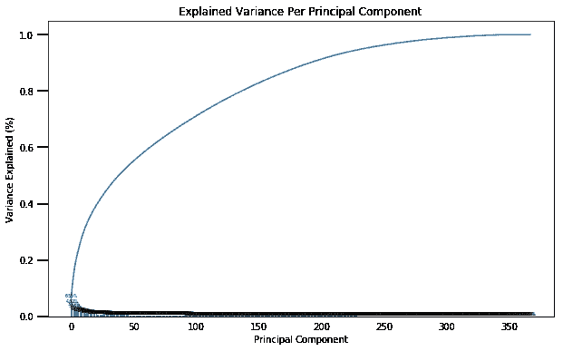*

*Azdias 差异由 350 多个组成部分解释*

*[PCA](https://www.dezyre.com/data-science-in-python-tutorial/principal-component-analysis-tutorial) (主成分分析)是一种通过产生主成分(最优加权观察变量的线性组合)来减少所需特征数量，从而使数据更简单的方法。这些组件像上面的图表一样排列，表示它们的方差，从最左边的开始，方差最大，而最右边的方差最小；因此，可以被丢弃*

**

*Azdias 方差由 200 个分量解释*

*在我们丢弃超过 150 个方差最小的组件后，我们仍然保留了 91%,而 366 个组件的方差为 100%。由于它仅减少了 9%的差异，我们决定仅使用 200 个组件。*

*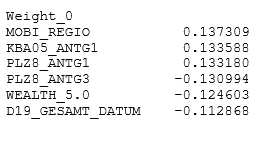*

*影响第一个组成部分的前 3 个(正面和负面)特征*

*我们可以通过查看哪些特性对组件的影响最大来表征每个组件。对于第一个组成部分，个人在某些地区具有低流动性和低住房密度的特征，以及贫穷和交易量低的特征。*

*在我们成功地创建了这些组件之后，我们将根据相似的特征对它们进行分组，并将它们分配到一个集群中。在这种情况下，我们将使用的聚类算法是 [K-means](https://www.analyticsvidhya.com/blog/2016/11/an-introduction-to-clustering-and-different-methods-of-clustering/) ，这是一种根据固定数量的聚类(K)进行分组的算法。*

*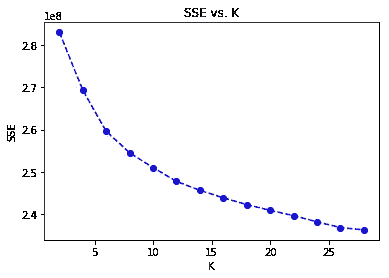*

*一定数量簇上的误差图*

*正如我们可以看到的，通过拥有大量的集群，误差不断减少；但是，如果有太多的聚类，数据可能会过拟合和不均匀聚类。确定聚类数的经验法则之一是查看误差减少不再显著的点(在此图中，约为 10)。*

*确定聚类数量后，我们将对 Azdias/人口数据和客户数据应用聚类。*

*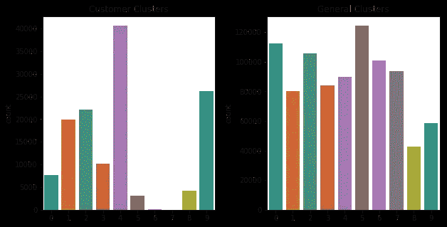*

*聚类之间的比较*

*正如我们在上面所看到的，在德国的顾客和普通人群中，集群的比例是不同的。如果与一般人群相比，客户数据的聚类中有更高比例的人，则表明该聚类中的人是公司的目标受众。另一方面，在一般人群中，聚类中的数据比例大于客户数据，这表明一组人在目标人口统计之外。*

*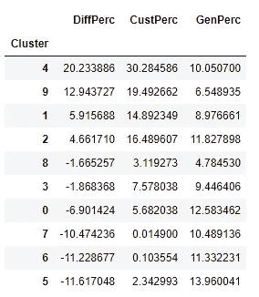*

*分类差异表*

*从左侧的表格中我们可以看到，目标客户位于聚类 4 中，在该聚类中差异最大。而最不可能成为公司目标客户的客户位于聚类 5，在聚类 5 中，客户和人口之间的差值最小甚至为负。*

*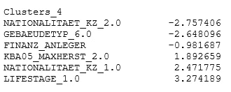*

*聚类 4 中的前 3 个(正面和负面)特征*

*公司的目标客户是拥有大众-奥迪汽车的德国本地人以及投资者的准家庭夫妇和单身人士。*

*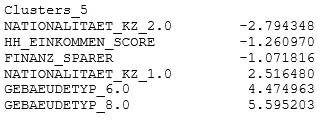*

*分类 5 中的前 3 个(正面和负面)特征*

*而聚类 5 中的个体是德国本地人，具有高收入和省钱的倾向，并且是公平供应的能源消费者。*

*通过无监督学习了解目标客户的特征，邮购公司可以调整其业务战略和营销活动，以适应新客户或保留其客户群。*

# ***预测客户转化率***

*在知道目标之后，邮购公司可以开发一个预测模型来预测客户的反应。建立监督学习模型的过程是:在 **Mailout_train** 文件中训练模型，选择算法并优化模型；然后，该模型将尝试预测在 **Mailout_test** 文件中给定特征的转化率/响应率。*

*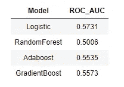*

*模型 ROC AUC 结果*

*根据训练结果，选择逻辑回归作为预测模型的算法，因为其 ROC AUC 得分最高。在我们知道我们将使用哪种算法之后，我们将通过调整它的参数来优化模型。*

*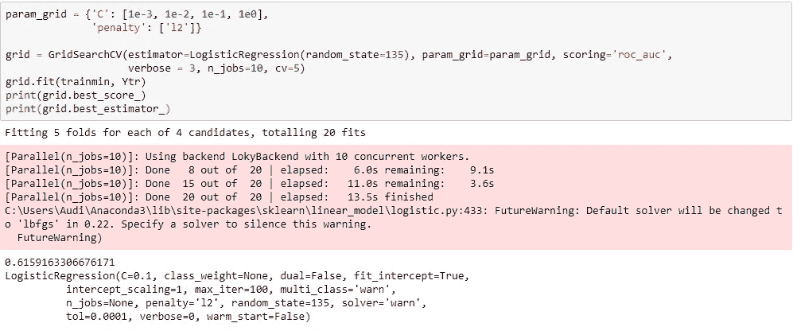*

*逻辑回归调整(改进后)*

*因此，我们通过给定用于调整的 C 参数(逆正则化参数)的范围来调整参数，以避免训练数据的过拟合。最后一步，我们将带有由 **Mailout_test 文件**给出的因子的预测提交给 Kaggle，并获得结果 0.56476(后来变成 0.63107)。*

*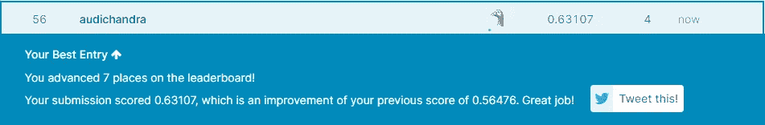*

*改进后的结果*

**(技术说明:在使用 MinMax Scaler 对数据进行不同的调整并删除异常值缺失值列后，ROC AUC 得分有所提高。这个 0.63107 的改进与我的 Github 中的过程有点不同)**

*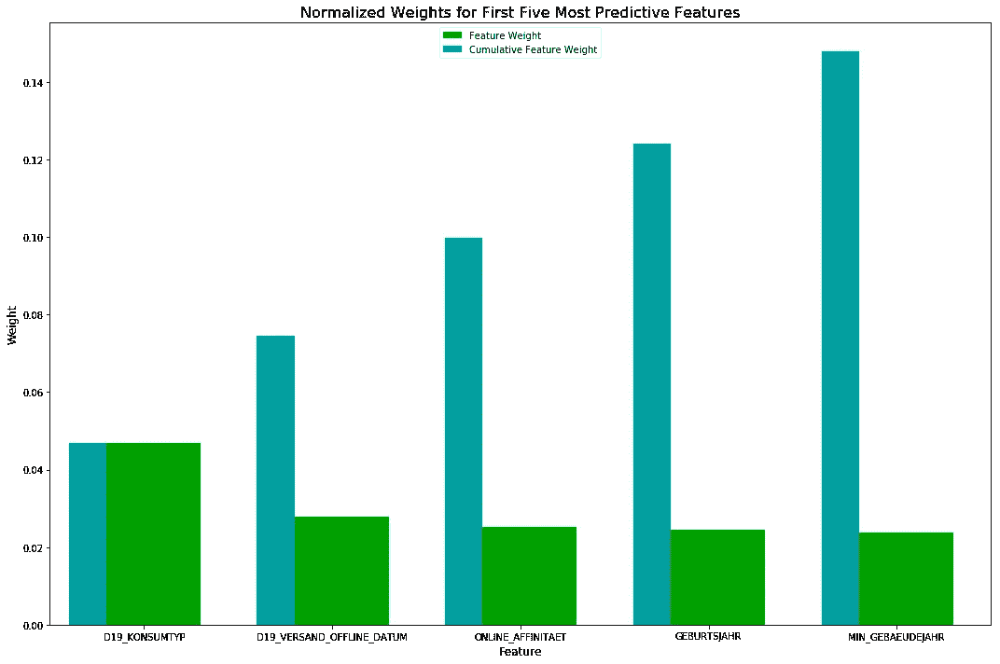*

*通过特征重要性模块，我们成功提取了 5 个最具预测性的特征，以确定客户对营销活动的回应率。这些因素是消费类型、邮购的线下交易、线上亲和力、年龄和他/她目前居住的房屋或建筑物的年龄。客户的消费越普遍，邮购的线下交易越少，在线活动的能力越高，以及就年龄和他/她所居住的当前房屋或建筑物的年龄而言越老，客户越有可能对营销活动/报价做出响应。*

# ***结论***

*在经历了所有这些过程之后，让我们总结一下机器学习能力:*

1.  ***无监督学习**是一种从**未标记**数据中得出结论的机器学习。最常见的无监督学习分析类型是聚类分析，我们试图收集覆盖尽可能多的**方差**的所有**必要**变量，根据它们的**共同**特征对它们进行分组并对它们进行分析。这种算法帮助我们**分组**他们的聚类，并提供他们的权重和方差，这使我们能够辨别德国邮购公司目标受众的**特征**。*
2.  ***监督学习**是一种机器学习，它学习了一个**函数**，该函数能够**基于**输入-输出结果**的另一个例子将**输入转换为输出。该算法需要首先被训练，随后可以被用于预测需要用选择的度量标准**评估**的结果。监督学习帮助我们**完善了**我们的功能，该功能可以根据之前的训练用给定的输入预测输出。该示例显示了我们以 63%的准确率成功预测了客户的回复率，这可以用作公司的和**评估**，以了解哪些因素对客户的回复率影响最大。*

*这篇文章旨在成为一个更简单的指南和一个例子，说明机器学习在支持我们完成任务方面有多么强大。希望上面所有的过程和结果至少可以给出机器学习的轮廓和目的。*

*这篇文章的作者还认为，所有的过程和结果都可以改善，这就是为什么所有的投入和反馈都是受欢迎的。作者还要感谢 Udacity 和 Bertelsmann Arvato Analytics 为我们提供了参与这个真实项目的机会。*

**你可以在*[*LinkedIn*](https://www.linkedin.com/in/audi-chandra-131a9864/)上和他联系*

**如果你想了解更多细节，请访问他的* [*Github*](https://github.com/audichandra/Data_Science_Capstone_Arvato)*