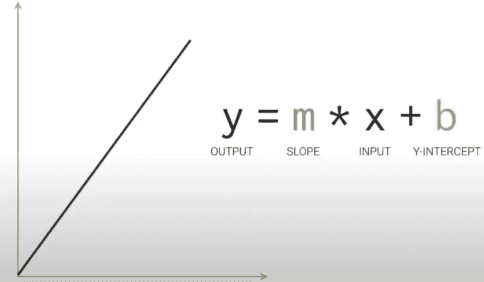
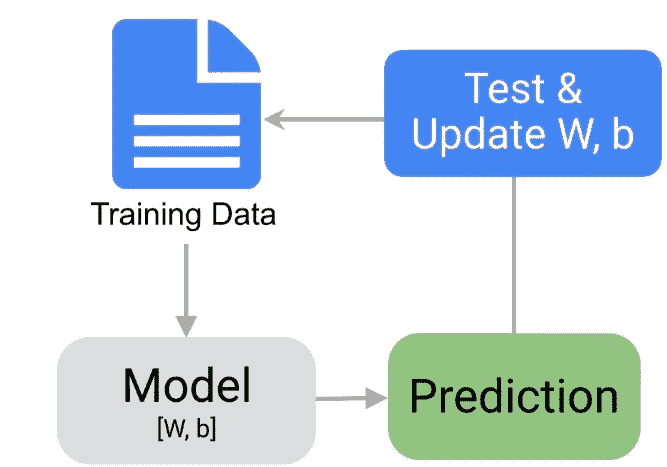
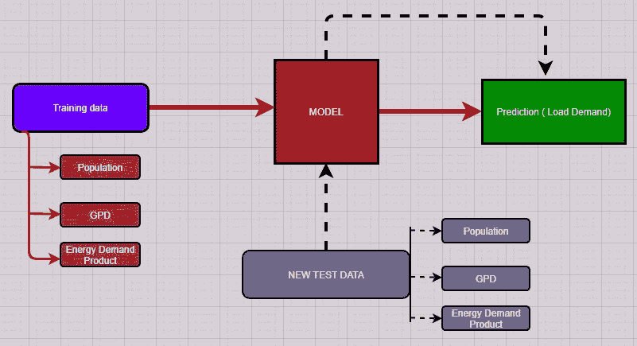

# 机器如何预测 ML 中的数据？

> 原文：<https://medium.com/analytics-vidhya/how-machine-predict-data-in-ml-89c061d0df3d?source=collection_archive---------18----------------------->

图:[带数据的训练机](https://www.bbva.com/en/machine-learning-how-its-used-in-banking/)

让我们从一个简单的例子开始，假设我们希望我们的机器预测未来 5 年的整体负载需求。我们知道，有一些因素可以用于负荷需求预测，如人口增长、人均收入增长、耗能产品的增长等。这些都可以成为预测负荷需求的变量。

现在，为了预测负荷需求，必须制作系统。首先，我们要做一个模型。 ***那么，模型是什么？*机器学习中的**模型是经过处理的数据的数学表示。 ***还有，我们为什么需要它？*** 需要一个模型来正确预测我们的数据，为此我们必须将训练数据输入到机器学习算法中。训练有素的模型只能给出可信的预测。

# 如何培养一个模特？

通过输入可用数据来训练机器学习模型。训练 80%的可用数据和 20%用于预测是很好的。 ***这和考驾照差不多，你训练自己越多，越有可能出现有驾照的司机。这就是所谓的数据准备。*** 有时我们需要另一种形式的数据调整或操作，如复制、规范化、纠错等。这些都属于你的模型的数据准备。

接下来，我们需要更加熟悉模型中使用的特征变量。

*假设您为 GPD 和人口收集了大量数据，而为能源需求产品收集了非常少的数据，那么在这种情况下，模型将向来自人口和 GDP 的更多训练数据倾斜。这可能会产生有偏差的数据结果。因此，平衡每个特征变量是非常重要的。*

望向一条直线的简单方程，**训练一个模型**

这是一个简单的直线方程。其中 **m** 为**(直线的斜率)，b 为 y 轴截距。**在机器学习中，有很多矩阵形式的 **m** (值的集合) **b** (偏差)。m 的矩阵(m1..mx)称为 W，(b1…bx)的矩阵在模型中表示为 b。

ML 算法的流程

这是该模式的总体运行情况。利用[W，b]方程设计模型，并提供 W 和 b 的测试值来预测产量。

# 如何为您的数据选择最佳模型？

多年来，数据科学家和研究人员创建了许多模型。一些模型适用于图像数据、数字数据、文本或音乐。查看您的数据和目标变量有助于模型预测。 ***同样，在负荷预测中，回归学习算法模型非常适合。在将预测归入几个类别的情况下，分类器模型可以很好地工作。此外，当需要预测有关室内能耗和电力监管的数据时，我们可以根据您拥有的*** 特征变量应用聚类或强化学习模型。

*当我们想预测形象、声音、性格等的时候。然后深度学习模型就来了。*

图:有数据和预测的机器学习模型

***在简单的理解中总结，机器如何预测:***

1.  收集数据
2.  准备数据
3.  选择模型
4.  训练模型
5.  评估模型的性能
6.  预测工作的准确性