# 机器如何“学习”——人工智能:解释者和例子

> 原文：<https://medium.com/analytics-vidhya/how-machines-learn-ai-explainer-and-examples-daa71a472716?source=collection_archive---------27----------------------->

## 打开神经网络

来源:https://images7.alphacoders.com/925/thumb-1920-925903.jpg

沃利在哪？让我们扫描这些面孔:“不不不不不不不..是啊！”从你的眼睛接受视觉刺激，你可以联想到人海中的面孔是否属于你要找的人。

你刚刚执行了一个功能来识别一张特定的脸——[，这是我们在](https://www.theguardian.com/science/2018/oct/10/how-many-faces-average-person-recognises-5000)进化上所擅长的。你的智能手机可能具有面部识别解锁功能，该功能基于一个**神经网络**，该网络将你的面部图像映射到你的身份。**神经网络**是一种将给定输入映射到期望输出的数学函数。

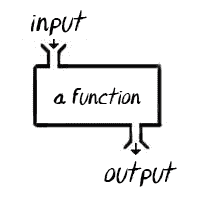

来源:[微积分用 pics 和 gif 讲解](https://0a.io/chapter1/calculus-explained.html)

那么神经网络是如何学会做到这一点的呢？就像试图让一只狗去捡东西一样，我们必须训练它！

用于比较目的；一个蹒跚学步的孩子在看到一两个例子后，可能有能力知道什么是小狗..
然而，数据饥渴的**神经网络**在训练期间看到多达数万个样本后，需要花费大量时间和精力来学习特定类别的特征表示。

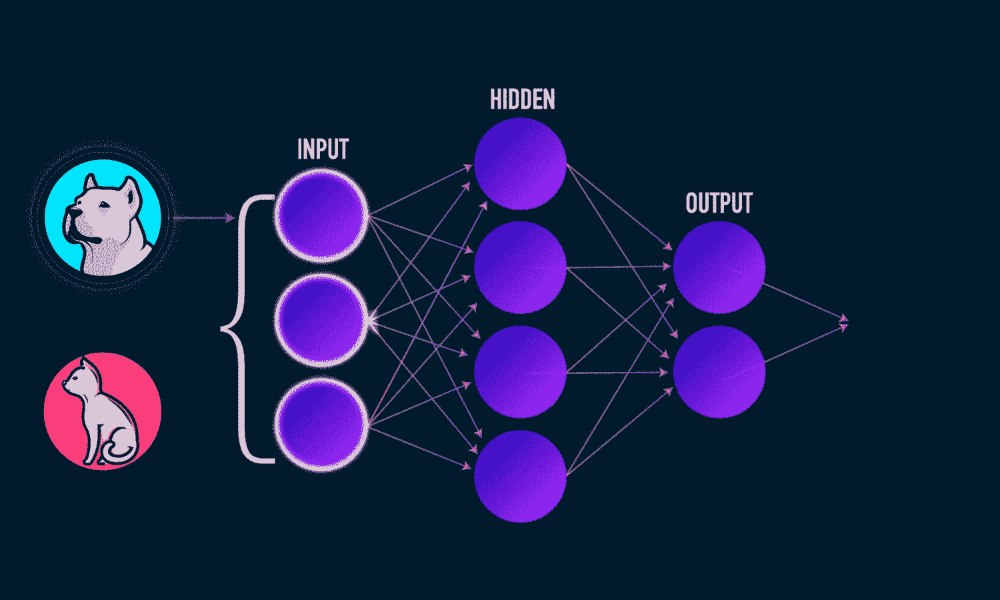

来源:[https://analyticsindiamag . com/how-to-create-your-first-artificial-neural-network-in-python/](https://analyticsindiamag.com/how-to-create-your-first-artificial-neural-network-in-python/)

这太疯狂了。你所说的训练是什么？训练一个**神经网络**有两个主要组成部分。
首先，我们有**正向传播**，在开始时，这基本上是对正确答案/输出可能是什么的猜测。在我的第一篇文章中，我也谈到了这是如何发生在计算机视觉中的。

然后，我们将猜测的正确性(或错误)与实际答案进行比较，并在此基础上，递归地向后更新网络的部分，以便未来的猜测更加准确。这一步称为**反向传播。**

经过多次迭代，我们的网络在猜测正确答案方面变得越来越好..有人甚至会说它在做预测！；o

请记住，神经网络背后最初的[直觉是松散地复制大脑中神经元的放电，加强特定序列神经元对给定刺激的放电。](http://aris.onl/intuitive-neural-nets/)

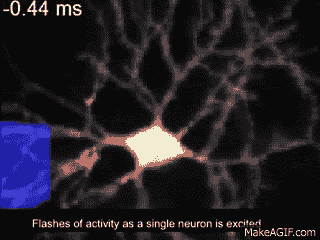

来源:[https://I . pinimg . com/originals/23/B1/1b/23 b 11 ba 3 f 0760 CD 585 e 5692 BCA 858 ed5 . gif](https://i.pinimg.com/originals/23/b1/1b/23b11ba3f0760cd585e5692bca858ed5.gif)

让我们介绍一下神经网络的组成部分:

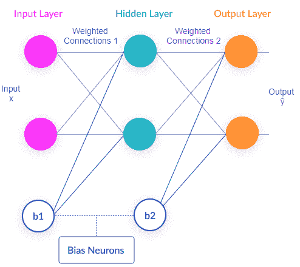

来源:[https://missing link . ai/guides/neural-network-concepts/neural-network-bias-bias-neuron-over fitting-under fitting/](https://missinglink.ai/guides/neural-network-concepts/neural-network-bias-bias-neuron-overfitting-underfitting/)

*   输入层， **x**
*   隐藏层
*   输出层， **ŷ**
*   加权连接， **Wᵢ** 和偏置， **bᵢ** 各层之间

你可以看到这些连接成一个[非循环图](https://www.statisticshowto.com/directed-acyclic-graph/)，其中每一层的神经元都有加权连接——突触[到下一层。这些权重放大或抑制其输入的响应。](https://en.wikipedia.org/wiki/Synapse)

此外，我们没有计算输入层，所以你在上面看到的图是一个两层的神经网络；我们有一个输出层和一个隐藏层。

至于单个神经元的输入，它的作用是:

1.  将输入乘以权重
2.  将这些值相加，然后加上偏差
3.  通过激活函数传递整个值

那就是**正向传播**！我们所做的是通过我们的网络传递输入值，得到一个输出值，瞧。

对于那些对这背后的微积分更感兴趣的人，你可以看看底部的附录。

现在，我们确定模型输出ŷ与实际值 y 的接近程度。为此，我们使用**损失函数**。一个简单的**损失函数**是对我们的样本取误差平方和:

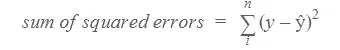

回想一下，在训练中，我们希望优化权重和偏差，以**最小化损失函数**。为此，我们使用一种叫做**梯度下降**的流行方法将误差向后传播。对于感兴趣的人，这背后的计算将在附录中讨论。

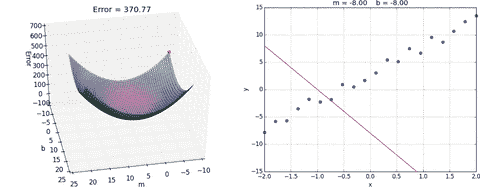

来源:[https://media.giphy.com/media/O9rcZVmRcEGqI/giphy.gif](https://media.giphy.com/media/O9rcZVmRcEGqI/giphy.gif)

利用**梯度下降**，我们**通过我们的模型**神经网络**反向传播**误差，以更新权重和偏差，这递增地减少我们损失函数的误差，直到我们不能再这样做，达到局部最小值。

同时还有其他可以考虑的细微差别，例如学习率、过拟合、标准化等..还有更多的事情要做。我们刚刚经历了一个**神经网络**如何能够“学习”一个接受输入并将其映射到所需输出的函数！

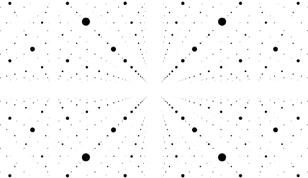

来源: [Hello 神经网络——理解神经网络的初学者指南](/praemineo/hello-neural-network-the-beginners-guide-to-understanding-neural-networks-b9b2e9c18c83)

现在是例子！在我们的日常生活中，我们的互动可能比我们想象的要多，而且这种互动在未来可能会增加，下面是一些例子:

**有针对性的广告:**使用你的细节和信息作为输入参数，比如年龄、性别和位置，人们可以训练一个神经网络来确定哪些广告将与[个性化营销](https://www.thinkwithgoogle.com/marketing-resources/ai-personalized-marketing/)有最高的参与度。

**自动化聊天机器人:**在线聊天体验中更快的交互，以回答您的问题并升级用户体验。这属于自然语言处理领域，由微软提供服务。

**信用评级:**甲骨文在他们的[博客](https://blogs.oracle.com/datascience/using-the-artificial-neural-network-for-credit-risk-management)中写道，确定个人客户的风险是可能的。

**财务预测:**愿意利用神经网络进行投资的投资者希望获得竞争优势，这样的公司之一是 [TwoSigma](https://www.twosigma.com/) 。

**欺诈检测:**许多处理各种交易的公司都可能不得不处理欺诈交易。为了领先一步，组织可以利用[神经网络来检测异常](https://iopscience.iop.org/article/10.1088/1757-899X/263/4/042039)。

厉害！我们坚持到了最后！

来源:https://media0.giphy.com/media/fxtEUQIqolzxSaxVSF/giphy.gif

在我之前的两篇文章中有更多关于计算机视觉的例子:

*   [计算机视觉人工智能:解释者和例子——分析 Vidhya](/analytics-vidhya/computer-vision-ai-explainer-and-examples-1666b089263a)
*   [Deepfake AI:解释器和例子——分析 Vidhya](/analytics-vidhya/deepfake-ai-explainer-and-examples-6d9e4bec55c0)

更多资源:

*   [用 Python 构建自己的神经网络！](https://towardsdatascience.com/how-to-build-your-own-neural-network-from-scratch-in-python-68998a08e4f6)
*   [更详细地了解反向传播](https://www.youtube.com/watch?v=Ilg3gGewQ5U&feature=youtu.be)

感谢阅读，希望你学到了一些东西！还有❤❤·卡尔文和维纳斯。

数据科学家 Steven Vuong

欢迎对下一篇文章的评论、反馈和建议。
[stevenvuong96@gmail.com](mailto:stevenvuong96@gmail.com)
[https://www.linkedin.com/in/steven-vuong/](https://www.linkedin.com/in/steven-vuong/)
https://github.com/StevenVuong/

**附录:
数学棉花糖的正向和反向传播背后的更多演算**

首先，我们有**正向传播**。为了更好地解释这一点，我们可以先看看单个神经元如何接受输入并产生输出 **:**

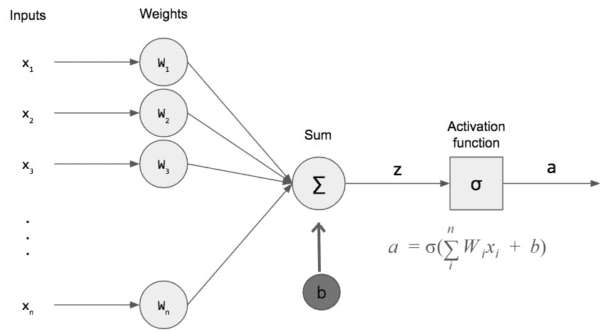

来源:[https://python machine learning . pro/WP-content/uploads/2017/09/Single-perceptron . png . webp](https://pythonmachinelearning.pro/wp-content/uploads/2017/09/Single-Perceptron.png.webp)

我们在上面看到的是输入乘以权重并与偏差相加。然后，这些信号通过用 sigma 表示的**激活函数**，以产生输出。

一个常用的**激活函数**是 sigmoid 函数:

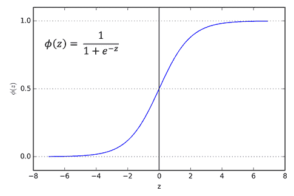

来源:[https://miro . medium . com/max/970/1 * Xu 7b 5y 9 gp 0 il 5 oobj 7 ltww . png](https://miro.medium.com/max/970/1*Xu7B5y9gp0iL5ooBj7LtWw.png)

一个重要的特征是它在任何点都是可微的，这意味着我们可以确定沿 z 轴任意两点之间的斜率。

**激活函数**需要将[非线性](https://ai.stackexchange.com/questions/5493/what-is-the-purpose-of-an-activation-function-in-neural-networks)引入我们的模型。

因此，对于初始输入 x₁，我们的第一层输出是第一层权重乘以输入，并与偏差相加，然后将其插入我们的激活函数。

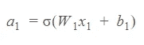

由于我们的第一层输出与第二层输入相同，我们可以说:

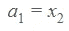

给我们第二层输出:

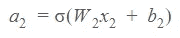

因为我们的第二层是最后一层，我们有:

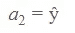

兵棒嘣！将这一切拼凑成我们的双层**神经网络**，我们有:

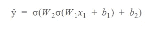

这给了我们模型输出ŷ，万岁！

在我们继续之前，gif 中断！

来源:[https://media 1 . tenor . com/images/1e 977363 e 546d 3020 a 09062593852840/tenor . gif？itemid=5631613](https://media1.tenor.com/images/1e977363e546d3020a09062593852840/tenor.gif?itemid=5631613) ..五个人请赞助我

回想一下，我们使用误差平方和作为损失函数**:**

对于**反向传播**，我们使用[链式法则](https://www.khanacademy.org/math/ap-calculus-ab/ab-differentiation-2-new/ab-3-1a/a/chain-rule-review)来计算相对于我们的权重和偏差的偏导数，以便相应地调整它们。这些允许我们在多个步骤中确定成本函数的局部最小值。为此，我们使用**梯度下降**。

因此，作为确定 W₂更新量的示例，我们可以计算:

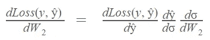

最后，我们可以更新参数 W₂:

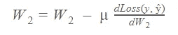

其中μ是我们想要调整 W₂.的程度这就是所谓的[学习率](https://machinelearningmastery.com/understand-the-dynamics-of-learning-rate-on-deep-learning-neural-networks/#:~:text=Learning%20Rate%20and%20Gradient%20Descent,-Deep%20learning%20neural&text=Specifically%2C%20the%20learning%20rate%20is,is%20adapted%20to%20the%20problem.)。将同样的原理应用于 b₂，然后是我们的第一层参数 W₁和 b₁，我们完成了一个完整的训练[时期](https://deepai.org/machine-learning-glossary-and-terms/epoch)！

来源:[https://media 1 . tenor . com/images/e0a 669626522 df 539 e 2 C3 cced 9454700/tenor . gif？itemid=8102486](https://media1.tenor.com/images/e0a669626522df539e2c3cced9454700/tenor.gif?itemid=8102486)