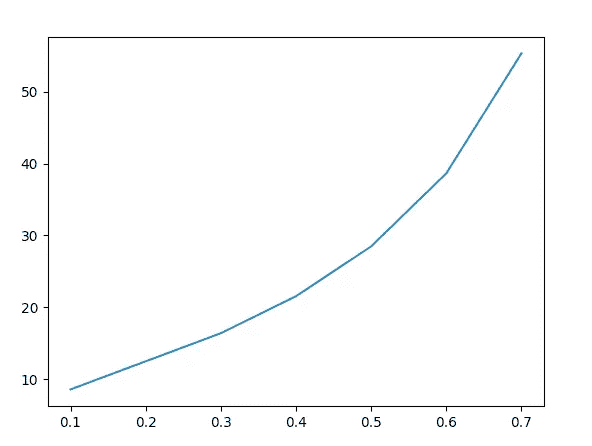

# 一个独特的人需要多少个维度？

> 原文：<https://medium.com/analytics-vidhya/how-many-dimensions-until-there-is-only-one-3e45f8ce4dcf?source=collection_archive---------14----------------------->

x 轴显示每个维度的概率，y 轴显示维度的数量。这条线代表多少个维度。假设他们每个人都有相同的概率，它需要到达美国个人吗

如果你考虑几个事件的联合概率，或者在这种情况下，我们称每个事件为一个维度，并假设个体是由我们在某个时间点可以测量的维度组成的。在我们的例子中，一个维度将是更广泛的动物和更具体的人类维度。维度可以是人口统计学(年龄和性别)，生物学(基因或神经递质…