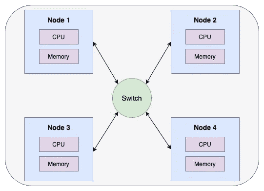
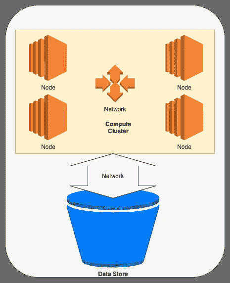
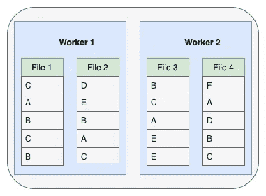
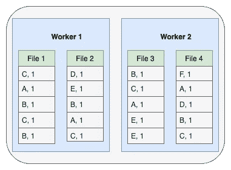
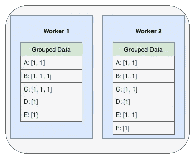
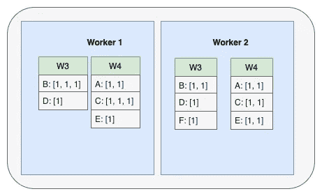
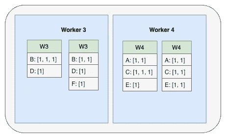
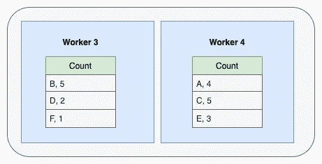
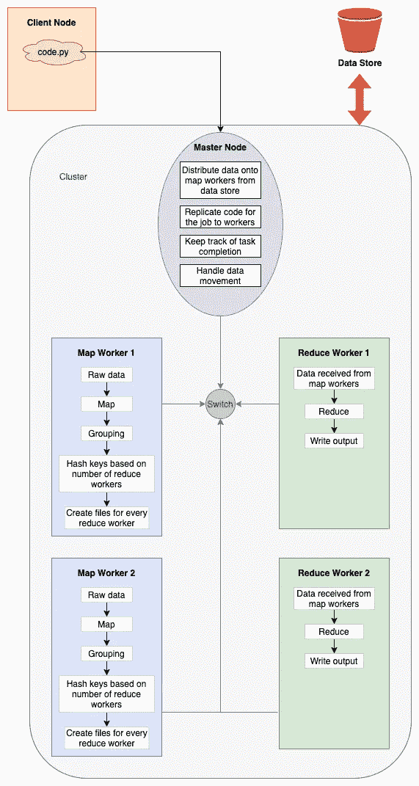

# Map Reduce 如何让你轻松应对 Pb 级

> 原文：<https://medium.com/analytics-vidhya/how-map-reduce-let-you-deal-with-petabyte-scale-with-ease-151fd00b8d1c?source=collection_archive---------10----------------------->


Map Reduce 是当今世界用于分析和操作 Pb 级数据集的系统(Spark、Hadoop)的核心思想。了解核心概念有助于更好地理解为什么这些系统在特定阶段对数据执行特定操作。这反过来有助于在使用这些系统处理数据时设计高效的流程。为什么在连接前使用 user_id 对数据进行重新分区。为什么人们被告知要尽可能避免减少任务(是的，这很贵，但是多少和为什么)。
本文的目标是**通过一个字符频率计数的例子来理解 MapReduce 系统是如何工作的。**

# 内容

*   分布式系统抽象
*   MapReduce
*   获取分布式系统中字符的频率
*   MapReduce 系统架构
*   可量测性
*   关于优化的思考
*   资源

# 分布式系统抽象

在这里，我将给出一个分布式系统的抽象，它足以理解后面的章节。我将隐藏在这些系统的制造/工作中出现的大部分复杂情况。



分布式的计算机系统

**节点**代表一台拥有一些**计算**资源(处理器)和一些**存储**资源(RAM、硬盘)的计算机。开关和箭头表示节点通过网络连接并且可以相互通信以传递数据和指令的事实。

暂时**我们将假设节点不会失效**并且**网络总是可达的**并且具有足够的带宽不会导致任何拥塞。

下图说明了处理数据的系统的一般情况。



关于数据如何驻留在世界上的最常见场景

数据存在于一些存储中([亚马逊 S3](https://aws.amazon.com/s3/) 、 [Azure 存储账户](https://docs.microsoft.com/en-us/azure/storage/common/storage-account-overview) ) ( *S3 只是一堆专门设计来存储数据的计算机*)，我们有一些计算节点可以让这些数据做所需的操作，在某些情况下还会将其写回存储。云服务提供商也提供同时具备计算和存储功能的系统([亚马逊红移](https://aws.amazon.com/redshift/?whats-new-cards.sort-by=item.additionalFields.postDateTime&whats-new-cards.sort-order=desc))，但如果系统不是以高[吞吐量](https://en.wikipedia.org/wiki/Throughput)使用的话，这是相当昂贵的。在这种情况下，最好启动计算集群，完成计算，然后关闭集群。

因此，上面的想法是从存储中获取数据，并将其分布在具有自己的存储空间的计算群集节点上，然后对该数据进行计算，并将结果发送回存储。

# MapReduce

顾名思义，MapReduce 有两个任务。

*   **映射任务:**对数据进行一些运算， ***对数据形成键值对*** 。
*   **Reduce Task:** ***对于一个特定的 key 取所有的值*** 并对这些值应用一些运算。

就这样吗？不尽然！让我们用一个例子来理解这个系统的工作原理。

# 获取分布式系统中字符的频率

问题很简单，我们在一个分布式系统中有多个文件，每行包含一个字符，我们想知道一个字符在整个文件集中出现了多少次。

在整个部分中，我将描述需要完成的操作。在下一节中，我们将了解是什么承担了这项工作，以及它是如何完成这项工作的。请注意，高效地应用操作并不是目标。而是要了解需要进行哪些操作。

在阅读之前，许多优化会浮现在脑海中，而在实际系统中，大多数优化会被实际应用。唯一要注意的是，随着这些优化而来的是一些复杂性，我们在这里不想转移我们的思想去弄清楚如何使这些工作。我已经介绍了一个部分来讨论其中的一些。

*   **初始数据:**下图显示了计算集群中的数据，我们的集群中有两个工作节点(我们将这些节点称为`Map workers`，因为这些工作节点将负责对数据执行映射任务),它们包含两个文件，每个文件每行一个字符。



原始数据

*   **Map:** 为每个字符创建一个键值对，其中 key 是字符本身，value 始终为 1。



在对整个数据应用映射操作之后

*   **分组:**上面我们得到的数据有很多重复的键，所以让我们把这些键组合起来，创建一个包含所有与那些键相关的值的列表。我们将组合文件中的内容，以获得每个工人的单个文件。



这里的问题是`Worker 1`不知道键`A`是否存在于其他地方。因此，基于它所拥有的数据，它不能说出那个字符的确切数目。我们想到的解决方案是，让我们将所有数据发送给一个工人，该工人可以做进一步的汇总以获得最终结果。这种方法的问题是，**数据可能太大，无法在单个系统上运行**和**在此期间，另一个系统会做什么？**

如果我们可以在两个工人之间分担几乎相等的工作，我们可以将必须发送的数据量减少一半，同时并行计算数据，从而将花费的时间减少一半。这是一个双赢的局面，但如何实现这一点呢？

让我们考虑一下，我们已经为这个作业生成了另外两个工人`Worker 3`和`Worker 4`(我们将这些工人称为`Reduce Workers`，因为这些工人将对数据执行 reduce 任务)。

现在我们知道数据需要在两个系统上共享，现在让我们根据数据应该发送给哪个工人的键进行选择。**我们希望确保只有一个键的数据只属于一个工人。**想到的是 [**哈希函数**](https://en.wikipedia.org/wiki/Hash_function) **。在应用散列函数之前，让我们将字符转换成数字，这将使我们更容易构造散列函数。为此，让我们考虑一个字符的 ASCII 值**

设哈希函数为`(ASCII value for the character) mod 2`。如果值为 0，我们发送到`Worker 3`，如果值为 1，我们发送到`Worker 4`(如果我们有`n`减少工人，我们可以将`mod 2`改为`mod n`)。

```
A: 65 (65 mod 2 = 1): Worker 4
B: 66 (66 mod 2 = 0): Worker 3
C: 67 (67 mod 2 = 1): Worker 4
D: 68 (68 mod 2 = 0): Worker 3
E: 69 (69 mod 2 = 1): Worker 4
F: 70 (70 mod 2 = 0): Worker 3
```

该操作后的数据如下所示，对于每个 reduce 工作线程，在 map 工作线程上创建一个单独的文件，然后将这些文件发送给 reduce 工作线程，以应用 reduce 操作。



地图工作者中用于减少工作者的文件

`Worker 3`和`Worker 4`处的数据如下:



在 reduce workers 收到的数据文件

*   **Reduce:**Reduce 函数将获取一个键的所有值，并将这些值相加。例如，在键`B`的`Worker 3`处，我们将从两个文件中获取值

```
B: [1, 1, 1] sent by worker 1
B: [1, 1] sent by worker 2
```

reduce 函数将接受这个键，并对这些值求和，输出 5。下图显示了最终输出



应用归约操作后的输出

上面的输出可以写到一些外部存储器中，在那里它可以合并成一个文件或者保存为两个文件部分。

# MapReduce 系统架构

这里，我将描述一种可能 map reduce 系统架构。不同的系统会围绕这个基本架构有所不同。



*   **主节点:**主节点负责**监控**和**管理**其他节点。主节点知道有多少 map worker 和有多少 reduce workers。它知道所有需要的细节来与它们交流。创建集群的用户通常可以配置工人的数量或不同类型。图中列出了该节点的职责。客户机(用户)将与主节点连接，并将发送包含定义 map 和 reduce 操作的函数(或某些情况下的对象)的代码。主节点将获取该代码，并将其发送到工作节点，以便工作节点根据分配的角色(映射工作器/归约工作器)知道对给定数据执行什么代码。主节点还负责最初将数据分发到 map worker 节点。地图工作者完成任务后。主节点将触发向缩减器节点的数据推送(也可以是从缩减器节点的拉取)。
*   **Map Node:** Map node 负责获取初始数据，形成可供 reducer 函数使用的键值对。地图工作者将获得所需的信息，了解要为 reduce 工作者创建多少个文件作为输出。它的输出是每个 reducer 的文件。
*   **Reduce 节点:** Reduce 节点负责对它从 map 节点接收的数据应用 Reduce 函数。一旦生成输出，就可以根据需要将该输出发送到数据存储或主节点。
*   **客户端节点:**客户端节点是开发人员编写代码的节点，通过向集群中的主节点发送代码来触发集群中的作业。

# 可量测性

在 map 或 reduce 任务期间，工作节点不必关心其他节点上的数据。这种独立性使得并行计算更容易，因为我们不必担心会导致死锁或降低执行速度的锁或共享数据。在一个 worker 中，我们通常会有几个内核，每个内核可以运行多个线程。我们可以创建足够数量的小文件(分区),以确保所有这些资源都得到利用，从而最大限度地提高吞吐量。在应用地图任务之前，数据不必跨集群移动。需要将数据分发给 reduce workers 以应用 reduce 任务，从而确保特定键值在一个位置。

这种方法的可扩展性来自于这样一个事实:如果数据增加，我们需要做的就是创建更多的数据分区，增加 Map 的数量，减少工作人员。数据将分布在多台机器上，因此更多的工作将并行完成。

需要注意的一点是，增加 reduce worker 的数量可能不是一个好方法，因为在 map worker 上会创建太多的文件(因为 map worker 为每个 reducer 创建一个文件)，这可能会导致在网络上发送的文件中只有很少的数据供 reduce worker 在吞吐量下降时使用。

# 关于优化的思考

正如我们可以注意到的，在发送 reduce 任务的数据之前，我们可能已经合计了这些值。这将减少需要发送的数据量，从而减少员工数量。这里要注意的一点是，对于这个 **reduce 函数需要是**[](https://www.mathsisfun.com/associative-commutative-distributive.html)****。**因此，我们要做的只是将 reduce 函数应用于在 map workers 中为 reduce workers 生成的文件。或者让我们的地图功能复杂到可以进行这个操作。**

**映射和缩减工作线程是分开的。但是使用相同的工人来应用地图以及减少任务是可能的。这样，我们就可以在计算和存储方面利用整个集群。这样做还会减少需要通过网络发送的文件数量。这将减少通信成本，从而减少完成工作所需的时间。**

**以表格方式创建文件对于执行操作可能并不理想。我们可以考虑用其他格式(JSON， [Parquet](https://parquet.apache.org/documentation/latest/) )来存储中间阶段的数据，这种格式允许像 map 和 lists 这样的存储结构，提供了更有效的数据访问。我们还可以对数据执行编码和压缩，以减少所需的存储空间，同时减少需要通过网络发送的数据量。**

**我们可以尝试将大部分数据保存在主内存(RAM)中，而不是创建文件，因为我们知道，与当今高质量的磁盘相比，主内存的访问速度通常要快 10 到 20 倍。Spark 确实使用了这种优化，并且通过使用这种优化以及超出本文范围的许多其他优化，赢得了 [Daytona GraySort 竞赛](https://databricks.com/blog/2014/11/05/spark-officially-sets-a-new-record-in-large-scale-sorting.html)。这是关于大数据排序的，它击败了 Hadoop，使用少于 10 倍的机器以 3 倍的速度完成任务。**

# **资源:**

*   **【http://infolab.stanford.edu/~ullman/mmds/ch2n.pdf **
*   **[https://gist . github . com/GL meice/b 00 c 9c 97 a 06 a 957 af 7426 B1 be 5 BC 8 be 6](https://gist.github.com/GLMeece/b00c9c97a06a957af7426b1be5bc8be6)**
*   **[https://Hadoop . Apache . org/docs/current/Hadoop-MapReduce-client/Hadoop-MapReduce-client-core/MapReduce tutorial . html](https://hadoop.apache.org/docs/current/hadoop-mapreduce-client/hadoop-mapreduce-client-core/MapReduceTutorial.html)**
*   **[https://spark . Apache . org/docs/latest/rdd-programming-guide . html # transformations](https://spark.apache.org/docs/latest/rdd-programming-guide.html#transformations)**