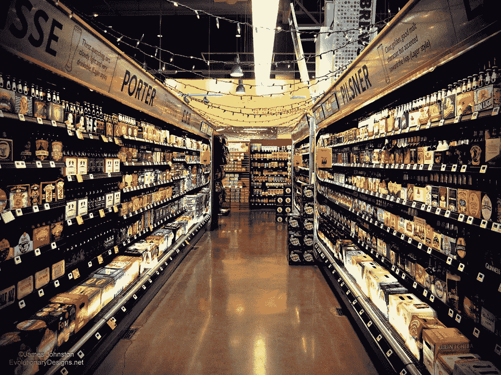
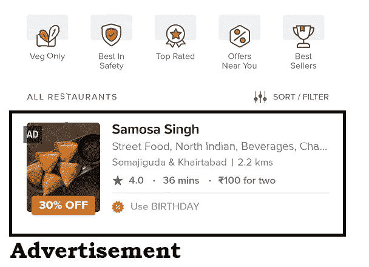
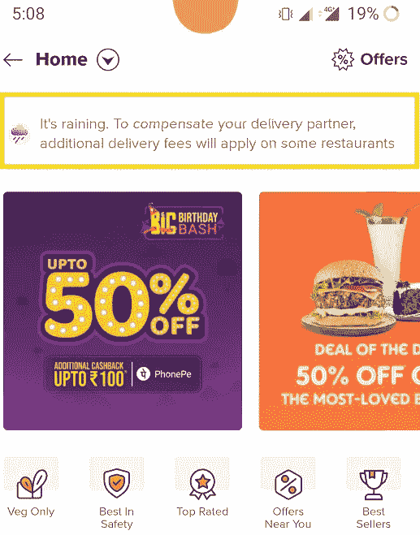
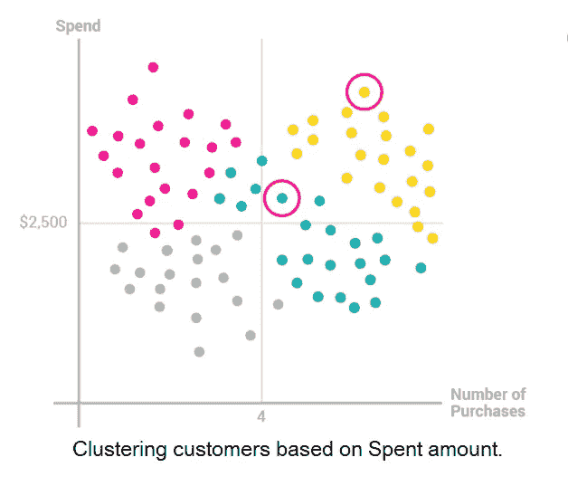
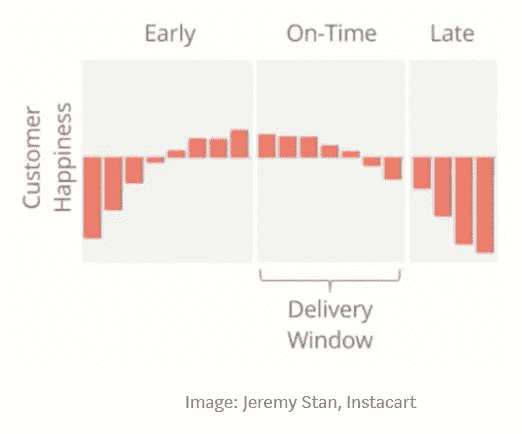
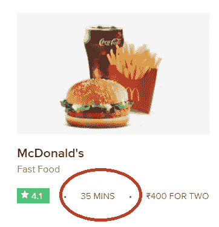
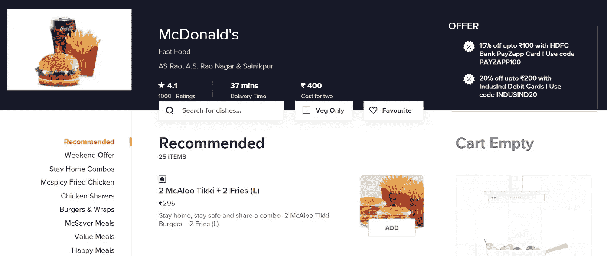

# ML/AI 如何革新杂货递送服务…..| 2020 年 8 月

> 原文：<https://medium.com/analytics-vidhya/how-ml-ai-is-revolutionizing-grocery-delivery-service-for-profit-4f965a6f7ea5?source=collection_archive---------13----------------------->

图片来源:[https://michelleismoneyhungry . com/gentrification-one-杂货店/](https://michelleismoneyhungry.com/gentrification-one-grocery-stores/)

全球在线**杂货市场**的规模在 2019 年估值为 1898.1 亿美元，预计从 2020 年到 2027 年的 CAGR 将达到 24.8%。在预测期内，不断增长的可支配收入和人们对舒适的日益增长的倾向预计将推动**市场**。

# 随着冠状病毒封锁对在线杂货交付平台的需求不断增长，JioMart 是 Reliance Industries 在这一领域的冲刺中获利的出价。

因此，对于企业来说，食品杂货配送是一个巨大的机会，可以利用顾客在家订购食品杂货的舒适性来获利。在这个领域，机器学习有着巨大的空间。仅在印度，就有 Flipkart、亚马逊、Jiomart、Swiggy、big basket 等公司押注于杂货服务领域。

昨天，我读了一篇关于 **Instacart(总部位于旧金山的杂货配送公司)**如何解决围绕杂货配送服务的棘手而复杂的业务问题的文章。我还会将它与 Swiggy stores 进行比较，Swiggy 最近在印度推出了杂货店送货服务，这在印度非常受欢迎，因为这两家公司处于相同的领域，并且有共同的问题。

**该公司使用数据科学和 ml 解决方案解决的问题的快速总结:**

1.  产品广告是 Instacart 推动杂货店销售的商业模式。因此**通过广告将客户转化率最大化**并将客户定位到正确的杂货项目或商店将为 Instacart 带来收入。在 Instacart 上购买的所有商品中，约有 30%是广告商品。

swiggy 上的餐馆广告。图片来源:Swiggy.in

2.**增加特定商店的流量以提高知名度**也增加了 Instacart 的收入选择，因为杂货店老板愿意为他们页面上的大量新客户流量付费。他们获得相当大一部分收入。

A/B 测试。图片来源:Shopify

3.他们还需要估计 ML 可以提高多少运营效率，这将有助于进行各种各样的 A/B 测试。

4.他们还需要**预测客户在服务上的花费**，以预测需求，这对于供需平衡至关重要。

5.它还需要知道**有多少客户是定期购买的回头客**，这样他们就可以开发智能算法来提前预测他们的需求。

下雨时需求增加，所以向顾客收取额外费用。图片来源:Swiggy.in

6.根据各种因素，如天气、路况、商店的繁忙程度、商店包装订单需要多长时间以及可用的配送代理等，预测交付订单所需的**时间存在很大差异。因此，数据科学绝对有很大的发展空间。**

图片来源:Optimove.com

7.他们还**需要根据客户的行为来识别他们**。有三种类型的顾客，一种会继续购物。两个因为糟糕的送货选择而离开，三个只是在这里浏览而不是购买。

8.我们也可以使用直方图来直观显示客户满意度，x 轴表示交付时间，y 轴表示客户满意度。

交货时间估计。图片来源:Swiggy.in

9.Instacart 也在为配送代理人向特定客户配送订单的**行程时间构建自己的模型，因为大多数订单都是重复订单，并且这些事件很有可能被高度确定地预测到。**

物品推荐。图片来源:Swiggy.in

10.**向用户动态推荐商品**(他/她可能会感兴趣)也会增加转化率。

正如我们所看到的，数据科学/机器学习在提高杂货交付的运营效率方面有很大的空间。这让我有兴趣知道是否有任何数据可供我尝试这些事情，幸运的是 **Instacart** 在 Kaggle 上举办了一场**比赛，基本上是要求你**预测用户的下一个订单中将会有哪些产品。****

**数据注释:**

1.  **数据集是匿名的**因此没有关于客户的个人信息，这实际上增加了预测的价值，但这应该不是问题。
2.  来自 20 万客户的 300 万份订单，数据非常庞大。
    购买产品的顺序可能会提供很多信息。
3.  时间戳在预测客户行为方面非常重要，因为他们不会购买一件杂货，除非他们已经用过并再次需要它。有很多关于时间的直觉，比如**顾客可能会在一个月的第一周购买一些产品**，他/她也可能会根据他以前的购买情况重新订购某些商品。数据科学的范围如此之广。

我将这篇文章分成**部分**作为一个系列，所以在我的下一篇文章中，我将深入**探索数据**，并给出我发现的见解。我还将为一些**基线模型想法**搭建舞台，这将使我们的机器学习模型与**幼稚模型**进行比较变得容易，并决定它是否真的有效。

我真的很高兴能参与这个项目，**如果你觉得这篇文章内容丰富，请鼓掌或留下评论**，如果你有任何问题，也请告诉我。我很期待听到你在评论中说些什么，我很期待下一部分“探索 Instacart 数据”。

如果你觉得这篇文章有帮助，请鼓掌

**参考文献:**
1。[https://medium . com/data series/how-insta cart-uses-data-science-to-charge-business-problems-774 a 826 b 6 ed 5](/dataseries/how-instacart-uses-data-science-to-tackle-complex-business-problems-774a826b6ed5)

2.[https://www . ka ggle . com/c/insta cart-market-basket-analysis/data](https://www.kaggle.com/c/instacart-market-basket-analysis/data)

3.[https://www . grandview research . com/industry-analysis/online-杂货-市场#:~:text = The % 20 global % 20 online % 20 grocery % 20 market，market % 20 over % 20 The % 20 forecast % 20 period](https://www.grandviewresearch.com/industry-analysis/online-grocery-market#:~:text=The%20global%20online%20grocery%20market,market%20over%20the%20forecast%20period)。

4.[https://www . business today . in/latest/trends/reliance-jiomart-opens-online-杂货服务-in-200-cities-key-things-to-now/story/404916 . html](https://www.businesstoday.in/latest/trends/reliance-jiomart-opens-online-grocery-service-in-200-cities-key-things-to-now/story/404916.html)