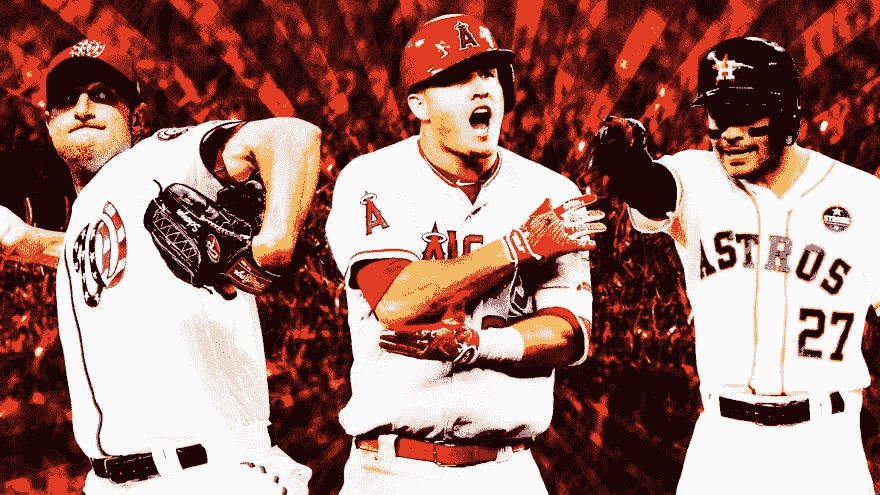
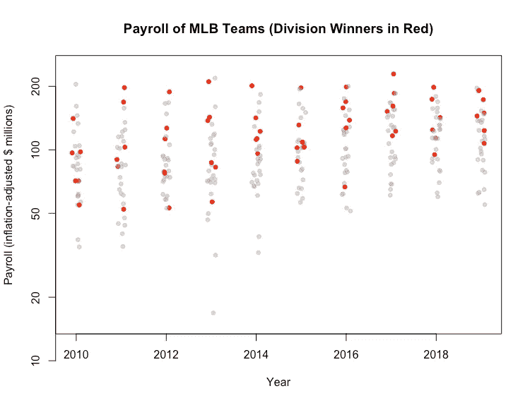
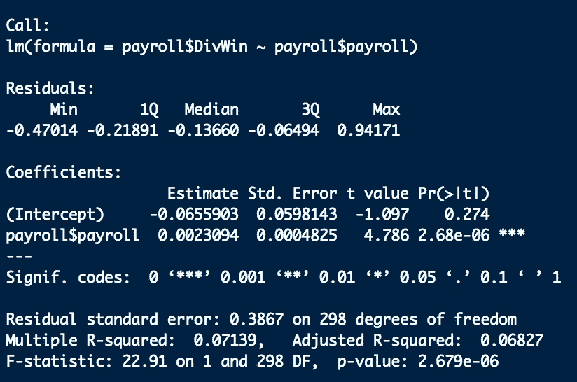
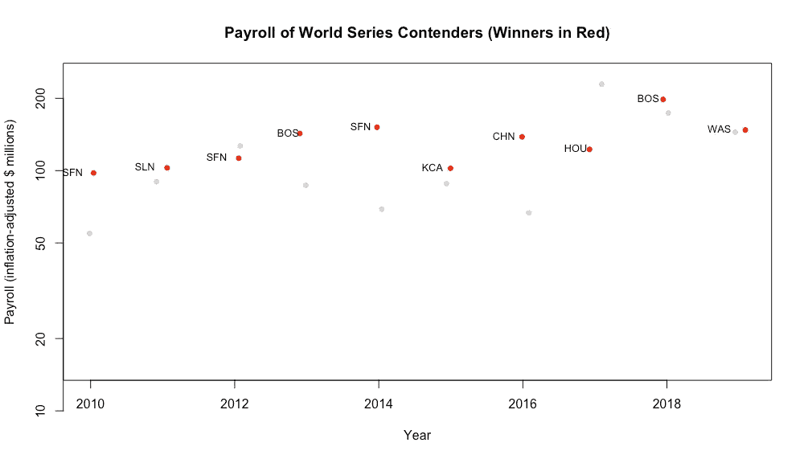
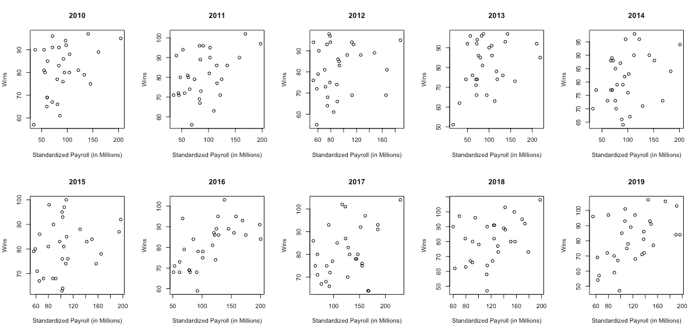

# 在棒球运动中，你能买到多少成功？

> 原文：<https://medium.com/analytics-vidhya/how-much-success-can-you-buy-in-baseball-eeda0584e34a?source=collection_archive---------11----------------------->

随着 MLB 休赛期如火如荼，超过 20 亿美元已经投入到自由球员身上，在一项没有工资帽的运动中花多少钱的问题仍然相对没有答案。我们看到了停滞不前的 2018-2019 MLB 休赛期和快速发展的 2019-2020 休赛期之间的并列关系，在这两个赛季中，球队准备好了展示他们想要赢得比赛并变得积极进取。如果球队签下几名球员，他们会觉得自己很有竞争力吗？或者与去年休赛期相比，球队之间达成了更多友好的交易？也许两者都是对的，但现在似乎比以往任何时候，球队都意识到，要成为一支季后赛球队，一个真正证明了的赢家，你需要打开支票簿。看看 2010 年顶级支出团队的统治地位和表现，我们就会明白为什么倾家荡产是值得的。

棒球有大的市场团队和小的市场团队。两人都可以赢得世界大赛，但后者很少能取得持续的成功——一连串的统治地位。在 2010 年，我们看到堪萨斯皇家队连续赢得美联冠军，克利夫兰印第安人队几乎赢得了世界大赛，甚至辛辛那提红人队也赢得了几个分区冠军。然而，纽约扬基队自 1995 年以来从未有过失败的赛季是有原因的。洛杉矶道奇队连续 7 年赢得分区冠军是有原因的。是因为他们愿意消费。仅这个休赛期，扬基队在 9 年内就向 RHP·格里特·科尔支付了 3.24 亿美元，比科尔的前球队(匹兹堡海盗队)在过去 3 个赛季支付给他们整个 25 人名单的总和还要多 6200 万美元。

赢得分区冠军是一个团队竞争的第一步。自从 MLB 在 2011 赛季后采用了一场外卡季后赛以来，这是确保自己进入季后赛的唯一方式。我们首先来看看过去十年中的部门获胜者，以及他们在竞争对手中的薪酬排名。

所有 30 支 MLB 球队按年度调整通胀后的工资抖动图，红色部分为冠军

最突出的一点是，大多数红点在各自的赛季中都处于联盟的上半部分。2010 年部门获奖者的工资中位数为 1.355 亿美元，而非部门获奖者的工资中位数为 1.013 亿美元。

在 2010 年，60 个部门获奖者中有 36 个是薪酬前 10 名。另一种思考方式是，如果一支球队自 2010 年以来每年都排名前 10 位，那么他们没有赢得任何一个分区冠军的可能性几乎是万分之一。在 2010 年，MLB 有 6 支球队没有赢得分区冠军。当你考虑棒球的随机性以及自 2000 年以来没有球队连续赢得世界大赛的事实时，这似乎非常重要。

为了获得更多的关于金钱如何转化为季后赛的统计数据，特别是分区冠军，我进行了一个简单的线性回归模型来预测分区冠军的工资。这是使用虚拟变量 1 作为部门获胜，0 作为非部门获胜来计算的。

通过工资单预测部门成功的简单线性模型

即使是这样一个简单的模型也有几个优点。首先，这个回归提供了 2.68*10^-6.的 p 值这基本上意味着，如果你假设 MLB 的每支球队都有同等的可能性赢得独立于他们薪资的分区，那么获得比 2010 年更极端结果的概率是 0.00000268。

接下来，看看这个模型的等式，你会看到斜率是 0.0023094，这意味着每花 100 万，一个团队赢得他们部门的可能性增加了 0.23%。因此，一个工资为 2 亿美元的球队有 39.6%的机会赢得他们的分区，而一个工资为 1 亿美元的球队有 16.5%的机会赢得他们的分区。当然，这只是为了提供支出的重要性的背景，这个模型并不是它实际上是如何工作的。如果是这样的话，一支花费 4.61 亿美元的球队将有 100%的机会赢得他们的比赛。

我们已经看到，巨额工资对于进入季后赛至关重要，但另一个趋势指出，支付大笔资金也可以让你在最有意义的比赛中获得优势。自从 2003 年佛罗里达马林鱼队以来，还没有球队赢得过世界大赛。在其他 16 个获胜者中，有 7 个团队来自工资单上的前 5 名。

高薪球队在 2010 年占据上风，因为过去 10 次世界大赛冠军中有 8 次的薪水高于对手。

年度联赛冠军，世界职业棒球大赛冠军

接下来，我看了每一年的标准化工资与胜率的对比图，看看工资是否一直与胜率相关，而不仅仅是进入季后赛。当分析一个赛季的胜率与工资(通货膨胀标准化)相比时，2010 年的每一年的相关性都是正的，范围从 0.19 到 0.64，平均相关性为 0.37。

2010-2019 年经通胀调整的薪资与 Wins

你会注意到，在大多数图表中，标准化工资和一个赛季的胜率之间存在明显的正相关关系。这在 2010 年、2013 年、2016 年和 2019 年等年份尤为明显，在这些年份，支出最高的球队一直处于胜率最高的球队之列，而薪资水平不高的球队胜率相当低。这些图表支持的一个最大趋势是，一旦你花费足够多，胜利就会到来。像布莱斯·哈珀(13 年 3.3 亿美元)、迈克·特劳特(12 年 4.26 亿美元)、斯蒂芬·斯特拉斯堡(7 年 2.45 亿美元)和其他一些超级巨星已经证明，不仅球队肯定负担得起，而且他们值得每一分钱。

虽然这里的重点是指出支出的重要性，但同样重要的是要认识到，有一些团队的工资一直低于平均水平，但仍然可以工作。下表显示了自 2010 年以来，分区冠军在每个常规赛胜利上花费的百万美元(标准化通货膨胀)方面的最佳赛季。

2010 年十大赛区赢家，每次获胜花费数百万美元

2011 年亚利桑那响尾蛇队以 94-68 结束了常规赛，标准工资为 5230 万美元，为他们赢得了每场比赛仅 55.6 万美元的冠军。在这些球队中，有两支赢得了各自的联赛，但没有一支赢得了世界职业棒球大赛。这只是表明，虽然你可以有一个惊喜的赛季，赢得 90 多场常规赛，但世界大赛的人才往往是买来的，而不是开发的。

秘密是公开的:花，花，花。虽然一些老板可以试着精打细算，挑选他们想要有竞争力的赛季，但他们最感兴趣的是出去给球员支付他们应得的报酬。那么，如果只是归结为花钱，我们为什么要关心所有这些趋势呢？因为球员、球迷和教练都会同意，他们想要赢得冠军，不管你如何到达那里。俗话说“如果你输掉了赛季的最后一场比赛，没人会在乎。”

*要查看本项目使用的代码和数据，请访问*[*【https://github.com/ga3798/Independent-Projects】*](https://github.com/ga3798/Independent-Projects)

*从拉赫曼数据库获得的数据& Spotrac*