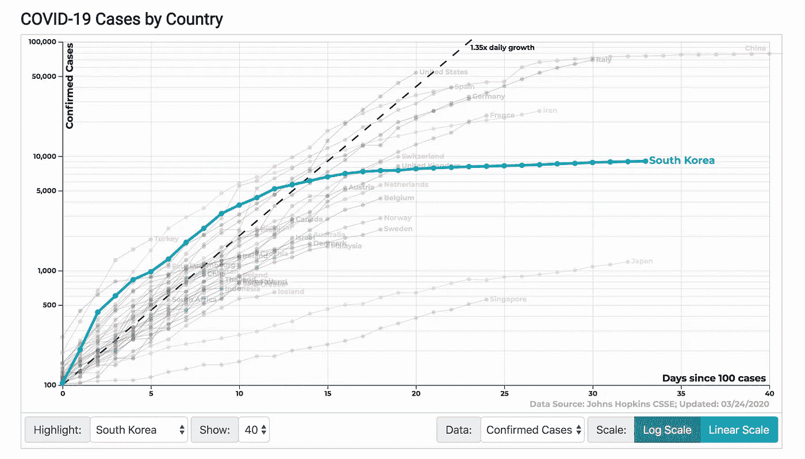
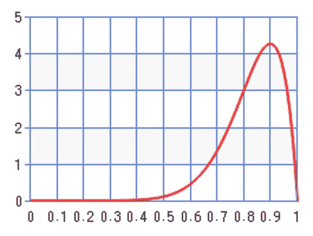
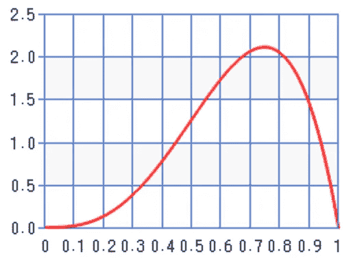
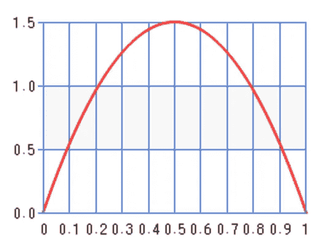
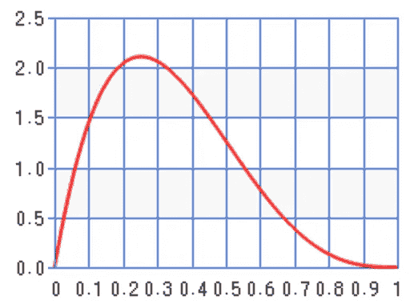
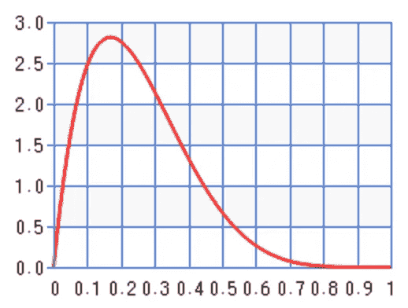
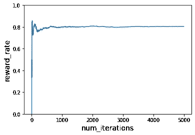

# 多国武装匪徒如何帮助我们为新冠肺炎而战——第一部分

> 原文：<https://medium.com/analytics-vidhya/how-multi-armed-bandits-can-help-us-in-the-fight-for-covid-19-part-1-6dac796851b4?source=collection_archive---------15----------------------->

我是一名 AWS ML 英雄，我在想强化学习和 AWS 如何帮助以更有效和高效的方式分发新冠肺炎测试包。为什么？识别尽可能多的感染者似乎是最大限度减少或阻止新冠肺炎病毒传播的关键之一。这似乎是韩国设法使曲线变平的原因之一。



来源:http://91-divoc.com/pages/covid-visualization/

所以，让我们先定义一下什么是多臂匪徒。首先，这是一种强化学习方法。**你反复面临在不同的选项、行动或武器中做出选择的问题。每次选择/决定后，你都会得到一定数量的奖励。每只手臂的奖励与未知的固定概率分布相关联。你的目标是在某个时间段或离散的时间步长内最大化预期总报酬。**

一些多武装匪徒的例子:

*   一位医生在一系列重病患者的实验治疗中选择(摘自*强化学习:理查德·萨顿和安德鲁·巴尔托的介绍)*
*   广告系统选择在哪个网站上显示哪个广告
*   选择在主页上显示哪些文章的推荐系统

鉴于所有这些信息，我很肯定你已经开始在你的头脑中形成一个新冠肺炎 MAB 问题的定义。问题定义如下:

*   还有 *M* 区域。例如，它类似于伦敦的行政区(卡姆登、伊斯灵顿、威斯敏斯特等)。
*   我们假设，鉴于目前的封锁，人们不会在地区/行政区之间移动，或者只有很小一部分人必须移动。
*   在这些区域之间有一个中心工厂，持续生产 Coviv-19 测试套件。
*   每当生产一种新的检测试剂盒时，必须选择将它运送到哪个地区/行政区。
*   **因此，区域是 MAB 问题的双臂，目标是最大化真阳性的数量。**

我知道这个问题不符合 MABs 的所有理论假设，但这篇博客的主要目的是激发新的想法！

这个问题定义的主要假设是，它假设每个区域/行政区都有真阳性的稳定概率分布。可能不是，但在后面的另一部分，我们将解决这个问题！

让我们尝试一个简单的 MAB 解决方案，*ε贪婪或 E 贪婪。*下面是伪代码(来源:*强化学习:理查德·萨顿和安德鲁·巴尔托的介绍)*:

```
ε <- user_input()  // In range (0.0, 1.0). User defines this.
Initialize, for a = 1 to k:  // k is number of arms
   Q(a) <- 0  // estimated rewards per arm a
   N(a) <- 0  // number of times arm a is chosenLoop forever:
   random_number <- random()  // random number in [0.0, 1)
   if (random_number < ε):  // exploration part
      A <- choose a random arm a
   else:  // exploitation part
      A <- argmax Q(a)  // choose arm with highest Q(a) so far

   R <- bandit(A)  // receive reward for chosen arm
   N(A) <- N(A) + 1
   Q(A) <- Q(A) + 1/N(A)[R - Q(A)]
```

首先，我们来实现一下*egredy*算法。

```
import numpy as npclass EGreedy:
    """
    Implementation of EGreedy algorithm as described in Section 2 of book:
    Reinforcement Learning: An Introduction (Version 2)
    Richard S. Sutton and Andrew G. Barto
    """
    def __init__(self, k, epsilon=0.1):
        """
        Constructor of EGreedy
        :param k: [int], number of arms. 0-based indexing.
        :param epsilon: [float, default=0.1], epsilon value in range (0.0, 1.0) for exploration
        """
        self.k = k
        self.epsilon = epsilon
        self.rewards = np.asarray([0.0 for _ in range(k)])
        self.steps = np.asarray([0 for _ in range(k)])def reset(self):
        self.rewards = np.asarray([0.0 for _ in range(self.k)])
        self.steps = np.asarray([0 for _ in range(self.k)])def choose(self):
        random_number = np.random.uniform(0.0, 1, 1)[0]if random_number < self.epsilon:
            return np.random.choice(self.k, 1, replace=False)[0].item()
        else:
            return np.argmax(self.rewards, axis=0)def feedback(self, arm_id, reward):
        self.steps[arm_id] += 1
        self.rewards[arm_id] += (1 / self.steps[arm_id]) * (reward - self.rewards[arm_id])
```

然后，我们必须定义每个地区/行政区感染人数的平稳概率分布。这种分布我用贝塔分布，参数 *a/b* 定义*感染者/未感染者*的比例。让我们假设有 *M=5* 个区域。

*   区域 1 有一个*β(a = 10，b=2)*
*   区域 2 有一个*β(a = 4，b=2)*
*   区域 3 有一个*β(a = 2，b=2)*
*   区域 4 有一个*β(a = 2，b=4)*
*   区域 5 有一个*β(a = 2，b=6)*

从下面绘制的分布图中可以看出，1 区发现感染者的概率最高。下一个是 2 区，以此类推。



区域 1 的感染概率分布



区域 2 的感染概率分布



区域 3 的感染概率分布



区域 4 的感染概率分布



区域 5 的感染概率分布

接下来我们需要实现的是模拟部分。下面是伪代码:

```
egreedy = initialize_egreedy()
for i=1 to num_test_kits:
    area <- egreedy.choose()  // choose an area to send this kit
    beta_distro <- find_distro(area)  // find distro of area
    random <- random()  // random number in [0.0, 1) uniform distro
    if random < beta_distro.draw():
       reward = 1  // found an infected person using this kit
    else:
       reward = 0  // this kit was used on a non infected person egreedy.feedback(area, reward)
```

正如你所看到的，每一个新创建的测试包都被送到一个地区，并在这个地区的一个人身上使用。然后，从该区域的 Beta 分布中抽取一个数字，以确定检测试剂盒是否用于受感染者。我们假设检测试剂盒是完美的(没有假阳性和假阴性)。

对 5，000 个测试套件运行模拟后的预期报酬率图表为:



检测试剂盒在各地区的分布情况如下:

*   1 区:4594
*   面积 2: 92
*   面积 3: 114
*   第 4 区:102
*   面积 5: 98

这种简单的在线 MAB 算法将大多数测试包分发到了受感染人数最多的地区，但并没有将它们“公平”地分发到其他地区。但是，我们仍然有很大的进步！

敬请期待！在下一部分中，我将向您展示如何在 AWS 上部署这个算法，以及如何以有序的方式改进测试包的分发。

PS: Github 回购:[https://github.com/pm3310/mab-covid19](https://github.com/pm3310/mab-covid19)