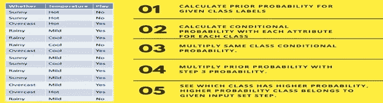

# 朴素贝叶斯算法如何工作

> 原文：<https://medium.com/analytics-vidhya/how-naive-bayes-algorithm-work-d53e0a13a364?source=collection_archive---------12----------------------->

在这篇文章中，我将解释朴素贝叶斯算法的基础。

# 什么是朴素贝叶斯算法？

aive Bayes 是一种基于 Bayes 定理的统计分类技术。NB 分类器是快速、准确和可靠的算法。朴素贝叶斯分类器在大数据集上具有很高的准确率和速度。

朴素贝叶斯分类器假设类中特定特征的影响独立于其他特征。例如，贷款申请人是否合适取决于他/她的收入、以前的贷款和交易历史、年龄和地点。即使这些功能是相互依赖的，这些功能仍然被认为是独立的。这个假设简化了计算，这就是为什么它被认为是幼稚的。这种假设被称为条件独立。

贝叶斯定理

在哪里，

P(h|D):给定数据 D 的假设 h 的概率。

P(D|h)是假设假设 h 为真时数据 D 的概率。

P(h)是假设 h 为真的概率。这叫做后验概率。

P(D)是数据的概率。

## 让我们通过一个例子来理解 Naive bays 的工作原理。举一个天气状况和运动的例子。你需要计算运动的概率。现在你需要根据天气状况来分类玩家是否玩游戏。

日期设置

**第一种方法(在单一特征的情况下)**

朴素贝叶斯通过以下步骤计算事件的概率。：

步骤 1:计算给定类别标签的先验概率。

第二步:找出每个类的每个属性的似然概率。

第三步:将这些值放入贝叶斯公式，并计算后验概率。

步骤 4:考虑到输入属于概率较高的类，查看哪个类的概率较高。

为了简化先验和后验概率计算，可以使用两个频率表和似然表。这两个表将帮助你计算先验和后验概率。频率表包含所有特征标签的出现次数。有两个可能性表。似然表 1 显示标签的先验概率，似然表 2 显示后验概率。

现在假设我们要计算天气阴天时打球的概率。

P **出场概率是**

P(是|阴)= P(阴|是)* P(是)/ P(阴)……………………………… (1)

第一步:计算先验概率:

- P(阴)= 4 / 14 = 0.29

- P(是)= 9/14 = 0.64

第二步:计算后验概率:

- P(阴|是)= 4/9 = 0.44

第三步:将先验概率和后验概率代入等式:

- P(是|阴)= 0.44 * 0.64 / 0.29 = 0.97(更高)

类似地，我们可以计算出不玩的概率

P(无|阴)= P(阴|无)* P(无)/ P(阴)……………………………………(2)

第一步:计算先验概率:

- P(阴)= 4 / 14 = 0.29

- P(否)= 5/14 = 0.35

第二步:计算后验概率:

- P(阴|否)= 0/5 = 0.0

第三步:将先验概率和后验概率代入等式:

*   p(无|阴)= 0 * 0.35 / 0.29 = 0

“是”类的概率更高。因此，我们可以在这里确定，如果天气是阴天，那么玩家将进行这项运动。

# **现在假设你想计算天气阴沉、气温温和时打球的概率。**

日期设置

**出场概率:**

*P (Play= Yes |天气=阴天，气温=温和)= P(天气=阴天，气温=温和| Play= Yes)* P(Play=Yes)…。(1)

P(天气=阴，温度=温和|玩=是)= P(阴|是) P(温和|是)……..(2)

计算先验概率:

p(是)= 9/14 = 0.64

计算后验概率:

P(阴|是)= 4/9 = 0.44 P(温和|是)= 4/9 = 0.44

将后验概率放入等式(2)

p(天气=阴，温度=温和|玩耍=是)= 0.44 * 0.44 = 0.1936(更高)

将先验概率和后验概率放入等式(1)P(Play = Yes | Weather =多云，Temp =温和)= 0.1936*0.64 = 0.124

同样，你可以计算不玩的概率:

**不玩概率:**

*P(Play= No |天气=阴天，气温=温和)= P(天气=阴天，气温=温和| Play= No)* P(Play=No) …。(3)

P(天气=阴天，温度=温和|玩耍=否)= P(天气=阴天|玩耍=否)..(4)

计算先验概率:

p(否)= 5/14 = 0.36

计算后验概率:

P(天气=多云|玩耍=无)= 0/9 = 0 P(温度=温和|玩耍=无)=2/5=0.4

将后验概率放入等式(4)

p(天气=多云，温度=温和|玩耍=无)= 0 * 0.4= 0

将先验概率和后验概率放入等式(3)

p(Play = No | Weather =多云，Temp =温和)= 0*0.36=0

“是”类的概率更高。

因此，你可以在这里说，如果天气阴沉，运动员将会进行这项运动。