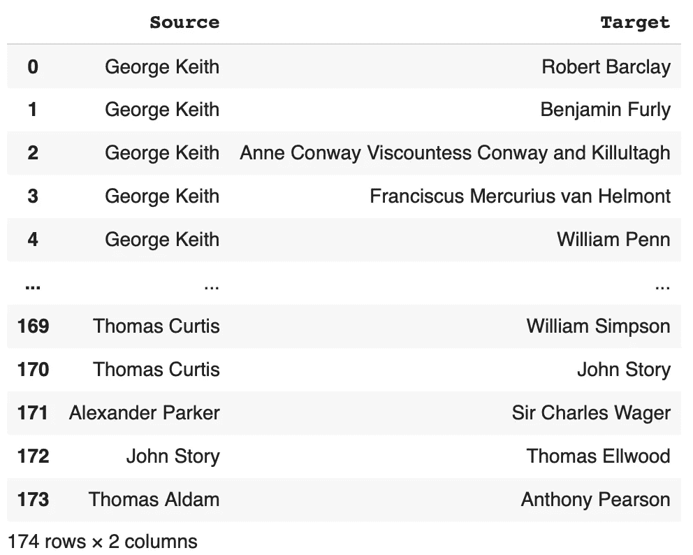
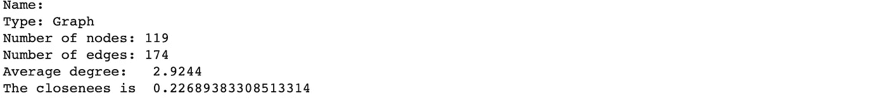
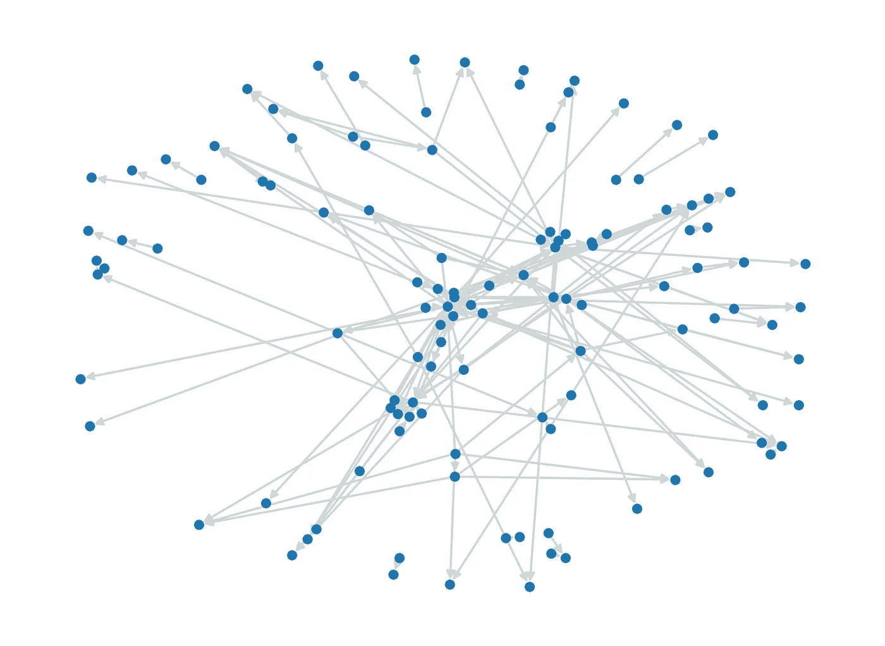
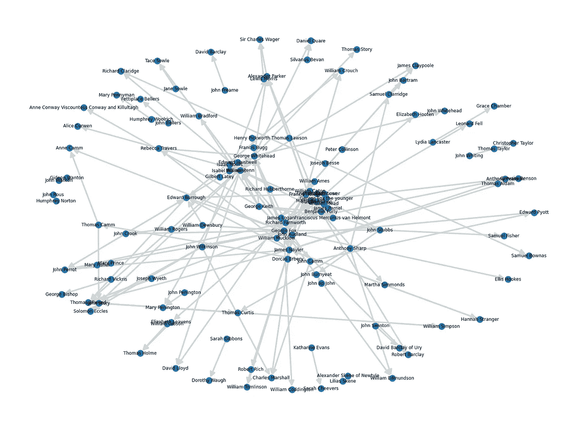
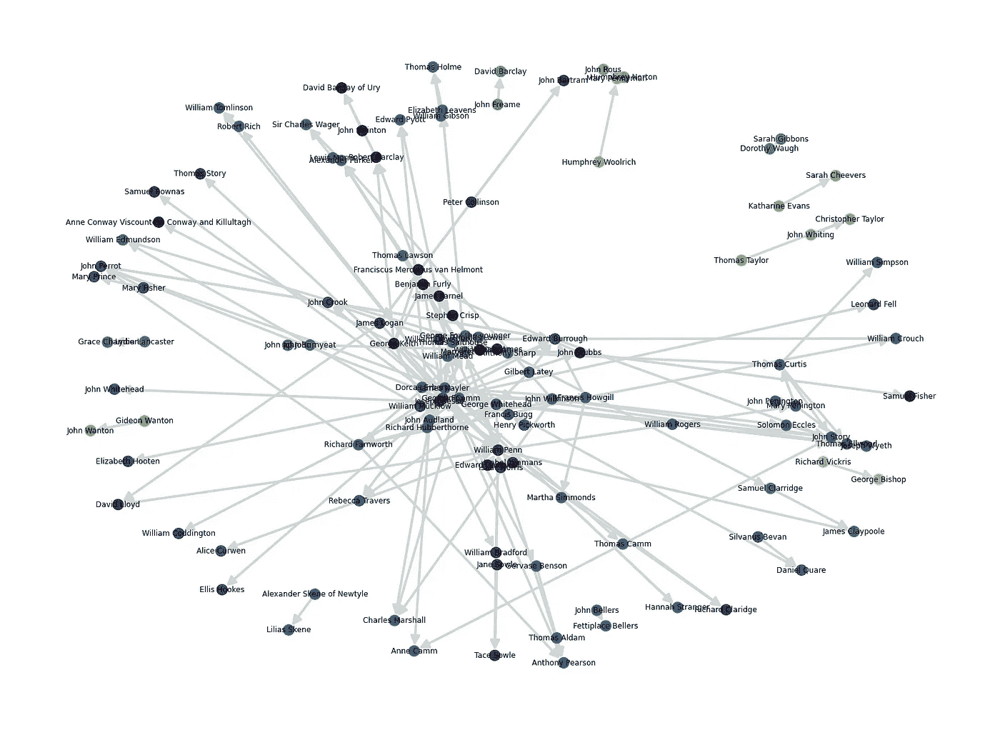
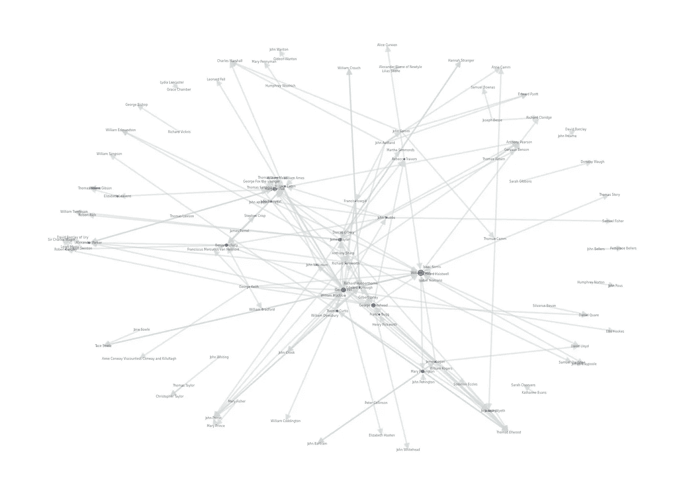
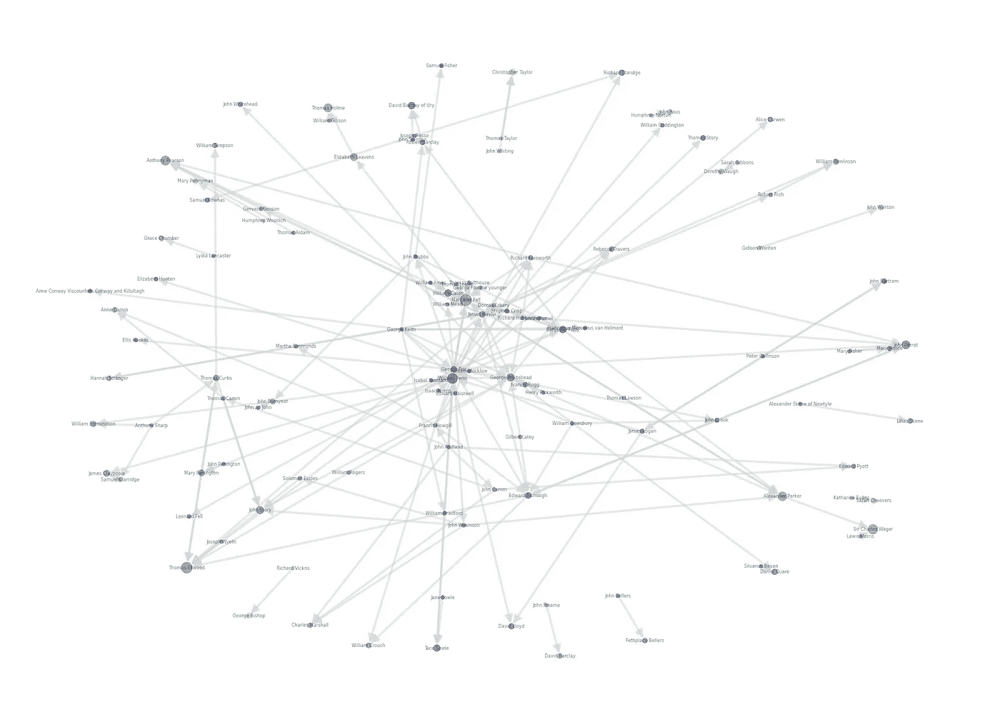
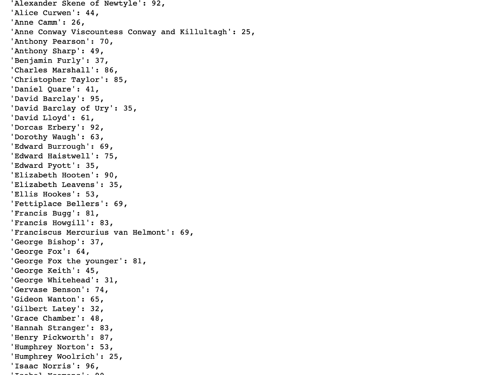

# 网络分析如何帮助我们赢得疫情

> 原文：<https://medium.com/analytics-vidhya/how-network-analysis-can-help-us-win-over-the-pandemic-8addc7aea488?source=collection_archive---------8----------------------->

照片由[克拉丽斯·克罗斯](https://unsplash.com/@herfrenchness?utm_source=unsplash&utm_medium=referral&utm_content=creditCopyText)在 [Unsplash](https://unsplash.com/s/photos/network?utm_source=unsplash&utm_medium=referral&utm_content=creditCopyText) 拍摄

尽管疫苗是预防 COVID19 感染的最佳手段，但由于抗原漂移和缺乏对全球传播的了解，菌株选择和最佳实施仍然很困难。谷歌和苹果最近推出了一种接触追踪 API[,卫生服务部门可以使用它来构建一个应用程序，以通知其用户，并帮助卫生当局使用网络分析来遏制病毒的传播。](https://techcrunch.com/2020/05/20/apple-and-google-launch-exposure-notification-api-enabling-public-health-authorities-to-release-apps/)

但是什么是网络分析，它是如何工作的？

在本教程中，我将概述如何使用 python 创建具有视觉吸引力的网络图的基础知识，并识别手边的数据模式，以解决以下问题:

1.  如果某个人被感染，如何追踪危险人群中的所有人？
2.  *不同受感染者或群体所需的隔离水平和优先级是什么？*

*注:如果你只对 python 函数和可视化感兴趣，可以跳过网络分析理论，直接跳到第 1 节(先决条件)。*

## 理论

此分析中使用的一些技术术语和 python 包是:

`Network`仅仅是一个被称为**节点**的相似对象集合的系统，这些节点使用**边**的集合相互连接。网络的一些例子是社会网络，即 T21 人之间的网络；**运输系统*即道路或火车布局等。*

> *在数学中，网络通常被称为图，与图的研究有关的数学领域被称为图论。*

*`Node`是我们尝试连接的任何类型的代理或元素。在这种情况下，它将是考虑中的人。*

*`Edge`是节点之间的连接。在这个分析中，是人与人之间的身体接触。*

**节点*和*边*还包含与其相关联的元数据，即对于*节点:*信息，如年龄、性别、先前的呼吸健康问题，对于*边:*日期/时间，两个人会面的持续时间等。，可进一步用于丰富分析。*

*`Degree`对于一个特定的节点是它所包含的边的数量。所以，如果一个人遇到了 6 个不同的人，这个人的度数就是 6。*

*`undirected graph`是一种所有边都是双向的网络。在这个分析中，我们使用`undirected graph.`作为对比，边缘指向一个方向的网络被称为`directed graph.`银行交易，社交媒体 likes 就是`directed graph.`的例子*

*`NetworkX`在本次分析中，我们将使用[NetworkX](https://networkx.github.io)Python API 包，因为它是操纵、分析和建模图形数据最简单的包之一。*

*`Closeness`聚类系数是对图中节点倾向于聚集在一起的程度的度量。数字越小越好，因为它表明人们接触的人数越少，从而控制传播。*

*请注意，*在现实生活中，数据将比我们用于此分析的数据大得多，但是为了保持简单，我们制作了一个小样本*。使用 NetworkX 中的[子图](https://networkx.github.io/documentation/networkx-1.10/reference/generated/networkx.Graph.subgraph.html)功能可以轻松过滤大规模数据。*

# *1.先决条件*

*在本节中，我们将设置可视化和分析数据所需的环境。如果您已经准备了下面列出的任何部分，您可以分别跳过它们。*

*   *为你的网络分析下载或[创建](https://www.youtube.com/watch?v=Q-qKKQLNLPo)原始数据。我从[这里](https://programminghistorian.org/en/lessons/exploring-and-analyzing-network-data-with-python)下载了我的数据。*
*   *对于编码使用[Jupyter](https://jupyter.org/index.html)Notebook——一个开源网络应用程序，用于创建/共享包含实时代码、公式、可视化和叙述性文本的文档。你可以从[这里](https://jupyter.org/install.html)安装它，或者你可以免费使用谷歌托管的叫做 [Google Colab](https://colab.research.google.com/notebooks/intro.ipynb#recent=true) 的 jupyter 笔记本，这样你就不用安装了。*
*   *安装 [NetworkX](https://networkx.github.io/documentation/networkx-1.10/overview.html#free-software) —一个轻量级 Python 包，用于创建、操作和研究复杂网络的结构、动态和功能。您可以使用 CLI(命令行界面)或 Jupyter 笔记本来运行以下命令:*

*   *导入必要的库。 *NetworkX* 通常导入为`nx`:*

# *2.导入数据并创建基础网络*

*下一步是创建一个名为`G`的空图，并将数据集导入 dataframe。导入数据帧后，我们可以使用以下方法检查其尺寸:*

*数据看起来像这样-*

**

*原始数据帧*

*我们可以看到，我们的数据集有两列，表示两个人之间的接触。请注意，一个人可以有多个联系人。下一步是使用以下代码用数据帧(df)填充图形(G ):*

*命令`nx.info(G)`将显示如下输出-*

**

# *3.将网络可视化*

*在所有这些理论和网络准备之后，现在是时候最终可视化它并看到模式了。为此，我们将运行以下代码:*

*底部的一个用来创建网络，顶部的一个用来给边添加名称*

**

*网络 G*

*但由于没有任何标签很难阅读网络，我们将在图中添加标签，它看起来像这样-*

**

*带标签的网络 G*

## *发现此网络中的社区*

*每周彼此联系紧密的群体称为社区。我编写了下面的代码来导入社区模块，并构建一个名为`c_values` 的变量，该变量用于将互连的边用相同的颜色着色，以区分它们。*

*代码将复制如下图:*

**

*分配了标签和社区的网络 G*

## *检测最暴露的人*

*我们感兴趣的下一个方面是找到与大多数人有接触的人，因为他们感染病毒的概率更高，如果卫生官员想要控制传播，他们在打破这一链条方面也至关重要。*

*我采用了两种方法来研究重要的节点:*

**介数中心性算法使用广度优先搜索算法计算连通图中每对节点之间的最短(加权)路径。每个节点都会根据通过该节点的最短路径的数量得到一个分数。最频繁位于这些最短路径上的节点将具有较高的介数中心性得分。**

**上面的代码将创建如下图形:**

****

**分配了标签、社区和中心性的网络 G**

****2*。页面排名*****

**我们可以使用的另一种方法是一种叫做 *PageRank 的算法，*这是 SEO 中一种流行的方法，由 Google 开发，并以其创始人 Larry Page 的名字命名。它用于在搜索结果中对网页进行排名。NetworkX 本身就提供了这一点，并根据传入链接的结构计算图 G 中节点的排名。**

**这将生成下图:**

****

**分配了标签、社区和中心性的网络 G**

## **属性**

**此外，如开始所讨论的，如果特定的年龄或健康相关数据可用，则它可用于丰富节点或实体，如下所示:**

****

**一旦年龄或以前的健康问题成为图表的一部分，它们就可以用来通过颜色或大小区分节点，这将减轻对高危人群的监控。为了使本文简短，我没有深究这个问题，但是对于任何对这个话题感兴趣的人来说，这可能是一个有趣的项目。**

# **4.从图表中获得的见解**

**现在我们有了最终的网络(图)。这些是可以从图表中得出的见解，可以回答前面提到的问题:**

*   ****概述:**该图可以提供整个网络的概述，即谁遇到了谁，这从表格数据中很难把握。**
*   ****聚集:**寻找相互联系的人群社区，这样一旦社区中有人患病，可以及时联系到该社区的其他人，从而控制传播。**
*   ****寻路:**如果资源不足以针对风险社区中的每个人，卫生当局可以关注位于两个感染节点之间的节点，这些节点具有更高的感染病毒的概率。**
*   ****关键实体:**如果卫生当局计划开始随机测试，他们可以从更大的节点开始，如*威廉·佩恩*和*玛格丽特·费尔*，这些节点具有更高的人类接触程度，从而过滤社区。**

**感谢您的阅读&祝您度过愉快的一周！[笔记本](https://github.com/manekgarg/Network-analysis-Corona/blob/master/Covid19_Network_Analysis_Level_2.ipynb)准备好立即运行，你也可以克隆[回购](https://github.com/manekgarg/Network-analysis-Corona)并在本地运行代码。如果你有任何问题或想法，欢迎在下面留言。**