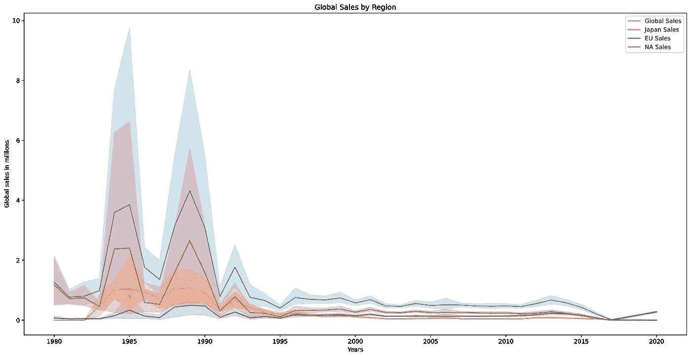
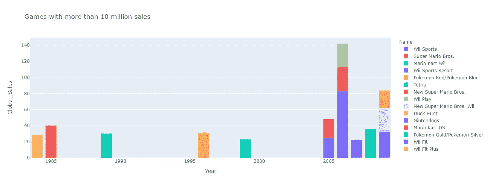
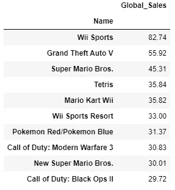
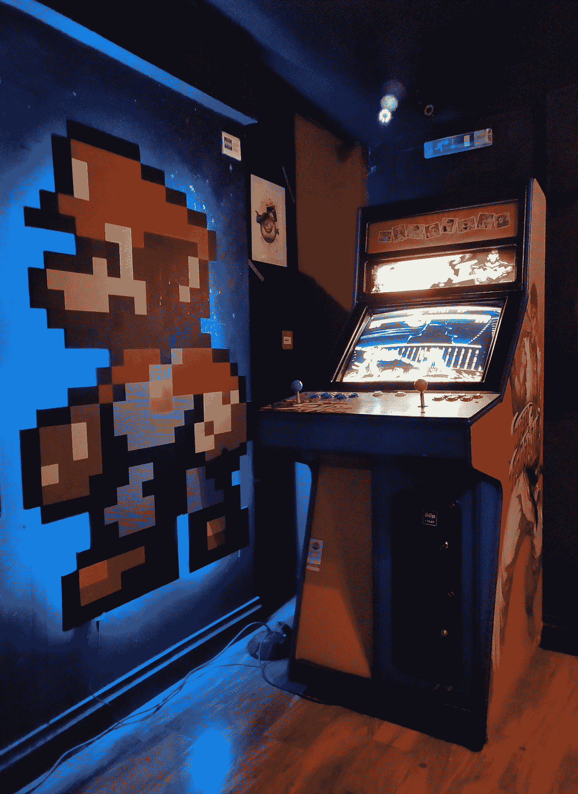

# 任天堂如何统治游戏产业，我们能学到什么？

> 原文：<https://medium.com/analytics-vidhya/how-nintendo-dominated-the-gaming-industry-and-what-can-we-learn-through-data-3741de188e6b?source=collection_archive---------9----------------------->

或许，这个标题会让一些人感到惊讶。任天堂真的统治了游戏行业吗？索尼和微软的新一代游戏机正在向我们走来。现代游戏机的游戏预算正在超过好莱坞大片。任天堂主要是一个孩子的公司，总是低规格，许多铁杆玩家甚至不重视。当然，谈论市场支配地位有点言过其实，不是吗？

不完全是！所有这些可能都有些道理，但归根结底，事实就是数据所说的那样！

所以，事不宜迟，让我们从 Kaggle 加载著名的视频游戏销售数据集，并开始挖掘真相，这样我们就可以得出正确的结论。

*你可以在我的 Github 中探索所有代码和 Python 细节:*

【https://github.com/IoannisSkartsaris/Video_Games_Sales】T5[T6](https://github.com/IoannisSkartsaris/Video_Games_Sales)

*数据集来源:*

[*https://www.kaggle.com/kedokedokedo/vgsales*](https://www.kaggle.com/kedokedokedo/vgsales)

**那么，让我们从房间里的大象开始**。任天堂真的是最终的历史市场领导者吗？

要回答这个问题，让我们看看全球销售的历史分布:

我们可以从 80 年代末到 90 年代初区分出一个主要的游戏繁荣期。随后，全球销量急剧下降，回到约 100 万辆，但随后又短暂回升至近 200 万辆。最后，销售额再次下降，保持在 100 万英镑的稳定水平。

在 80 年代末和 90 年代初之后，全球销售额再也没有达到过那么高的水平。这里我们需要问的主要问题是，那些风靡全球的版本是什么，是什么让它们如此特别？

为了回答这个问题，让我们仔细看看在游戏世界掀起最大波澜的游戏…

哇！我们首先注意到的是，几乎所有销售额超过 1000 万的游戏都是任天堂发布的！

我们甚至可以观察到任天堂一鸣惊人的发布，这些年来全球游戏销售的所有峰值。

80 年代中期,《超级马里奥》的销量达到了 4000 万，是那个时代游戏销量最高的。在千禧年的最后十年，马里奥系列凭借《马里奥兄弟 3》、《马里奥大陆》和《马里奥世界》统治了市场。

此外，**俄罗斯方块**也在当时由任天堂发行，并且也达到了**3000 多万**的销量。

1996 年，任天堂再次发布了口袋妖怪 T1，几乎达到了 T2 3200 万的销售额。十年后，该公司成功克服了自身的困难，发布了所有游戏历史上的终极重磅炸弹:Wii Sports。

**Wii Sports** 将《超级马里奥兄弟》至今仍未被打破的记录翻了一番，带回了 8200 万的销售额**！这是迄今为止最卖座的游戏...**

****

**照片由[米卡·鲍梅斯特](https://unsplash.com/@mbaumi?utm_source=medium&utm_medium=referral)在 [Unsplash](https://unsplash.com?utm_source=medium&utm_medium=referral) 上拍摄**

**因此，毫无疑问，任天堂坐在游戏世界的顶端，历史上击败了所有竞争对手。**

**但是，是什么让他们的游戏如此成功呢？**

**答案就在任天堂的生态系统中。任天堂一直特别注重向其他游戏机开放自己的游戏，此外还效仿或抄袭竞争对手…**

**虽然微软和索尼长期以来一直在争夺从系统中获取最大的利润，加大马力(甚至是逐渐增加)为射击游戏和动作游戏提取令人赏心悦目的小滴，但任天堂一直专注于游戏体验。**

**当现代发行商和游戏机将游戏玩家隔离在他们自己的小泡泡里，将孤立的多人游戏作为社交游戏时，任天堂已经设法让人们聚在一起玩 Wii。又或许，在学校，校园，甚至在工作的午休时间，互相收集和怜惜口袋妖怪！**

**从本质上来说，一方面，我们有索尼/微软的商业模式，给大众马力，设计一个通用的控制台，每个制造商都能找到发展的空间。更像廉价的“个人电脑型”替代品上的标准化输入控制器。**

**另一方面，**任天堂**大部分时间都在**关注游戏体验、新颖概念和颠覆性。GameBoy 的概念专注于便携性，Wii 专注于家庭娱乐，而 NES 则专注于当时创新的家庭游戏市场。****

****

**[阿尔瓦罗·雷耶斯](https://unsplash.com/@alvarordesign?utm_source=medium&utm_medium=referral)在 [Unsplash](https://unsplash.com?utm_source=medium&utm_medium=referral) 上的照片**

**任天堂通过将人们聚集在一起，分享经验和乐趣而获得了成功。这有额外的吸引力...**

**这种模式主要通过共享空间和个人一起生活或花费时间(身体上)来赚钱。这样，个人、家庭成员、朋友或夫妇就可以轻松分担购买游戏机的负担。**

**此外，封闭的任天堂生态系统，一旦被收购，促进平行游戏的销售，并在消费者心中留下受欢迎的任天堂专营权。**

**如果你想享受塞尔达或超级马里奥的最新版本，只有一条路可走。相比之下，如果你是《使命召唤》的铁杆粉丝，你的心不需要躺在索尼或者微软身上。**

****

**票房最高的游戏**

**在最后这张图表中，我们看到的正是这一点！顶部的空间只留给像超级马里奥兄弟或俄罗斯方块这样的创新者，它们是同类产品中的第一个。此外，像 Wii Sports 和某种程度上的 Pokemon 这样的社交体验是最能刺激销售的。**

**一般来说，我们认为“创意”比图形或高生产价值更重要。**

**当制作精良且市场新鲜时，像 GTA 沙盒风格这样的独特体验可能会占据特殊的位置。平心而论，一款深受喜爱的游戏类型中制作精良的游戏肯定有像《COD》一样获得高分的空间。**

**然而，随着公众对年复一年充斥市场的普通产品越来越感到厌倦，不管这些产品有多精美。**

**随着时间的推移，这些努力注定会失败。大规模生产的射手似乎面临着与 90 年代街机复兴的格斗游戏相似的命运。随着每家公司争相大规模生产越来越多的街头霸王克隆产品，这一领域已经过度饱和，充斥着太多相同类型的产品。**

**尽管许多《街头霸王 2》的克隆体拥有比原片名更高的生产价值，但没有一个**像最初的**那样取得成功。**

****

**由[凯文·博瑞尔](https://unsplash.com/@kev2480?utm_source=medium&utm_medium=referral)在 [Unsplash](https://unsplash.com?utm_source=medium&utm_medium=referral) 拍摄的照片**

****总之，**任天堂仍然是游戏市场上无可争议的历史领导者。**

**这主要归功于**的创新**，以及**巧妙的销售策略**。**

**将媒体与新颖的游戏方法相结合，为引入**颠覆性游戏体验铺平了道路。****

**Wii 的 Wii Sports 和 Gb 的 Pokemon 是终极例子，就像街霸在街机上引入了玩家对玩家的打斗一样。**

**最重要的是，谁先做某事，谁将会风靡世界！**

**…有比超级马里奥更好的平台游戏。还有比俄罗斯方块更有趣的益智游戏。在街机上，确实有比《街头霸王 2》更好的格斗游戏。**

**然而，他们都得了第二…之后总是太晚了…！**