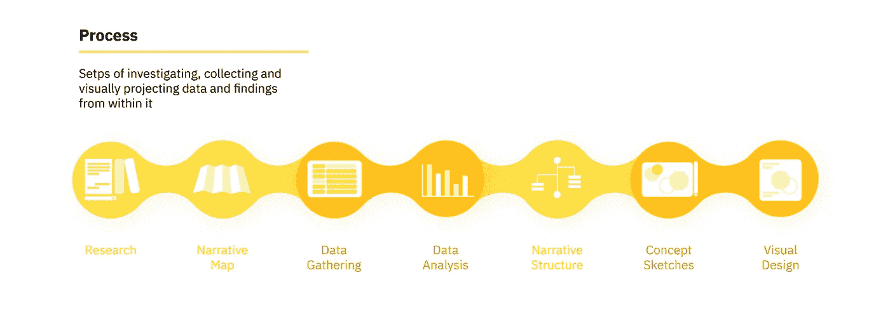
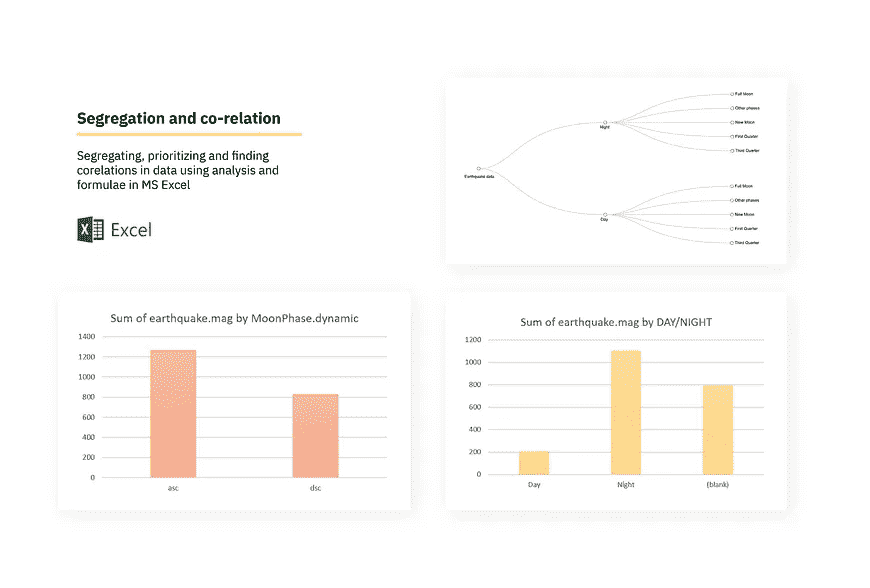
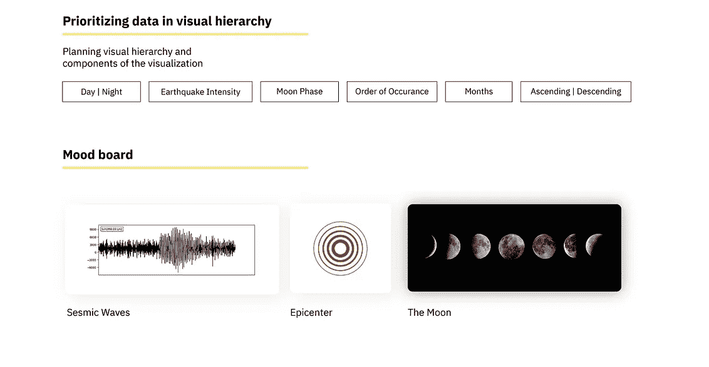
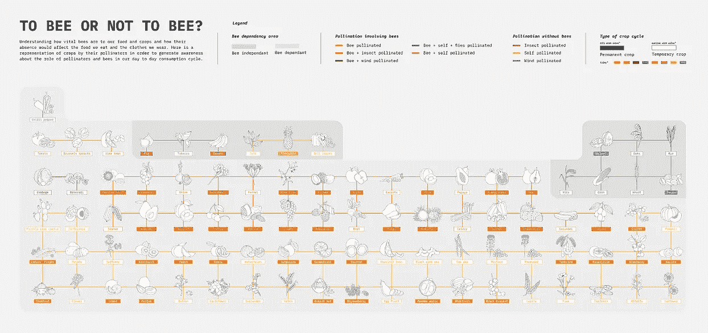
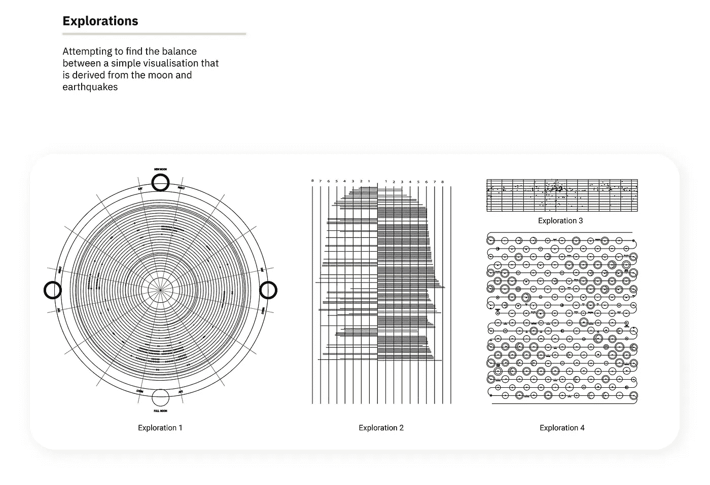

# 如何避免数据可视化

> 原文：<https://medium.com/analytics-vidhya/how-not-to-approach-data-visualisation-71722c6df73c?source=collection_archive---------21----------------------->

数据可视化是我在班加罗尔国家设计学院攻读信息设计硕士学位课程的一个定义部分。在两个学期的课程中，我花了 365 天来练习数据可视化的微妙艺术。

我学到了一些技巧和诀窍，并在途中犯了很多错误。本文将涵盖这些错误。知道什么不该做是帮助一个人找到方向和保持正轨的关键，可以节省很多时间和痛苦。

我在这里引用的例子来自我参与的项目，你可以在文章的结尾找到它们的链接。

**你有责任** 当你把自己放在数据可视化创造者的位置上时，你肩负着几项非常重要的责任:
*a)你负责数据认证和提及来源。你控制叙述——不要误导、隐藏或操纵数据来迎合叙述，你的读者指望你以最真实的形式传递信息。让自己摆脱偏见——不要在没有计算证据的情况下做出结论和假设。*

**不要对数据可视化进行逆向工程** 永远不要对你想要的可视化有一个预先构想的概念，然后试图找到适合可视化的数据。数据是一堆很不起眼的粘土，我们不要强迫每一堆都变成一个锅，它可以多得多，可以是一个杯子，一个盘子，甚至一个灯笼。永远理解数据的本质将会得到它的可视化。遵循一个流程。不要跳到视觉设计

这个过程是在创建地震和月亮的数据可视化时进行的

**不仅仅是漂亮的脸蛋** 有数据可视化，美观重要，功能重要。句号。不要让任何人告诉你别的。你需要在这两方面下功夫。当你可视化你的数据时，你必须小心颜色、隐喻、符号、空间、形式、完形，但是首先，你需要综合手头的数据。花时间在你的数据上，坐在上面，撕开它，粉碎它，然后理顺它，你需要成为记者，你需要好奇，你需要尊重好的数据合成的力量。

数据合成和相互关系，视觉层次以及视觉图像，都是齐头并进的

**可以很简单** 不要过度观想。数据可视化可以很简单。它们可能不会改变世界，但会改变你对 excel 表格和数据库的看法。把数据当成你的宝贝，不要再拿它和别人比较，同时，尊重世界上所有的数据和形象。不要使观想过于复杂，这会产生误导的高风险，同时增加认知负荷。这也是对数据的曲解。理解你的数据，它的优点，缺点，限制和方面。并非所有数据都相同。

上面是蜜蜂上相同数据集的两个可视化。根据你想要展示的内容，观想会发生变化。

你可能会错
不要认为你的第一次观想是最好的。它可能是，但通常并不总是最好的。探索。失败。质疑一下。这是发挥数据和设计真正潜力的唯一途径。如果你尝试每一个可能的迭代，推理它们并选择一个最终的设计，你会对你的想象更有信心。

处理地震和月亮的数据集的可视化迭代

**你需要休息**
不要连续工作。数据可视化是一项值得休息的任务，不要让任何人告诉你其他的事情。连续工作使眼睛过度疲劳会导致疲劳。要经常停下来，退后一步，用新的眼光审视你的观想。它有助于获得视角，并高效地交付您工作的最佳版本。

**反馈**
在过程中不要孤立自己。像所有以用户为中心的设计一样，数据可视化是为了让观众吸收。实践反馈，不要让它成为一个结束的过程，在所有的步骤和阶段接受反馈。通过一系列持续的反馈和更新，你可以使你的设计更加通用和简单。

*上面提到的作品链接:
1。月亮和地震数据可视化:*[*https://www . behance . net/gallery/86790411/Data-Visualization-月亮和地震*](https://www.behance.net/gallery/86790411/Data-Visualization-Moon-and-Earthquakes) *2 .蜜蜂数据可视化 1:*[*https://www . behance . net/gallery/95090837/Data-visualization-To-bee-or-not-To-bee*](https://www.behance.net/gallery/95090837/Data-Visualisation-To-bee-or-not-to-bee) *3 .蜜蜂数据可视化 2:*[*https://www . behance . net/gallery/95115637/Data-visualization-Bee-blooms*](https://www.behance.net/gallery/95115637/Data-Visualisation-Bee-blooms)