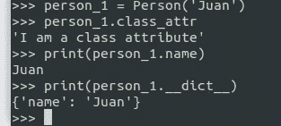

# Python 中对象和类属性的工作方式

> 原文：<https://medium.com/analytics-vidhya/how-object-and-class-attributes-work-in-python-38e6432ab61a?source=collection_archive---------21----------------------->

为了理解这在 Python 中是如何工作的，首先我们需要提高我们在以下概念方面的知识。

**什么是职业属性:**

当我们谈论一个类属性时，它是一个属于这个类的变量，并且可以被这个类的所有对象共享和访问。接下来是定义类属性的方法。

很多时候我们需要初始化 class 属性，它可以是任何类型的数据

**什么是实例属性:**它是只属于一个对象的属性，这个属性的作用域是唯一可以从对象访问的，并且必须在构造函数(__init__(self，...)之外定义

**类和实例属性有什么区别:**

所以两者的区别在于实例属性定义在构造函数内部，而类属性定义在构造函数外部。

`instance_attr`只能从一个对象的范围内访问。class 属性(`class_attr`)既可以作为类的属性也可以作为对象的属性来访问，因为它在所有对象之间是共享的。

**创建它们的所有方法是什么，Pythonic 的做法是什么:**

正如我们前面看到的，我们创建了类属性，方法是在类中声明它们并给它们赋值，在类的方法之外。传统上，它是在班级的顶端完成的，在其他任何事情之前。

我们还创建了实例属性，方法是在类外声明它们并给它们赋值。还有另一种方法，使用 __init__ 方法。它是一个构造函数方法，在一个类的实例被创建后被自动调用。它通常是类中定义的第一个方法。这是一种更 pythonic 化的方式。让我们使用我们的示例，为 *Person* 添加一个 *name* 属性:

注意 *self* 关键字。它引用该类的当前实例或对象。现在我们可以这样创建一个*人*的新实例:

**它们各自的优缺点是什么:**

**Python 如何使用** `**__dict__:**`处理对象和类属性

所有实例都有一个 *__dict__* 字典，用来存储它们的属性和相应的值

示例 __dict__

__dict__ 将只显示实例属性。如果 Person 是一个类，那么它在技术上也是一个对象，并且具有可以列出的属性。我们可以注意到“class_attr”:“我是一个类属性”，这是我们的类属性，还有 name 属性，它没有值，因为它的值在类的每个实例化中都给定了。

对于 OOP 来说，类是一个非常重要和相关的工具，它们可以以多种方式使用，它们的属性也是如此，我们可以做得更好的是尝试理解与此相关的所有概念。