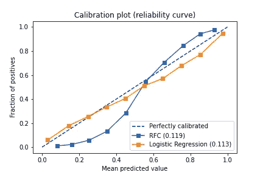

# 概率校准的工作原理

> 原文：<https://medium.com/analytics-vidhya/how-probability-calibration-works-a4ba3f73fd4d?source=collection_archive---------3----------------------->

**概率校准是校准 ML 模型以返回事件的*真实*可能性的过程。当我们需要所讨论事件的概率而不是其分类时，这是必要的。**

假设您有两个预测雨天的模型，模型 A 和模型 b。这两个模型的精度都是 0.8。事实上，每 10 个雨天，都被误标为两天。