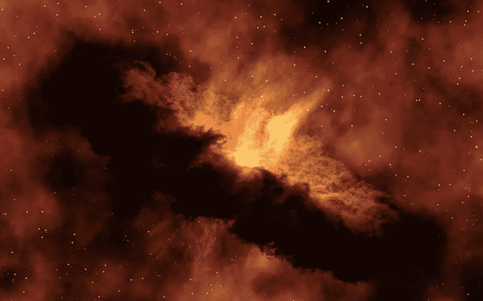

# 启发式涌现编程如何导致人工进化

> 原文：<https://medium.com/analytics-vidhya/how-programming-with-heuristic-emergence-can-lead-to-artificial-evolution-cbb132d9e879?source=collection_archive---------20----------------------->

启发式涌现是一种自然现象，可以帮助我们产生人工进化。

*启发式涌现*可能是你从未听说过的宇宙中最强大的自然现象。

为了理解启发式涌现实际上是什么，我们需要知道一些组成术语——涌现和启发式。