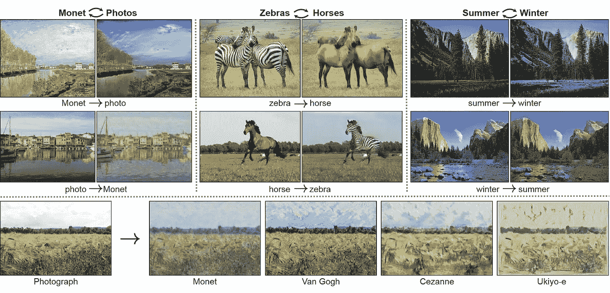

# Pytorch 如何让 GANs 的训练变得超级简单！

> 原文：<https://medium.com/analytics-vidhya/how-pytorch-has-made-gans-training-super-easy-971f91c666ce?source=collection_archive---------9----------------------->

当我一头扎进机器学习领域时，世代对抗网络总是让我感到惊讶。gan 是可以想象新事物的机器学习模型。[生成对抗网络(GAN](https://ddcolrs.wordpress.com/2017/07/03/generative-adversarial-networks-gan/) s)于 2014 年首次引入，这是机器学习领域的一个普遍新概念。引入 GANs 的目的是生成与真实图像样本截然不同且无法区分的人工样本或图像。

# 甘是什么？

GANs 通过生成给定输入样本序列的最可能结果来进行预测。例如，生成模型可以基于先前提供的样本帧生成下一个可能的设计。记住这个概念，我们现在就可以处理 GANs。该模型是一种新的无监督神经网络结构，优于传统网络。更准确地说，一种训练神经网络的新方法是 GANs。GANs 包含两个独立的网络，这两个网络工作截然不同，但又互为对手

**1- *发生器*** 将随机噪声作为输入，然后这些噪声通过一个可微函数来转换噪声并将其重新整形为可识别的结构。输出是逼真的图像。输入噪声的选择决定了发生器网络将输出哪个镜像。

***2-鉴别器*** 是必须经过训练的神经网络，在此之后，它充当分类器，可以区分真实(数据集中的图像)和虚假(生成器生成的图像)。

## 我们能拿 GANS 怎么办？

随着时间的推移，我意识到甘斯有超级酷的应用。在过去的几年里，Gans 已经产生了大量的超级有趣的结果。游戏开发和动画制作费用昂贵，需要雇佣许多制作艺术家来完成相对常规的任务。GAN 可以自动生成动画角色并为其上色。

StackGANs 模型可以将对鸟类的文字描述转换成高分辨率的鸟类图像。Pix2Pix GANs 将粗糙的草图转换成逼真的图像。可以在无人监督的任务中训练图像到图像的翻译。甘斯可以把一张脸部的照片转换成脸部的漫画。这是我最喜欢的一款 GANs，可以生成高分辨率的图像。看看这个视频。

## 为什么是 Pytorch？

2017 年初，PyTorch 发布，并在深度学习社区产生了相当大的影响。脸书人工智能研究团队将其开发为一个开源项目。一段时间后，它被工业界和学术界的团队所采用。以我的经验来看，这是学习深度学习的最佳框架，总体来说是一种乐趣。到本文结束时，您将学会如何训练自己的 GAN。是不是很酷？

# 用 Pytorch 打造时尚 MNIST 甘

让我们动手编程吧。在这篇文章中，我将建立一个在时尚 MNIST 数据集上训练的生成对抗网络(GAN ),这篇文章是为 GAN 的初学者准备的。从这一点上，我们将能够产生一个新的时尚项目！

图表显示了 GANS 的总体结构，使用时尚 MNIST 图片作为数据。潜在样本是生成器用来构建其假图像的随机向量。这通常被称为*** *潜在向量**** ，而那个向量空间被称为*** *潜在空间**** 。随着生成器的训练，它会想出如何将潜在向量映射到可识别的图像，从而骗过鉴别器。

这篇文章的灵感来自于 [Udacity](https://medium.com/u/2929690a28fb?source=post_page-----971f91c666ce--------------------------------) 的 Nanodegree 项目中的 GANs 课程，但我将该模型应用于时尚数据集，并进行了一些修改。

## 步骤# 01-导入必要的库并加载 MNIST 数据集

开始之前，我们需要安装 Pytorch。如果您安装了 Python >= 3.5 和 Jupyter，您可以在本地运行它。或者，你可以在 Google Colab 中运行(如果你有 Google 帐户的话)。开始之前，我们做所有必要的进口

现在，我们将定义用于数据加载的子流程的数量。要加载的每批样品，理想的批量范围为 32 至 128。将数据转换为 torch.FloatTensor。稍后获取训练数据集。准备数据加载器，帮助加载上述批量的数据。

## 步骤#02 —可视化数据集

## 步骤# 03—定义我们模型的鉴别器

鉴别器网络将会是一个非常典型的线性分类器。为了使这个网络成为通用函数逼近器，我们至少需要一个隐藏层，这些隐藏层应该有一个关键属性:

# 步骤# 04-定义我们模型的生成器

发生器网络将与鉴别器网络几乎完全相同，除了我们将一个[双曲正切激活函数](https://pytorch.org/docs/stable/nn.html#tanh)应用到我们的输出层。

# 步骤#05 定义模型的超参数并构建完整的网络

在这种情况下，超参数将是输入层的大小、生成器和鉴别器的隐藏层以及输出大小。

现在我们从上面定义的类中实例化鉴别器和生成器。确保您已经传入了正确的输入参数。

打印发生器和鉴别器的详细描述。

# 步骤#06 定义鉴频器和发电机损耗

## 鉴频器损耗

*   对于鉴别器，总损失是真实和伪造图像的损失之和，`d_loss = d_real_loss + d_fake_loss`。
*   请记住，我们希望鉴频器为真实图像输出 1，为虚假图像输出 0，因此我们需要设置损耗来反映这一点。

## 发电机损耗

只有在标签翻转的情况下，发电机损耗才会看起来相似。生成器的目标是得到`D(fake_images) = 1`。在这种情况下，标签被**翻转**来表示生成器试图欺骗鉴别器，让它认为生成的图像(赝品)是真的！

# 步骤#07 优化和培训

我们希望分别更新生成器和鉴别器变量。因此，我们将定义两个独立的 Adam 优化器。

> 训练将包括交替训练鉴别器和发生器。我们将使用函数`real_loss`和`fake_loss`来帮助我们计算以下所有情况下的鉴频器损耗。

## 甄别训练

1.  计算真实训练图像上的鉴别器损耗
2.  生成假图像
3.  计算伪生成图像的鉴别器损耗
4.  把真假损失加起来
5.  执行反向传播+优化步骤来更新鉴别器的权重

## 发电机培训

1.  生成假图像
2.  使用**翻转**标签计算假图像的鉴别器损失！
3.  执行反向传播+优化步骤来更新生成器的权重

## 保存样本

在我们训练时，我们还会打印出一些损失统计数据，并保存一些生成的“假”样本。

## 培训损失

这里我们将绘制发生器和鉴别器的训练损耗，在每个时期后记录。

**生成的样本**

我训练了 200 个纪元，得到了这些结果。这些是最后一次训练的样本。你可以看到生成器能够再现像鞋子、衬衫、帽子、裙子这样的图像，因为这只是一个样本，它并不能代表这个生成器可以生成的全部图像。为了获得更好的结果，您可以调整参数，比如增加历元数，或者尝试和测试不同的优化器。

这不是结束，我发现甘斯更多。Insha Allah 将很快写更多关于不同 GANs 架构的文章。敬请期待！

## 参考资料:

推荐大家参考我的[https://medium . com/@ mahamshafiq 98/machine-learning-basics-524 e63c 8238](/@mahamshafiq98/machine-learning-basics-524e63c8238)文章作为补充资源。 [Udacity](https://medium.com/u/2929690a28fb?source=post_page-----971f91c666ce--------------------------------) 深度学习 Nanodegree 在我之前提到过的时候简要地讨论过这个话题，所以请去看看吧！